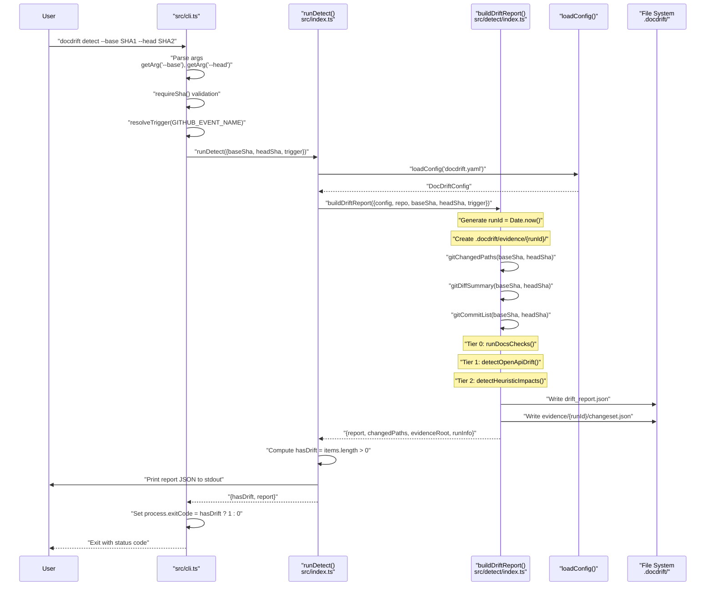
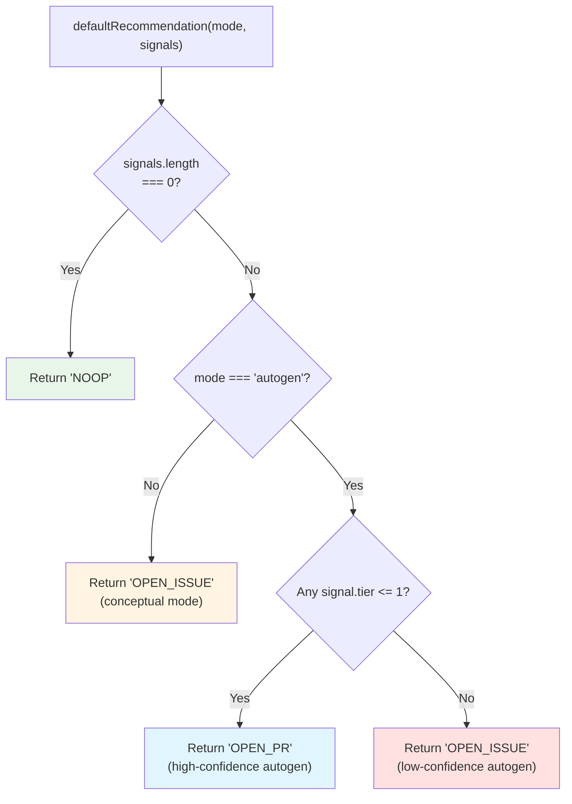

# detect Command

<details>
<summary>Relevant source files</summary>

The following files were used as context for generating this wiki page:

- [.gitignore](.gitignore)
- [README.md](README.md)
- [docdrift-yml.md](docdrift-yml.md)
- [src/cli.ts](src/cli.ts)
- [src/devin/v1.ts](src/devin/v1.ts)
- [src/index.ts](src/index.ts)

</details>


The `detect` command performs drift detection and generates a structured report without triggering any remediation actions. It runs the three-tier detection system, produces the `drift_report.json` artifact, and exits with a status code indicating whether drift was found. This command is useful for validating detection logic, understanding what drift exists before remediation, and integrating drift checks into CI pipelines without opening PRs or issues.

For full drift detection with automated remediation via Devin sessions, see [3.3](#3.3). For configuration validation, see [3.1](#3.1). For details on how the detection system works, see [4](#4).

## Purpose and Scope

The `detect` command is a read-only operation that:
- Runs all three detection tiers (Tier 0: docs checks, Tier 1: OpenAPI drift, Tier 2: heuristic impacts)
- Generates `drift_report.json` in `.docdrift/`
- Creates evidence bundles with changesets and detection artifacts
- Does NOT open PRs, create issues, or interact with GitHub
- Does NOT call Devin API
- Does NOT modify state or enforce policy caps

This makes it safe to run locally or in CI for validation purposes without side effects.

**Sources**: [src/cli.ts:33-40](), [README.md:8](), [README.md:67]()

## Command Syntax

```bash
docdrift detect --base <baseSha> --head <headSha>
```

### Required Arguments

| Argument | Description | Example |
|----------|-------------|---------|
| `--base` | Git commit SHA representing the baseline state | `b0f624f` or `HEAD^` |
| `--head` | Git commit SHA representing the current state | `6030902` or `HEAD` |

The command compares the repository state between `baseSha` and `headSha` to detect documentation drift.

**Sources**: [src/cli.ts:34-35](), [README.md:83-84]()

## Environment Variables

The `detect` command optionally reads:

| Variable | Purpose | Required |
|----------|---------|----------|
| `GITHUB_EVENT_NAME` | Sets the trigger type in the report (e.g., `push`, `pull_request`) | No (defaults to `unknown`) |

No authentication environment variables are needed since `detect` does not interact with external services.

**Sources**: [src/cli.ts:36]()

## Command Flow



**Sources**: [src/cli.ts:33-40](), [src/index.ts:144-155](), [src/detect/index.ts:20-115]()

## Detection Process Details

The `detect` command delegates to `buildDriftReport()` which orchestrates the three-tier detection system:

```mermaid
graph TB
    Start["buildDriftReport()"] --> Init["Create RunInfo<br/>{runId, repo, baseSha, headSha, trigger, timestamp}"]
    Init --> CreateEvidence["Create evidence directory<br/>.docdrift/evidence/{runId}/"]
    
    CreateEvidence --> GitData["Collect Git data:<br/>- gitChangedPaths()<br/>- gitDiffSummary()<br/>- gitCommitList()"]
    
    GitData --> Tier0["Tier 0: runDocsChecks()<br/>Run policy.verification.commands"]
    
    Tier0 --> LoopStart{"For each<br/>docArea in<br/>config.docAreas"}
    
    LoopStart -->|next area| InitArea["Initialize:<br/>signals = []<br/>impactedDocs = Set()"]
    
    InitArea --> AddTier0{"docsCheck<br/>signal?"}
    AddTier0 -->|Yes| PushTier0["Add signal + summary"]
    AddTier0 -->|No| CheckOpenAPI
    PushTier0 --> CheckOpenAPI
    
    CheckOpenAPI{"docArea.detect<br/>.openapi?"}
    CheckOpenAPI -->|Yes| Tier1["Tier 1: detectOpenApiDrift()<br/>Compare generated vs published spec"]
    CheckOpenAPI -->|No| CheckPaths
    
    Tier1 --> AddTier1{"OpenAPI signal?"}
    AddTier1 -->|Yes| PushTier1["Add signal, impactedDocs, summary"]
    AddTier1 -->|No| CheckPaths
    PushTier1 --> CheckPaths
    
    CheckPaths{"docArea.detect<br/>.paths.length > 0?"}
    CheckPaths -->|Yes| Tier2["Tier 2: detectHeuristicImpacts()<br/>Match code paths to doc impacts"]
    CheckPaths -->|No| CheckSignals
    
    Tier2 --> AddTier2{"Heuristic signal?"}
    AddTier2 -->|Yes| PushTier2["Add signal, impactedDocs, summary"]
    AddTier2 -->|No| CheckSignals
    PushTier2 --> CheckSignals
    
    CheckSignals{"signals.length > 0?"}
    CheckSignals -->|No| LoopStart
    CheckSignals -->|Yes| CreateItem["Create DriftItem:<br/>- docArea<br/>- mode<br/>- signals<br/>- impactedDocs<br/>- recommendedAction<br/>- summary"]
    
    CreateItem --> AddItem["Add to items[]"]
    AddItem --> LoopStart
    
    LoopStart -->|done| BuildReport["Create DriftReport:<br/>{run: RunInfo, items: DriftItem[]}"]
    
    BuildReport --> WriteReport["Write .docdrift/drift_report.json"]
    WriteReport --> WriteChangeset["Write evidence/{runId}/changeset.json"]
    WriteChangeset --> Return["Return {report, changedPaths, evidenceRoot, runInfo, checkSummaries}"]
```



**Sources**: [src/detect/index.ts:20-115](), [src/detect/index.ts:42-94]()

## Output Artifacts

The `detect` command produces the following files:

### Primary Output

**`.docdrift/drift_report.json`**
- Structured JSON report with all detected drift items
- Contains run metadata (repo, SHAs, trigger, timestamp)
- Lists drift items per doc area with signals, impacted docs, and recommended actions
- Format documented in [8.1](#8.1)

### Evidence Directory

**`.docdrift/evidence/{runId}/`**
- `changeset.json` - Git diff summary, changed paths, and commit list
- Per-doc-area subdirectories (if `run` command is used later, not created by `detect`)

**Sources**: [src/detect/index.ts:42-43](), [src/detect/index.ts:107-112]()

## Exit Codes

The `detect` command exits with:

| Exit Code | Condition | Meaning |
|-----------|-----------|---------|
| `0` | No drift detected | All doc areas are in sync |
| `1` | Drift detected | One or more doc areas have drift |
| `1` | Error occurred | Command failed (e.g., invalid config, missing Git commits) |

The exit code is determined by whether any drift items were found:

```typescript
// src/cli.ts:38
process.exitCode = result.hasDrift ? 1 : 0;
```

Where `hasDrift` is computed as:

```typescript
// src/index.ts (runDetect function)
const hasDrift = report.items.length > 0;
```

**Sources**: [src/cli.ts:38](), [src/index.ts:144-155]()

## Recommended Action Assignment

Each drift item in the report includes a `recommendedAction` field computed by `defaultRecommendation()`:



This recommendation is **advisory only** during `detect`. The actual policy decision is made by the policy engine during `run` command execution, which considers additional factors like PR caps, existing state, and allowlists. See [5.1](#5.1) for full policy decision logic.

**Sources**: [src/detect/index.ts:10-18](), [src/detect/index.ts:91]()

## Use Cases

### Local Development Validation

Run `detect` locally to check if your code changes have introduced documentation drift before pushing:

```bash
# Compare your working branch against main
git fetch origin main
npx docdrift detect --base origin/main --head HEAD
```

If exit code is 1, review `.docdrift/drift_report.json` to see what drift was detected.

### CI/CD Pre-Merge Checks

Add `detect` to a pull request check workflow to block merges with undocumented changes:

```yaml
- name: Check for doc drift
  run: npx @devinnn/docdrift detect --base ${{ github.event.pull_request.base.sha }} --head ${{ github.event.pull_request.head.sha }}
  # Fails if drift detected (exit code 1)
```

### Dry-Run Before Remediation

Run `detect` before `run` to preview what drift exists without triggering Devin sessions or opening PRs:

```bash
# See what would be detected
npx docdrift detect --base HEAD^ --head HEAD

# Review the report
cat .docdrift/drift_report.json

# If satisfied, run full remediation
DEVIN_API_KEY=... npx docdrift run --base HEAD^ --head HEAD
```

**Sources**: [README.md:63-68](), [README.md:83-84]()

## Comparison with Other Commands

| Feature | `detect` | `run` | `validate` |
|---------|----------|-------|------------|
| Runs detection tiers | ✓ | ✓ | ✗ |
| Generates drift_report.json | ✓ | ✓ | ✗ |
| Calls Devin API | ✗ | ✓ | ✗ |
| Opens PRs/Issues | ✗ | ✓ | ✗ |
| Updates state.json | ✗ | ✓ | ✗ |
| Requires DEVIN_API_KEY | ✗ | ✓ | ✗ |
| Requires GITHUB_TOKEN | ✗ | Optional | ✗ |
| Safe for CI checks | ✓ | ✗ | ✓ |
| Exit code 1 if drift | ✓ | ✗ | ✗ |

**Sources**: [src/cli.ts:27-60](), [README.md:7-10]()

## Implementation Reference

The `detect` command implementation spans:

1. **CLI Argument Parsing**: [src/cli.ts:33-40]()
   - Extracts `--base` and `--head` arguments
   - Validates SHAs with `requireSha()`
   - Resolves trigger from environment

2. **Orchestration**: `runDetect()` function (referenced in CLI)
   - Loads configuration from `docdrift.yaml`
   - Invokes `buildDriftReport()`
   - Computes `hasDrift` boolean
   - Returns result with exit code

3. **Detection Engine**: [src/detect/index.ts:20-115]()
   - `buildDriftReport()` is the core function
   - Orchestrates all three detection tiers
   - Aggregates signals per doc area
   - Writes artifacts to `.docdrift/`

4. **Helper Functions**:
   - [src/cli.ts:12-18]() - `getArg()` for parsing command-line flags
   - Git utilities referenced in detection (e.g., `gitChangedPaths()`, `gitDiffSummary()`)

**Sources**: [src/cli.ts:1-67](), [src/detect/index.ts:1-116]()

## Output Example

When run successfully, `detect` prints the drift report to stdout:

```json
{
  "run": {
    "repo": "owner/repo",
    "baseSha": "b0f624f",
    "headSha": "6030902",
    "trigger": "push",
    "timestamp": "2024-01-15T10:30:00.000Z"
  },
  "items": [
    {
      "docArea": "api_reference",
      "mode": "autogen",
      "signals": [
        {
          "tier": 1,
          "confidence": 0.95,
          "description": "OpenAPI spec drift detected: field renamed (name → fullName)"
        }
      ],
      "impactedDocs": [
        "docs/reference/openapi.json",
        "docs/reference/api.md"
      ],
      "recommendedAction": "OPEN_PR",
      "summary": "OpenAPI drift: 3 changes (1 addition, 1 removal, 1 modification)"
    }
  ]
}
```

The same content is written to `.docdrift/drift_report.json` for programmatic consumption.

**Sources**: [src/detect/index.ts:96-105](), [README.md:97]()

---