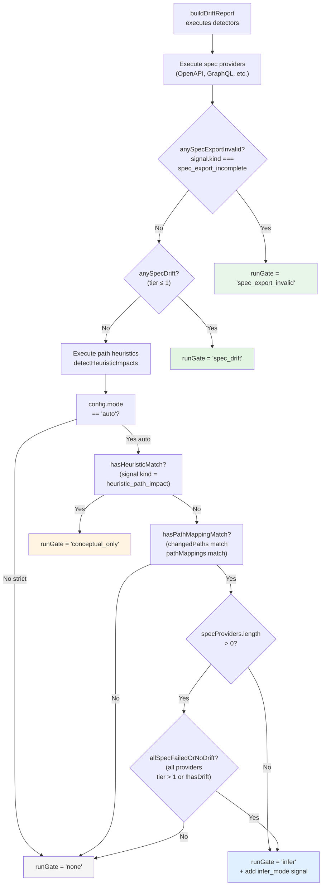
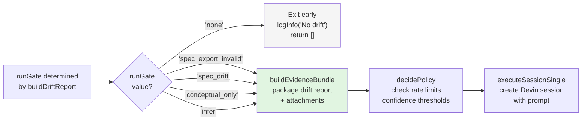

# Run Gate Logic

<details>
<summary>Relevant source files</summary>

The following files were used as context for generating this wiki page:

- [.gitignore](.gitignore)
- [README.md](README.md)
- [docdrift-yml.md](docdrift-yml.md)
- [docdrift.schema.json](docdrift.schema.json)
- [src/config/normalize.ts](src/config/normalize.ts)
- [src/config/schema.ts](src/config/schema.ts)
- [src/detect/index.ts](src/detect/index.ts)
- [src/index.ts](src/index.ts)
- [test/config.test.ts](test/config.test.ts)

</details>


## Purpose and Scope

This document explains the run gate system in docdrift, which determines whether and how to proceed with documentation remediation based on detected drift signals. The run gate acts as the first filter in the remediation pipeline, deciding if any action is warranted before the policy engine evaluates the details.

For information about how drift is detected before reaching the run gate, see [Detection Pipeline](#6.1). For information about what happens after the run gate passes, see [Policy Decision Logic](#7.1).

**Sources:** [src/detect/index.ts:1-199](), [src/index.ts:266-270](), [README.md:49-57]()

---

## Run Gate Types

The run gate system defines five possible outcomes, each representing a different level of confidence and triggering different remediation behaviors.

| Gate Type | Trigger Condition | Remediation Behavior | Mode Requirement |
|-----------|------------------|----------------------|------------------|
| `spec_export_invalid` | Exported spec failed completeness validation (e.g. missing requestBody) | Fix spec source first, then re-export and update docs | Any mode |
| `spec_drift` | Spec provider detected drift (tier ≤ 1) | Full remediation with high confidence | Any mode |
| `conceptual_only` | Heuristic path matches, no spec drift | Conceptual docs update only | `auto` mode only |
| `infer` | pathMappings match, spec failed or none | Infer docs from file changes | `auto` mode only |
| `none` | No conditions met | Exit early, no remediation | Any mode |

**Sources:** [src/detect/index.ts:11](), [src/index.ts:172-185]()

---

## Gate Decision Logic

The run gate is determined by evaluating detection results in priority order. The logic implements a hierarchical decision tree where higher-confidence signals take precedence.

### Decision Tree Diagram



**Sources:** [src/detect/index.ts:104-136]()

---

## Implementation Details

### Gate Determination Code Path

The gate logic is implemented in `buildDriftReport` at [src/detect/index.ts:104-136](). The function evaluates detection results and assigns the appropriate gate.

**Priority 0: Spec Export Incomplete (Validation Failed)**

```
anySpecExportInvalid = providerResults.some((r) => r.signal?.kind === "spec_export_incomplete")
```

When any spec provider returns a signal with `kind === "spec_export_incomplete"`, the gate is immediately set to `spec_export_invalid`. This occurs when the exported OpenAPI spec fails completeness validation (e.g. POST/PUT/PATCH operations missing `requestBody`). Remediation instructs Devin to fix the spec source first, then re-export and update published spec and docs.

**Priority 1: Spec Drift Detection**

```
anySpecDrift = providerResults.some((r) => r.hasDrift && r.signal && r.signal.tier <= 1)
```

When no export validation failure exists and any spec provider (OpenAPI, GraphQL, etc.) detects drift with confidence tier ≤ 1, the gate is set to `spec_drift`. This bypasses heuristic and infer checks.

**Priority 2: Heuristic Match (Auto Mode)**

```
hasHeuristicMatch = signals.some((s) => s.kind === "heuristic_path_impact")
```

If no spec drift exists and the mode is `auto`, the system checks for heuristic signals generated by path rule matches in `docAreas[].detect.paths`. If found, the gate is set to `conceptual_only`.

**Priority 3: Path Mapping Inference (Auto Mode)**

```
hasPathMappingMatch = 
  pathMappings.length > 0 &&
  changedPaths.some((p) => pathMappings.some((m) => matchesGlob(m.match, p)))

allSpecFailedOrNoDrift =
  providerResults.length === 0 ||
  providerResults.every((r) => !r.hasDrift || (r.signal?.tier ?? 2) > 1)
```

In `auto` mode, if `pathMappings` match changed files and either:
- No spec providers are configured, OR
- All spec providers failed or reported no drift (tier > 1)

Then the gate is set to `infer`. The system synthesizes an `infer_mode` signal with tier 2 and confidence 0.6.

**Priority 5: No Gate**

If none of the above conditions are met, the gate remains `none` and remediation is skipped.

**Sources:** [src/detect/index.ts:70-136]()

---

## Mode-Based Behavior

The `mode` configuration field controls which run gates are enabled. This provides teams with control over noise levels and automation scope.

### Strict Mode (Default)

```yaml
mode: strict  # or omit, defaults to strict
```

**Behavior:**
- Only proceeds when spec drift is detected (`spec_drift` gate)
- Ignores heuristic matches and path mapping matches
- **Gate outcomes:** `spec_export_invalid`, `spec_drift`, or `none`
- **Philosophy:** Conservative. Only remediate when there is concrete, verifiable API specification drift.

**Use case:** Teams that want low noise and high confidence. Documentation updates only occur when there is an unambiguous source of truth (API spec diff).

### Auto Mode

```yaml
mode: auto
```

**Behavior:**
- Proceeds on spec drift (`spec_drift` gate)
- **Additionally** proceeds on heuristic path matches (`conceptual_only` gate)
- **Additionally** proceeds when pathMappings match and specs are unavailable/clean (`infer` gate)
- **Gate outcomes:** `spec_export_invalid`, `spec_drift`, `conceptual_only`, `infer`, or `none`
- **Philosophy:** Proactive. Catch conceptual doc drift even when API specs don't change.

**Use case:** Teams with mature path mapping configurations who want to keep guides and tutorials synchronized with code changes beyond just API reference updates.

**Sources:** [src/config/schema.ts:109-110](), [docdrift-yml.md:109-110](), [src/detect/index.ts:105-136]()

---

## Gate to Remediation Flow

Once the run gate is determined, it controls the downstream remediation pipeline.

### Flow Diagram



**Sources:** [src/index.ts:256-270]()

### Early Exit on None Gate

When `runGate === "none"`, the system exits before building evidence or creating Devin sessions:

```typescript
if (runGate === "none" || report.items.length === 0) {
  logInfo("No drift; skipping session");
  return [];
}
```

This prevents unnecessary API calls and resource consumption when no actionable drift is detected.

**Sources:** [src/index.ts:267-270]()

### DriftItem Mode Assignment

The run gate influences the `mode` field on the drift item, which affects prompt generation:

```typescript
const item: DriftItem = {
  docArea: "docsite",
  mode: runGate === "conceptual_only" ? "conceptual" : "autogen",
  signals: aggregated.signals,
  impactedDocs: aggregated.impactedDocs,
  recommendedAction: aggregated.signals.some((s) => s.tier <= 1) ? "OPEN_PR" : "OPEN_ISSUE",
  summary: aggregated.summary,
};
```

- `conceptual_only` gate → `mode: "conceptual"` → conceptual prompt style
- All other gates → `mode: "autogen"` → autogen prompt style

**Sources:** [src/detect/index.ts:167-174]()

---

## Run Gate Context in Evidence

The run gate value is passed to evidence bundle generation and included in the Devin prompt, providing context about why the session was triggered.

### Evidence Bundle Integration

```typescript
const prompt = buildWholeDocsitePrompt({
  aggregated: input.aggregated,
  config: input.config,
  attachmentUrls,
  runGate: input.runGate,  // <-- passed to prompt builder
  trigger: input.trigger,
  prNumber: input.prNumber,
  existingDocdriftPr: input.existingDocdriftPr,
});
```

The prompt builder uses `runGate` to provide context to Devin about the detection mechanism and confidence level.

**Sources:** [src/index.ts:101-109](), [src/devin/prompts.ts]()

---

## Run Gate Labels for User Display

The system provides human-friendly labels for run gates when displaying detection results.

### Label Mapping

| RunGate | Label | Usage |
|---------|-------|-------|
| `spec_export_invalid` | "spec export incomplete" | Detect command output |
| `spec_drift` | "API spec drift" | Detect command output |
| `conceptual_only` | "path heuristics (no spec changes)" | Detect command output |
| `infer` | "inferred from file changes" | Detect command output |
| `none` | "none" | Detect command output |

### Implementation

```typescript
function runGateLabel(gate: RunGate): string {
  switch (gate) {
    case "spec_export_invalid":
      return "spec export incomplete";
    case "spec_drift":
      return "API spec drift";
    case "conceptual_only":
      return "path heuristics (no spec changes)";
    case "infer":
      return "inferred from file changes";
    case "none":
      return "none";
    default:
      return gate;
  }
}
```

These labels appear in the `docdrift detect` command output to inform users about the detection source.

**Sources:** [src/index.ts:172-185](), [src/index.ts:225-228]()

---

## Signal Tier System

The gate logic relies on a tier system for signal confidence. Signals with tier ≤ 1 are considered high-confidence and trigger the `spec_drift` gate.

### Tier Assignments by Signal Kind

| Signal Kind | Typical Tier | Description |
|-------------|-------------|-------------|
| `spec_export_incomplete` | 1 | Exported spec failed completeness validation (e.g. missing requestBody) |
| `openapi_diff` | 1 | OpenAPI specification diff detected |
| `swagger2_diff` | 1 | Swagger 2.0 specification diff detected |
| `graphql_diff` | 1 | GraphQL schema diff detected |
| `fern_diff` | 1 | Fern definition diff detected |
| `postman_diff` | 1 | Postman collection diff detected |
| `heuristic_path_impact` | 2 | Path heuristic match (lower confidence) |
| `infer_mode` | 2 | Inferred from file changes (lowest confidence) |

**Note:** Tier values are set by individual spec provider implementations. The run gate logic uses `tier <= 1` as the threshold for `spec_drift`.

**Sources:** [src/detect/index.ts:70](), [src/spec-providers/types.ts]()

---

## Complete Gate Determination Example

### Scenario: OpenAPI Change with Path Mappings

**Configuration:**
```yaml
mode: auto
openapi:
  export: "npm run openapi:export"
  generated: "openapi/generated.json"
  published: "apps/docs-site/openapi/openapi.json"
pathMappings:
  - match: "src/features/**"
    impacts: ["docs/guides/**"]
```

**Changed Files:**
- `src/api/users.ts` (OpenAPI endpoint change)
- `src/features/auth.ts` (feature code change)

**Detection Results:**
1. OpenAPI detector: `hasDrift: true`, `tier: 1` (spec changed)
2. Path heuristic: matches `src/features/**` → impacts `docs/guides/**`

**Gate Decision:**
- `anySpecDrift = true` (tier 1 detected)
- **Result:** `runGate = "spec_drift"`
- Reason: Spec drift takes priority over all other signals

**Sources:** [src/detect/index.ts:70-84]()

### Scenario: Path Mapping Match, No Spec Drift (Auto Mode)

**Configuration:**
```yaml
mode: auto
openapi:
  export: "npm run openapi:export"
  generated: "openapi/generated.json"
  published: "apps/docs-site/openapi/openapi.json"
pathMappings:
  - match: "src/features/**"
    impacts: ["docs/guides/**"]
```

**Changed Files:**
- `src/features/billing.ts` (no API changes, just logic)

**Detection Results:**
1. OpenAPI detector: `hasDrift: false` (no spec changes)
2. Path mapping: matches `src/features/**`

**Gate Decision:**
- `anySpecDrift = false`
- `isAuto = true`
- `hasPathMappingMatch = true`
- `allSpecFailedOrNoDrift = true` (spec ran but no drift)
- **Result:** `runGate = "infer"`
- Reason: Auto mode + pathMapping match + no spec drift

**Sources:** [src/detect/index.ts:111-136]()

### Scenario: Path Mapping Match, No Spec Drift (Strict Mode)

**Configuration:**
```yaml
mode: strict  # or omitted (default)
openapi:
  export: "npm run openapi:export"
  generated: "openapi/generated.json"
  published: "apps/docs-site/openapi/openapi.json"
pathMappings:
  - match: "src/features/**"
    impacts: ["docs/guides/**"]
```

**Changed Files:**
- `src/features/billing.ts`

**Detection Results:**
1. OpenAPI detector: `hasDrift: false`
2. Path mapping: matches (but ignored in strict mode)

**Gate Decision:**
- `anySpecDrift = false`
- `isAuto = false`
- **Result:** `runGate = "none"`
- Reason: Strict mode only proceeds on spec drift

**Sources:** [src/detect/index.ts:105-110]()

### Scenario: Spec Export Incomplete (OpenAPI Validation Fails)

**Configuration:**
```yaml
mode: strict
specProviders:
  - format: openapi3
    current:
      type: export
      command: npm run openapi:export
      outputPath: openapi/generated.json
    published: apps/docs-site/openapi/openapi.json
    validation:
      enabled: true
      allowlist: ["/health"]
```

**Situation:** The export command runs and produces an OpenAPI spec, but one or more POST/PUT/PATCH operations lack a `requestBody` (e.g. incomplete `@swagger` JSDoc). Export completeness validation fails.

**Detection Results:**
1. OpenAPI detector: runs validation after parsing; validation fails
2. Detector writes `openapi3-validation.txt` and returns `hasDrift: true` with `signal.kind === "spec_export_incomplete"` (tier 1)

**Gate Decision:**
- `anySpecExportInvalid = true`
- **Result:** `runGate = "spec_export_invalid"`
- Reason: Spec export incomplete takes priority over all other checks. Devin is prompted to fix the spec source (e.g. add requestBody to JSDoc), re-run the export, then update the published spec and docs.

**Sources:** [src/spec-providers/openapi.ts](), [src/spec-providers/openapi-validator.ts](), [src/detect/index.ts:70-76]()

---

## Summary Table: Gate Determination Logic

| Condition | Priority | Mode | Gate Set | Next Action |
|-----------|---------|------|---------|-------------|
| Spec export completeness validation failed | 1 (highest) | Any | `spec_export_invalid` | Proceed to policy/remediation; fix spec source first |
| Spec provider tier ≤ 1 drift detected | 2 | Any | `spec_drift` | Proceed to policy/remediation |
| Heuristic path impact signal exists | 3 | `auto` only | `conceptual_only` | Proceed to policy/remediation |
| pathMappings match, spec clean/failed | 4 | `auto` only | `infer` | Proceed to policy/remediation |
| None of the above | 5 (lowest) | Any | `none` | Exit early, skip remediation |

**Sources:** [src/detect/index.ts:104-136]()

---