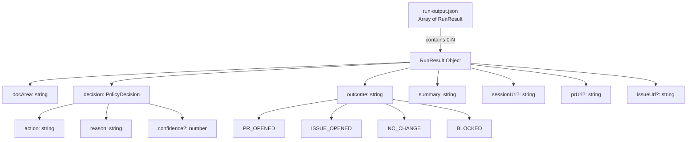
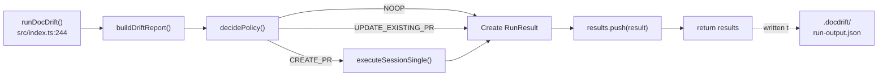
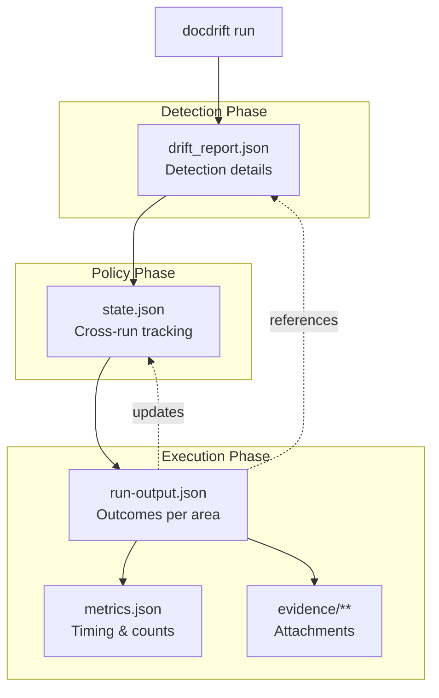

# run-output.json

<details>
<summary>Relevant source files</summary>

The following files were used as context for generating this wiki page:

- [.github/workflows/devin-doc-drift.yml](.github/workflows/devin-doc-drift.yml)
- [docdrift-yml.md](docdrift-yml.md)
- [src/config/validate.ts](src/config/validate.ts)
- [src/devin/prompts.ts](src/devin/prompts.ts)
- [src/github/client.ts](src/github/client.ts)
- [src/index.ts](src/index.ts)

</details>


This document describes the `run-output.json` file produced by the `docdrift run` command. This file provides a quick-reference summary of each documentation area's outcome during a run, including Devin session URLs, PR links, and issue links.

For detailed drift analysis data, see [drift_report.json](#10.1). For observability metrics, see [metrics.json](#10.2). For persistent state tracking across runs, see [state.json](#10.3).

---

## Purpose and Scope

The `run-output.json` file serves as a **quick-reference run summary** for CI systems and human operators. It contains a per-area outcome record with direct links to Devin sessions, GitHub PRs, and issues. This file is designed for:

- **CI/CD integration**: Parse outcomes to determine workflow success/failure
- **Observability**: Quick visibility into which areas opened PRs vs. issues vs. were blocked
- **Debugging**: Access Devin session URLs for troubleshooting
- **Automation**: Post-process outcomes to trigger downstream actions

Unlike `drift_report.json` (which contains detection details) or `metrics.json` (which contains timing/statistics), `run-output.json` focuses on **actionable outcomes per doc area**.

**Sources:** [.github/workflows/devin-doc-drift.yml:70-76](), [src/index.ts:244-529]()

---

## File Location and Format

| Property | Value |
|----------|-------|
| **Path** | `.docdrift/run-output.json` |
| **Format** | JSON array |
| **Encoding** | UTF-8 |
| **Generated by** | `docdrift run` command |
| **Lifecycle** | Overwritten on each run |

The file is created in the `.docdrift/` directory at the repository root. It is uploaded as a GitHub Actions artifact when the workflow completes.

**Sources:** [.github/workflows/devin-doc-drift.yml:85-95]()

---

## Schema Structure

The file contains an **array of run results**, one per documentation area processed during the run.



**Diagram: run-output.json Structure**

**Sources:** [src/index.ts:453-462](), [src/index.ts:305-312](), [src/index.ts:317-323]()

---

## Field Definitions

### RunResult Object

Each object in the array represents one documentation area's outcome.

| Field | Type | Required | Description |
|-------|------|----------|-------------|
| `docArea` | string | Yes | Unique identifier for the documentation area (e.g., `"docsite"`, `"api_reference"`) |
| `decision` | PolicyDecision | Yes | Policy engine decision that determined the action taken |
| `outcome` | string | Yes | Final session outcome: `"PR_OPENED"`, `"ISSUE_OPENED"`, `"NO_CHANGE"`, or `"BLOCKED"` |
| `summary` | string | Yes | Human-readable summary of what happened |
| `sessionUrl` | string | No | Devin session URL when a session was created |
| `prUrl` | string | No | GitHub PR URL when a PR was opened |
| `issueUrl` | string | No | GitHub issue URL when an issue was created |

**Sources:** [src/index.ts:453-462]()

### PolicyDecision Object

The `decision` field contains the policy engine's determination.

| Field | Type | Description |
|-------|------|-------------|
| `action` | string | One of: `"CREATE_PR"`, `"UPDATE_EXISTING_PR"`, `"OPEN_ISSUE"`, `"NOOP"` |
| `reason` | string | Explanation for why this action was chosen |
| `confidence` | number | Optional confidence score (0-1) for the drift detection |

**Sources:** [src/policy/engine.ts]() (inferred from usage in [src/index.ts:294-302]())

---

## Outcome Values

### Outcome: `PR_OPENED`

A Devin session successfully created or updated a pull request.

**Conditions:**
- Session completed with terminal status
- Devin reported a PR URL in structured output or session metadata
- Policy allowed PR creation or update

**Associated Fields:**
- `sessionUrl`: Always present
- `prUrl`: Always present
- `issueUrl`: Present if `requireHumanReview` paths were touched

**Sources:** [src/index.ts:389-420](), [src/index.ts:143-150]()

### Outcome: `BLOCKED`

The run could not complete successfully.

**Conditions:**
- Devin session ended with `status: "blocked"` or no DEVIN_API_KEY available
- Session finished but couldn't open a PR due to uncertainty
- Policy reached PR cap and no existing PR to update

**Associated Fields:**
- `sessionUrl`: Present if a session was started
- `issueUrl`: Present only if `DEVIN_API_KEY` missing (special case)

**Sources:** [src/index.ts:449-451](), [src/index.ts:153-161](), [src/index.ts:319-323](), [src/index.ts:421-443]()

### Outcome: `NO_CHANGE`

No documentation changes were needed or made.

**Conditions:**
- Policy decision was `NOOP` (e.g., allowlist blocked, confidence too low)
- Session completed without opening a PR
- Existing PR found and changes bundled into it

**Associated Fields:**
- `sessionUrl`: Present if a session ran
- `prUrl`: Present if bundled into existing PR

**Sources:** [src/index.ts:304-312](), [src/index.ts:163-168](), [src/index.ts:316-333]()

### Outcome: `ISSUE_OPENED`

An issue was created instead of a PR (currently not used in the codebase as a top-level outcome, but defined in the schema).

**Sources:** [src/index.ts:39-47]() (defined in SessionOutcome type but not used as a standalone outcome in results)

---

## Generation Pipeline



**Diagram: run-output.json Generation Pipeline**

**Sources:** [src/index.ts:244-529]()

---

## Usage in CI/CD

### GitHub Actions Workflow

The `devin-doc-drift.yml` workflow reads `run-output.json` to display session outcomes:

```yaml
- name: Show Devin session URLs
  if: success()
  run: |
    node -e "
      const r = require('./.docdrift/run-output.json');
      if (Array.isArray(r)) r.forEach((x, i) => console.log('Doc area:', x.docArea, '| Session:', x.sessionUrl || '(none)', '| Outcome:', x.outcome));
    "
```

This step outputs a summary line for each doc area processed, showing:
- Doc area name
- Devin session URL (or `"(none)"` if no session)
- Final outcome

**Sources:** [.github/workflows/devin-doc-drift.yml:70-76]()

### Artifact Upload

The file is uploaded as part of the `docdrift-artifacts` artifact:

```yaml
- name: Upload artifacts
  if: always()
  uses: actions/upload-artifact@v4
  with:
    name: docdrift-artifacts
    path: |
      .docdrift/drift_report.json
      .docdrift/metrics.json
      .docdrift/run-output.json
      .docdrift/evidence/**
      .docdrift/state.json
```

**Sources:** [.github/workflows/devin-doc-drift.yml:85-95]()

---

## Example Content

### Single-Area Run with PR Opened

```json
[
  {
    "docArea": "docsite",
    "decision": {
      "action": "CREATE_PR",
      "reason": "Spec drift detected with high confidence",
      "confidence": 0.95
    },
    "outcome": "PR_OPENED",
    "summary": "Updated OpenAPI spec and impacted guides",
    "sessionUrl": "https://api.devin.ai/sessions/abc123",
    "prUrl": "https://github.com/org/repo/pull/456",
    "issueUrl": "https://github.com/org/repo/issues/789"
  }
]
```

**Explanation:**
- Policy allowed PR creation due to high confidence (0.95)
- Devin session successfully opened PR #456
- Issue #789 was created because the PR touched `requireHumanReview` paths

**Sources:** [src/index.ts:453-462](), [src/index.ts:389-420]()

### Run with Policy NOOP

```json
[
  {
    "docArea": "docsite",
    "decision": {
      "action": "NOOP",
      "reason": "Confidence 0.72 below threshold 0.8"
    },
    "outcome": "NO_CHANGE",
    "summary": "Confidence 0.72 below threshold 0.8"
  }
]
```

**Explanation:**
- Policy engine rejected the run due to low confidence
- No Devin session was created
- No PRs or issues were opened

**Sources:** [src/index.ts:304-312]()

### Run with PR Cap Reached

```json
[
  {
    "docArea": "docsite",
    "decision": {
      "action": "UPDATE_EXISTING_PR",
      "reason": "PR cap reached (1/1 today)"
    },
    "outcome": "BLOCKED",
    "summary": "PR cap reached",
    "prUrl": "https://github.com/org/repo/pull/123"
  }
]
```

**Explanation:**
- Policy tried to bundle changes into an existing PR
- No existing PR was found (field `prUrl` refers to the rate-limiting context)
- Outcome is `BLOCKED` because no action could be taken

**Sources:** [src/index.ts:315-333]()

### Blocked Session (DEVIN_API_KEY Missing)

```json
[
  {
    "docArea": "docsite",
    "decision": {
      "action": "CREATE_PR",
      "reason": "Spec drift detected"
    },
    "outcome": "BLOCKED",
    "summary": "DEVIN_API_KEY missing; cannot start Devin session",
    "issueUrl": "https://github.com/org/repo/issues/999"
  }
]
```

**Explanation:**
- Policy allowed PR creation
- No Devin session could start because `DEVIN_API_KEY` was not set
- An issue was created to notify maintainers

**Sources:** [src/index.ts:374-385](), [src/index.ts:421-443]()

---

## Relationship to Other Artifacts



**Diagram: Output Artifacts Relationship**

| File | Purpose | Relationship to run-output.json |
|------|---------|--------------------------------|
| **drift_report.json** | Detection details (signals, impacted docs, recommendations) | Upstream: determines what goes into run-output |
| **state.json** | Persistent state (PR history, SLA timestamps) | Bidirectional: read during policy, updated after run |
| **metrics.json** | Timing, counts, noise rate | Parallel: both written at end of run |
| **evidence/** | Attachments uploaded to Devin | Parallel: created during evidence bundle build |

**Sources:** [src/index.ts:256-264](), [src/evidence/bundle.ts]() (inferred), [.github/workflows/devin-doc-drift.yml:85-95]()

---

## Parsing Examples

### Check if Any PR Was Opened

```bash
node -e "
const results = require('./.docdrift/run-output.json');
const prOpened = results.some(r => r.outcome === 'PR_OPENED');
console.log(prOpened ? 'PR opened' : 'No PR');
process.exit(prOpened ? 0 : 1);
"
```

**Sources:** [.github/workflows/devin-doc-drift.yml:73-76]() (similar pattern)

### Extract All Session URLs

```bash
node -e "
const results = require('./.docdrift/run-output.json');
results.forEach(r => {
  if (r.sessionUrl) console.log(r.sessionUrl);
});
"
```

### Count Blocked Outcomes

```bash
node -e "
const results = require('./.docdrift/run-output.json');
const blocked = results.filter(r => r.outcome === 'BLOCKED');
console.log('Blocked areas:', blocked.length);
blocked.forEach(r => console.log('  -', r.docArea, ':', r.summary));
"
```

---

## Empty Run

When no drift is detected or the run gate is `none`, the `runDocDrift` function returns an empty array:

```json
[]
```

This occurs when:
- `runGate === "none"` (no drift detected at all)
- `report.items.length === 0` (drift report empty)

**Sources:** [src/index.ts:267-270]()

---

## Summary

The `run-output.json` file provides a **per-area outcome summary** for each `docdrift run` execution:

- **Structure**: JSON array of `RunResult` objects
- **Content**: Policy decision, session outcome, URLs for sessions/PRs/issues
- **Purpose**: Quick reference for CI, human operators, and automation
- **Location**: `.docdrift/run-output.json`
- **Lifecycle**: Overwritten on each run, uploaded as GitHub Actions artifact

Use this file to:
- Determine run success/failure in CI pipelines
- Access Devin session URLs for troubleshooting
- Link to PRs or issues created during the run
- Build downstream automation based on outcomes

**Sources:** [src/index.ts:244-529](), [.github/workflows/devin-doc-drift.yml:70-95](), [src/index.ts:18-47]()

---