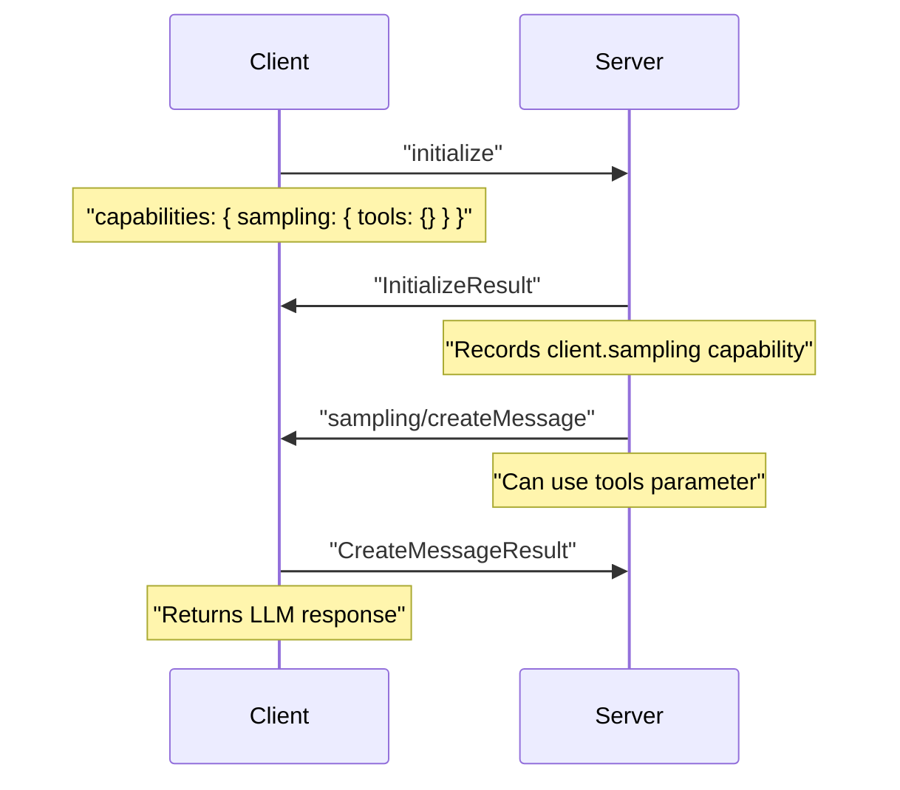
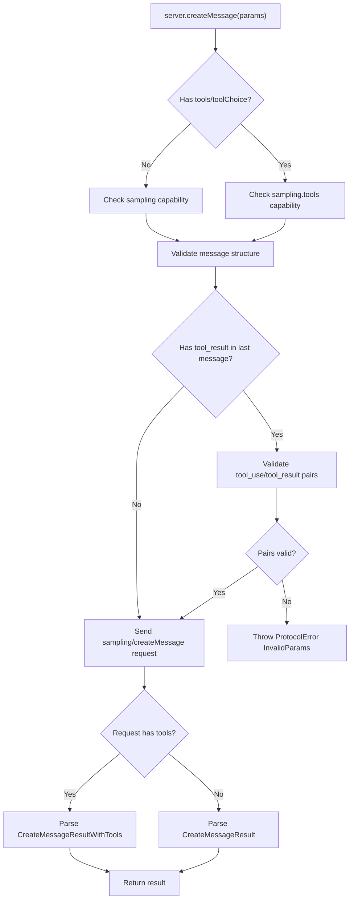
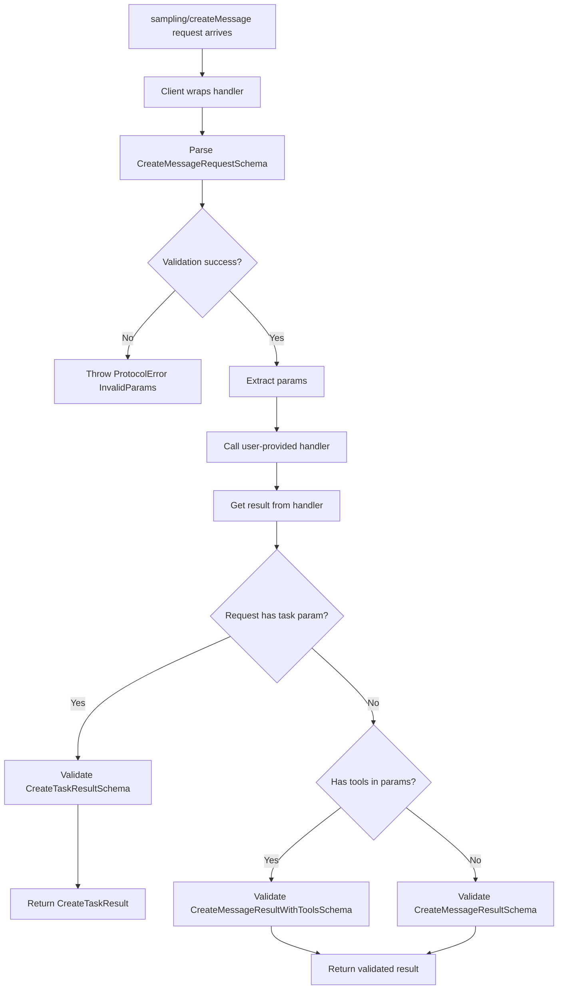
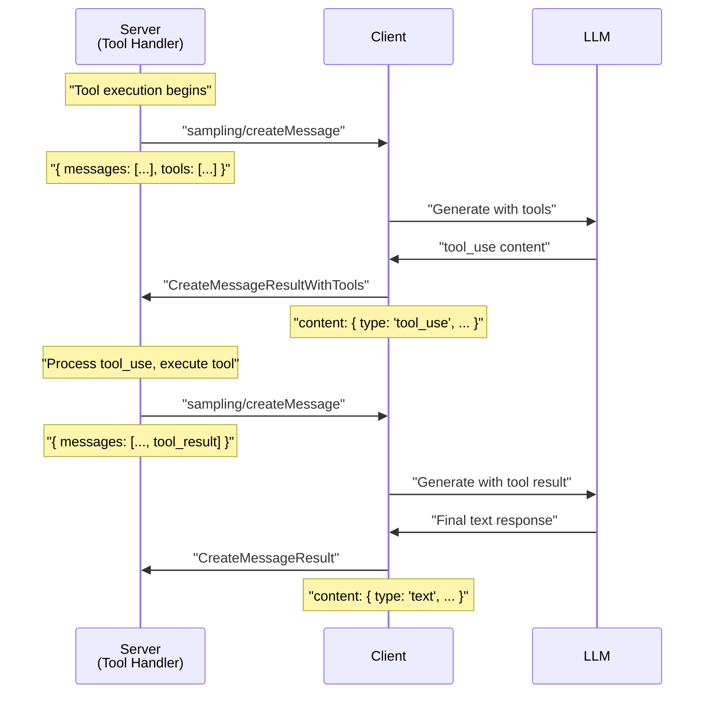

# Sampling and LLM Requests

<details>
<summary>Relevant source files</summary>

The following files were used as context for generating this wiki page:

- [examples/client/src/simpleStreamableHttp.ts](examples/client/src/simpleStreamableHttp.ts)
- [examples/client/src/simpleTaskInteractiveClient.ts](examples/client/src/simpleTaskInteractiveClient.ts)
- [packages/client/src/client/client.ts](packages/client/src/client/client.ts)
- [packages/core/src/shared/protocol.ts](packages/core/src/shared/protocol.ts)
- [packages/core/src/types/types.ts](packages/core/src/types/types.ts)
- [packages/core/test/shared/protocol.test.ts](packages/core/test/shared/protocol.test.ts)
- [packages/server/src/server/mcp.ts](packages/server/src/server/mcp.ts)
- [packages/server/src/server/server.ts](packages/server/src/server/server.ts)
- [test/integration/test/client/client.test.ts](test/integration/test/client/client.test.ts)
- [test/integration/test/server.test.ts](test/integration/test/server.test.ts)
- [test/integration/test/server/mcp.test.ts](test/integration/test/server/mcp.test.ts)
- [test/integration/test/taskLifecycle.test.ts](test/integration/test/taskLifecycle.test.ts)

</details>


**Purpose**: This page documents the sampling system that allows MCP servers to request LLM completions from clients during tool execution. This enables servers to leverage the client's language model capabilities for tasks like content generation, analysis, or multi-turn interactions.

For information about requesting user input from clients, see [Elicitation System](#7.3). For general server-to-client communication patterns, see [Server Protocol Class](#3.4).

---

## Overview

Sampling is a capability that allows servers to request LLM completions from connected clients. During tool execution, a server can send a `sampling/createMessage` request to the client, which then uses its language model to generate a response. This is particularly useful for:

- Generating content based on prompts
- Analyzing or transforming text
- Creating multi-turn conversations
- Executing tool calls through the LLM (when tool support is enabled)

The sampling system supports both simple text generation and more complex interactions involving tool use, allowing servers to orchestrate sophisticated workflows that combine their capabilities with the client's LLM.

**Sources**: [packages/server/src/server/server.ts:466-546](), [packages/core/src/types/types.ts:490-530]()

---

## Capability Negotiation

Before a server can request sampling, the client must advertise the `sampling` capability during initialization. The capability has optional sub-capabilities for advanced features:

| Capability | Description | Required |
|------------|-------------|----------|
| `sampling` | Basic LLM sampling support | Yes |
| `sampling.tools` | Tool use via `tools` and `toolChoice` parameters | No |
| `sampling.context` | Context inclusion via `includeContext` parameter | No |

### Diagram: Capability Advertisement



**Sources**: [packages/core/src/types/types.ts:490-530](), [packages/server/src/server/server.ts:246-276]()

---

## Message Structure and Validation

### Request Parameters

The `CreateMessageRequest` supports two parameter variations depending on whether tools are included:

#### CreateMessageRequestParamsBase

```typescript
{
  messages: Message[],           // Conversation history
  maxTokens: number,             // Maximum tokens to generate
  temperature?: number,          // Optional: 0.0-1.0
  stopSequences?: string[],      // Optional: Stop generation sequences
  metadata?: object,             // Optional: Implementation-specific metadata
  modelPreferences?: {           // Optional: Preferred models
    hints?: Array<{ name?: string }>,
    costPriority?: number,       // 0.0-1.0
    speedPriority?: number,      // 0.0-1.0
    intelligencePriority?: number // 0.0-1.0
  },
  systemPrompt?: string,         // Optional: System-level instructions
  includeContext?: "none" | "thisServer" | "allServers"
}
```

#### CreateMessageRequestParamsWithTools

Extends the base parameters with:

```typescript
{
  tools?: Tool[],                // Available tools
  toolChoice?: ToolChoice        // Tool selection strategy
}
```

### Result Types

The response type varies based on whether tools were provided in the request:

| Request Has Tools | Result Type | Content Type |
|-------------------|-------------|--------------|
| No | `CreateMessageResult` | Single content block |
| Yes | `CreateMessageResultWithTools` | Single block or array (for parallel tool calls) |

**Sources**: [packages/core/src/types/types.ts:1451-1530](), [packages/server/src/server/server.ts:488-546]()

---

## Server-Side Implementation

### Using the Server Class

The `Server` class provides the `createMessage()` method with multiple overloads for type safety:

```typescript
// Without tools - returns CreateMessageResult
await server.createMessage({
  messages: [{ role: 'user', content: { type: 'text', text: 'Write a haiku' } }],
  maxTokens: 100
});

// With tools - returns CreateMessageResultWithTools  
await server.createMessage({
  messages: [{ role: 'user', content: { type: 'text', text: 'Get the weather' } }],
  maxTokens: 100,
  tools: [weatherTool],
  toolChoice: { type: 'required' }
});
```

### Diagram: Server createMessage Method Flow



**Sources**: [packages/server/src/server/server.ts:466-546]()

### Tool Use Validation

The server automatically validates tool_use and tool_result content blocks to ensure proper conversation structure:

1. **tool_result blocks** must only appear in the last message if present
2. **All tool_result blocks** must correspond to tool_use blocks from the previous message
3. **IDs must match** between tool_use and tool_result blocks

This validation occurs even when the current request doesn't include tools, as the conversation may contain tool calls from previous exchanges.

**Sources**: [packages/server/src/server/server.ts:497-539]()

### Convenience Method in Tool Handlers

When implementing tools with `McpServer`, the `ServerContext` provides a convenience method `ctx.mcpReq.requestSampling()`:

```typescript
mcpServer.registerTool('analyze-text', {
  description: 'Analyze text using LLM'
}, async (args, ctx) => {
  const result = await ctx.mcpReq.requestSampling({
    messages: [{
      role: 'user',
      content: { type: 'text', text: `Analyze: ${args.text}` }
    }],
    maxTokens: 500
  });
  
  return {
    content: [{ type: 'text', text: result.content.text }]
  };
});
```

**Sources**: [packages/server/src/server/server.ts:131-152](), [packages/server/src/server/mcp.ts:200-248]()

---

## Client-Side Implementation

### Setting Up the Sampling Handler

Clients must implement the `sampling/createMessage` request handler to process sampling requests:

```typescript
const client = new Client(
  { name: 'my-client', version: '1.0.0' },
  { capabilities: { sampling: { tools: {} } } }
);

client.setRequestHandler('sampling/createMessage', async (request) => {
  // Call your LLM here
  const response = await myLLM.generate({
    messages: request.params.messages,
    maxTokens: request.params.maxTokens,
    tools: request.params.tools
  });
  
  return {
    model: 'gpt-4',
    role: 'assistant',
    content: response.content
  };
});
```

### Diagram: Client Request Handler Wrapping



**Sources**: [packages/client/src/client/client.ts:366-407]()

### Validation in Client

The `Client` class automatically wraps the `sampling/createMessage` handler to ensure:

1. Request parameters conform to `CreateMessageRequestSchema`
2. Response conforms to appropriate result schema based on tool presence
3. Task-based execution returns `CreateTaskResult` when requested

**Sources**: [packages/client/src/client/client.ts:366-407]()

---

## Tool Support in Sampling

When clients advertise the `sampling.tools` capability, servers can include tool definitions in sampling requests. The LLM can then decide to use tools, creating a multi-turn interaction pattern.

### Message Flow with Tools



**Sources**: [packages/server/src/server/server.ts:497-546]()

### Tool Use Content Structure

When the LLM decides to use tools, it returns `tool_use` content blocks:

```typescript
{
  type: 'tool_use',
  id: 'call_abc123',       // Unique identifier for this call
  name: 'get_weather',     // Tool name
  arguments: {             // Tool arguments
    location: 'San Francisco'
  }
}
```

The server must then execute the tool and provide results in the next message as `tool_result` blocks:

```typescript
{
  type: 'tool_result',
  toolUseId: 'call_abc123', // Must match tool_use.id
  content: [
    { type: 'text', text: 'Temperature: 72°F, Sunny' }
  ],
  isError: false
}
```

**Sources**: [packages/core/src/types/types.ts:1306-1344]()

---

## Task-Based Sampling

Sampling requests support task augmentation for long-running LLM operations:

### Server Side

```typescript
// Request sampling with task augmentation
await ctx.mcpReq.requestSampling({
  messages: [...],
  maxTokens: 2000,
  task: {
    ttl: 300_000,        // 5 minutes
    pollInterval: 1000   // Poll every second
  }
});
```

### Client Side

The client handler receives the task parameter and can return a `CreateTaskResult`:

```typescript
client.setRequestHandler('sampling/createMessage', async (request) => {
  if (request.params.task) {
    // Create task for long-running generation
    const task = await ctx.task.store.createTask({
      ttl: request.params.task.ttl,
      pollInterval: request.params.task.pollInterval
    });
    
    // Start async generation
    generateAsync(request.params, task.taskId);
    
    return { task };
  }
  
  // Regular synchronous generation
  return await generateSync(request.params);
});
```

**Sources**: [packages/client/src/client/client.ts:376-402](), [packages/server/src/server/server.ts:488-546]()

---

## Context Inclusion

Clients that advertise `sampling.context` capability can receive context about the server in sampling requests via the `includeContext` parameter:

| Value | Description |
|-------|-------------|
| `"none"` | No context included (default if capability not declared) |
| `"thisServer"` | Include context about the requesting server |
| `"allServers"` | Include context about all connected servers |

Servers should only use `includeContext` values other than `"none"` if the client has advertised the `sampling.context` capability.

**Sources**: [packages/core/src/types/types.ts:498-510]()

---

## Code Entity Reference

### Server Classes and Methods

| Entity | Location | Purpose |
|--------|----------|---------|
| `Server.createMessage()` | [packages/server/src/server/server.ts:466-546]() | Low-level sampling request method |
| `ctx.mcpReq.requestSampling()` | [packages/server/src/server/server.ts:141]() | Convenience method in ServerContext |
| `Server.assertCapabilityForMethod()` | [packages/server/src/server/server.ts:246-276]() | Validates client capabilities |

### Client Classes and Methods

| Entity | Location | Purpose |
|--------|----------|---------|
| `Client.setRequestHandler()` | [packages/client/src/client/client.ts:292-411]() | Register sampling handler (wraps for validation) |
| `ClientCapabilitiesSchema.sampling` | [packages/core/src/types/types.ts:498-510]() | Capability definition |

### Type Definitions

| Type | Location | Description |
|------|----------|-------------|
| `CreateMessageRequest` | [packages/core/src/types/types.ts:1483-1490]() | Sampling request type |
| `CreateMessageResult` | [packages/core/src/types/types.ts:1493-1509]() | Result without tools |
| `CreateMessageResultWithTools` | [packages/core/src/types/types.ts:1512-1530]() | Result with tool support |
| `CreateMessageRequestParamsBase` | [packages/core/src/types/types.ts:1451-1479]() | Base request parameters |
| `CreateMessageRequestParamsWithTools` | [packages/core/src/types/types.ts:1481]() | Parameters with tool support |

### Schemas

| Schema | Location | Purpose |
|--------|----------|---------|
| `CreateMessageRequestSchema` | [packages/core/src/types/types.ts:1483-1490]() | Validates requests |
| `CreateMessageResultSchema` | [packages/core/src/types/types.ts:1493-1509]() | Validates results without tools |
| `CreateMessageResultWithToolsSchema` | [packages/core/src/types/types.ts:1512-1530]() | Validates results with tools |

**Sources**: [packages/server/src/server/server.ts:1-668](), [packages/client/src/client/client.ts:1-901](), [packages/core/src/types/types.ts:1451-1530]()

---

## Example: Complete Sampling Flow

### Example Server Tool Using Sampling

```typescript
// Server implementation using McpServer
mcpServer.registerTool(
  'write-haiku',
  {
    description: 'Generate a haiku on any topic',
    inputSchema: z.object({
      topic: z.string().describe('The topic for the haiku')
    })
  },
  async ({ topic }, ctx) => {
    // Request LLM to write haiku
    const result = await ctx.mcpReq.requestSampling({
      messages: [{
        role: 'user',
        content: {
          type: 'text',
          text: `Write a haiku about ${topic}`
        }
      }],
      maxTokens: 100,
      temperature: 0.8
    });
    
    return {
      content: [{
        type: 'text',
        text: result.content.text
      }]
    };
  }
);
```

### Example Client Handler

```typescript
// Client implementation
const client = new Client(
  { name: 'haiku-client', version: '1.0.0' },
  { capabilities: { sampling: {} } }
);

client.setRequestHandler('sampling/createMessage', async (request) => {
  // Extract the prompt
  const prompt = request.params.messages[0].content.text;
  
  // Call your LLM (example using a hypothetical API)
  const completion = await llmApi.complete({
    prompt: prompt,
    max_tokens: request.params.maxTokens,
    temperature: request.params.temperature || 0.7
  });
  
  return {
    model: 'gpt-4',
    role: 'assistant',
    content: {
      type: 'text',
      text: completion.text
    }
  };
});
```

**Sources**: [examples/client/src/simpleTaskInteractiveClient.ts:49-78](), [test/integration/test/server/mcp.test.ts:200-248]()

---

## Error Handling

### Common Errors

| Error Code | Scenario | Message |
|------------|----------|---------|
| `SdkErrorCode.CapabilityNotSupported` | Client doesn't support sampling | "Client does not support sampling" |
| `SdkErrorCode.CapabilityNotSupported` | Client doesn't support tools but server sent them | "Client does not support sampling tools capability" |
| `ProtocolErrorCode.InvalidParams` | Invalid message structure | "tool_result blocks are not matching any tool_use from the previous message" |
| `ProtocolErrorCode.InvalidParams` | Invalid request format | "Invalid sampling request: ..." |
| `ProtocolErrorCode.InvalidParams` | Invalid result format | "Invalid sampling result: ..." |

### Example Error Handling

```typescript
// Server side
try {
  const result = await server.createMessage({
    messages: [{ role: 'user', content: { type: 'text', text: 'Hello' } }],
    maxTokens: 100,
    tools: [someTool]
  });
} catch (error) {
  if (error instanceof SdkError && error.code === SdkErrorCode.CapabilityNotSupported) {
    // Client doesn't support tools
    console.error('Client does not support tool-enabled sampling');
  }
}
```

**Sources**: [packages/server/src/server/server.ts:492-546](), [packages/client/src/client/client.ts:366-407]()

---