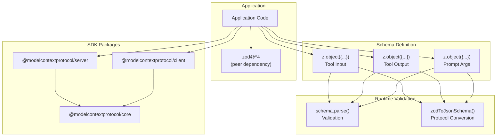
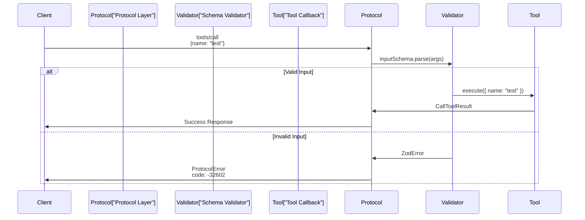
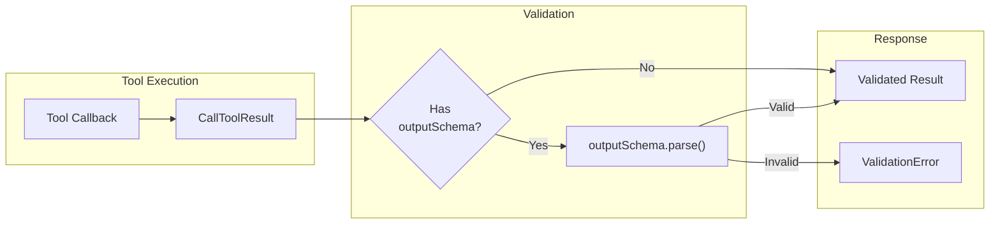
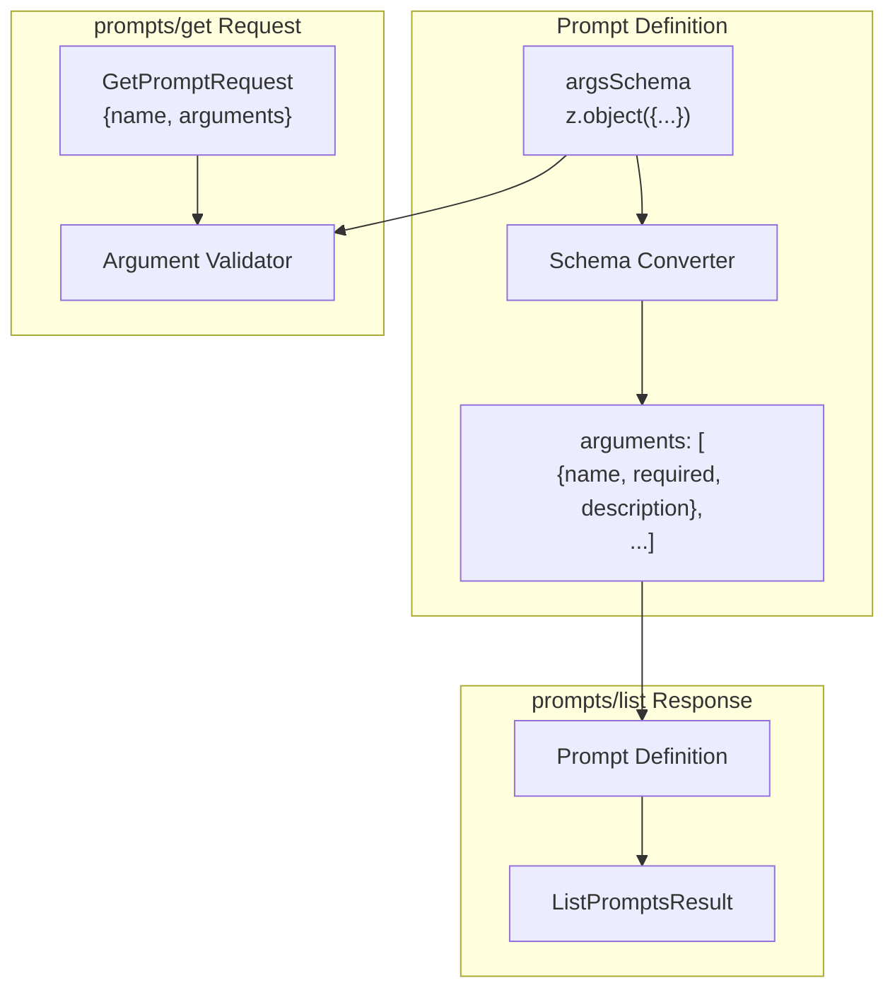
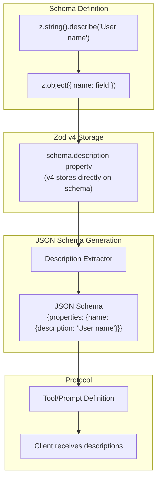
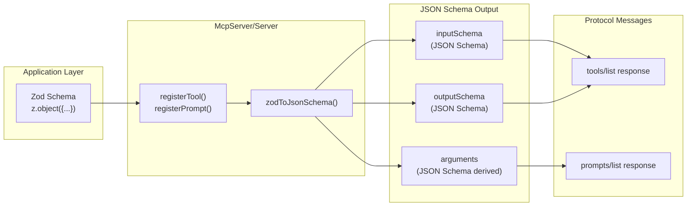
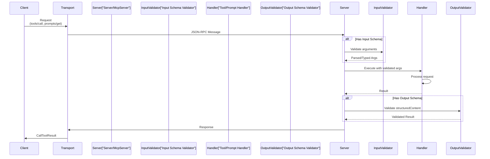
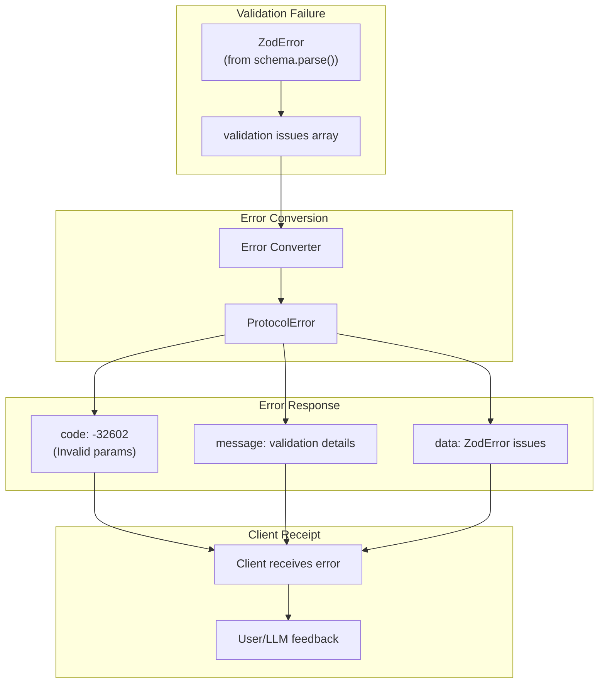
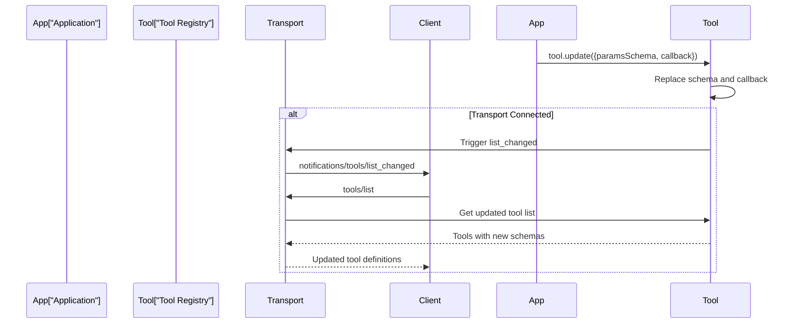

# Schema Validation

<details>
<summary>Relevant source files</summary>

The following files were used as context for generating this wiki page:

- [.changeset/funky-baths-attack.md](.changeset/funky-baths-attack.md)
- [.changeset/shy-times-learn.md](.changeset/shy-times-learn.md)
- [examples/server/src/ssePollingExample.ts](examples/server/src/ssePollingExample.ts)
- [packages/server/test/server/streamableHttp.test.ts](packages/server/test/server/streamableHttp.test.ts)
- [test/integration/test/client/client.test.ts](test/integration/test/client/client.test.ts)
- [test/integration/test/issues/test1277.zod.v4.description.test.ts](test/integration/test/issues/test1277.zod.v4.description.test.ts)
- [test/integration/test/server.test.ts](test/integration/test/server.test.ts)
- [test/integration/test/server/mcp.test.ts](test/integration/test/server/mcp.test.ts)
- [test/integration/test/stateManagementStreamableHttp.test.ts](test/integration/test/stateManagementStreamableHttp.test.ts)
- [test/integration/test/taskLifecycle.test.ts](test/integration/test/taskLifecycle.test.ts)
- [test/integration/test/taskResumability.test.ts](test/integration/test/taskResumability.test.ts)
- [test/integration/test/title.test.ts](test/integration/test/title.test.ts)

</details>


Schema validation in the MCP TypeScript SDK ensures type safety and data integrity for tool inputs/outputs, prompt arguments, and resource parameters. The SDK uses Zod v4 as a required peer dependency to define schemas that are validated at runtime and converted to JSON Schema for protocol communication.

For information about type definitions and message schemas, see [Type System and Message Schemas](#2.2). For OAuth-specific validation, see [OAuth Authentication](#5).

---

## Zod v4 as Required Peer Dependency

The SDK requires Zod v4 (`zod@^4`) as a peer dependency for schema definition and validation. This allows applications to control the Zod version while ensuring compatibility.



**Peer Dependency Declaration**: Applications must install `zod@^4` explicitly. The SDK validates that Zod v4 is available and throws clear errors if incompatible versions are detected.

Sources: [test/integration/test/server/mcp.test.ts:21](), [test/integration/test/client/client.test.ts:16]()

---

## Tool Input Schema Validation

Tools can specify an `inputSchema` using Zod to validate arguments passed by clients. The schema is validated when `tools/call` requests are received.

### Registration with McpServer

```typescript
// Example from test suite
mcpServer.registerTool(
    'greet',
    {
        description: 'A simple greeting tool',
        inputSchema: z.object({
            name: z.string().describe('Name to greet'),
            count: z.number().optional().describe('Number of times to greet')
        })
    },
    async ({ name, count }) => {
        // name and count are fully typed from the schema
        return {
            content: [{ type: 'text', text: `Hello, ${name}!` }]
        };
    }
);
```

**Type Inference**: The callback parameters are automatically typed based on the schema. For `z.object({ name: z.string() })`, the callback receives `{ name: string }`.

**Validation Timing**: Input validation occurs before the tool callback executes. Invalid inputs result in a `ProtocolError` with code `-32602` (Invalid params).

Sources: [test/integration/test/server/mcp.test.ts:888-918](), [packages/server/test/server/streamableHttp.test.ts:129-138]()

### Input Schema Flow



**Schema Properties**:
- **Required fields**: `z.string()` without `.optional()` are required
- **Optional fields**: `z.string().optional()` or `z.string().nullish()`
- **Default values**: `z.string().default("value")` provides fallback
- **Descriptions**: `z.string().describe("...")` adds documentation

Sources: [test/integration/test/server/mcp.test.ts:264-266](), [test/integration/test/server/mcp.test.ts:878-918]()

---

## Tool Output Schema Validation

Tools can specify an `outputSchema` to validate the structured content returned by the tool. This ensures type safety for tool responses.

### Output Schema with structuredContent

```typescript
// Example from test suite
mcpServer.registerTool(
    'calculator',
    {
        description: 'Perform calculation',
        inputSchema: z.object({
            operation: z.enum(['add', 'subtract']),
            a: z.number(),
            b: z.number()
        }),
        outputSchema: z.object({
            result: z.number(),
            operation: z.string()
        })
    },
    async ({ operation, a, b }) => {
        const result = operation === 'add' ? a + b : a - b;
        return {
            content: [{ type: 'text', text: `Result: ${result}` }],
            structuredContent: {
                result,
                operation
            }
        };
    }
);
```

**structuredContent Field**: When `outputSchema` is specified, the tool result can include a `structuredContent` field that is validated against the schema.

**Validation Timing**: Output validation occurs after the tool callback completes, before the response is sent to the client.

Sources: [test/integration/test/server/mcp.test.ts:652-721]()

### Output Schema Validation Flow



**Output Schema in tools/list**: The `outputSchema` is converted to JSON Schema and included in the tool definition returned by `tools/list`, allowing clients to understand the structured output format.

Sources: [test/integration/test/server/mcp.test.ts:654-721]()

---

## Prompt Argument Schema Validation

Prompts can specify an `argsSchema` to validate arguments passed when the prompt is retrieved via `prompts/get`.

### Prompt Registration with Arguments

```typescript
// Example from test suite
mcpServer.registerPrompt(
    'greeting-template',
    {
        description: 'Generate a greeting message',
        argsSchema: z.object({
            name: z.string().describe('The user name'),
            language: z.enum(['en', 'es', 'fr']).describe('Language for greeting'),
            formal: z.boolean().optional().describe('Use formal tone')
        })
    },
    async ({ name, language, formal }) => {
        // Arguments are validated and typed
        const greeting = formal ? `Good day, ${name}` : `Hi ${name}`;
        return {
            messages: [
                {
                    role: 'user',
                    content: { type: 'text', text: greeting }
                }
            ]
        };
    }
);
```

**Argument Definitions**: The schema is converted to an array of argument definitions in `prompts/list` responses, with each property becoming an argument entry.

Sources: [test/integration/test/issues/test1277.zod.v4.description.test.ts:25-44](), [test/integration/test/title.test.ts:88-117]()

### Prompt Arguments in Protocol



**Zod v4 Description Extraction**: The SDK extracts descriptions from Zod v4 schemas using the `.describe()` method. This is important because Zod v4 stores descriptions differently than v3.

Sources: [test/integration/test/issues/test1277.zod.v4.description.test.ts:1-64]()

---

## Resource Argument Validation

Dynamic resources (using `ResourceTemplate`) can have argument schemas for URI template variables.

### Dynamic Resource with Arguments

```typescript
// Example pattern from test suite
server.registerResource(
    'user-profile',
    new ResourceTemplate('users://{userId}/profile', { list: undefined }),
    {
        title: 'User Profile',
        description: 'User profile information'
    },
    async (uri, { userId }, _extra) => {
        // userId is extracted from URI template and validated
        return {
            contents: [
                {
                    uri: uri.href,
                    text: `Profile data for user ${userId}`
                }
            ]
        };
    }
);
```

**URI Template Variables**: The `ResourceTemplate` class parses the URI template pattern and extracts variable names. These variables are passed to the callback as typed parameters.

**Validation**: Resource template variables can be validated using schemas, ensuring that URI parameters match expected types and formats.

Sources: [test/integration/test/title.test.ts:156-202](), [test/integration/test/server/mcp.test.ts:352-399]()

---

## Schema Descriptions and Documentation

The `.describe()` method adds human-readable descriptions to schema fields, which are included in JSON Schema output and displayed to users.

### Description Extraction in Zod v4



**Zod v4 vs v3**: In Zod v3, descriptions were stored in `._def.description`. In Zod v4, they are stored directly on the schema object's `.description` property. The SDK handles this correctly.

**Purpose**: Descriptions help users understand what each field expects, improving the developer experience for both tool creators and consumers.

Sources: [test/integration/test/issues/test1277.zod.v4.description.test.ts:1-64]()

### Description Usage Example

```typescript
// All fields have descriptions
const schema = z.object({
    name: z.string().describe('The user name'),
    email: z.string().email().describe('Valid email address'),
    age: z.number().min(0).describe('Age in years'),
    active: z.boolean().default(true).describe('Whether account is active')
});
```

**Generated JSON Schema** includes all descriptions:
```json
{
    "type": "object",
    "properties": {
        "name": {
            "type": "string",
            "description": "The user name"
        },
        "email": {
            "type": "string",
            "format": "email",
            "description": "Valid email address"
        },
        "age": {
            "type": "number",
            "minimum": 0,
            "description": "Age in years"
        },
        "active": {
            "type": "boolean",
            "default": true,
            "description": "Whether account is active"
        }
    },
    "required": ["name", "email", "age"]
}
```

Sources: [test/integration/test/issues/test1277.zod.v4.description.test.ts:28-31]()

---

## JSON Schema Generation

Zod schemas are converted to JSON Schema for protocol communication. This happens automatically when tools, prompts, or resources are registered.

### Schema Conversion Pipeline



**Conversion Details**:
- **Type mapping**: Zod types map to JSON Schema types (e.g., `z.string()` → `"type": "string"`)
- **Constraints**: Zod refinements and constraints are preserved (e.g., `.min()`, `.max()`, `.email()`)
- **Enums**: `z.enum()` becomes JSON Schema `enum` array
- **Optional fields**: `.optional()` removes field from `required` array
- **Default values**: `.default()` adds `default` property

Sources: [test/integration/test/server/mcp.test.ts:910-917]()

### Tools List with Schemas

The `tools/list` response includes both input and output schemas as JSON Schema:

```typescript
{
    tools: [
        {
            name: "greet",
            description: "A simple greeting tool",
            inputSchema: {
                type: "object",
                properties: {
                    name: {
                        type: "string",
                        description: "Name to greet"
                    },
                    count: {
                        type: "number",
                        description: "Number of times to greet"
                    }
                },
                required: ["name"]
            },
            outputSchema: {
                type: "object",
                properties: {
                    greeting: { type: "string" },
                    count: { type: "number" }
                },
                required: ["greeting"]
            }
        }
    ]
}
```

Sources: [test/integration/test/server/mcp.test.ts:909-918]()

---

## Validation Flow and Timing

Schema validation occurs at specific points in the request/response lifecycle to ensure data integrity.

### Complete Validation Flow



**Validation Points**:

| Location | Validation Type | Zod Method | Error Code |
|----------|----------------|------------|------------|
| Tool input | `inputSchema` | `schema.parse(args)` | `-32602` (Invalid params) |
| Tool output | `outputSchema` | `schema.parse(structuredContent)` | `-32603` (Internal error) |
| Prompt arguments | `argsSchema` | `schema.parse(args)` | `-32602` (Invalid params) |
| Resource arguments | Template schema | `schema.parse(variables)` | `-32602` (Invalid params) |

Sources: [test/integration/test/server/mcp.test.ts:878-918]()

### Input Validation Example

```typescript
// Server-side validation
mcpServer.registerTool(
    'divide',
    {
        inputSchema: z.object({
            dividend: z.number(),
            divisor: z.number().min(1)  // Must be at least 1
        })
    },
    async ({ dividend, divisor }) => {
        // divisor is guaranteed to be >= 1
        const result = dividend / divisor;
        return {
            content: [{ type: 'text', text: `${result}` }]
        };
    }
);

// Client call with invalid input
await client.callTool({
    name: 'divide',
    arguments: {
        dividend: 10,
        divisor: 0  // Invalid: violates .min(1)
    }
});
// Throws ProtocolError with code -32602
```

Sources: [test/integration/test/server/mcp.test.ts:888-918]()

---

## Error Handling and Validation Failures

When validation fails, the SDK throws structured errors with appropriate error codes and messages.

### Validation Error Mapping



**Error Structure**:
```typescript
{
    jsonrpc: "2.0",
    id: "request-id",
    error: {
        code: -32602,
        message: "Invalid params: validation failed",
        data: {
            issues: [
                {
                    code: "invalid_type",
                    expected: "string",
                    received: "number",
                    path: ["name"],
                    message: "Expected string, received number"
                }
            ]
        }
    }
}
```

Sources: [test/integration/test/server.test.ts:706-756]()

### Validation Error Categories

| Error Type | Code | When It Occurs |
|------------|------|----------------|
| Invalid input type | `-32602` | Argument type doesn't match schema |
| Missing required field | `-32602` | Required field not provided |
| Constraint violation | `-32602` | Value violates `.min()`, `.max()`, `.email()`, etc. |
| Invalid enum value | `-32602` | Value not in `z.enum()` list |
| Output validation failure | `-32603` | `structuredContent` doesn't match `outputSchema` |

**Error Recovery**: Clients should catch `ProtocolError` exceptions and examine the error code and data to provide meaningful feedback to users or LLMs about what went wrong.

Sources: [test/integration/test/server.test.ts:706-756]()

---

## Schema Update and Versioning

Tools, prompts, and resources can be updated with new schemas after initial registration, triggering appropriate notifications.

### Schema Updates with .update()

```typescript
// Initial registration
const tool = mcpServer.registerTool(
    'calculator',
    {
        inputSchema: z.object({
            a: z.number(),
            b: z.number()
        })
    },
    async ({ a, b }) => {
        return { content: [{ type: 'text', text: `${a + b}` }] };
    }
);

// Later: update the schema
tool.update({
    paramsSchema: z.object({
        a: z.number(),
        b: z.number(),
        operation: z.enum(['add', 'subtract', 'multiply'])
    }),
    callback: async ({ a, b, operation }) => {
        // New callback with updated schema
        // ...
    }
});
```

**Notification**: When a tool's schema is updated after the transport is connected, a `notifications/tools/list_changed` notification is sent to clients.

**Schema Migration**: The update is atomic - the old schema and callback are replaced simultaneously, ensuring consistency.

Sources: [test/integration/test/server/mcp.test.ts:541-632]()

### Update Flow



Sources: [test/integration/test/server/mcp.test.ts:541-632](), [test/integration/test/server/mcp.test.ts:726-783]()

---

## Summary

**Schema validation** in the MCP TypeScript SDK provides:

1. **Type Safety**: Zod schemas ensure runtime type checking and TypeScript type inference
2. **Documentation**: `.describe()` generates human-readable field documentation
3. **Protocol Integration**: Automatic JSON Schema conversion for wire format
4. **Error Handling**: Structured validation errors with clear feedback
5. **Flexibility**: Support for tool inputs/outputs, prompt arguments, and resource parameters

**Key Classes and Methods**:

| Component | Purpose | Key Methods |
|-----------|---------|-------------|
| `McpServer.registerTool()` | Define tool with schemas | `inputSchema`, `outputSchema` parameters |
| `McpServer.registerPrompt()` | Define prompt with args | `argsSchema` parameter |
| `McpServer.registerResource()` | Define resource with args | `ResourceTemplate` with schema |
| `z.object()` | Define object schema | `.describe()`, `.optional()`, `.default()` |
| `schema.parse()` | Validate data | Throws `ZodError` on failure |

Sources: [test/integration/test/server/mcp.test.ts:39-1300](), [test/integration/test/client/client.test.ts:1-2400]()

---