# Server Examples and Patterns

<details>
<summary>Relevant source files</summary>

The following files were used as context for generating this wiki page:

- [docs/server.md](docs/server.md)
- [examples/server/src/elicitationUrlExample.ts](examples/server/src/elicitationUrlExample.ts)
- [examples/server/src/jsonResponseStreamableHttp.ts](examples/server/src/jsonResponseStreamableHttp.ts)
- [examples/server/src/simpleStatelessStreamableHttp.ts](examples/server/src/simpleStatelessStreamableHttp.ts)
- [examples/server/src/simpleStreamableHttp.ts](examples/server/src/simpleStreamableHttp.ts)
- [packages/server/package.json](packages/server/package.json)
- [packages/server/src/experimental/tasks/mcpServer.ts](packages/server/src/experimental/tasks/mcpServer.ts)
- [pnpm-lock.yaml](pnpm-lock.yaml)
- [pnpm-workspace.yaml](pnpm-workspace.yaml)

</details>


This page provides a walkthrough of the example server implementations and common architectural patterns for building MCP servers. For API documentation of server classes and methods, see [McpServer High-Level API](#3.1) and [Server Protocol Class](#3.4). For transport configuration details, see [Streamable HTTP Server Transport](#3.5) and [Middleware Integration](#3.6).

## Example Server Index

The SDK includes several reference implementations that demonstrate different server patterns and features. All examples are located under [`examples/server/src/`]() and can be run directly with `tsx`.

| Example File | Pattern | Features Demonstrated |
|-------------|---------|----------------------|
| `simpleStreamableHttp.ts` | Full-featured stateful server | Sessions, resumability, EventStore, tools, resources, prompts, logging, OAuth hooks |
| `simpleStatelessStreamableHttp.ts` | Stateless server | No session tracking, simple request/response |
| `jsonResponseStreamableHttp.ts` | JSON-only mode | HTTP POST request/response without SSE notifications |
| `standaloneSseWithGetStreamableHttp.ts` | Notification-only SSE | GET endpoint for SSE streaming separate from POST requests |
| `simpleSseServer.ts` | Legacy HTTP+SSE transport | Backwards compatibility with 2024-11-05 protocol version |
| `sseAndStreamableHttpCompatibleServer.ts` | Multi-transport server | Supports both modern and legacy clients simultaneously |
| `toolWithSampleServer.ts` | Sampling integration | Demonstrates server-side LLM completion requests |

**Running an example:**

```bash
# From repo root
pnpm --filter @modelcontextprotocol/examples-server exec tsx src/simpleStreamableHttp.ts

# Or from examples/server directory
cd examples/server
pnpm tsx src/simpleStreamableHttp.ts
```

Sources: [README.md:85-126](), [docs/server.md:13-19]()

## Example Architecture Overview

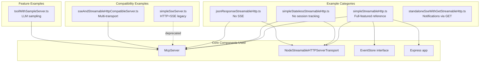

Sources: [README.md:85-126](), [docs/server.md:13-70]()

## Simple Streamable HTTP Pattern

The `simpleStreamableHttp.ts` example demonstrates a full-featured stateful MCP server with all major capabilities enabled.

### Architecture

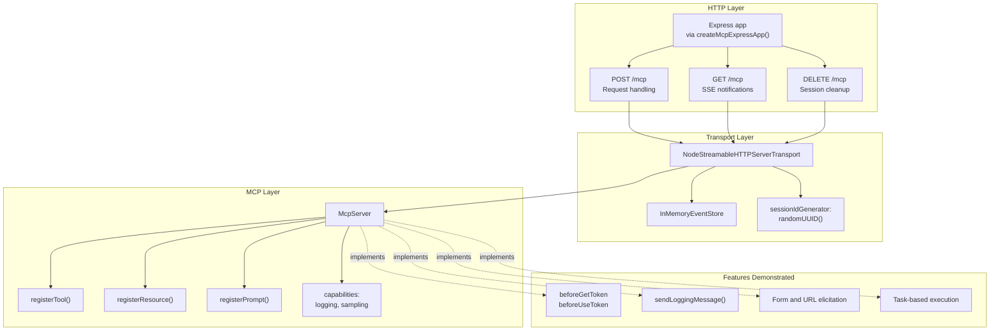

### Key Implementation Details

The example creates a server with session management and resumability:

1. **Express app with DNS rebinding protection** via `createMcpExpressApp()` from [`@modelcontextprotocol/express`]()
2. **Event storage** using `InMemoryEventStore` for notification persistence
3. **Session ID generation** using `randomUUID()` for unique session tracking
4. **OAuth integration hooks** (`beforeGetToken`, `beforeUseToken`) for authentication flows
5. **Capability registration** including tools, resources, prompts with schema validation
6. **Logging and notifications** via `sendLoggingMessage()` within tool handlers

Sources: [docs/server.md:33-36](), [docs/server.md:64-70]()

## Stateless Server Pattern

The `simpleStatelessStreamableHttp.ts` example demonstrates a minimal server with no session tracking.

### When to Use Stateless Mode

| Scenario | Use Stateless | Use Stateful |
|----------|--------------|--------------|
| Simple API-style servers | ✓ | |
| No server-to-client notifications needed | ✓ | |
| Horizontal scaling without shared state | ✓ | |
| Task resumability required | | ✓ |
| Event replay needed | | ✓ |
| Multiple concurrent client sessions | | ✓ |

### Stateless Configuration

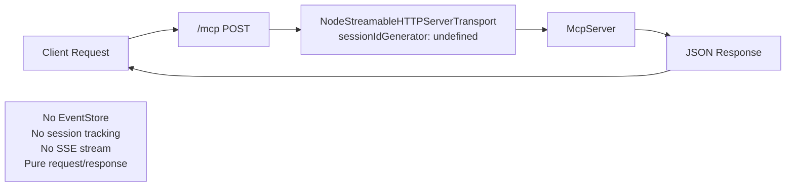

The key difference from stateful mode is passing `sessionIdGenerator: undefined` to `NodeStreamableHTTPServerTransport`, which disables session creation and tracking.

Sources: [docs/server.md:40-50]()

## JSON Response Mode Pattern

The `jsonResponseStreamableHttp.ts` example shows how to disable SSE notifications entirely and return responses as plain JSON.

### Architecture

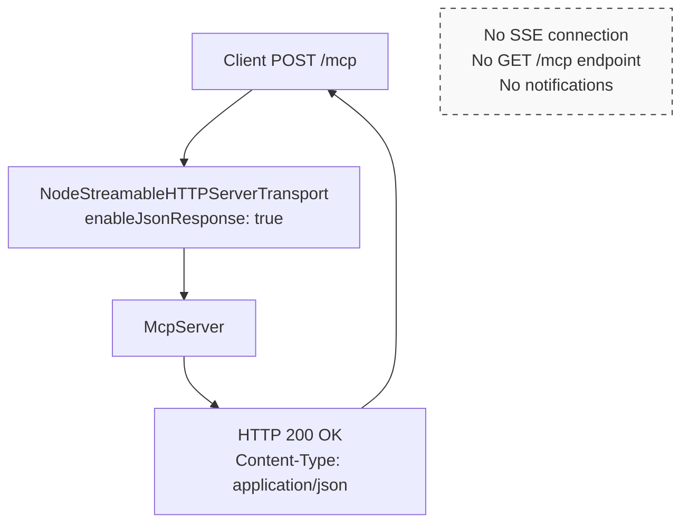

### Configuration

Setting `enableJsonResponse: true` in transport options changes the response format from SSE to plain JSON:
- Server responds with `Content-Type: application/json`
- No SSE stream opened
- Notifications are not supported
- Simpler for clients that don't need server-initiated messages

Sources: [docs/server.md:35-36]()

## Session Management and Resumability Pattern

Session management enables clients to disconnect and reconnect while preserving state and replaying missed notifications.

### EventStore Interface

The `EventStore` interface defines the contract for persisting and replaying notification events:

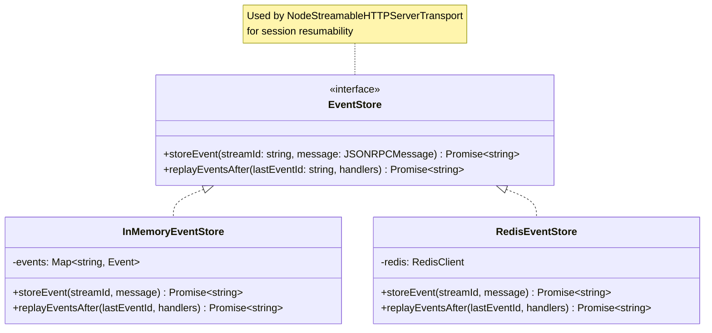

### InMemoryEventStore Implementation

The test suite demonstrates a complete `InMemoryEventStore` implementation:

[test/integration/test/taskResumability.test.ts:15-44]()

This implementation:
1. Generates unique event IDs combining stream ID, timestamp, and random suffix
2. Stores events in a `Map<string, {streamId, message}>`
3. Replays events after a given `lastEventId` by sorting and filtering
4. Returns the stream ID for validation

### Resumability Flow

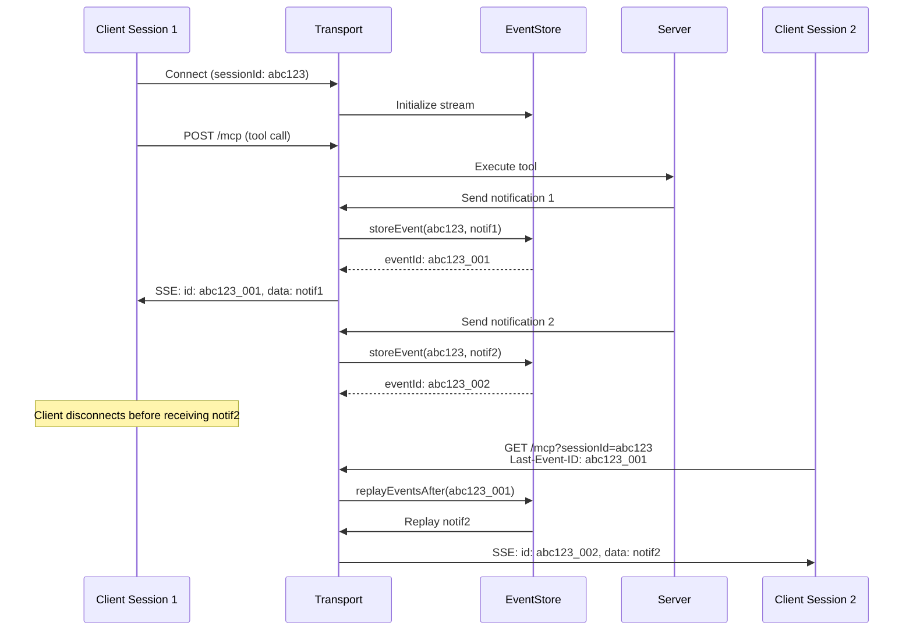

Sources: [test/integration/test/taskResumability.test.ts:1-298]()

## Multi-Node Deployment Patterns

For production deployments, MCP servers can be scaled horizontally with proper session affinity and shared state.

### Deployment Architecture Options

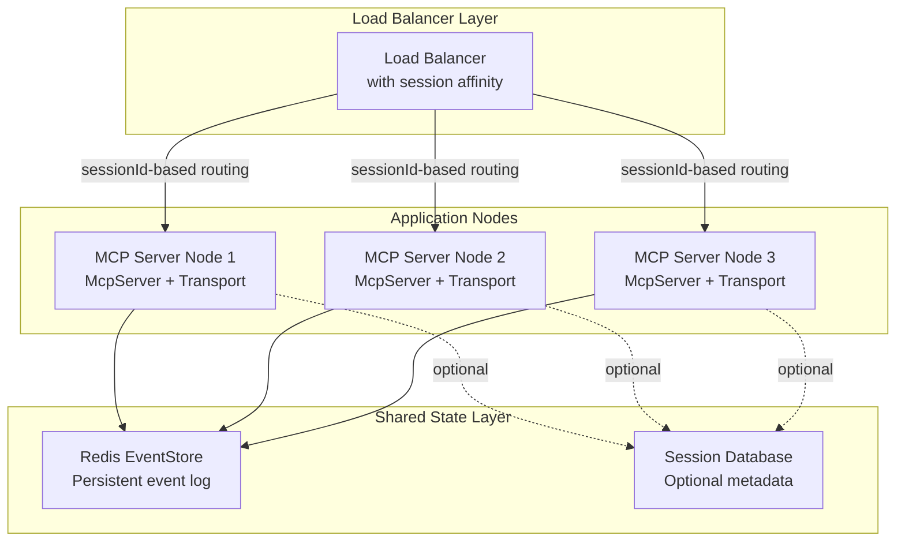

### Session Affinity Configuration

| Approach | Implementation | Trade-offs |
|----------|---------------|-----------|
| **Sticky sessions** | Route by `sessionId` in URL or cookie | Simple, but node failures lose sessions |
| **Shared EventStore** | Redis-based EventStore implementation | Enables failover, adds latency |
| **Stateless mode** | No sessions, pure request/response | Easiest to scale, no resumability |

### EventStore Implementation for Production

A Redis-based EventStore would implement:

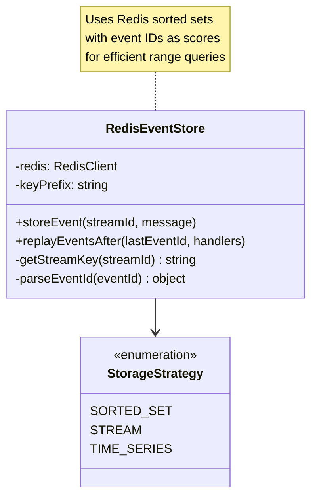

Key implementation considerations:
1. Use Redis sorted sets with event IDs as scores for range queries
2. Implement TTL for old events to prevent unbounded growth
3. Consider Redis Streams for native append-log semantics
4. Handle connection failures with retry logic

Sources: [docs/server.md:211-214]()

## Backwards Compatibility Pattern

The `sseAndStreamableHttpCompatibleServer.ts` example demonstrates serving both modern Streamable HTTP clients and legacy HTTP+SSE clients from a single server.

### Multi-Transport Architecture

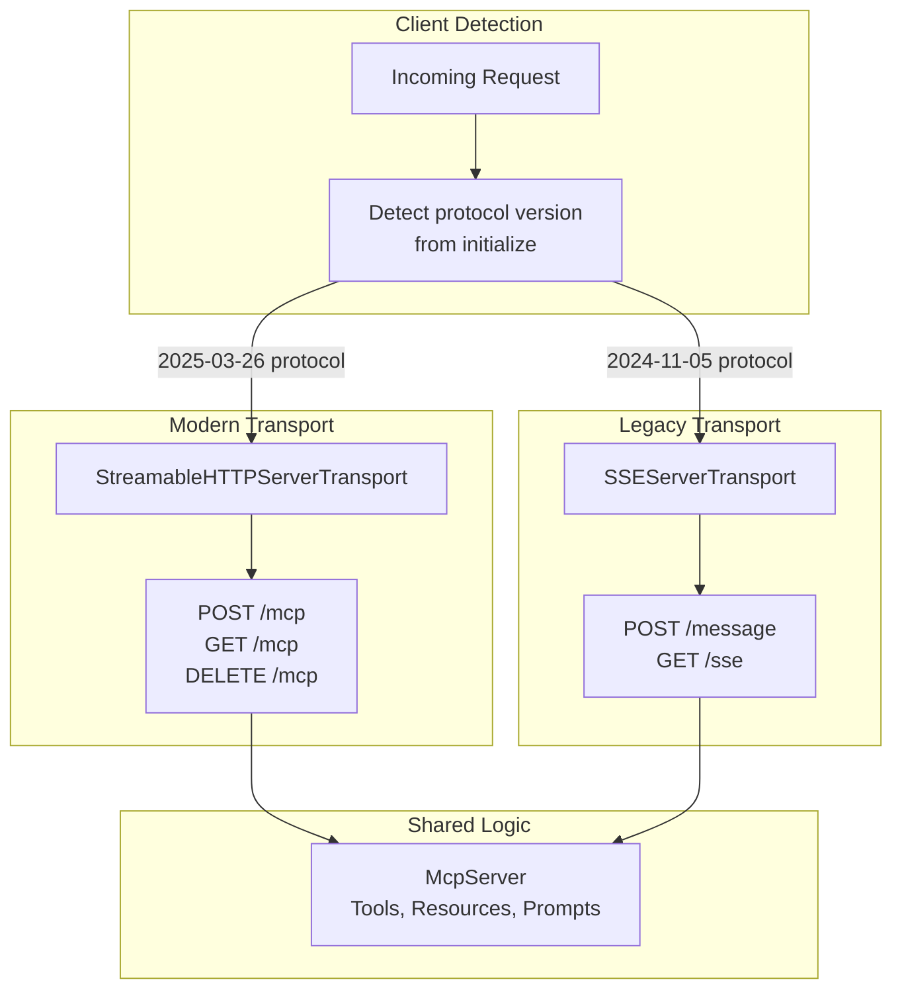

### Implementation Strategy

1. **Single McpServer instance** shared by both transports
2. **Protocol version detection** during initialization handshake
3. **Separate endpoint paths** to avoid routing conflicts
4. **Capability normalization** to handle differences between protocol versions

Sources: [docs/server.md:54-60](), [docs/server.md:217-223]()

## DNS Rebinding Protection Pattern

MCP servers running on localhost are vulnerable to DNS rebinding attacks. The SDK provides helper functions to enable automatic protection.

### Protection Architecture

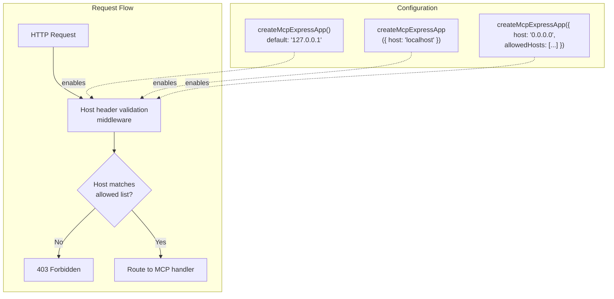

### Automatic Protection Rules

| Binding Host | Auto-Protected | Requires Manual Config |
|-------------|----------------|----------------------|
| `127.0.0.1` | ✓ | |
| `localhost` | ✓ | |
| `0.0.0.0` or `::` | | ✓ (provide `allowedHosts`) |
| Specific IP | | ✓ (provide `allowedHosts`) |

### Usage Examples

**Automatic protection (default):**

[docs/server.md:76-87]()

**Manual allow-list for 0.0.0.0:**

[docs/server.md:90-98]()

The middleware implementation is located in:
- [`packages/server/src/server/middleware/hostHeaderValidation.ts`]()
- [`packages/middleware/express/src/index.ts`]()
- [`packages/middleware/hono/src/index.ts`]()

Sources: [docs/server.md:72-98]()

## Tool, Resource, and Prompt Registration Patterns

While the API details are covered in [Tool Registration and Execution](#3.2) and [Resource and Prompt Management](#3.3), the examples demonstrate common registration patterns.

### Tool Registration Pattern

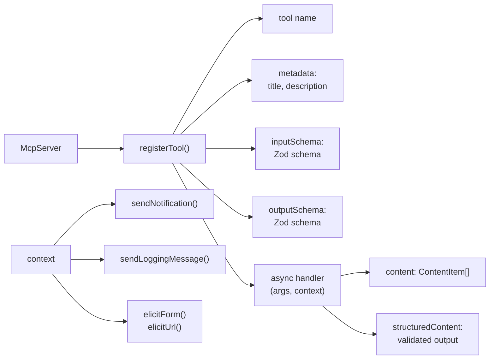

Example tool registration from the examples demonstrates:
1. **Schema-driven input validation** using Zod
2. **Structured output** with both text and typed data
3. **Context access** for notifications, logging, and elicitation
4. **ResourceLink outputs** for referencing large resources

Sources: [docs/server.md:104-140]()

### Resource Registration Pattern

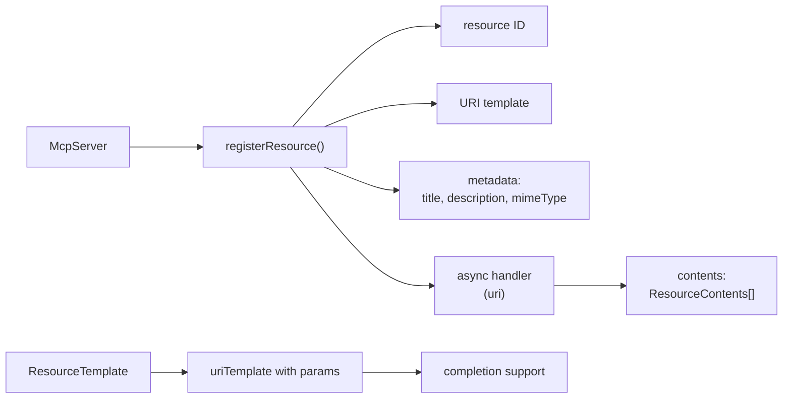

Resources support:
1. **Static resources** with fixed URIs
2. **Dynamic resources** using `ResourceTemplate` with URI parameters
3. **Completion support** for parameter suggestions
4. **Multiple content items** per resource

Sources: [docs/server.md:142-165]()

### Prompt Registration Pattern

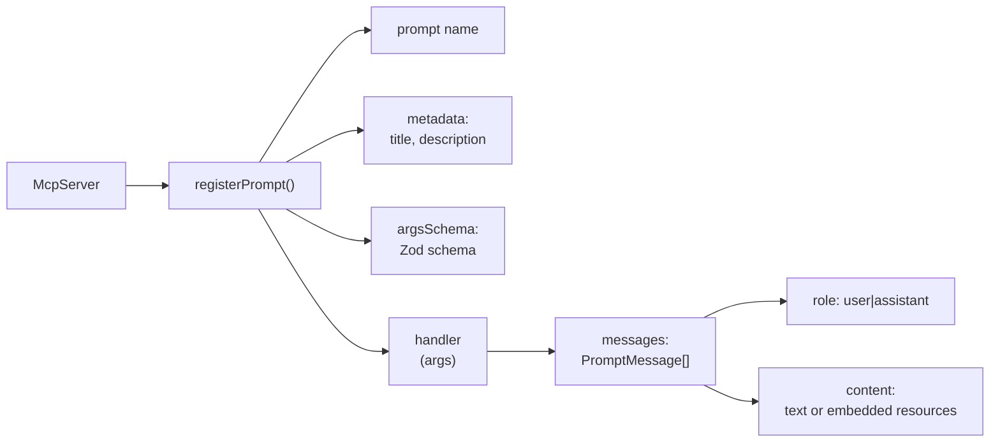

Prompts provide:
1. **Reusable templates** for consistent LLM interactions
2. **Argument validation** via Zod schemas
3. **Message formatting** with role-based structure
4. **Embedded resources** for context injection

Sources: [docs/server.md:167-196]()

## Running Examples Workflow

### Development Workflow

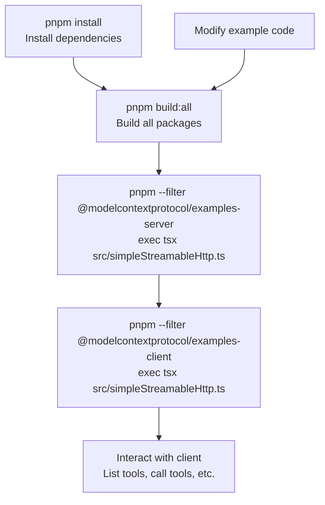

### Alternative: Direct Execution

From within the example package directory:

```bash
cd examples/server
pnpm tsx src/simpleStreamableHttp.ts
```

This bypasses the filter syntax and runs directly in the package context.

Sources: [README.md:85-126](), [CONTRIBUTING.md:113-125]()

## Example Selection Guide

### Decision Tree for Choosing an Example

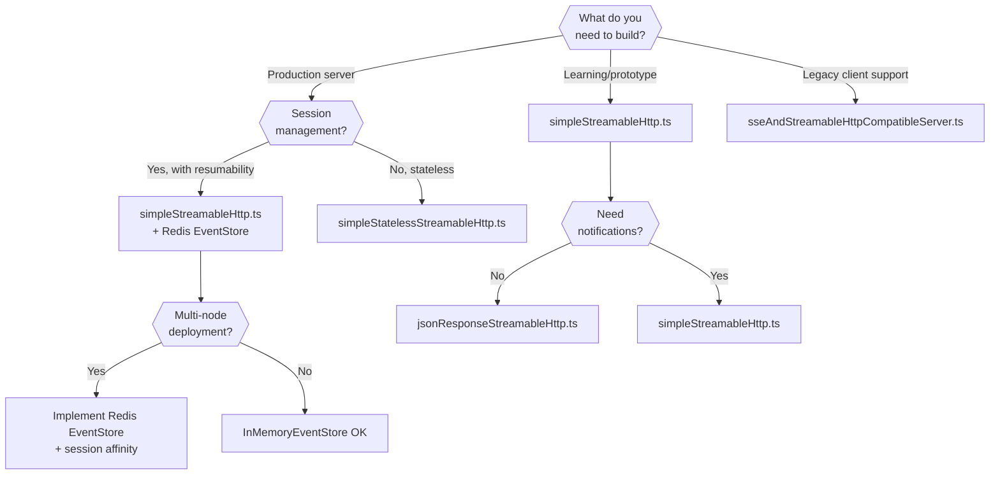

### Feature Matrix

| Example | Sessions | Resumability | SSE Notifications | JSON-only | OAuth | Multi-node Ready |
|---------|----------|--------------|-------------------|-----------|-------|------------------|
| `simpleStreamableHttp.ts` | ✓ | ✓ | ✓ | | ✓ | with shared EventStore |
| `simpleStatelessStreamableHttp.ts` | | | | ✓ | | ✓ |
| `jsonResponseStreamableHttp.ts` | ✓ | | | ✓ | | with shared EventStore |
| `sseAndStreamableHttpCompatibleServer.ts` | ✓ | ✓ | ✓ | | | with shared EventStore |
| `simpleSseServer.ts` | ✓ | | ✓ | | | |

Sources: [docs/server.md:13-70]()

## Summary

The SDK provides a comprehensive set of examples demonstrating:

1. **Stateful vs stateless** server patterns for different scaling needs
2. **Session management** with EventStore for resumability and fault tolerance
3. **Multi-node deployment** patterns using session affinity and shared state
4. **Backwards compatibility** supporting both modern and legacy protocol versions
5. **Security patterns** including DNS rebinding protection
6. **Feature integration** showing tools, resources, prompts, logging, and authentication

Each example is self-contained and runnable, providing both a learning resource and a starting point for production implementations. For detailed API documentation, refer to the related pages on [McpServer High-Level API](#3.1), [Server Protocol Class](#3.4), and [Streamable HTTP Server Transport](#3.5).

---