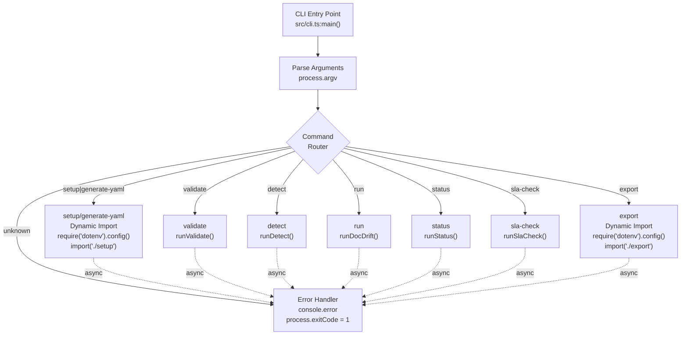
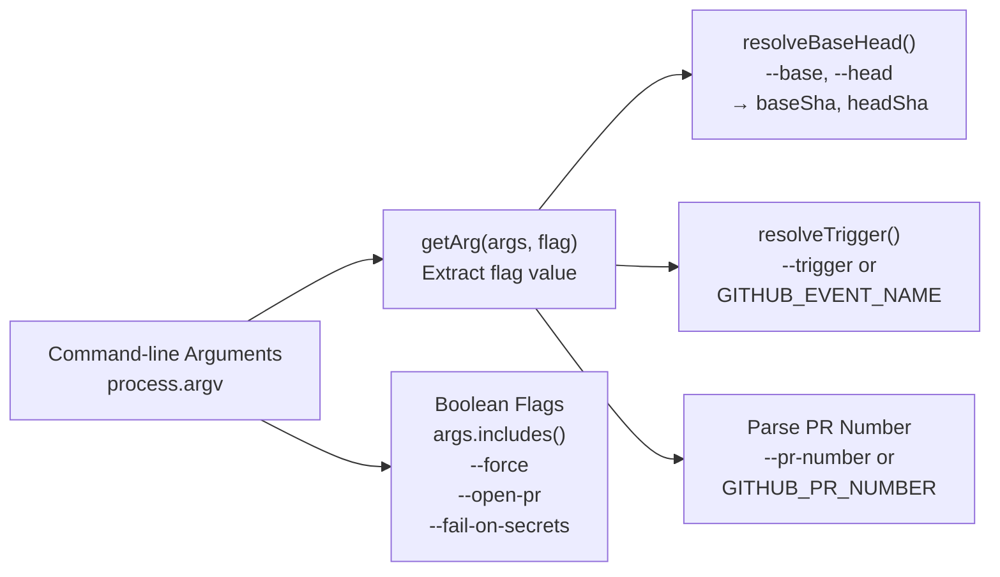
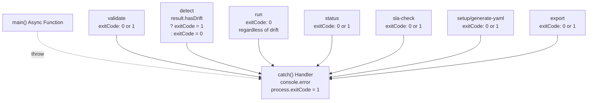

# CLI Reference

<details>
<summary>Relevant source files</summary>

The following files were used as context for generating this wiki page:

- [.gitignore](.gitignore)
- [README.md](README.md)
- [src/cli.ts](src/cli.ts)
- [src/devin/v1.ts](src/devin/v1.ts)

</details>


This document provides comprehensive reference documentation for all docdrift CLI commands. The CLI is the primary interface for interacting with the docdrift system, offering commands for setup, validation, drift detection, remediation orchestration, status monitoring, and export operations.

For conceptual information about how the detection and remediation pipeline works, see [Drift Detection System](#6). For details about the configuration file that these commands operate on, see [Configuration System](#4).

---

## Command Overview

The docdrift CLI provides 8 commands organized into three functional groups:

| Command | Group | Purpose |
|---------|-------|---------|
| `setup` | Setup | Interactive configuration generation with AI assistance |
| `generate-yaml` | Setup | Scriptable configuration generation |
| `validate` | Validation | Validate `docdrift.yaml` configuration |
| `detect` | Detection | Check for drift without triggering remediation |
| `run` | Detection | Full detection with Devin AI remediation |
| `status` | Monitoring | Show recent Devin session history |
| `sla-check` | Monitoring | Monitor stale documentation PRs |
| `export` | Export | Generate static MDX snapshots from DeepWiki |

All commands are invoked via the `docdrift` executable or `npx @devinnn/docdrift`.

**Sources:** [src/cli.ts:1-114](), [README.md:18-25]()

---

## Command Entry Point and Routing



**Command Routing Flow**

The CLI entry point at [src/cli.ts:23-108]() implements a simple command routing pattern. The `main()` function extracts the command from `process.argv[2]` and routes to the appropriate handler function. Commands `setup`, `generate-yaml`, and `export` dynamically load their modules and call `require('dotenv').config()` to load environment variables. All other commands are synchronously imported from the main index.

**Sources:** [src/cli.ts:23-108]()

---

## Argument Parsing



**Argument Parsing Mechanism**

The CLI uses a simple `getArg()` helper function at [src/cli.ts:15-21]() to extract flag values. The function searches for the flag in the arguments array and returns the next element. Boolean flags are detected using `args.includes()`. SHA resolution is delegated to `resolveBaseHead()` which handles default values and Git operations. Trigger types are resolved from `--trigger` flag or `GITHUB_EVENT_NAME` environment variable via `resolveTrigger()`.

**Sources:** [src/cli.ts:15-21](), [src/cli.ts:58-59](), [src/cli.ts:68-69]()

---

## setup and generate-yaml

**Purpose:** Generate `docdrift.yaml` configuration file through interactive or scriptable mode.

**Syntax:**
```bash
docdrift setup
docdrift generate-yaml [--output <path>] [--force] [--open-pr]
```

**Arguments and Options:**

| Option | Type | Default | Description |
|--------|------|---------|-------------|
| `--output` | string | `docdrift.yaml` | Output file path for generated configuration |
| `--force` | boolean | `false` | Overwrite existing configuration file |
| `--open-pr` | boolean | `false` | Create a Devin PR instead of writing locally |

**Behavior:**

Both commands invoke `runSetup()` from the dynamically imported setup module. The `setup` command provides an interactive experience, while `generate-yaml` is designed for scriptable environments. When `--open-pr` is specified and `DEVIN_API_KEY` is present, the system creates a Devin AI session to analyze the repository and open a PR with the generated configuration. Otherwise, configuration is written directly to the filesystem.

**Environment Variables:**

- `DEVIN_API_KEY` — Required when using `--open-pr` mode for Devin PR generation

**Examples:**

```bash
# Interactive setup with default output path
docdrift setup

# Generate configuration to custom path
docdrift generate-yaml --output config/docdrift.yaml

# Overwrite existing configuration
docdrift generate-yaml --force

# Create Devin PR with generated configuration
docdrift generate-yaml --open-pr
```

**Exit Codes:**

- `0` — Configuration generated successfully
- `1` — Error during generation or API failure

**Related Functions:**

- `runSetup()` in setup module — Main setup orchestration
- `buildRepoFingerprint()` — Repository scanning and analysis
- `inferConfigFromFingerprint()` — AI-powered configuration inference

For detailed information about the setup system architecture, see [Setup System](#5).

**Sources:** [src/cli.ts:40-49](), [README.md:36-41]()

---

## validate

**Purpose:** Validate the syntax and constraints of `docdrift.yaml` configuration file.

**Syntax:**
```bash
docdrift validate
```

**Arguments and Options:**

This command accepts no arguments or options. It validates the `docdrift.yaml` file in the current working directory.

**Behavior:**

The command invokes `runValidate()` which:
1. Loads `docdrift.yaml` from the current directory
2. Validates against the Zod schema (`docDriftConfigSchema`)
3. Performs runtime validation checks (command existence, field constraints)
4. Outputs validation errors or success message

**Examples:**

```bash
# Validate configuration in current directory
docdrift validate
```

**Exit Codes:**

- `0` — Configuration is valid
- `1` — Configuration is invalid or file not found

**Validation Checks:**

- Schema structure conformance (Zod validation)
- Command executability (`validateRuntimeConfig()`)
- Field interdependencies and constraints
- Mode-specific requirements

For detailed information about configuration validation and normalization, see [Validation and Normalization](#4.2).

**Sources:** [src/cli.ts:52-55](), [README.md:18]()

---

## detect

**Purpose:** Analyze repository changes and check for documentation drift without triggering remediation.

**Syntax:**
```bash
docdrift detect [--base <sha>] [--head <sha>] [--trigger <type>] [--pr-number <n>]
```

**Arguments and Options:**

| Option | Type | Default | Description |
|--------|------|---------|-------------|
| `--base` | string | Auto-resolved | Base commit SHA for comparison |
| `--head` | string | Auto-resolved | Head commit SHA for comparison |
| `--trigger` | string | Auto-resolved | Trigger type: `push`, `pull_request`, `manual`, `schedule` |
| `--pr-number` | number | Auto-resolved | Pull request number for PR-triggered runs |

**Behavior:**

The command invokes `runDetect()` which:
1. Resolves base and head SHAs using `resolveBaseHead()`
2. Loads and normalizes `docdrift.yaml` configuration
3. Analyzes Git changes between base and head
4. Executes spec providers (OpenAPI, GraphQL, etc.)
5. Evaluates path mappings against changed files
6. Determines run gate (spec_drift, conceptual_only, infer, none)
7. Outputs drift report to `.docdrift/drift_report.json`
8. Returns result object with `hasDrift` boolean

**Environment Variables:**

- `GITHUB_EVENT_NAME` — Used to auto-resolve trigger type when `--trigger` not specified
- `GITHUB_PR_NUMBER` — Used to auto-resolve PR number when `--pr-number` not specified

**Examples:**

```bash
# Detect drift with auto-resolved SHAs
docdrift detect

# Detect drift between specific commits
docdrift detect --base abc123 --head def456

# Detect drift for PR trigger
docdrift detect --trigger pull_request --pr-number 42

# Use in CI with exit code check
docdrift detect && echo "No drift" || echo "Drift detected"
```

**Exit Codes:**

- `0` — No drift detected
- `1` — Drift detected (hasDrift = true)

**Output Artifacts:**

- `.docdrift/drift_report.json` — Comprehensive drift analysis report
- `.docdrift/metrics.json` — Timing and detection metrics

For detailed information about the detection pipeline, see [Detection Pipeline](#6.1). For drift report structure, see [drift_report.json](#10.1).

**Sources:** [src/cli.ts:57-65](), [README.md:19]()

---

## run

**Purpose:** Execute full drift detection and trigger Devin AI remediation sessions for impacted documentation areas.

**Syntax:**
```bash
docdrift run [--base <sha>] [--head <sha>] [--trigger <type>] [--pr-number <n>] [--pr-head-ref <branch>]
```

**Arguments and Options:**

| Option | Type | Default | Description |
|--------|------|---------|-------------|
| `--base` | string | Auto-resolved | Base commit SHA for comparison |
| `--head` | string | Auto-resolved | Head commit SHA for comparison |
| `--trigger` | string | Auto-resolved | Trigger type: `push`, `pull_request`, `manual`, `schedule` |
| `--pr-number` | number | Auto-resolved | Pull request number for PR-triggered runs |
| `--pr-head-ref` | string | `GITHUB_PR_HEAD_REF` | Source PR head branch name; used when `prStrategy: "commit-to-branch"` so Devin commits to that branch |

**Behavior:**

The command invokes `runDocDrift()` which:
1. Performs drift detection (same as `detect` command)
2. Loads state from `.docdrift/state.json`
3. Evaluates policy decisions via `decidePolicy()` for each impacted doc area
4. Builds evidence bundles with drift reports and attachments
5. Creates Devin AI sessions for approved areas
6. Polls sessions until terminal status
7. Creates/updates GitHub PRs or issues based on outcomes
8. Updates state with PR history and SLA timestamps
9. Writes comprehensive output to `.docdrift/run-output.json`

**Environment Variables:**

- `DEVIN_API_KEY` — Required for Devin session creation
- `GITHUB_TOKEN` — Required for GitHub PR/issue operations
- `GITHUB_EVENT_NAME` — Used to auto-resolve trigger type
- `GITHUB_PR_NUMBER` — Used to auto-resolve PR number when trigger is `pull_request`
- `GITHUB_PR_HEAD_REF` — Source PR head branch name (e.g. `feature/add-endpoint`); used for commit-to-branch so Devin knows which branch to commit to

**Examples:**

```bash
# Run full detection and remediation
docdrift run

# Run with specific commit range
docdrift run --base abc123 --head def456

# Run for pull request trigger (commit-to-branch: pass head ref)
docdrift run --trigger pull_request --pr-number 42 --pr-head-ref feature/add-endpoint

# View output artifacts
cat .docdrift/run-output.json
```

**Exit Codes:**

- `0` — Run completed (regardless of drift detection or remediation outcomes)
- `1` — Error during execution

**Output Artifacts:**

- `.docdrift/run-output.json` — Per-area outcomes, session URLs, PR/issue links
- `.docdrift/drift_report.json` — Drift analysis report
- `.docdrift/metrics.json` — Performance and decision metrics
- `.docdrift/state.json` — Updated PR history and SLA tracking
- `.docdrift/evidence/<timestamp>/` — Evidence bundles uploaded to Devin

**Policy Decisions:**

The run command respects policy configuration in `docdrift.yaml`:
- `policy.prCaps` — Maximum PRs per 24 hours per area
- `policy.confidence` — Minimum confidence threshold for automation
- `policy.allowlist` — Explicitly allowed documentation paths
- `policy.verification` — Verification commands to run

For detailed information about policy evaluation, see [Policy Engine](#7). For session lifecycle, see [Session Lifecycle](#8.3). For PR management, see [PR Lifecycle Management](#9.2).

**Sources:** [src/cli.ts:67-78](), [README.md:20]()

---

## status

**Purpose:** Display recent Devin AI session history filtered by time window and docdrift tags.

**Syntax:**
```bash
docdrift status [--since <duration>]
```

**Arguments and Options:**

| Option | Type | Default | Description |
|--------|------|---------|-------------|
| `--since` | duration | `24h` | Time window for session history (e.g., `1h`, `24h`, `7d`) |

**Behavior:**

The command invokes `runStatus()` which:
1. Parses duration using `parseDurationHours()`
2. Calls `devinListSessions()` with `tag: 'docdrift'` filter
3. Filters sessions to those created within the time window
4. Displays session details: ID, URL, status, creation time

**Environment Variables:**

- `DEVIN_API_KEY` — Required for querying Devin API

**Duration Format:**

The `--since` argument accepts human-readable duration strings:
- `1h` — 1 hour
- `24h` — 24 hours
- `7d` — 7 days
- `168h` — 1 week (equivalent to 7d)

**Examples:**

```bash
# Show sessions from last 24 hours (default)
docdrift status

# Show sessions from last hour
docdrift status --since 1h

# Show sessions from last week
docdrift status --since 7d
```

**Exit Codes:**

- `0` — Status retrieved successfully
- `1` — API error or authentication failure

**Output Format:**

The command outputs session information including:
- Session ID
- Session URL (clickable link to Devin interface)
- Current status (active, finished, blocked, etc.)
- Creation timestamp
- Structured output or PR URL if available

For detailed information about Devin session operations, see [Devin Client API](#8.1).

**Sources:** [src/cli.ts:80-85](), [README.md:21]()

---

## sla-check

**Purpose:** Monitor documentation PRs open for 7+ days and create reminder issues to enforce SLA compliance.

**Syntax:**
```bash
docdrift sla-check
```

**Arguments and Options:**

This command accepts no arguments or options.

**Behavior:**

The command invokes `runSlaCheck()` which:
1. Loads configuration and state from `.docdrift/state.json`
2. Calls `listOpenPrsWithLabel()` to find PRs with `config.policy.slaLabel` (default: `doc-drift`)
3. Filters PRs open for 7+ days using `isPrOpen()` check
4. Checks if reminder issue was already created (tracked in state)
5. Creates GitHub issue with SLA reminder if needed
6. Updates `state.lastSlaIssueOpenedAt` timestamp
7. Respects `config.policy.slaEnable` flag (default: true)

**Environment Variables:**

- `GITHUB_TOKEN` — Required for GitHub API operations

**SLA Configuration:**

SLA behavior is controlled by `docdrift.yaml` policy settings:
- `policy.slaEnable` — Enable/disable SLA monitoring (default: true)
- `policy.slaLabel` — Label to identify doc-drift PRs (default: `doc-drift`)
- `policy.slaDays` — Number of days before reminder (default: 7)

**Examples:**

```bash
# Check and create SLA reminders
docdrift sla-check

# Typical CI usage (scheduled job)
# .github/workflows/sla-check.yml
# - cron: '0 0 * * *'  # Daily at midnight
```

**Exit Codes:**

- `0` — SLA check completed (issues may or may not be created)
- `1` — Error during execution

**Issue Format:**

Created issues contain:
- List of stale PRs with URLs and open duration
- Reminder to review and merge or close
- Tagged with repository-specific labels

For detailed information about issue creation, see [Issues and Notifications](#9.3). For state management, see [State Management](#7.3).

**Sources:** [src/cli.ts:87-90](), [README.md:22]()

---

## export

**Purpose:** Generate static MDX snapshots from DeepWiki documentation source for local hosting or archival.

**Syntax:**
```bash
docdrift export [--repo <owner/name>] [--out <path>] [--mode <mode>] [--server <type>] [--fail-on-secrets]
```

**Arguments and Options:**

| Option | Type | Default | Description |
|--------|------|---------|-------------|
| `--repo` | string | Auto-detected | Repository in format `owner/name` |
| `--out` | string | `docs/deepwiki` | Output directory for exported MDX files |
| `--mode` | string | `local` | Export mode: `local`, `pr`, `commit` |
| `--server` | string | `auto` | DeepWiki server: `public`, `private`, `auto` |
| `--fail-on-secrets` | boolean | `false` | Exit with error if secrets detected in export |

**Behavior:**

The command invokes `runExport()` from the dynamically imported export module which:
1. Detects repository information from Git config or `--repo` argument
2. Connects to DeepWiki server (public or private based on `--server`)
3. Fetches documentation snapshot via DeepWiki MCP
4. Transforms documentation to MDX format
5. Writes files to output directory
6. Optionally creates PR or commit based on `--mode`
7. Scans for potential secrets if `--fail-on-secrets` enabled

**Environment Variables:**

- `DEEPWIKI_API_KEY` — May be required for private server access
- `GITHUB_TOKEN` — Required for `pr` and `commit` modes

**Export Modes:**

- `local` — Write files to local filesystem only
- `pr` — Create a PR with exported documentation
- `commit` — Commit directly to repository

**Examples:**

```bash
# Export to default location
docdrift export

# Export to custom directory
docdrift export --out docs/api

# Export and create PR
docdrift export --mode pr

# Export with secret detection
docdrift export --fail-on-secrets

# Export specific repository
docdrift export --repo myorg/myrepo --out docs/export
```

**Exit Codes:**

- `0` — Export completed successfully
- `1` — Export failed or secrets detected (when `--fail-on-secrets` enabled)

**Output Structure:**

Exported files are organized in the output directory:
```
docs/deepwiki/
├── index.mdx
├── getting-started.mdx
├── api/
│   ├── overview.mdx
│   └── endpoints.mdx
└── guides/
    └── authentication.mdx
```

For detailed information about the export system, see the Export guide in the documentation.

**Sources:** [src/cli.ts:92-103](), [README.md:25]()

---

## Error Handling and Exit Codes



**Error Handling Pattern**

All commands are wrapped in a top-level `main().catch()` handler at [src/cli.ts:110-113](). Errors are caught, logged to `console.error()`, and `process.exitCode` is set to `1`. This ensures proper exit codes for CI/CD integration.

The `detect` command has special exit code behavior: it returns exit code `1` when drift is detected (even though this is a successful operation). This allows shell scripts to branch on drift detection using standard `&&` and `||` operators. The `run` command always returns exit code `0` on completion, as both "drift detected and remediated" and "no drift" are considered successful outcomes.

**Sources:** [src/cli.ts:110-113](), [src/cli.ts:62-64]()

---

## Command Summary Table

| Command | Primary Function | Requires Config | Requires API Keys | Modifies State | Creates Artifacts |
|---------|-----------------|-----------------|-------------------|----------------|-------------------|
| `setup` | `runSetup()` | No | Optional (DEVIN) | No | `docdrift.yaml`, workflows |
| `generate-yaml` | `runSetup()` | No | Optional (DEVIN) | No | `docdrift.yaml` |
| `validate` | `runValidate()` | Yes | No | No | None |
| `detect` | `runDetect()` | Yes | No | No | `drift_report.json`, `metrics.json` |
| `run` | `runDocDrift()` | Yes | Yes (DEVIN, GITHUB) | Yes | `run-output.json`, `state.json`, evidence |
| `status` | `runStatus()` | No | Yes (DEVIN) | No | Console output |
| `sla-check` | `runSlaCheck()` | Yes | Yes (GITHUB) | Yes | GitHub issues, `state.json` |
| `export` | `runExport()` | No | Optional | No | MDX files |

**Sources:** [src/cli.ts:1-114]()

---