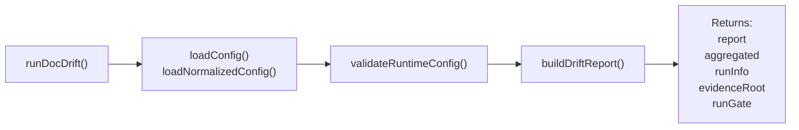
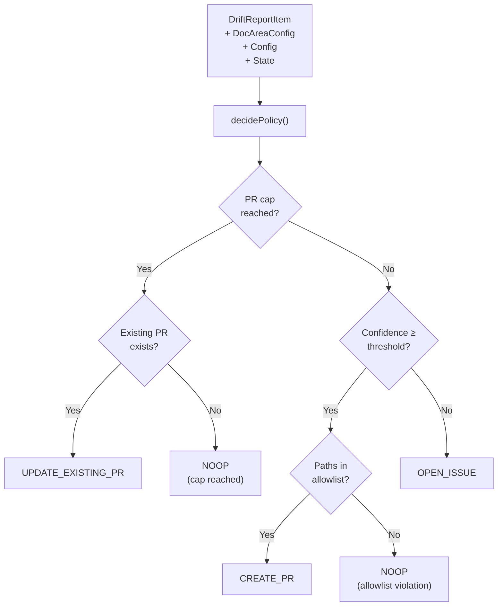
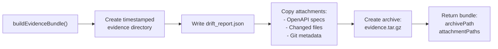
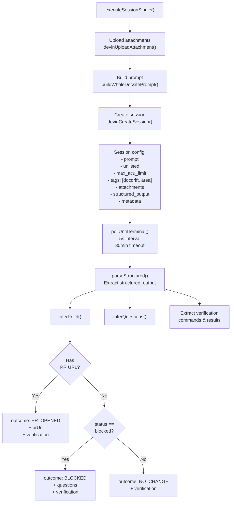
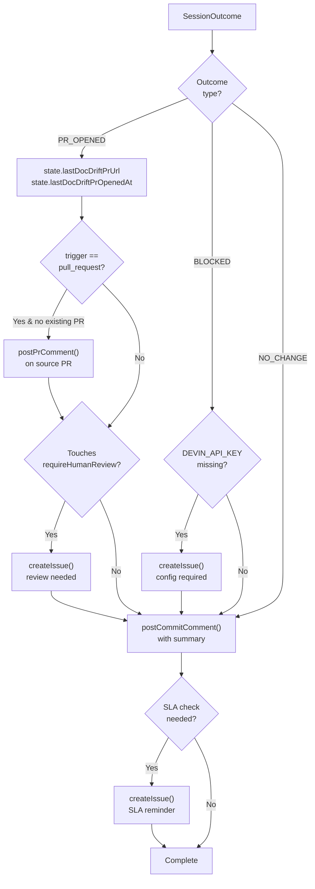
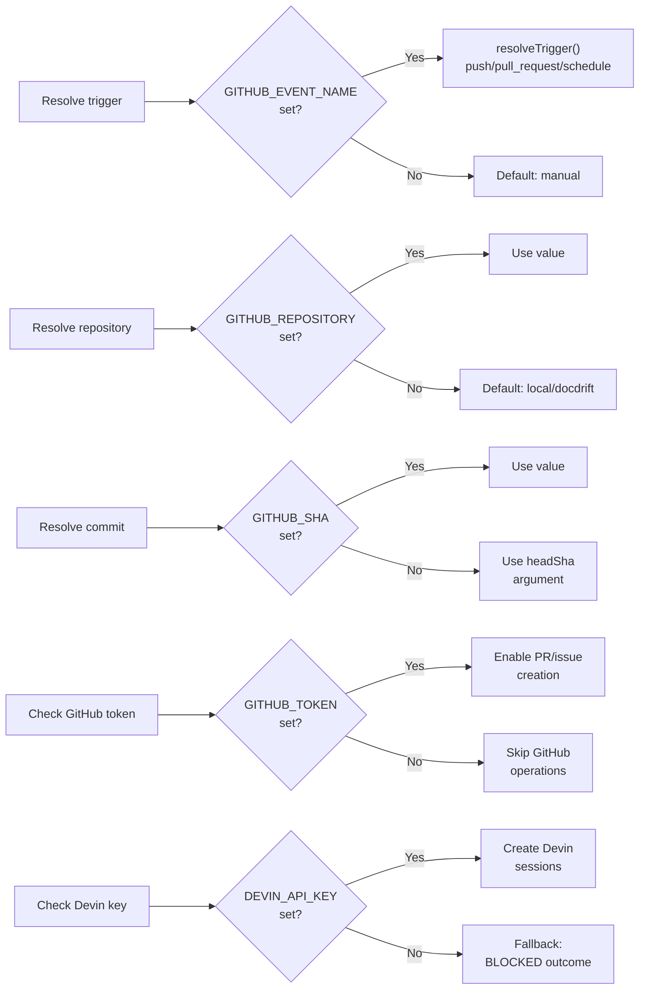
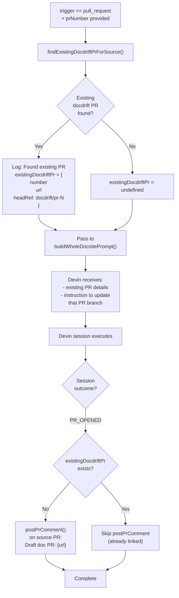

# run

<details>
<summary>Relevant source files</summary>

The following files were used as context for generating this wiki page:

- [.gitignore](.gitignore)
- [README.md](README.md)
- [docdrift-yml.md](docdrift-yml.md)
- [src/cli.ts](src/cli.ts)
- [src/devin/v1.ts](src/devin/v1.ts)
- [src/index.ts](src/index.ts)

</details>


The `run` command performs complete drift detection and remediation. It detects documentation drift, applies policy rules, creates Devin AI sessions to remediate drift, and opens pull requests or issues on GitHub. This is the primary command for automated documentation maintenance in CI/CD pipelines.

For drift detection only without remediation, see [detect](#3.3). For viewing recent session history, see [status](#3.5).

## Command Syntax

```bash
npx @devinnn/docdrift run [options]
```

**Options:**

| Option | Required | Default | Description |
|--------|----------|---------|-------------|
| `--base <sha>` | No | `GITHUB_BASE_SHA` in CI, else `git merge-base origin/main HEAD` | Base commit SHA for drift comparison |
| `--head <sha>` | No | `GITHUB_SHA` in CI, else `HEAD` | Head commit SHA for drift comparison |
| `--trigger <type>` | No | Inferred from `GITHUB_EVENT_NAME` | Trigger type: `push`, `pull_request`, `schedule`, or `manual` |
| `--pr-number <num>` | No | `GITHUB_PR_NUMBER` if set | Pull request number (used for PR-specific logic) |

Sources: [src/cli.ts:67-78](), [src/index.ts:650-660](), [README.md:20-21]()

## Prerequisites

The `run` command requires specific environment variables depending on the execution context:

| Variable | Required | Purpose |
|----------|----------|---------|
| `DEVIN_API_KEY` | Yes | Authentication for Devin API to create sessions |
| `GITHUB_TOKEN` | No* | Required for PR/issue creation and comments |
| `GITHUB_REPOSITORY` | No* | Repository identifier (e.g., `owner/repo`) |
| `GITHUB_SHA` | No* | Commit SHA for comments and references |

\* Required when running in GitHub Actions to enable full PR/issue/comment functionality. Without these, the command runs in local mode with limited GitHub integration.

Sources: [src/index.ts:253-254](), [docdrift-yml.md:26-34]()

## Execution Flow

The `run` command orchestrates a multi-phase pipeline from detection through remediation:

```mermaid
graph TD
    Start["run command invoked"] --> LoadConfig["loadConfig()<br/>validateRuntimeConfig()"]
    LoadConfig --> BuildReport["buildDriftReport()"]
    
    BuildReport --> RunGate{"Run gate<br/>decision"}
    
    RunGate -->|"none"| ExitNoDrift["Exit: No drift detected<br/>return []"]
    RunGate -->|"spec_drift<br/>conceptual_only<br/>infer"| LoadState["loadState()"]
    
    LoadState --> Policy["decidePolicy()<br/>Check PR caps,<br/>confidence,<br/>allowlist"]
    
    Policy --> Decision{"Policy<br/>action"}
    
    Decision -->|"NOOP"| ExitPolicy["Exit: Policy blocked<br/>return result"]
    Decision -->|"UPDATE_EXISTING_PR"| CheckExisting{"Existing PR<br/>found?"}
    
    CheckExisting -->|"Yes"| ExitBundle["Exit: Bundle into existing<br/>return result"]
    CheckExisting -->|"No"| ExitBlocked["Exit: PR cap reached<br/>outcome=BLOCKED"]
    
    Decision -->|"CREATE_PR"| BuildEvidence["buildEvidenceBundle()<br/>drift_report.json<br/>attachments/"]
    
    BuildEvidence --> CheckPRContext{"trigger ==<br/>pull_request?"}
    CheckPRContext -->|"Yes"| FindExisting["findExistingDocdriftPrForSource()"]
    CheckPRContext -->|"No"| ExecuteSession
    FindExisting --> ExecuteSession["executeSessionSingle()"]
    
    ExecuteSession --> Upload["devinUploadAttachment()<br/>for each attachment"]
    Upload --> BuildPrompt["buildWholeDocsitePrompt()"]
    BuildPrompt --> CreateSession["devinCreateSession()"]
    CreateSession --> Poll["pollUntilTerminal()"]
    
    Poll --> Outcome{"Session<br/>outcome"}
    
    Outcome -->|"PR_OPENED"| PostPR["postPrComment()<br/>if pull_request trigger"]
    Outcome -->|"BLOCKED"| HandleBlocked["Check if DEVIN_API_KEY<br/>missing"]
    Outcome -->|"NO_CHANGE"| PostComment
    
    PostPR --> CheckReview{"Touches<br/>requireHumanReview<br/>paths?"}
    CheckReview -->|"Yes"| CreateReviewIssue["createIssue()<br/>review needed"]
    CheckReview -->|"No"| UpdateState
    
    HandleBlocked --> CheckAPIKey{"DEVIN_API_KEY<br/>missing?"}
    CheckAPIKey -->|"Yes"| CreateConfigIssue["createIssue()<br/>config required"]
    CheckAPIKey -->|"No"| UpdateState
    
    CreateReviewIssue --> UpdateState["applyDecisionToState()<br/>saveState()"]
    CreateConfigIssue --> UpdateState
    
    UpdateState --> PostComment["postCommitComment()"]
    PostComment --> CheckSLA{"slaDays > 0<br/>and PR open<br/>≥ slaDays?"}
    
    CheckSLA -->|"Yes"| CreateSLAIssue["createIssue()<br/>SLA reminder"]
    CheckSLA -->|"No"| WriteMetrics
    
    CreateSLAIssue --> WriteMetrics["writeMetrics()<br/>.docdrift/metrics.json"]
    WriteMetrics --> WriteOutput["Write run-output.json<br/>return results"]
```



**Sources:** [src/index.ts:244-530](), [src/cli.ts:67-78]()

## Phase Details

### 1. Configuration and Detection

The command begins by loading and validating configuration, then building a drift report:



The `buildDriftReport` function [src/detect/index.ts]() performs:
- Git diff analysis between base and head SHAs
- Spec provider execution (OpenAPI, GraphQL, etc.)
- Path mapping evaluation
- Run gate determination (`spec_drift`, `conceptual_only`, `infer`, or `none`)

**Run gate decision logic:**
- `none`: No drift detected, exit early with empty results
- `spec_drift`: API specification changed (high confidence)
- `conceptual_only`: Path mappings matched but no spec changes
- `infer`: Changes detected in infer mode

Sources: [src/index.ts:256-264](), [src/detect/index.ts]()

### 2. Policy Evaluation

If drift is detected, the policy engine decides what action to take:



Policy configuration comes from `docdrift.yaml`:
- `policy.prCaps.maxPrsPerDay`: Default 1
- `policy.confidence.autopatchThreshold`: Default 0.8
- `policy.allowlist`: Required glob patterns

Sources: [src/index.ts:294-303](), [src/policy/engine.ts](), [docdrift-yml.md:83-128]()

### 3. Evidence Bundle Construction

For actions requiring Devin intervention, an evidence bundle is created:



Evidence directory structure:
```
.docdrift/evidence/{timestamp}/
├── drift_report.json
├── attachments/
│   ├── openapi-generated.json
│   ├── openapi-published.json
│   └── changed-files/
└── evidence.tar.gz
```

Sources: [src/index.ts:336-337](), [src/evidence/bundle.ts]()

### 4. Devin Session Execution

The `executeSessionSingle` function orchestrates Devin AI interaction:



Sources: [src/index.ts:83-169](), [src/devin/v1.ts:153-180](), [src/devin/prompts.ts]()

### 5. GitHub Actions

Based on session outcome, various GitHub actions are performed:



**Issue creation logic:**

Issues are created **only** in these scenarios:
1. **Human review required**: PR touches paths matching `requireHumanReview` globs
2. **SLA reminder**: PR open ≥ `slaDays` (default 7)
3. **Configuration error**: `DEVIN_API_KEY` not set

Issues are **not** created for:
- Devin-reported `BLOCKED` status (evidence questions)
- Policy `OPEN_ISSUE` decision
- Session `NO_CHANGE` outcome

Sources: [src/index.ts:388-520](), [src/github/client.ts](), [docdrift-yml.md:286-320]()

## Output Files

The `run` command produces multiple output files in the `.docdrift/` directory:

| File | Purpose | Reference |
|------|---------|-----------|
| `run-output.json` | Summary of run results per doc area | [10.5](#10.5) |
| `drift_report.json` | Detailed drift detection results | [10.1](#10.1) |
| `metrics.json` | Timing and operational metrics | [10.2](#10.2) |
| `state.json` | Persistent state for rate limiting and SLA | [10.3](#10.3) |
| `evidence/{timestamp}/` | Evidence bundle with attachments | [10.4](#10.4) |

The command writes `run-output.json` to `.docdrift/run-output.json` and also prints results to stdout as JSON:

```json
[
  {
    "docArea": "docsite",
    "decision": {
      "action": "CREATE_PR",
      "reason": "High confidence; proceed with PR"
    },
    "outcome": "PR_OPENED",
    "summary": "Updated API reference for new endpoints",
    "sessionUrl": "https://preview.devin.ai/sessions/abc123",
    "prUrl": "https://github.com/owner/repo/pull/456"
  }
]
```

Sources: [src/cli.ts:73-76](), [src/index.ts:522-529]()

## Differences from `detect` Command

| Aspect | `detect` | `run` |
|--------|----------|-------|
| **Purpose** | Check for drift only | Detect and remediate drift |
| **Devin sessions** | Never created | Created when drift detected |
| **PRs/Issues** | Never created | Created based on policy |
| **Policy engine** | Not invoked | Full policy evaluation |
| **Evidence bundles** | Not created | Created for Devin sessions |
| **State updates** | None | Updates `.docdrift/state.json` |
| **Exit code** | `1` if drift, `0` otherwise | Always `0` (errors throw) |
| **Output** | Console summary only | Full JSON results + artifacts |

The `detect` command is useful for:
- Local development checks
- CI checks without remediation
- Verifying configuration correctness

The `run` command is used for:
- Full CI/CD automation
- Automated documentation maintenance
- Production drift remediation

Sources: [src/index.ts:201-242](), [src/index.ts:244-530](), [README.md:19-20]()

## Environment Variable Resolution

The `run` command uses these environment variables with fallback logic:



The function `canPostCommitComment` determines if GitHub integration is available:

```typescript
function canPostCommitComment(repository: string, commitSha: string): boolean {
  if (!repository || repository === "local/docdrift") return false;
  return /^[0-9a-f]{40}$/i.test(commitSha);
}
```

Sources: [src/index.ts:77-81](), [src/index.ts:624-629](), [src/index.ts:252-254]()

## PR Lifecycle for Pull Request Triggers

When triggered on a pull request (`trigger: pull_request`), the `run` command implements special PR handling:



Branch naming convention for doc-drift PRs:
- Source PR: `feature/api-changes` (PR #123)
- Doc drift PR: `docdrift/pr-123`

This ensures documentation updates track through the development lifecycle and avoids PR proliferation.

Sources: [src/index.ts:339-348](), [src/index.ts:394-401](), [src/github/client.ts]()

## Example Usage

### Basic Usage (CI)

In GitHub Actions, minimal configuration:

```yaml
- name: Run docdrift
  run: npx @devinnn/docdrift run
  env:
    DEVIN_API_KEY: ${{ secrets.DEVIN_API_KEY }}
    GITHUB_TOKEN: ${{ secrets.GITHUB_TOKEN }}
```

Arguments are automatically resolved from GitHub Actions context variables.

### Manual Invocation

Specify explicit SHAs:

```bash
npx @devinnn/docdrift run --base abc123 --head def456
```

### Pull Request Context

```bash
npx @devinnn/docdrift run \
  --trigger pull_request \
  --pr-number 123
```

### Local Development

Without GitHub integration:

```bash
export DEVIN_API_KEY=sk_...
npx @devinnn/docdrift run
```

This creates Devin sessions but skips PR/issue creation.

Sources: [README.md:33-41](), [docs/guides/ci-github.md](), [src/cli.ts:67-78]()

## Error Handling

The `run` command throws errors for:

| Condition | Error Message |
|-----------|---------------|
| Config validation fails | `Config validation failed: {details}` |
| Invalid duration format | `Invalid --since value: {value}` |
| Missing required SHA | `Missing required argument: {label}` |

The command returns results array even when some operations fail:
- Missing `DEVIN_API_KEY`: Creates result with `BLOCKED` outcome
- GitHub operations fail: Logs warning, continues execution
- Policy blocks action: Returns result with `NOOP` decision

Exit codes:
- `0`: Success (even if no drift or policy blocked)
- `1`: Uncaught error or exception

Sources: [src/index.ts:246-249](), [src/index.ts:374-385](), [src/cli.ts:110-113]()

## Metrics Collection

Each run produces detailed metrics in `.docdrift/metrics.json`:

```typescript
{
  driftItemsDetected: 1,
  prsOpened: 1,
  issuesOpened: 0,
  blockedCount: 0,
  timeToSessionTerminalMs: [450000], // 7.5 minutes
  docAreaCounts: { docsite: 1 },
  noiseRateProxy: 1
}
```

Fields:
- `driftItemsDetected`: Number of drift items found
- `prsOpened`: PRs created in this run
- `issuesOpened`: Issues created in this run
- `blockedCount`: Sessions that ended in `BLOCKED` status
- `timeToSessionTerminalMs`: Array of session execution times
- `docAreaCounts`: Drift items per doc area
- `noiseRateProxy`: Approximation of noise (currently equals `prsOpened`)

Sources: [src/index.ts:284-292](), [src/index.ts:522-523](), [src/evidence/bundle.ts]()

---