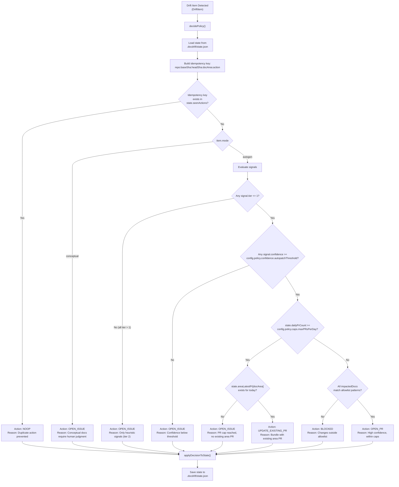
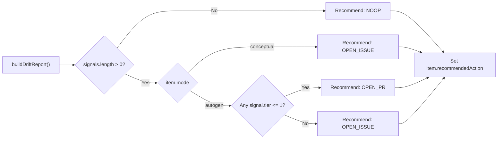
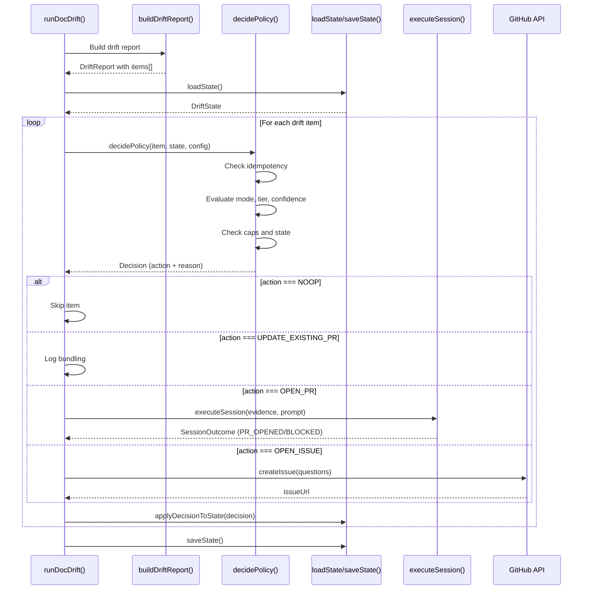

# Decision Logic

<details>
<summary>Relevant source files</summary>

The following files were used as context for generating this wiki page:

- [docdrift-yml.md](docdrift-yml.md)
- [src/index.ts](src/index.ts)

</details>


This page details the policy engine's decision logic that determines which action to take for each detected drift item. The decision process evaluates drift characteristics, system state, and policy constraints to route items to the appropriate remediation path.

For information about how decisions are executed and state is updated, see [State Management](#5.3). For the noise reduction mechanisms that influence decision outcomes, see [Noise Reduction](#5.2).

---

## Overview

The decision logic operates as a multi-stage gating system that progressively filters drift items through a series of checks. Each drift item enters with a recommended action (determined during detection) and exits with a final decision that may differ based on runtime constraints, existing state, and policy configuration.

The decision process is implemented across two primary stages:

1. **Detection-time recommendation** - Initial action suggested based on drift mode, signal tier, and confidence ([src/detect/index.ts:10-18]())
2. **Policy-time decision** - Final action determined by evaluating state, caps, allowlists, and bundling rules ([src/index.ts:221-229]())

**Sources:** [src/detect/index.ts:10-18](), [src/index.ts:221-263](), [README.md:16-21]()

---

## Decision Inputs

The decision logic consumes the following inputs:

| Input | Type | Source | Purpose |
|-------|------|--------|---------|
| `item` | `DriftItem` | Detection phase | Contains drift signals, mode, impacted docs, and initial recommendation |
| `docAreaConfig` | `DocAreaConfig` | Configuration | Defines mode, allowlist, verification commands, and detection rules |
| `config` | `DocDriftConfig` | Configuration | Global policy settings including PR caps and confidence thresholds |
| `state` | `DriftState` | State file | Tracks PR counts, existing PRs per doc area, and idempotency keys |
| `repo` | `string` | Environment | Repository identifier for idempotency key generation |
| `baseSha` | `string` | CLI argument | Base commit SHA for idempotency key generation |
| `headSha` | `string` | CLI argument | Head commit SHA for idempotency key generation |

**Sources:** [src/index.ts:221-229](), [src/detect/index.ts:86-93]()

---

## Decision Flow

The following diagram illustrates the complete decision flow, showing how a drift item progresses through the policy engine:



**Sources:** [src/index.ts:221-263](), [README.md:16-21](), Diagram 4 from high-level architecture

---

## Initial Recommendation Logic

During drift detection, the `defaultRecommendation` function provides an initial recommended action based on drift mode and signal characteristics:



**Implementation:**

[src/detect/index.ts:10-18]()
```typescript
function defaultRecommendation(mode: "autogen" | "conceptual", signals: Signal[]): DriftItem["recommendedAction"] {
  if (!signals.length) {
    return "NOOP";
  }
  if (mode === "autogen") {
    return signals.some((s) => s.tier <= 1) ? "OPEN_PR" : "OPEN_ISSUE";
  }
  return "OPEN_ISSUE";
}
```

This initial recommendation is later refined by `decidePolicy` based on runtime constraints.

**Sources:** [src/detect/index.ts:10-18](), [src/detect/index.ts:86-93]()

---

## Action Types

The decision logic produces one of the following action types:

| Action | Description | Triggers When | Next Steps |
|--------|-------------|---------------|------------|
| `NOOP` | No action taken | Idempotency key exists in state | Skip processing, item already handled |
| `OPEN_PR` | Create new PR via Devin | High confidence autogen drift within caps | Execute Devin session, upload evidence bundle |
| `UPDATE_EXISTING_PR` | Bundle into existing PR | PR cap reached but existing area PR exists today | Add evidence to existing session/PR context |
| `OPEN_ISSUE` | Create GitHub issue | Low confidence, conceptual mode, or caps reached | Create issue with questions, no Devin session |
| `BLOCKED` | Action blocked | Changes outside allowlist | Create issue explaining blockage reason |

**Sources:** [src/index.ts:231-263](), [src/model/types.ts]() (type definitions not shown)

---

## Mode-Based Routing

The drift item's `mode` field is the first major routing decision:

### Autogen Mode

For `mode: "autogen"` doc areas:
- Proceed to confidence and tier evaluation
- High-tier (tier 0-1), high-confidence signals are candidates for automated PRs
- Low-tier (tier 2) or low-confidence signals escalate to issues

### Conceptual Mode

For `mode: "conceptual"` doc areas:
- Always route to `OPEN_ISSUE` action
- Bypass confidence and tier checks
- Rationale: Conceptual documentation requires human judgment to ensure correct semantics and wording

This routing is evident in the initial recommendation:

[src/detect/index.ts:14-17]()
```typescript
if (mode === "autogen") {
  return signals.some((s) => s.tier <= 1) ? "OPEN_PR" : "OPEN_ISSUE";
}
return "OPEN_ISSUE"; // conceptual mode always issues
```

**Sources:** [src/detect/index.ts:10-18](), [README.md:20]()

---

## Confidence and Tier Gating

For autogen drift, the decision logic applies two sequential gates:

### Tier Gate

**Purpose:** Filter out heuristic-only drift (tier 2 signals from path matching)

**Logic:**
- If any signal has `tier <= 1` (tier 0 docs checks or tier 1 OpenAPI diff), proceed to confidence check
- If all signals have `tier > 1` (only heuristic path matches), route to `OPEN_ISSUE`

**Rationale:** Tier 2 signals are speculative and require human validation before automated changes

### Confidence Gate

**Purpose:** Ensure high-confidence drift before automated PR generation

**Logic:**
- If any signal has `confidence >= config.policy.confidence.autopatchThreshold`, proceed to cap checks
- Otherwise, route to `OPEN_ISSUE`

**Default Threshold:** Typically set to 0.8 or higher (80% confidence)

**Configuration:**
```yaml
policy:
  confidence:
    autopatchThreshold: 0.8
```

**Sources:** [src/detect/index.ts:14-15](), [README.md:19]()

---

## State-Based Checks

After passing mode and confidence gates, the decision logic evaluates system state:

### Idempotency Check

**Purpose:** Prevent duplicate actions for the same drift

**Key Generation:**
```
{repo}:{baseSha}:{headSha}:{docArea}:{action}
```

**Logic:**
- Generate idempotency key from repository, SHAs, doc area, and recommended action
- Check if key exists in `state.seenActions` set
- If exists, return `NOOP` with reason "Duplicate action prevented"

**Implementation Reference:** [src/index.ts:221-238]()

### Daily PR Cap Check

**Purpose:** Enforce global limit on PRs opened per day

**Logic:**
- Check if `state.dailyPrCount >= config.policy.caps.maxPRsPerDay`
- If cap reached, check for existing area PR to bundle with
- If no existing area PR, route to `OPEN_ISSUE`

**Configuration:**
```yaml
policy:
  caps:
    maxPRsPerDay: 3
```

### Area PR Bundling Check

**Purpose:** Bundle multiple drifts in same doc area into single PR

**Logic:**
- Check if `state.areaLatestPr[item.docArea]` exists and was created today
- If exists, return `UPDATE_EXISTING_PR` action
- Subsequent evidence is added to the same Devin session context

**Rationale:** Reduces noise by consolidating related changes

**Sources:** [src/index.ts:241-263](), [README.md:17-18]()

---

## Allowlist Enforcement

The final gate before `OPEN_PR` action:

**Purpose:** Ensure Devin only modifies approved file paths

**Logic:**
- Extract all `impactedDocs` from drift item
- Check each path against `config.policy.allowlist` patterns
- If any path is outside allowlist, return `BLOCKED` action

**Configuration:**
```yaml
policy:
  allowlist:
    - "docs/**"
    - "openapi/**"
```

**Rationale:** Safety mechanism to prevent Devin from modifying code or infrastructure files

**Sources:** [README.md:19](), [src/index.ts:221-229]()

---

## Decision Execution Flow

The following diagram shows how decisions flow through the runtime execution:



**Sources:** [src/index.ts:179-377](), [src/index.ts:221-263]()

---

## Policy Decision Function Interface

The core decision function signature (referenced but not shown in provided files):

**Expected Signature:**
```typescript
function decidePolicy(input: {
  item: DriftItem;
  docAreaConfig: DocAreaConfig;
  config: DocDriftConfig;
  state: DriftState;
  repo: string;
  baseSha: string;
  headSha: string;
}): PolicyDecision
```

**Where:**
- `PolicyDecision` contains `action` and `reason` fields
- Actions are: `"NOOP" | "OPEN_PR" | "UPDATE_EXISTING_PR" | "OPEN_ISSUE" | "BLOCKED"`

**Invocation:**

[src/index.ts:221-229]()
```typescript
const decision = decidePolicy({
  item,
  docAreaConfig: areaConfig,
  config,
  state,
  repo,
  baseSha: options.baseSha,
  headSha: options.headSha
});
```

**Sources:** [src/index.ts:13](), [src/index.ts:221-229]()

---

## State Updates

After each decision is executed, the state is updated to reflect the outcome:

**State Update Function:** `applyDecisionToState`

**Updates Include:**
- Add idempotency key to `state.seenActions`
- Increment `state.dailyPrCount` for OPEN_PR actions
- Set `state.areaLatestPr[docArea]` with PR URL
- Track decision history

**Invocation Examples:**

[src/index.ts:256-262]()
```typescript
state = applyDecisionToState({
  state,
  decision,
  docArea: item.docArea,
  outcome,
  link: existingPr
});
```

[src/index.ts:356-362]()
```typescript
state = applyDecisionToState({
  state,
  decision,
  docArea: item.docArea,
  outcome: sessionOutcome.outcome,
  link: sessionOutcome.prUrl ?? issueUrl
});
```

**Persistence:** State is saved to `.docdrift/state.json` after all items are processed ([src/index.ts:365]())

**Sources:** [src/index.ts:13](), [src/index.ts:256-262](), [src/index.ts:356-362](), [src/index.ts:365]()

---

## Decision Outcomes by Scenario

The following table summarizes decision outcomes for common scenarios:

| Scenario | Mode | Tier | Confidence | Cap Status | Allowlist | Decision |
|----------|------|------|------------|------------|-----------|----------|
| OpenAPI field added | autogen | 1 | 0.95 | Under cap | ✓ | OPEN_PR |
| OpenAPI field added (duplicate) | autogen | 1 | 0.95 | Under cap | ✓ | NOOP (idempotency) |
| Path match only | autogen | 2 | 0.6 | Under cap | ✓ | OPEN_ISSUE (tier too high) |
| Low confidence OpenAPI | autogen | 1 | 0.6 | Under cap | ✓ | OPEN_ISSUE (confidence low) |
| Auth behavior change | conceptual | 2 | 0.7 | Under cap | ✓ | OPEN_ISSUE (mode) |
| High confidence, cap reached, no area PR | autogen | 1 | 0.95 | At cap | ✓ | OPEN_ISSUE (cap) |
| High confidence, cap reached, area PR exists | autogen | 1 | 0.95 | At cap | ✓ | UPDATE_EXISTING_PR (bundle) |
| Changes outside docs/ | autogen | 1 | 0.95 | Under cap | ✗ | BLOCKED (allowlist) |

**Sources:** [src/index.ts:231-263](), [src/detect/index.ts:10-18](), [README.md:16-21]()

---

## Key Design Principles

The decision logic implements the following principles:

1. **Safety First:** Multiple gates prevent unintended automation (confidence, tier, allowlist)
2. **Noise Reduction:** Bundling and caps limit PR volume while maintaining coverage
3. **Human Judgment:** Conceptual drift always escalates for human review
4. **Idempotency:** Duplicate actions are prevented across multiple runs
5. **Progressive Gating:** Early exits for clear cases (NOOP, conceptual) before expensive checks
6. **State Persistence:** State survives across runs to enforce daily caps and prevent duplicates

**Sources:** [README.md:16-21](), [src/index.ts:221-263]()

---