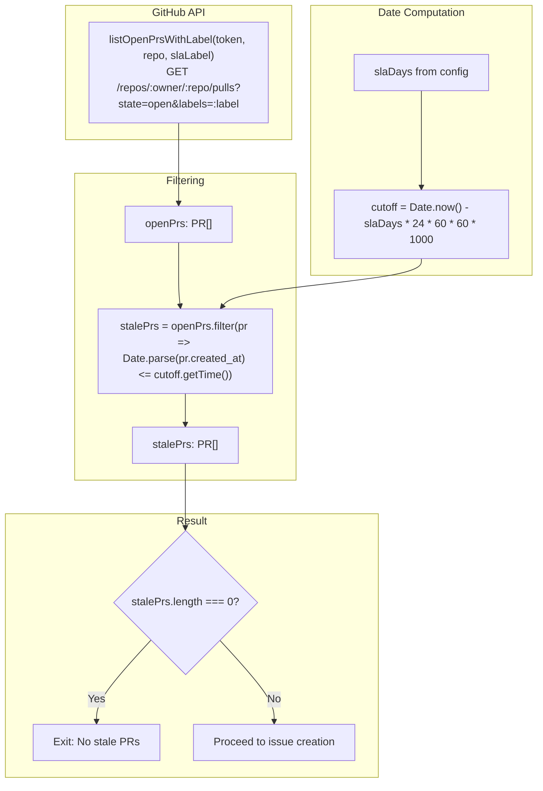

# sla-check

<details>
<summary>Relevant source files</summary>

The following files were used as context for generating this wiki page:

- [.gitignore](.gitignore)
- [README.md](README.md)
- [docdrift-yml.md](docdrift-yml.md)
- [src/cli.ts](src/cli.ts)
- [src/devin/v1.ts](src/devin/v1.ts)
- [src/index.ts](src/index.ts)

</details>


The `sla-check` command monitors open documentation drift pull requests and creates reminder issues when PRs remain unmerged beyond a configured SLA threshold. This command prevents documentation drift PRs from becoming stale by automatically escalating long-running PRs to team attention.

For information about the main drift detection and remediation workflow, see [run](#3.4). For details on SLA configuration settings, see [Policy Configuration](#4.6).

---

## Purpose and Scope

The `sla-check` command performs the following operations:

1. Queries GitHub for open pull requests labeled with `slaLabel` (default: `"docdrift"`)
2. Identifies PRs that have been open longer than `slaDays` (default: 7)
3. Creates a reminder issue listing all stale PRs
4. Updates state to enforce a cooldown period between reminder issues

This command is intended to run on a schedule (e.g., daily cron) to ensure documentation PRs do not languish. It does not perform drift detection, remediation, or PR creation—those functions belong to the `detect` and `run` commands.

**Sources:** [README.md:22-22](), [src/index.ts:542-595]()

---

## CLI Usage

```bash
npx @devinnn/docdrift sla-check
```

The command accepts no arguments. All configuration is read from `docdrift.yaml` and environment variables.

### Required Environment Variables

| Variable | Purpose |
|----------|---------|
| `GITHUB_TOKEN` | GitHub API token with `repo` scope for reading PRs and creating issues |
| `GITHUB_REPOSITORY` | Repository in `owner/name` format |

The command will fail with an error if either variable is missing.

**Sources:** [src/index.ts:542-550](), [src/cli.ts:87-89]()

---

## Workflow


**Workflow: sla-check command execution flow**

**Sources:** [src/index.ts:542-595]()

---

## Configuration

The `sla-check` command reads two fields from the `policy` section of `docdrift.yaml`:

| Field | Type | Default | Description |
|-------|------|---------|-------------|
| `slaDays` | number | `7` | Number of days before a PR is considered stale. Set to `0` to disable SLA checks entirely. |
| `slaLabel` | string | `"docdrift"` | GitHub label used to identify documentation drift PRs. Only PRs with this label are considered. |

### Example Configuration

```yaml
policy:
  slaDays: 7
  slaLabel: docdrift
  # ... other policy fields
```

When `slaDays` is set to `0` or a negative value, the command exits immediately with `issueOpened: false` and logs "SLA check disabled".

**Sources:** [src/index.ts:551-558](), [docdrift-yml.md:130-137]()

---

## State and Cooldown Logic

The `sla-check` command uses `.docdrift/state.json` to track when the last SLA reminder issue was created. This prevents issue spam by enforcing a 6-day cooldown period.


**Diagram: SLA cooldown mechanism using state.json**

### State Schema

The relevant portion of `state.json`:

```json
{
  "lastSlaIssueOpenedAt": "2024-01-15T10:30:00.000Z"
}
```

The cooldown logic is implemented at [src/index.ts:574-579]():

```typescript
const lastSla = state.lastSlaIssueOpenedAt ? Date.parse(state.lastSlaIssueOpenedAt) : 0;
const slaCooldown = 6 * 24 * 60 * 60 * 1000;
if (Date.now() - lastSla < slaCooldown) {
  logInfo("SLA issue cooldown; skipping");
  return { issueOpened: false };
}
```

**Sources:** [src/index.ts:573-579](), [src/policy/state.ts]()

---

## PR Detection Logic

The command identifies stale PRs using the following algorithm:



**Diagram: Stale PR detection algorithm**

The implementation at [src/index.ts:560-570]():

```typescript
const cutoff = new Date(Date.now() - slaDays * 24 * 60 * 60 * 1000);

const openPrs = await listOpenPrsWithLabel(githubToken, repo, slaLabel);
const stalePrs = openPrs.filter((pr) => {
  const created = pr.created_at ? Date.parse(pr.created_at) : Date.now();
  return Number.isFinite(created) && created <= cutoff.getTime();
});

if (stalePrs.length === 0) {
  logInfo("No doc-drift PRs open longer than slaDays; nothing to do");
  return { issueOpened: false };
}
```

**Sources:** [src/index.ts:560-571](), [src/github/client.ts]()

---

## Issue Creation

When stale PRs are found and the cooldown has passed, the command creates a GitHub issue using `renderSlaIssueBody`.

### Issue Template


**Diagram: Issue creation flow using renderSlaIssueBody**

The issue creation code at [src/index.ts:581-591]():

```typescript
const prUrls = stalePrs.map((p) => p.url).filter(Boolean);
await createIssue({
  token: githubToken,
  repository: repo,
  issue: {
    title: "[docdrift] Docs out of sync — merge doc drift PR(s)",
    body: renderSlaIssueBody({ prUrls, slaDays }),
    labels: ["docdrift"],
  },
});
state.lastSlaIssueOpenedAt = new Date().toISOString();
saveState(state);
```

**Sources:** [src/index.ts:581-593](), [src/github/client.ts]()

---

## Return Value

The `runSlaCheck` function returns an object indicating whether an issue was created:

```typescript
{ issueOpened: boolean }
```

| Value | Meaning |
|-------|---------|
| `{ issueOpened: true }` | An SLA reminder issue was successfully created |
| `{ issueOpened: false }` | No issue created (SLA disabled, no stale PRs, or cooldown active) |

The CLI invocation at [src/cli.ts:87-89]() does not use the return value, but it is available for programmatic usage.

**Sources:** [src/index.ts:542-595]()

---

## Scheduled Execution

The `sla-check` command is designed to run on a schedule. Add it to your GitHub Actions workflow:

```yaml
# .github/workflows/sla-check.yml
name: SLA Check
on:
  schedule:
    - cron: '0 9 * * *'  # Daily at 9 AM UTC

jobs:
  sla-check:
    runs-on: ubuntu-latest
    steps:
      - uses: actions/checkout@v4
      - uses: actions/setup-node@v4
        with:
          node-version: '20'
      - run: npx @devinnn/docdrift sla-check
        env:
          GITHUB_TOKEN: ${{ secrets.GITHUB_TOKEN }}
          GITHUB_REPOSITORY: ${{ github.repository }}
```

The daily schedule combined with the 6-day cooldown ensures teams receive at most one reminder per week for any set of stale PRs.

**Sources:** [README.md:22-22](), [docdrift-yml.md:130-137]()

---

## Integration with Main Workflow

The `run` command also performs inline SLA checking after creating or updating a documentation drift PR. This logic is implemented at [src/index.ts:498-520]():

```typescript
const slaDays = normalized.policy.slaDays ?? 0;
if (githubToken && slaDays > 0 && state.lastDocDriftPrUrl && state.lastDocDriftPrOpenedAt) {
  const openedAt = Date.parse(state.lastDocDriftPrOpenedAt);
  const daysOld = (Date.now() - openedAt) / (24 * 60 * 60 * 1000);
  const lastSla = state.lastSlaIssueOpenedAt ? Date.parse(state.lastSlaIssueOpenedAt) : 0;
  const slaCooldown = 6 * 24 * 60 * 60 * 1000;
  if (daysOld >= slaDays && Date.now() - lastSla > slaCooldown) {
    const slaIssueUrl = await createIssue({
      token: githubToken,
      repository: repo,
      issue: {
        title: "[docdrift] Docs out of sync — merge doc drift PR(s)",
        body: renderSlaIssueBody({
          prUrls: [state.lastDocDriftPrUrl],
          slaDays,
        }),
        labels: ["docdrift"],
      },
    });
    state.lastSlaIssueOpenedAt = new Date().toISOString();
    saveState(state);
  }
}
```

This means SLA reminders can be triggered by either:
1. The scheduled `sla-check` command (checks all stale PRs)
2. A `run` command execution (checks the most recent doc-drift PR)

Both paths respect the same 6-day cooldown and update `state.lastSlaIssueOpenedAt`.

**Sources:** [src/index.ts:498-520]()

---

## Code Entity Map


**Diagram: Code entity relationships for sla-check command**

**Sources:** [src/cli.ts:87-89](), [src/index.ts:542-595](), [src/github/client.ts](), [src/policy/state.ts]()

---