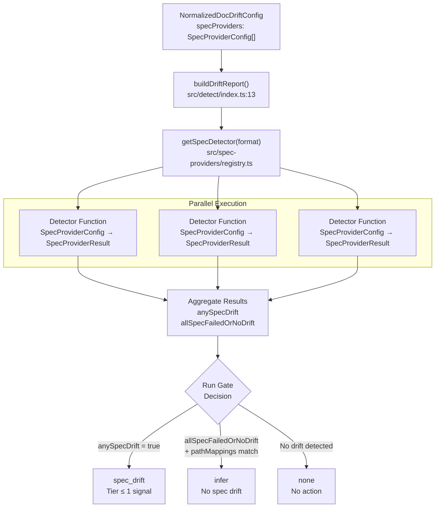
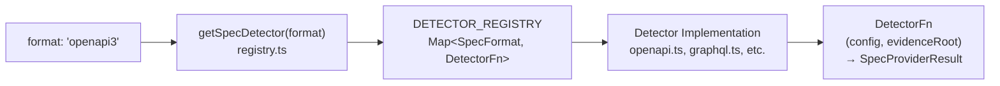
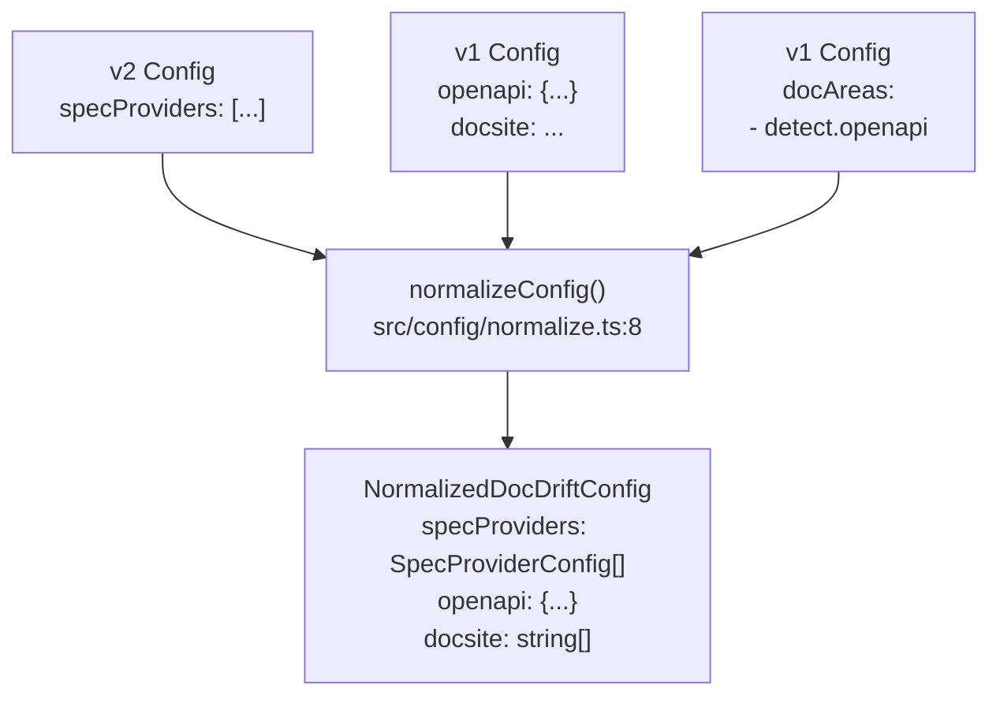

# Spec Providers

<details>
<summary>Relevant source files</summary>

The following files were used as context for generating this wiki page:

- [.gitignore](.gitignore)
- [README.md](README.md)
- [docdrift.schema.json](docdrift.schema.json)
- [src/config/normalize.ts](src/config/normalize.ts)
- [src/config/schema.ts](src/config/schema.ts)
- [src/detect/index.ts](src/detect/index.ts)
- [test/config.test.ts](test/config.test.ts)

</details>


## Purpose and Scope

Spec providers define API specifications that docdrift monitors for drift detection. Each spec provider configures a specific API specification format (OpenAPI, GraphQL, etc.), specifies how to obtain the current specification state, and identifies where the published specification is located for comparison. This page documents the spec provider configuration structure, supported formats, source types, and how they integrate into the detection pipeline.

For information about how path mappings detect drift through file changes, see [Path Mappings](#4.5). For the complete configuration file reference, see [Configuration File Reference](#4.3).

---

## Configuration Structure

A spec provider is defined in the `specProviders` array within `docdrift.yaml` using the following schema:

```yaml
specProviders:
  - format: openapi3              # Required: Specification format
    current:                      # Required: How to obtain current spec
      type: export                # url | local | export
      command: npm run export     # For type: export
      outputPath: generated.json  # For type: export
    published: docs/api/spec.json # Required: Published spec location
```

### Schema Definition

The `specProviderConfigSchema` defines three required fields:

| Field | Type | Description |
|-------|------|-------------|
| `format` | enum | Specification format: `openapi3`, `swagger2`, `graphql`, `fern`, `postman` |
| `current` | object | Source configuration for obtaining the current specification state |
| `published` | string | File path to the published specification in the documentation |

**Sources:** [src/config/schema.ts:33-40]()

---

## Supported Formats

The following API specification formats are supported:

| Format | Description | Use Case |
|--------|-------------|----------|
| `openapi3` | OpenAPI 3.x specifications | REST APIs with OpenAPI 3.0+ |
| `swagger2` | Swagger 2.0 (OpenAPI 2.0) | Legacy REST APIs using Swagger 2.0 |
| `graphql` | GraphQL schema definitions | GraphQL APIs |
| `fern` | Fern API definition format | APIs using Fern tooling |
| `postman` | Postman collection format | APIs documented via Postman |

**Sources:** [src/config/schema.ts:33](), [docdrift.schema.json:22-28](), [README.md:54]()

---

## Source Types

The `current` field uses a discriminated union to specify how the current specification is obtained. Three source types are supported:

### URL Source

Fetches the specification from a remote URL:

```yaml
current:
  type: url
  url: https://api.example.com/openapi.json
```

### Local Source

Reads the specification from a local file path:

```yaml
current:
  type: local
  path: ./api/schema.graphql
```

### Export Source

Executes a command to generate the specification:

```yaml
current:
  type: export
  command: npm run openapi:export
  outputPath: openapi/generated.json
```

The export type is the most common pattern, as it ensures the specification is generated from the current codebase state before comparison.

**Sources:** [src/config/schema.ts:23-31](), [docdrift.schema.json:31-91]()

---

## Spec Provider Flow in Detection Pipeline



**Spec Provider Detection Flow**

**Sources:** [src/detect/index.ts:58-84]()

---

## Detection Execution

The detection process executes all configured spec providers in parallel:

```typescript
// From buildDriftReport()
const providerResults: SpecProviderResult[] = [];
if (config.specProviders.length > 0) {
  const results = await Promise.all(
    config.specProviders.map(async (provider) => {
      const detector = getSpecDetector(provider.format);
      return detector(provider, evidenceRoot);
    })
  );
  providerResults.push(...results);
}
```

Each detector function receives a `SpecProviderConfig` and an `evidenceRoot` directory, then returns a `SpecProviderResult` containing:

| Field | Type | Description |
|-------|------|-------------|
| `hasDrift` | boolean | Whether drift was detected |
| `signal` | Signal | Detection signal with tier and confidence |
| `impactedDocs` | string[] | Documentation files impacted by the drift |
| `summary` | string | Human-readable summary of the drift |
| `evidenceFiles` | string[] | Paths to evidence files (diffs, specs) |

The detection logic aggregates results to determine if any spec provider detected high-confidence drift (tier ≤ 1):

```typescript
const anySpecDrift = providerResults.some(
  (r) => r.hasDrift && r.signal && r.signal.tier <= 1
);
```

**Sources:** [src/detect/index.ts:58-84](), [src/spec-providers/types.ts]()

---

## Registry Pattern

Spec providers are registered through a registry pattern that maps formats to detector functions:



**Spec Provider Registry Pattern**

Each format implementation is responsible for:

1. **Obtaining the current specification** according to the `current` source configuration
2. **Loading the published specification** from the `published` path
3. **Comparing specifications** to detect semantic differences
4. **Generating evidence files** (diffs, full specs) in the evidence directory
5. **Returning a result** with drift status, signals, and impacted docs

**Sources:** [src/detect/index.ts:63](), [src/spec-providers/registry.ts]()

---

## Normalization and Backward Compatibility

The configuration system supports multiple formats for specifying API specifications, all of which are normalized to `specProviders` during processing:



**Configuration Normalization to Spec Providers**

### V2 Config with specProviders

The modern approach uses the explicit `specProviders` array:

```yaml
version: 2
specProviders:
  - format: openapi3
    current:
      type: export
      command: npm run openapi:export
      outputPath: openapi/generated.json
    published: docs/api/openapi.json
```

This is passed through unchanged during normalization.

**Sources:** [src/config/normalize.ts:17-40]()

### V1 Config with openapi Block

The legacy simple format uses an `openapi` block:

```yaml
version: 1
openapi:
  export: npm run openapi:export
  generated: openapi/generated.json
  published: docs/api/openapi.json
docsite: docs/
```

During normalization, this is converted to a spec provider:

```typescript
specProviders = [
  {
    format: "openapi3",
    current: { 
      type: "export", 
      command: config.openapi.export, 
      outputPath: config.openapi.generated 
    },
    published: config.openapi.published,
  },
];
```

**Sources:** [src/config/normalize.ts:41-50]()

### V1 Config with docAreas

The legacy `docAreas` format includes OpenAPI detection per area:

```yaml
version: 1
docAreas:
  - name: api_reference
    detect:
      openapi:
        exportCmd: npm run openapi:export
        generatedPath: openapi/generated.json
        publishedPath: docs/api/openapi.json
```

The first `docArea` with an `openapi` detector is extracted and converted to a spec provider:

```typescript
const firstOpenApiArea = config.docAreas.find((a) => a.detect.openapi);
const o = firstOpenApiArea.detect.openapi;
specProviders = [
  {
    format: "openapi3",
    current: { 
      type: "export", 
      command: o.exportCmd, 
      outputPath: o.generatedPath 
    },
    published: o.publishedPath,
  },
];
```

**Sources:** [src/config/normalize.ts:66-83]()

---

## Multiple Spec Providers

A single configuration can define multiple spec providers to monitor different specifications:

```yaml
version: 2
specProviders:
  - format: openapi3
    current:
      type: export
      command: npm run api:export:rest
      outputPath: openapi/rest.json
    published: docs/api/rest/openapi.json
  
  - format: graphql
    current:
      type: export
      command: npm run api:export:graphql
      outputPath: schema/schema.graphql
    published: docs/api/graphql/schema.graphql
  
  - format: postman
    current:
      type: url
      url: https://api.example.com/postman.json
    published: docs/api/postman/collection.json
```

All providers are executed in parallel during detection. If any provider detects drift with tier ≤ 1, the run gate opens to `spec_drift`.

**Sources:** [src/detect/index.ts:58-68]()

---

## Deriving Docsite from Spec Providers

When using v2 config with `specProviders`, the `docsite` array is automatically derived from the published spec paths if not explicitly provided:

```typescript
const allPaths = specProviders.flatMap((p) => [p.published]);
const roots = new Set<string>();
for (const p of allPaths) {
  const parts = p.split("/").filter(Boolean);
  if (parts.length >= 2) roots.add(parts[0] + "/" + parts[1]);
  else if (parts.length === 1) roots.add(parts[0]);
}
docsite = roots.size > 0 ? [...roots] : ["."];
```

For example, if published specs are:
- `docs/api/openapi.json`
- `docs/graphql/schema.graphql`
- `reference/postman.json`

The derived docsite is: `["docs/api", "docs/graphql", "reference"]`

This ensures Devin updates are scoped to the relevant documentation directories.

**Sources:** [src/config/normalize.ts:33-40]()

---

## Example Configurations

### Single OpenAPI Spec with Export Command

```yaml
version: 2
specProviders:
  - format: openapi3
    current:
      type: export
      command: npm run openapi:export
      outputPath: openapi/generated.json
    published: apps/docs-site/openapi/openapi.json
docsite: apps/docs-site
policy:
  allowlist: ["apps/docs-site/**", "openapi/**"]
  verification:
    commands: ["npm run docs:build"]
```

### Multiple Specs with Different Formats

```yaml
version: 2
specProviders:
  - format: openapi3
    current:
      type: export
      command: npm run api:rest:export
      outputPath: specs/rest.json
    published: docs/rest-api/spec.json
  
  - format: graphql
    current:
      type: local
      path: src/schema.graphql
    published: docs/graphql/schema.graphql

mode: strict
```

### Remote Spec via URL

```yaml
version: 2
specProviders:
  - format: openapi3
    current:
      type: url
      url: https://api.example.com/v1/openapi.json
    published: docs/api/openapi.json
```

**Sources:** [test/config.test.ts:155-176](), [README.md:36-57]()

---

## JSON Schema Reference

The complete JSON Schema for spec providers is defined in `docdrift.schema.json`:

**specProviders Array Schema:**
- Type: `array`
- Items: `object` with properties:
  - `format`: enum of `["openapi3", "swagger2", "graphql", "fern", "postman"]`
  - `current`: discriminated union of url/local/export source types
  - `published`: string (minimum length 1)

**Sources:** [docdrift.schema.json:15-105]()

---