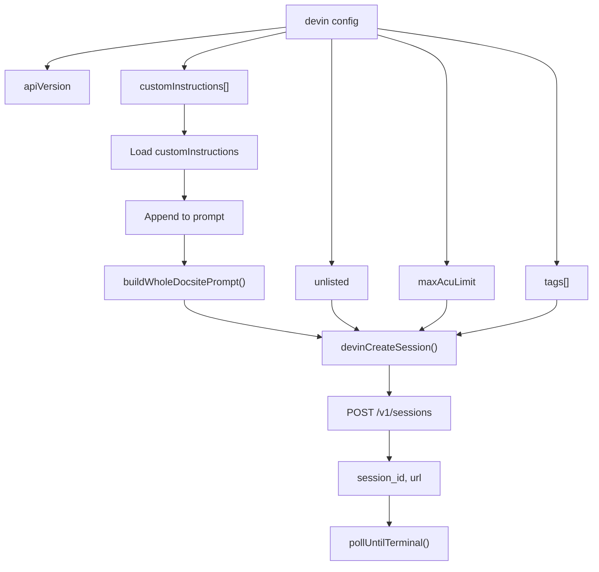
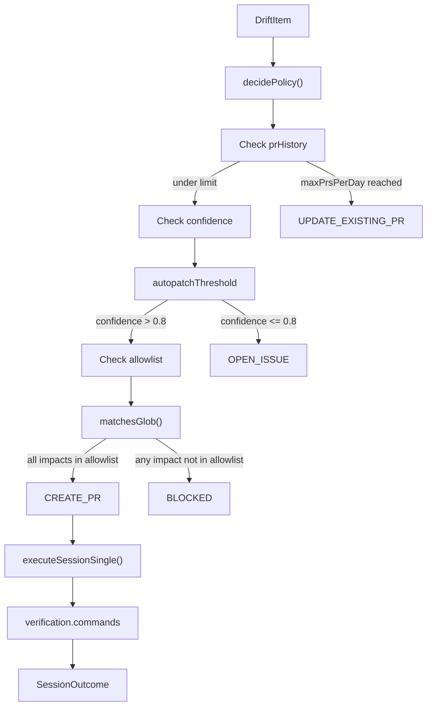
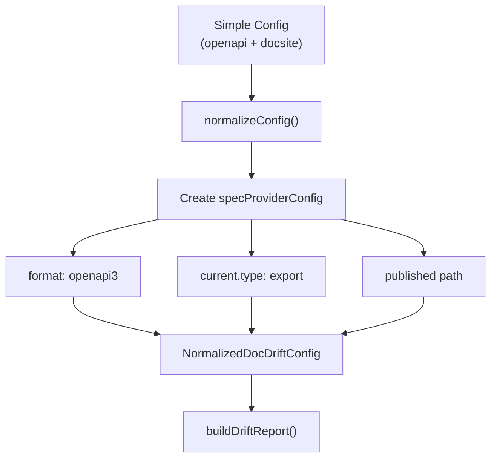
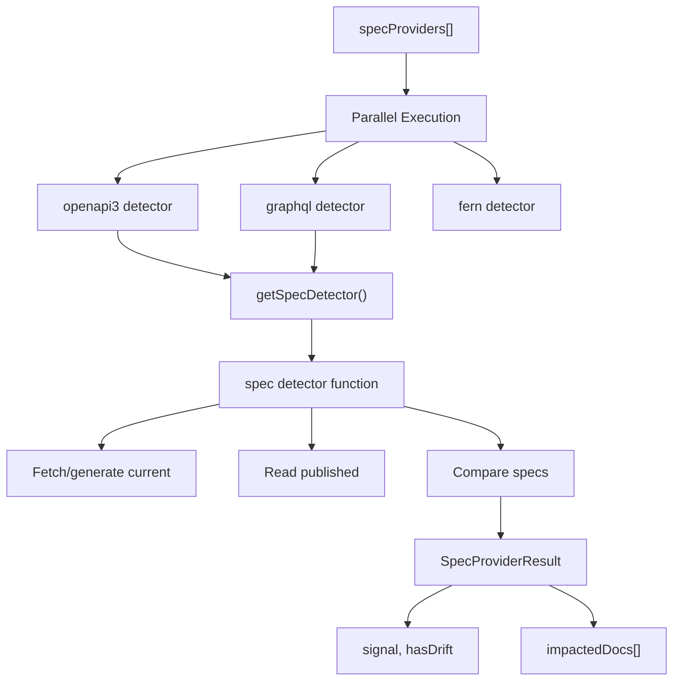
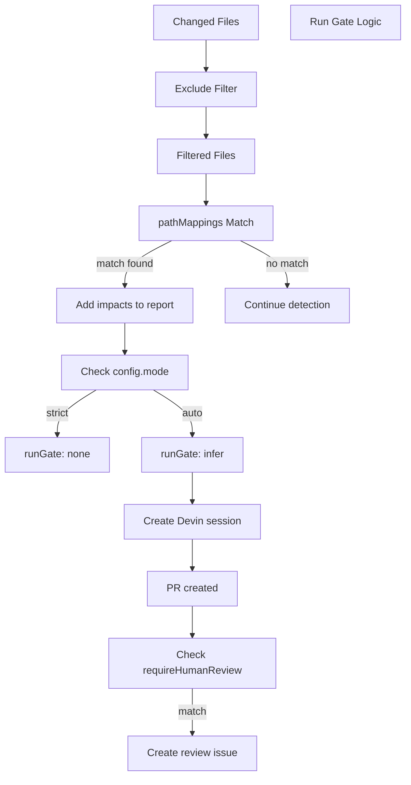

# Configuration File Reference

<details>
<summary>Relevant source files</summary>

The following files were used as context for generating this wiki page:

- [docdrift-yml.md](docdrift-yml.md)
- [docdrift.schema.json](docdrift.schema.json)
- [src/config/normalize.ts](src/config/normalize.ts)
- [src/config/schema.ts](src/config/schema.ts)
- [src/detect/index.ts](src/detect/index.ts)
- [src/index.ts](src/index.ts)
- [test/config.test.ts](test/config.test.ts)

</details>


This page provides comprehensive reference documentation for all fields in the `docdrift.yaml` configuration file. For validation and normalization logic, see page 4.2. For specific subsystem configurations, see pages 4.4 (Spec Providers), 4.5 (Path Mappings), and 4.6 (Policy Configuration).

## Configuration File Overview

The `docdrift.yaml` file must be located in the root of the consuming repository. It is loaded by the `loadConfig()` function in [src/config/load.ts]() and validated against the schema defined in [src/config/schema.ts]().

### IDE Autocomplete Support

Add the following comment at the top of your `docdrift.yaml` for IDE autocomplete and validation:

```yaml
# yaml-language-server: $schema=https://unpkg.com/@devinnn/docdrift@latest/docdrift.schema.json
```

This requires the Red Hat YAML extension for VS Code/Cursor.

### Configuration Versions

DocDrift supports two configuration versions:

| Version | Description | Primary Use Case |
|---------|-------------|------------------|
| `version: 1` | Simple config (`openapi` + `docsite`) or legacy config (`docAreas`) | Most common for single-API projects |
| `version: 2` | Advanced config with `specProviders` array | Multi-spec projects (OpenAPI + GraphQL + Postman) |

## Top-Level Fields

The configuration supports multiple formats depending on your project structure. All formats require `version`, `devin`, and `policy` fields.

| Field | Required | Type | Description |
|-------|----------|------|-------------|
| `version` | **Yes** | number | Schema version identifier (must be `1` or `2`) |
| `devin` | **Yes** | object | Devin AI API and session configuration |
| `policy` | **Yes** | object | Global policy for PR caps, confidence gating, allowlists, and verification |
| `specProviders` | No* | array | v2: Array of spec provider configurations (OpenAPI, GraphQL, etc.) |
| `openapi` | No* | object | v1: Simple OpenAPI configuration (export command, paths) |
| `docsite` | No* | string/array | v1: Root path(s) of documentation site |
| `docAreas` | No* | array | v1 legacy: Array of documentation areas with detection and patching rules |
| `pathMappings` | No | array | Heuristic path rules: when code changes, which docs may be impacted |
| `exclude` | No | array | Glob patterns for paths DocDrift should never modify (default: `[]`) |
| `requireHumanReview` | No | array | Glob patterns for paths that trigger review issues when modified (default: `[]`) |
| `mode` | No | string | `"strict"` (spec drift only) or `"auto"` (also run on pathMappings match) (default: `"strict"`) |

\* Config must include one of: `specProviders`, `(openapi + docsite)`, or `docAreas`.

**Configuration Structure Overview**

```mermaid
graph TD
    Root["docdrift.yaml"]
    Version["version"]
    Devin["devin"]
    Policy["policy"]
    Detection["Detection Config"]
    Global["Global Settings"]
    
    Root --> Version
    Root --> Devin
    Root --> Policy
    Root --> Detection
    Root --> Global
    
    Detection --> SpecProviders["specProviders[]<br/>(v2)"]
    Detection --> OpenAPI["openapi + docsite<br/>(v1 simple)"]
    Detection --> DocAreas["docAreas[]<br/>(v1 legacy)"]
    
    Devin --> DevinAPI["apiVersion"]
    Devin --> DevinUnlisted["unlisted"]
    Devin --> DevinACU["maxAcuLimit"]
    Devin --> DevinTags["tags[]"]
    Devin --> CustomInst["customInstructions[]"]
    
    Policy --> PRCaps["prCaps"]
    Policy --> Confidence["confidence"]
    Policy --> Allowlist["allowlist[]"]
    Policy --> Verification["verification"]
    Policy --> SLA["slaDays, slaLabel"]
    Policy --> AllowNew["allowNewFiles"]
    
    Global --> PathMappings["pathMappings[]"]
    Global --> Exclude["exclude[]"]
    Global --> ReviewPaths["requireHumanReview[]"]
    Global --> Mode["mode"]
```



**Sources:** [src/config/schema.ts:101-122](), [docdrift-yml.md:38-51]()

## Version Field

| Field | Required | Type | Valid Values | Description |
|-------|----------|------|--------------|-------------|
| `version` | **Yes** | number | `1` or `2` | Configuration schema version |

The `version` field specifies which configuration schema version is used. This determines which top-level fields are valid and how the configuration is normalized.

### Version 1

Version 1 supports two formats:

1. **Simple format**: `openapi` + `docsite` fields for single-spec projects
2. **Legacy format**: `docAreas` array for multi-area documentation management

```yaml
version: 1
openapi:
  export: "npm run openapi:export"
  generated: "openapi/generated.json"
  published: "apps/docs-site/openapi/openapi.json"
docsite: "apps/docs-site"
```

### Version 2

Version 2 introduces the `specProviders` array for multi-spec projects (e.g., OpenAPI + GraphQL + Postman). The `mode` field controls when detection runs.

```yaml
version: 2
specProviders:
  - format: openapi3
    current:
      type: export
      command: "npm run openapi:export"
      outputPath: "openapi/generated.json"
    published: "apps/docs-site/openapi/openapi.json"
docsite: "apps/docs-site"
mode: auto
```

**Schema Validation**

The schema uses `z.union([z.literal(1), z.literal(2)])` to validate the version field at [src/config/schema.ts:102]().

**Sources:** [src/config/schema.ts:102](), [docdrift-yml.md:40-43](), [test/config.test.ts:155-176]()

## Devin Configuration

The `devin` section configures how DocDrift interacts with the Devin AI API for automated documentation remediation. All Devin sessions created by DocDrift use these settings.

### Fields

| Field | Required | Type | Default | Description |
|-------|----------|------|---------|-------------|
| `apiVersion` | **Yes** | string | — | Must be `"v1"` (Devin API version) |
| `unlisted` | No | boolean | `true` | Whether sessions are unlisted in Devin dashboard |
| `maxAcuLimit` | No | integer | `2` | Maximum ACU (compute) limit per session (must be positive) |
| `tags` | No | array | `["docdrift"]` | Tags attached to Devin sessions for filtering and organization (each must be non-empty) |
| `customInstructions` | No | array | — | Paths to markdown files containing custom instructions appended to all prompts |
| `customInstructionContent` | No | string | — | Inline custom instruction text (alternative to `customInstructions` files) |

### Example

```yaml
devin:
  apiVersion: v1
  unlisted: true
  maxAcuLimit: 2
  tags:
    - docdrift
    - api-docs
  customInstructions:
    - "./docs/devin-instructions.md"
    - ".docdrift/prompt-append.md"
```

### Custom Instructions

The `customInstructions` field accepts an array of file paths (relative to `docdrift.yaml` location). These files are loaded by `loadConfig()` and their contents are concatenated and appended to all Devin prompts generated by `buildWholeDocsitePrompt()`, `buildAutogenPrompt()`, and `buildConceptualPrompt()`.

If a file in `customInstructions` does not exist, config loading fails with an error. Use `customInstructionContent` for inline instructions instead of file references.

### Session Creation

When `devinCreateSession()` is called, these settings are passed to the Devin API:

- `unlisted` → session visibility setting
- `max_acu_limit` → compute limit
- `tags` → session metadata (automatically includes `"docdrift"` and doc area name)

**Devin Session Creation Flow**



**Sources:** [src/config/schema.ts:111-117](), [docdrift-yml.md:54-78](), [src/index.ts:111-125](), [src/devin/v1.ts:1-30]()

## Policy Configuration

The `policy` section defines global constraints and verification rules that apply to all drift remediation. This section controls PR rate limiting, confidence thresholds, path allowlists, and verification commands.

### Policy Subsections

| Subsection | Required | Type | Description |
|------------|----------|------|-------------|
| `prCaps` | No | object | PR rate limits and scope constraints |
| `confidence` | No | object | Confidence thresholds for automation |
| `allowlist` | **Yes** | array | Glob patterns for paths PRs may modify (must have at least one) |
| `verification` | **Yes** | object | Commands to validate documentation changes (must have at least one) |
| `slaDays` | No | number | Days before opening SLA reminder issue (default: `7`, set `0` to disable) |
| `slaLabel` | No | string | Label for identifying doc-drift PRs in SLA checks (default: `"docdrift"`) |
| `allowNewFiles` | No | boolean | Whether Devin may create new files/folders (default: `false`) |

### prCaps

PR rate limiting and scope control.

| Field | Required | Type | Default | Description |
|-------|----------|------|---------|-------------|
| `maxPrsPerDay` | No | integer | `1` | Maximum PRs that can be opened per day (across all doc areas, must be ≥ 1) |
| `maxFilesTouched` | No | integer | `12` | Maximum files a single PR may touch (must be ≥ 1) |

```yaml
policy:
  prCaps:
    maxPrsPerDay: 1
    maxFilesTouched: 12
```

When `maxPrsPerDay` is reached, the policy engine returns `UPDATE_EXISTING_PR` action, bundling new changes into the most recent open PR.

### confidence

Confidence gating for automated vs. manual remediation.

| Field | Required | Type | Default | Description |
|-------|----------|------|---------|-------------|
| `autopatchThreshold` | No | number | `0.8` | Confidence score between `0` and `1`. Above this threshold, a PR may be opened; at or below, an issue is opened |

```yaml
policy:
  confidence:
    autopatchThreshold: 0.8
```

The threshold is checked by `decidePolicy()` at [src/policy/engine.ts]() when determining the policy action.

### allowlist

Glob patterns for paths that PRs are permitted to modify. At least one entry is required.

```yaml
policy:
  allowlist:
    - "docs/**"
    - "openapi/**"
    - "apps/docs-site/**"
```

Any file path outside the allowlist will cause the policy engine to return a `BLOCKED` action. This prevents DocDrift from accidentally modifying source code or configuration files.

### verification

Commands run after patching to verify documentation builds/lints correctly. At least one command is required.

```yaml
policy:
  verification:
    commands:
      - "npm run docs:check"
      - "npm run docs:build"
```

Each command must be a non-empty string. The **binary** of each command (e.g., `npm` for `npm run docs:check`) must exist on the runner, verified by `validateRuntimeConfig()` at [src/config/validate.ts]().

Verification results are included in the session outcome and displayed in commit comments.

### SLA Configuration

| Field | Required | Type | Default | Description |
|-------|----------|------|---------|-------------|
| `slaDays` | No | integer | `7` | Days before opening SLA issue for unmerged doc-drift PRs (set `0` to disable) |
| `slaLabel` | No | string | `"docdrift"` | Label used to identify doc-drift PRs for SLA checks |

```yaml
policy:
  slaDays: 7
  slaLabel: docdrift
```

The `runSlaCheck()` function at [src/index.ts:542-595]() uses these settings to find stale PRs and create reminder issues.

### allowNewFiles

| Field | Required | Type | Default | Description |
|-------|----------|------|---------|-------------|
| `allowNewFiles` | No | boolean | `false` | If `false`, Devin may only edit existing files. If `true`, Devin may add articles, create folders, and change information architecture |

```yaml
policy:
  allowNewFiles: false
```

This setting gives teams control to prevent doc sprawl. When `false`, the Devin prompt instructs: "DO NOT create new files, folders, or change doc structure. Only edit existing files."

### Example

```yaml
policy:
  prCaps:
    maxPrsPerDay: 1
    maxFilesTouched: 12
  confidence:
    autopatchThreshold: 0.8
  allowlist:
    - "docs/**"
    - "openapi/**"
  verification:
    commands:
      - "npm run docs:check"
  slaDays: 7
  slaLabel: docdrift
  allowNewFiles: false
```

**Policy Decision Flow**



**Sources:** [src/policy/engine.ts](), [src/config/schema.ts:76-98](), [docdrift-yml.md:82-128](), [src/index.ts:294-302]()

## Simple Configuration Format (openapi + docsite)

The simple configuration format is designed for single-spec projects where all documentation lives in one location. This format uses `openapi` and `docsite` top-level fields instead of `specProviders` or `docAreas`.

### Required Fields

| Field | Required | Type | Description |
|-------|----------|------|-------------|
| `openapi.export` | **Yes** | string | Command to generate current OpenAPI spec (e.g., `"npm run openapi:export"`) |
| `openapi.generated` | **Yes** | string | Path to generated spec output (e.g., `"openapi/generated.json"`) |
| `openapi.published` | **Yes** | string | Path to published spec in docs (e.g., `"apps/docs-site/openapi/openapi.json"`) |
| `docsite` | **Yes** | string or array | Root path(s) of documentation site (e.g., `"apps/docs-site"` or `["docs", "guides"]`) |

### Optional Fields

| Field | Required | Type | Default | Description |
|-------|----------|------|---------|-------------|
| `exclude` | No | array | `[]` | Glob patterns for paths DocDrift should never modify |
| `requireHumanReview` | No | array | `[]` | Glob patterns for paths that trigger review issues when modified |
| `pathMappings` | No | array | `[]` | Heuristic rules mapping code changes to doc impacts (see page 4.5) |

### Example

```yaml
version: 1

openapi:
  export: "npm run openapi:export"
  generated: "openapi/generated.json"
  published: "apps/docs-site/openapi/openapi.json"

docsite: "apps/docs-site"

exclude:
  - "apps/docs-site/blog/**"

requireHumanReview:
  - "apps/docs-site/docs/guides/**"

pathMappings:
  - match: "definition/**"
    impacts: ["apps/docs-site/docs/guides/**"]

devin:
  apiVersion: v1

policy:
  allowlist:
    - "apps/docs-site/**"
    - "openapi/**"
  verification:
    commands:
      - "npm run docs:build"
```

### How It Works

The simple format is normalized into a `specProviders` array by `normalizeConfig()` at [src/config/normalize.ts:41-50](). The `openapi` block becomes:

```typescript
specProviders: [
  {
    format: "openapi3",
    current: { type: "export", command: config.openapi.export, outputPath: config.openapi.generated },
    published: config.openapi.published,
  }
]
```

**Normalization Flow**



**Sources:** [src/config/schema.ts:16-20](), [src/config/normalize.ts:41-50](), [docdrift-yml.md:140-162](), [test/config.test.ts:103-124]()

## Spec Providers Format (v2)

The `specProviders` format is designed for multi-spec projects where you have multiple API specification formats (OpenAPI, GraphQL, Postman, etc.) that need to be kept in sync with documentation.

### specProviders Array

Each spec provider defines a format, current spec source, and published spec location.

| Field | Required | Type | Description |
|-------|----------|------|-------------|
| `format` | **Yes** | string | Spec format: `"openapi3"`, `"swagger2"`, `"graphql"`, `"fern"`, or `"postman"` |
| `current` | **Yes** | object | Source of current spec (see below) |
| `published` | **Yes** | string | Path to published spec in docs |

### current Source Types

The `current` field supports three source types (discriminated union):

#### Type: export

Generate spec by running a command.

| Field | Required | Type | Description |
|-------|----------|------|-------------|
| `type` | **Yes** | string | Must be `"export"` |
| `command` | **Yes** | string | Command to generate spec (e.g., `"npm run openapi:export"`) |
| `outputPath` | **Yes** | string | Path where command writes output (e.g., `"openapi/generated.json"`) |

```yaml
current:
  type: export
  command: "npm run openapi:export"
  outputPath: "openapi/generated.json"
```

#### Type: local

Read spec from a local file.

| Field | Required | Type | Description |
|-------|----------|------|-------------|
| `type` | **Yes** | string | Must be `"local"` |
| `path` | **Yes** | string | Path to spec file (e.g., `"api/openapi.json"`) |

```yaml
current:
  type: local
  path: "api/openapi.json"
```

#### Type: url

Fetch spec from a URL.

| Field | Required | Type | Description |
|-------|----------|------|-------------|
| `type` | **Yes** | string | Must be `"url"` |
| `url` | **Yes** | string | URL to fetch spec from (must be valid URL format) |

```yaml
current:
  type: url
  url: "https://api.example.com/openapi.json"
```

### Example: Multi-Spec Project

```yaml
version: 2

specProviders:
  - format: openapi3
    current:
      type: export
      command: "npm run openapi:export"
      outputPath: "openapi/generated.json"
    published: "apps/docs-site/openapi/openapi.json"
  
  - format: graphql
    current:
      type: export
      command: "npm run graphql:export"
      outputPath: "graphql/schema.graphql"
    published: "apps/docs-site/graphql/schema.graphql"

docsite: "apps/docs-site"
mode: auto

devin:
  apiVersion: v1

policy:
  allowlist:
    - "apps/docs-site/**"
  verification:
    commands:
      - "npm run docs:build"
```

**Spec Provider Detection Flow**



**Sources:** [src/config/schema.ts:22-40](), [docdrift.schema.json:15-104](), [test/config.test.ts:155-176](), [src/detect/index.ts:58-68]()

## DocAreas Format (Legacy)

The `docAreas` format is the legacy multi-area configuration. It allows defining multiple documentation areas, each with its own detection rules, ownership, and patching behavior. For new projects, use the simple `openapi + docsite` format or v2 `specProviders` format instead.

### DocArea Fields

Each doc area is an object with the following fields:

| Field | Required | Type | Description |
|-------|----------|------|-------------|
| `name` | **Yes** | string | Unique identifier for this doc area (non-empty) |
| `mode` | **Yes** | string | `"autogen"` (API reference, auto-patchable) or `"conceptual"` (guides, needs review) |
| `owners` | **Yes** | object | Ownership metadata (see below) |
| `detect` | **Yes** | object | Detection rules (see below) |
| `patch` | **Yes** | object | Patching behavior (see below) |

### owners

| Field | Required | Type | Description |
|-------|----------|------|-------------|
| `reviewers` | **Yes** | array | List of reviewer identifiers (e.g., `["team/api"]`), at least one required |

### detect

Must include at least one of `openapi` or `paths`.

#### detect.openapi

| Field | Required | Type | Description |
|-------|----------|------|-------------|
| `exportCmd` | **Yes** | string | Command to generate current spec (e.g., `"npm run openapi:export"`) |
| `generatedPath` | **Yes** | string | Path to generated spec output |
| `publishedPath` | **Yes** | string | Path to published spec in docs |

#### detect.paths

Array of path rules (same format as `pathMappings`):

| Field | Required | Type | Description |
|-------|----------|------|-------------|
| `match` | **Yes** | string | Glob pattern for code paths (e.g., `"apps/api/src/auth/**"`) |
| `impacts` | **Yes** | array | Doc paths impacted when `match` changes (e.g., `["docs/guides/auth.md"]`) |

### patch

| Field | Required | Type | Default | Description |
|-------|----------|------|---------|-------------|
| `targets` | No | array | — | List of doc file paths that may be updated by autogen PR |
| `requireHumanConfirmation` | No | boolean | `false` | If `true`, escalate to issue instead of auto-opening PR |

### Example

```yaml
version: 1

devin:
  apiVersion: v1

policy:
  allowlist:
    - "docs/**"
  verification:
    commands:
      - "npm run docs:check"

docAreas:
  - name: api_reference
    mode: autogen
    owners:
      reviewers: ["datastack/api-owners"]
    detect:
      openapi:
        exportCmd: "npm run openapi:export"
        generatedPath: "openapi/generated.json"
        publishedPath: "docs/reference/openapi.json"
    patch:
      targets:
        - "docs/reference/openapi.json"
        - "docs/reference/api.md"

  - name: auth_guide
    mode: conceptual
    owners:
      reviewers: ["datastack/platform", "datastack/security"]
    detect:
      paths:
        - match: "apps/api/src/auth/**"
          impacts: ["docs/guides/auth.md"]
    patch:
      requireHumanConfirmation: true
```

**DocAreas Normalization**

The `normalizeConfig()` function at [src/config/normalize.ts:66-105]() derives `specProviders`, `openapi`, and `docsite` from the first docArea with an `openapi` detector, and synthesizes `requireHumanReview` from areas with `requireHumanConfirmation: true` or `mode: "conceptual"`.

**Sources:** [src/config/schema.ts:48-74](), [docdrift-yml.md:323-432](), [docdrift.schema.json:315-428](), [test/config.test.ts:6-48]()

## Global Path Configuration

These top-level fields control path-based behavior across all detection and remediation.

### exclude

Glob patterns for paths DocDrift should never modify. Default: `[]`.

```yaml
exclude:
  - "apps/docs-site/blog/**"
  - "docs/internal/**"
```

Excluded paths are filtered out during path matching and are never included in `impactedDocs` arrays. This is useful for blog posts, internal documentation, or other content outside DocDrift's scope.

### requireHumanReview

Glob patterns for paths that trigger a review issue when a PR modifies them. Default: `[]`.

```yaml
requireHumanReview:
  - "apps/docs-site/docs/guides/**"
  - "docs/security/**"
```

When a PR is opened and touches any path matching `requireHumanReview`, DocDrift creates a GitHub issue using `createIssue()` with `renderRequireHumanReviewIssueBody()` at [src/index.ts:407-418](). The issue links to the PR and lists the touched paths.

In the simple config format with `pathMappings`, all `impacts` paths are automatically added to `requireHumanReview` by `normalizeConfig()` at [src/config/normalize.ts:52-54]().

### pathMappings

Array of heuristic rules mapping code changes to documentation impacts. See page 4.5 for comprehensive documentation.

| Field | Required | Type | Description |
|-------|----------|------|-------------|
| `match` | **Yes** | string | Glob pattern for code paths (e.g., `"definition/**"`) |
| `impacts` | **Yes** | array | Doc paths that may need updates when `match` changes (at least one) |

```yaml
pathMappings:
  - match: "definition/**"
    impacts: ["pages/guides/**", "pages/api/**"]
  - match: "packages/api/**"
    impacts: ["pages/api/**"]
```

**How pathMappings Works:**

1. `detectHeuristicImpacts()` at [src/detect/heuristics.ts]() checks if any changed file matches a `match` pattern
2. If matched, the corresponding `impacts` paths are added to the drift report
3. The mappings are included in the Devin prompt so they're visible up front
4. All `impacts` are automatically added to `requireHumanReview`

### mode

Controls when detection runs:

| Value | Description |
|-------|-------------|
| `"strict"` | Only run on spec drift (default) |
| `"auto"` | Also run when pathMappings match (no spec drift required) |

```yaml
mode: auto
```

The run gate logic at [src/detect/index.ts:106-136]() checks `config.mode` to determine whether to proceed when `pathMappings` match but no spec drift is detected. In `"strict"` mode, the gate returns `"none"`. In `"auto"` mode, the gate returns `"infer"` and creates an inference signal.

**Global Path Configuration Flow**



**Sources:** [src/config/schema.ts:106-110](), [docdrift-yml.md:164-200](), [src/detect/index.ts:99-136](), [src/config/normalize.ts:51-54]()

## Complete Configuration Example

Below is a complete, valid `docdrift.yaml` file demonstrating all top-level sections:

```yaml
version: 1

devin:
  apiVersion: v1
  unlisted: true
  maxAcuLimit: 2
  tags:
    - docdrift

policy:
  prCaps:
    maxPrsPerDay: 1
    maxFilesTouched: 12
  confidence:
    autopatchThreshold: 0.8
  allowlist:
    - "docs/**"
    - "openapi/**"
  verification:
    commands:
      - "npm run docs:check"

docAreas:
  - name: api_reference
    mode: autogen
    owners:
      reviewers: ["datastack/api-owners"]
    detect:
      openapi:
        exportCmd: "npm run openapi:export"
        generatedPath: "openapi/generated.json"
        publishedPath: "docs/reference/openapi.json"
    patch:
      targets:
        - "docs/reference/openapi.json"
        - "docs/reference/api.md"
```

**Sources:** [docdrift.yaml:1-48](), [docdrift-yml.md:149-199]()

---