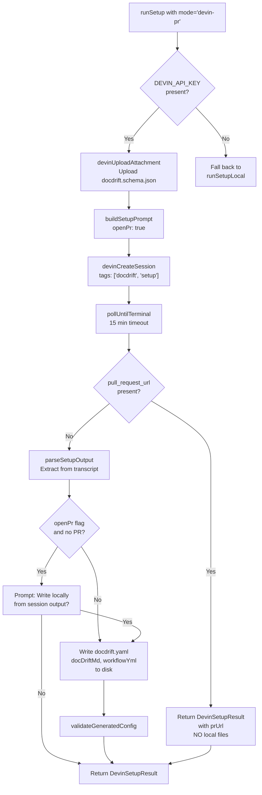
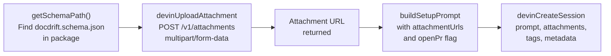
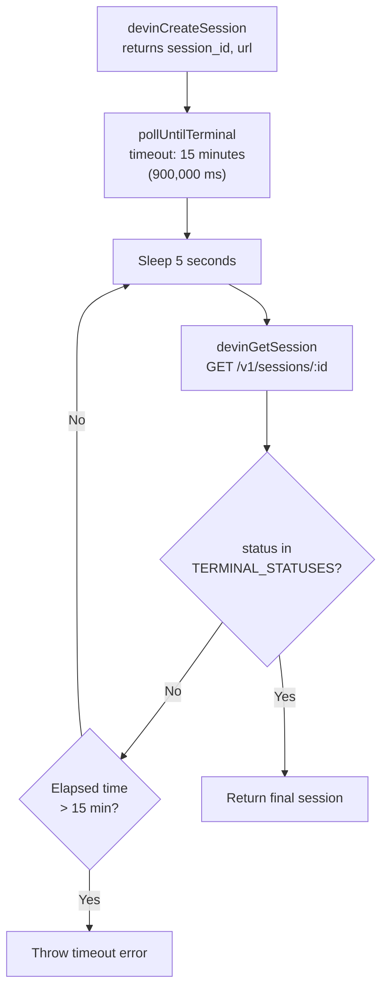
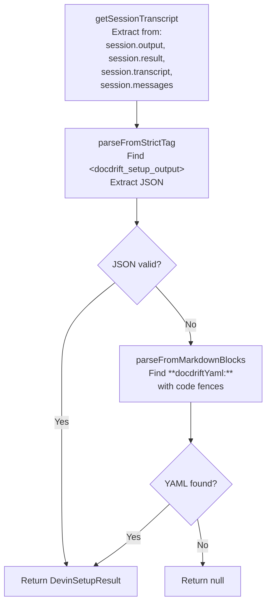
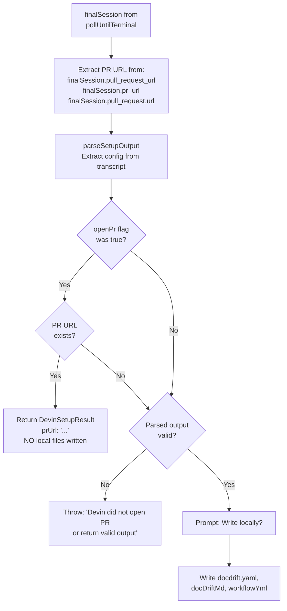
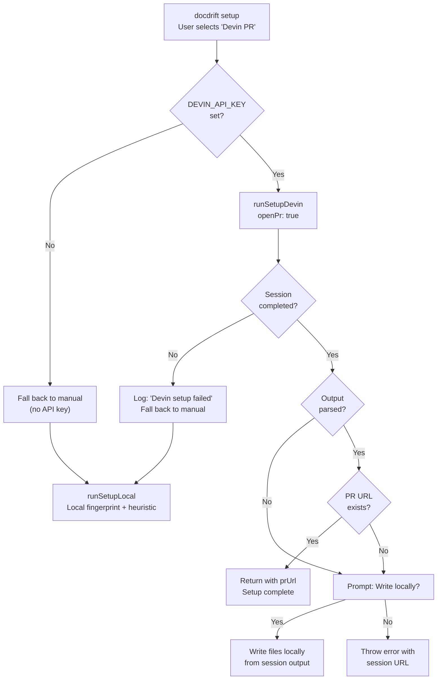

# Devin PR Setup Flow

<details>
<summary>Relevant source files</summary>

The following files were used as context for generating this wiki page:

- [docs/guides/setup.md](docs/guides/setup.md)
- [src/setup/devin-setup.ts](src/setup/devin-setup.ts)
- [src/setup/index.ts](src/setup/index.ts)
- [src/setup/setup-prompt.ts](src/setup/setup-prompt.ts)
- [test/setup-devin-pr.test.ts](test/setup-devin-pr.test.ts)

</details>


This document explains the Devin PR setup path, where the Devin AI agent analyzes the repository and creates a pull request containing the generated `docdrift.yaml` configuration and related files. For information about the manual setup path, see [Manual Setup Flow](#5.2). For general setup concepts, see [Setup Overview](#5.1).

The Devin PR flow delegates configuration generation entirely to an AI agent, eliminating the need for local file manipulation during setup. The user receives a PR URL and can merge the PR to obtain the configuration files.

## Prerequisites and Invocation

The Devin PR setup path requires two conditions:

1. **`DEVIN_API_KEY` environment variable**: Must contain a valid Devin API key
2. **Repository in Devin's Machine**: The repository must be added to Devin's workspace

The flow is triggered in two scenarios:
- User selects "Devin PR" mode in `docdrift setup` interactive prompt [src/setup/index.ts:14-32]()
- User runs `docdrift generate-yaml --open-pr` [docs/guides/setup.md:26]()

If `DEVIN_API_KEY` is not set when Devin PR mode is selected, the system automatically falls back to manual setup [src/setup/index.ts:44-47]().

**Sources:** [src/setup/index.ts:5-11](), [src/setup/index.ts:34-71](), [src/setup/devin-setup.ts:165-177]()

## High-Level Flow Architecture



The flow implements a fail-safe architecture where the absence of a PR does not block setup completion—the system falls back to writing files locally from the session output.

**Sources:** [src/setup/devin-setup.ts:165-289](), [src/setup/index.ts:54-70]()

## Session Creation and Attachment Upload

The setup process begins by uploading the JSON schema to Devin as context:



The schema file is located using multiple candidate paths to support both compiled (`dist/`) and source (`src/`) execution contexts [src/setup/devin-setup.ts:14-26]().

The session creation payload includes:
- **`prompt`**: Generated by `buildSetupPrompt` with instructions and attachment URLs
- **`unlisted: true`**: Session is private
- **`max_acu_limit: 2`**: Compute limit
- **`tags: ["docdrift", "setup"]`**: For filtering and organization
- **`metadata: { purpose: "docdrift-setup" }`**: Operational metadata

[src/setup/devin-setup.ts:191-205]()

**Sources:** [src/setup/devin-setup.ts:14-26](), [src/setup/devin-setup.ts:191-205](), [src/devin/v1.ts]() (referenced for API calls)

## Setup Prompt Generation

The `buildSetupPrompt` function constructs a structured prompt that instructs Devin on configuration generation:

| Prompt Section | Content | Purpose |
|----------------|---------|---------|
| **Task definition** | "You are Devin. Task: set up docdrift for this repository." | Establishes context |
| **Attachments** | Schema URLs with index labels | Provides specification reference |
| **Requirements** | 1. `docdrift.yaml` (version 2, docsite, specProviders)<br/>2. `.docdrift/DocDrift.md` (custom instructions)<br/>3. `.github/workflows/docdrift.yml` (CI workflow) | Defines expected outputs |
| **OpenAPI detection** | "If OpenAPI/swagger exists or an export script exists: Include specProviders" | Guides spec provider configuration |
| **PR creation** | "Create branch docdrift/setup from main, commit, push, open PR" (when `openPr: true`) | Controls file creation behavior |
| **Strict output** | XML-tagged JSON block with escape rules | Enables reliable parsing |

The prompt differentiates between two modes based on the `openPr` parameter [src/setup/setup-prompt.ts:38-50]():
- **`openPr: true`**: Instructs Devin to create files, commit, and open PR
- **`openPr: false`**: Instructs Devin to only emit the output block without creating files

**Sources:** [src/setup/setup-prompt.ts:34-98]()

## Strict Output Format

The prompt requires a specific output format to enable reliable extraction from the session transcript:

```
<docdrift_setup_output>
{"docdriftYaml":"# yaml...","docDriftMd":"# DocDrift...","workflowYml":"name: docdrift...","summary":"OpenAPI at..."}
</docdrift_setup_output>
```

This XML-tagged JSON block is defined by the constant `DOCDRIFT_SETUP_OUTPUT_TAG = "docdrift_setup_output"` [src/setup/setup-prompt.ts:8]().

**Rules enforced in the prompt:**
- Valid JSON only inside tags
- Newlines in YAML/workflow strings must be escaped as `\n`
- Double quotes must be escaped as `\"`
- Block must appear in final message even when PR is created

[src/setup/setup-prompt.ts:13-32]()

**Sources:** [src/setup/setup-prompt.ts:7-32](), [src/setup/setup-prompt.ts:14-32]()

## Polling and Session Lifecycle

After session creation, the system polls until a terminal status is reached:



Terminal statuses include: `finished`, `blocked`, `error`, `cancelled`, `done`, `complete`, `terminated` (as defined in the Devin client module, referenced by this flow).

The polling implementation is defined in the Devin v1 client [src/devin/v1.ts]() and invoked with `pollUntilTerminal(apiKey, session.session_id, 15 * 60_000)` [src/setup/devin-setup.ts:210]().

**Sources:** [src/setup/devin-setup.ts:207-210](), [src/devin/v1.ts]() (polling logic), Diagram 5 from context

## Output Parsing Strategy

The `parseSetupOutput` function extracts configuration from the terminal session using a two-tier strategy:



### Transcript Extraction

The `getSessionTranscript` function checks multiple locations in the session object [src/setup/devin-setup.ts:88-108]():
1. Top-level fields: `session.output`, `session.result`, `session.transcript`
2. Data field: `session.data.messages`
3. Events array: `session.events`
4. Message content fields: `content`, `text`, `message`, `body`

This defensive extraction handles API response variations across Devin API versions.

### Primary Parser: Strict Tag

`parseFromStrictTag` looks for the delimited block [src/setup/devin-setup.ts:111-133]():
```typescript
const openTag = `<${DOCDRIFT_SETUP_OUTPUT_TAG}>`;
const closeTag = `</${DOCDRIFT_SETUP_OUTPUT_TAG}>`;
// Extract JSON between tags and parse
```

Returns `null` if tags are missing or JSON is invalid.

### Fallback Parser: Markdown Blocks

`parseFromMarkdownBlocks` searches for markdown-formatted output [src/setup/devin-setup.ts:136-151]():
- **`**docdriftYaml:**` followed by `\`\`\`yaml ... \`\`\``**: Extracts YAML content
- **`**docDriftMd:**` followed by `\`\`\`markdown ... \`\`\``**: Extracts DocDrift.md
- **`**workflowYml:**` followed by `\`\`\`yaml ... \`\`\``**: Extracts workflow
- **`**summary:**` followed by text block**: Extracts summary (max 500 chars)

This fallback handles cases where the strict output block is malformed or absent.

**Sources:** [src/setup/devin-setup.ts:88-163](), [src/setup/setup-prompt.ts:7-8]()

## PR Detection and Return Logic

After polling completes, the system checks for PR creation:



The PR URL extraction checks three possible field locations to handle API response variations [src/setup/devin-setup.ts:211-214]().

### Critical Behavior: No Local Files When PR Exists

When `openPr: true` and a PR URL is found, the function **immediately returns without writing any local files** [src/setup/devin-setup.ts:218-226]():

```typescript
if (options.openPr && prUrl) {
  return {
    docdriftYaml: parsed?.docdriftYaml ?? "",
    docDriftMd: parsed?.docDriftMd,
    workflowYml: parsed?.workflowYml,
    summary: parsed?.summary ?? "Devin created PR with docdrift configuration.",
    sessionUrl: session.url,
    prUrl,
  };
}
```

This design ensures that the configuration exists only in the PR branch. Users must merge the PR and run `git pull` to obtain the files locally.

### Fallback: Write Locally

If `openPr: true` but no PR URL is returned, the system prompts the user [src/setup/devin-setup.ts:251-260]():
- Confirm: "Devin did not open a PR. Write config locally from session output?"
- If accepted: Writes files from parsed output
- If declined: Throws error with session URL for manual inspection

**Sources:** [src/setup/devin-setup.ts:210-227](), [src/setup/devin-setup.ts:251-288](), [test/setup-devin-pr.test.ts:32-54]()

## File Writing and Validation

When files are written locally (no PR created or user confirmed local write):

```mermaid
graph LR
    Parse["Parsed DevinSetupResult"]
    ValidateYaml["validateYamlContent<br/>Check YAML structure"]
    ValidCheck{"Pre-validation<br/>passed?"}
    WriteYaml["Write docdrift.yaml"]
    WriteMd["Write .docdrift/DocDrift.md<br/>(if docDriftMd present)"]
    WriteWorkflow["Write .github/workflows/<br/>docdrift.yml<br/>(if workflowYml present)"]
    AddSla["addSlaCheckWorkflow<br/>Add docdrift-sla-check.yml"]
    UpdateGitignore["ensureGitignore<br/>Add .docdrift/evidence/<br/>.docdrift/state.json"]
    Validate["validateGeneratedConfig<br/>Runtime validation"]

    Parse --> ValidateYaml
    ValidateYaml --> ValidCheck
    ValidCheck -->|No| ThrowError["Throw validation error<br/>with session URL"]
    ValidCheck -->|Yes| WriteYaml
    WriteYaml --> WriteMd
    WriteMd --> WriteWorkflow
    WriteWorkflow --> AddSla
    AddSla --> UpdateGitignore
    UpdateGitignore --> Validate
```



The validation occurs at two stages:
1. **Pre-validation**: `validateYamlContent` checks YAML structure before writing [src/setup/devin-setup.ts:241-249]()
2. **Post-validation**: `validateGeneratedConfig` performs full runtime validation after writing [src/setup/devin-setup.ts:283-286]()

If either validation fails, an error is thrown with the session URL for debugging.

**Sources:** [src/setup/devin-setup.ts:241-286](), [src/setup/devin-setup.ts:265-281]()

## Post-Setup User Actions

After a successful Devin PR setup, the user is presented with next steps [src/setup/index.ts:73-103]():

### When PR is Created

```
docdrift setup complete (PR created)

  Session: https://devin.ai/sess-xxxxx
  PR: https://github.com/org/repo/pull/123

Summary: OpenAPI at apps/api/openapi.json...

Checkout branch to review/edit before merging? (y/N)
```

If the user confirms checkout, the system attempts:
1. `git fetch origin docdrift/setup`
2. `git checkout docdrift/setup`

Next steps displayed:
1. Merge the PR in GitHub (or edit on branch `docdrift/setup`, push, then merge)
2. Run: `git pull`
3. Run: `npx @devinnn/docdrift validate`
4. Add `DEVIN_API_KEY` to repo secrets (Settings > Secrets > Actions)
5. Run: `npx @devinnn/docdrift detect` and `npx @devinnn/docdrift run`

[src/setup/index.ts:75-103]()

### When Files Written Locally

```
docdrift setup complete

  docdrift.yaml     written and validated
  .docdrift/DocDrift.md   created
  .github/workflows/docdrift.yml         added
  .github/workflows/docdrift-sla-check.yml  added
  .gitignore        updated

Summary: Generated from Devin session.

Next steps:
  1. Run: npx @devinnn/docdrift validate   — verify config
  2. Run: npx @devinnn/docdrift detect     — check for drift
```

[src/setup/index.ts:106-138]()

**Sources:** [src/setup/index.ts:73-103](), [src/setup/index.ts:106-138]()

## Error Handling and Fallback Chain

The setup system implements a three-tier fallback strategy:



**Fallback Triggers:**
1. **Missing `DEVIN_API_KEY`**: Immediate fallback to manual [src/setup/index.ts:44-52]()
2. **Devin session failure**: Catch exception, log error, fallback to manual [src/setup/index.ts:54-70]()
3. **No PR and user declines local write**: Throw error with session URL [src/setup/devin-setup.ts:251-259]()

The `usedLocalFallback` flag tracks whether fallback occurred, which affects the next steps messaging [src/setup/index.ts:41-42,121-126]().

**Sources:** [src/setup/index.ts:34-71](), [src/setup/devin-setup.ts:251-260]()

## DevinSetupResult Structure

The return type from both `runSetupDevin` and `runSetupLocal`:

```typescript
interface DevinSetupResult {
  docdriftYaml: string;         // YAML content
  docDriftMd?: string;          // DocDrift.md content (optional)
  workflowYml?: string;         // GitHub workflow content (optional)
  summary: string;              // Human-readable summary
  sessionUrl: string;           // Devin session URL
  prUrl?: string;               // PR URL (only when PR created)
}
```

**Key semantics:**
- **`prUrl` present**: Files exist in PR branch only, not written locally
- **`prUrl` absent**: Files were written to local filesystem
- **`sessionUrl` empty**: Manual setup was used (no Devin session)

[src/setup/devin-setup.ts:28-36]()

**Sources:** [src/setup/devin-setup.ts:28-36](), [src/setup/index.ts:73-74]()

---