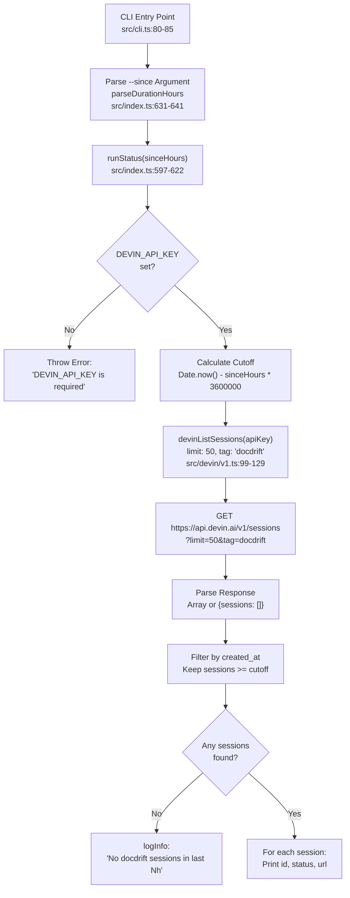
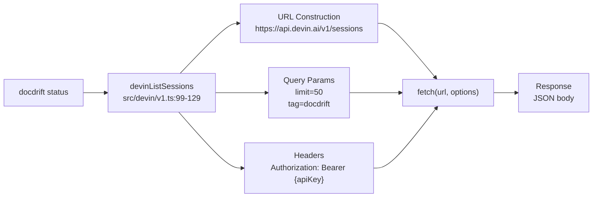
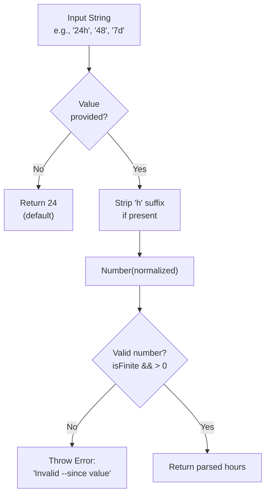
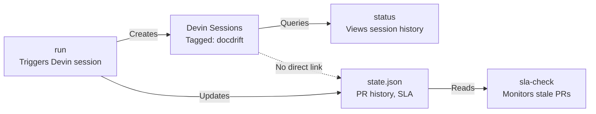

# status

<details>
<summary>Relevant source files</summary>

The following files were used as context for generating this wiki page:

- [docdrift-yml.md](docdrift-yml.md)
- [src/cli.ts](src/cli.ts)
- [src/devin/v1.ts](src/devin/v1.ts)
- [src/index.ts](src/index.ts)

</details>


The `status` command queries the Devin API for recent docdrift sessions and displays their current state. This provides visibility into session history, allowing users to monitor ongoing and completed remediation runs without navigating to the Devin web interface.

For information about triggering new remediation sessions, see [run](#3.4). For information about managing stale documentation PRs, see [sla-check](#3.6).

---

## Purpose and Scope

The `status` command serves as a quick inspection tool for Devin session activity. It answers questions like:
- What docdrift sessions have run recently?
- What is the current status of each session?
- Where can I view the session details in the Devin UI?

This command does not trigger new sessions, modify state, or interact with GitHub. It is read-only and safe to run at any time.

---

## Command Syntax

```bash
docdrift status [--since <duration>]
```

### Arguments

| Argument | Required | Default | Description |
|----------|----------|---------|-------------|
| `--since` | No | `24h` | Time window for session history. Accepts format like `24h`, `48h`, `7d`, or plain numbers interpreted as hours. |

### Environment Variables

| Variable | Required | Description |
|----------|----------|-------------|
| `DEVIN_API_KEY` | **Yes** | Devin API authentication token. Command fails immediately if not set. |

### Examples

```bash
# Show sessions from last 24 hours (default)
docdrift status

# Show sessions from last 48 hours
docdrift status --since 48h

# Show sessions from last 7 days (168 hours)
docdrift status --since 168h
```

**Sources:** [src/cli.ts:80-85](), [src/index.ts:597-622]()

---

## Output Format

The command prints tab-delimited output with three columns:

```
<session_id>    <status>    <url>
```

Each line represents one session. The format is designed for easy parsing by shell scripts or CI systems.

### Example Output

```
sess_abc123def456    finished    https://preview.devin.ai/devin/sess_abc123def456
sess_xyz789ghi012    blocked     https://preview.devin.ai/devin/sess_xyz789ghi012
sess_mno345pqr678    running     https://preview.devin.ai/devin/sess_mno345pqr678
```

### Column Definitions

| Column | Description | Possible Values |
|--------|-------------|-----------------|
| `session_id` | Unique Devin session identifier | Format: `sess_*` or internal ID |
| `status` | Current session status enum | `finished`, `blocked`, `running`, `error`, `cancelled`, `done`, `complete`, `terminated` |
| `url` | Direct link to session in Devin UI | Format: `https://preview.devin.ai/devin/<session_id>` |

### Empty Output

When no sessions match the time filter, the command prints:

```
No docdrift sessions in last <N>h
```

**Sources:** [src/index.ts:597-622]()

---

## Implementation Flow



**Sources:** [src/cli.ts:80-85](), [src/index.ts:597-622](), [src/index.ts:631-641](), [src/devin/v1.ts:99-129]()

---

## Devin API Integration

The `status` command interacts with the Devin v1 API through the `devinListSessions` function.

### API Request



### Request Details

| Parameter | Value | Purpose |
|-----------|-------|---------|
| HTTP Method | `GET` | Read-only query |
| Endpoint | `/v1/sessions` | List sessions API |
| Query: `limit` | `50` | Maximum sessions to retrieve |
| Query: `tag` | `docdrift` | Filter to docdrift-tagged sessions only |
| Header: `Authorization` | `Bearer {DEVIN_API_KEY}` | API authentication |

### Response Handling

The function handles two response formats for backward compatibility:

```typescript
// Format 1: Direct array
["session1", "session2", ...]

// Format 2: Wrapped in sessions property
{
  "sessions": ["session1", "session2", ...]
}
```

The normalization logic is at [src/devin/v1.ts:119-128]():

```typescript
if (Array.isArray(parsed)) {
  return parsed as DevinSession[];
}
if (parsed && typeof parsed === "object" && Array.isArray((parsed as any).sessions)) {
  return (parsed as any).sessions as DevinSession[];
}
return [];
```

**Sources:** [src/devin/v1.ts:99-129]()

---

## DevinSession Data Structure

The `DevinSession` interface defines the shape of session objects returned by the API:

### Core Fields

| Field | Type | Description |
|-------|------|-------------|
| `session_id` | `string?` | Primary session identifier |
| `id` | `string?` | Alternate identifier (fallback) |
| `url` | `string?` | Link to session in Devin UI |
| `status` | `string?` | Human-readable status |
| `status_enum` | `string?` | Canonical status enum (preferred) |
| `created_at` | `string?` | ISO 8601 timestamp of session creation |

### Extended Fields

| Field | Type | Description |
|-------|------|-------------|
| `structured_output` | `unknown` | Parsed structured output from session |
| `data` | `Record<string, unknown>?` | Additional session metadata |
| `pull_request_url` | `string?` | URL of opened PR (if any) |
| `pr_url` | `string?` | Alternate PR URL field |
| `messages` | `DevinSessionMessage[]?` | Chat history (for fallback parsing) |

The `status` command only uses the core fields for display. Extended fields are used by other subsystems like [run](#3.4) for outcome determination.

**Sources:** [src/devin/v1.ts:4-29]()

---

## Duration Parsing

The `parseDurationHours` function converts user-friendly duration strings to numeric hours:



### Supported Formats

| Format | Interpreted As | Example |
|--------|----------------|---------|
| `Nh` | N hours | `24h` → 24 hours |
| `N` | N hours | `48` → 48 hours |
| Empty/undefined | 24 hours (default) | None provided → 24 hours |

### Invalid Formats

The following inputs cause an error:
- Non-numeric values: `abc`, `yesterday`
- Zero or negative: `0h`, `-5`
- Special values: `NaN`, `Infinity`

**Sources:** [src/index.ts:631-641]()

---

## Time Filtering Logic

Sessions are filtered by comparing their `created_at` timestamp to the calculated cutoff:

```typescript
// Calculate cutoff timestamp (milliseconds since epoch)
const cutoff = Date.now() - sinceHours * 60 * 60 * 1000;

// Filter sessions
const filtered = sessions.filter((session: any) => {
  const createdAt = session?.created_at ? Date.parse(String(session.created_at)) : Date.now();
  return Number.isFinite(createdAt) ? createdAt >= cutoff : true;
});
```

### Filtering Behavior

| Condition | Included in Results? | Rationale |
|-----------|---------------------|-----------|
| `created_at` missing | **Yes** (uses `Date.now()`) | Assume recent session |
| `created_at` unparseable | **Yes** | Fail open to avoid hiding sessions |
| `created_at >= cutoff` | **Yes** | Within time window |
| `created_at < cutoff` | **No** | Outside time window |

This fail-open design ensures sessions are visible even if API response format changes.

**Sources:** [src/index.ts:606-609]()

---

## Session Status Values

The `status` command displays the raw status string from the Devin API. Common values include:

### Active States
- `running` — Session is currently executing
- `active` — Session is active (alternate form)

### Terminal States
These are checked in [pollUntilTerminal](#8.3) but also appear in status output:
- `finished` — Session completed successfully
- `done`, `complete`, `completed`, `success` — Alternate completion statuses
- `blocked` — Session requires human input
- `error` — Session encountered an error
- `cancelled` — Session was cancelled by user
- `terminated` — Session was terminated (timeout, resource limits)

### Status Enum vs Status

The API may return both `status_enum` and `status` fields. The code prefers `status_enum`:

```typescript
const status = String(session.status_enum ?? session.status ?? "unknown");
```

This ensures consistent status values even when the API evolves its response format.

**Sources:** [src/index.ts:618](), [src/devin/v1.ts:131-141]()

---

## Usage Patterns

### CI/CD Integration

Monitor session outcomes in GitHub Actions:

```yaml
- name: Check recent sessions
  run: |
    RESULT=$(docdrift status --since 1h)
    echo "$RESULT"
    if echo "$RESULT" | grep -q "blocked"; then
      echo "::warning::Docdrift session blocked, requires attention"
    fi
  env:
    DEVIN_API_KEY: ${{ secrets.DEVIN_API_KEY }}
```

### Local Development

Quick check after triggering a run:

```bash
# Trigger remediation
docdrift run

# Check status after a few minutes
docdrift status --since 1h
```

### Debugging

View extended session history:

```bash
# Last 7 days
docdrift status --since 168h

# Parse specific fields
docdrift status | awk '{print $1, $2}'
```

**Sources:** [src/cli.ts:80-85]()

---

## Error Handling

The command may fail in the following scenarios:

### Missing API Key

```
Error: DEVIN_API_KEY is required for status command
```

**Cause:** `DEVIN_API_KEY` environment variable is not set.

**Resolution:** Set the environment variable:
```bash
export DEVIN_API_KEY=your_api_key_here
docdrift status
```

### API Request Failure

If the Devin API request fails, the `ensureOk` function throws an error with the HTTP status and response body. Common causes:
- Invalid API key (401 Unauthorized)
- API rate limiting (429 Too Many Requests)
- Network connectivity issues

**Sources:** [src/index.ts:598-601](), [src/devin/v1.ts:31-35]()

---

## Relationship to Other Commands



### Comparison

| Command | Reads Sessions | Writes Sessions | Reads State | Writes State |
|---------|----------------|-----------------|-------------|--------------|
| `run` | No | **Yes** (creates) | Yes | **Yes** |
| `status` | **Yes** | No | No | No |
| `sla-check` | No | No | **Yes** | **Yes** |

The `status` command is purely observational. It does not modify session state, GitHub state, or local state files.

**Sources:** [src/index.ts:244-530](), [src/index.ts:597-622](), [src/index.ts:542-595]()

---

## Tag Filtering

All docdrift sessions are tagged with `"docdrift"` by default. The `status` command filters by this tag to exclude unrelated Devin sessions:

### Tag Configuration

Tags are configured in `docdrift.yaml`:

```yaml
devin:
  tags:
    - docdrift
    - custom-tag
```

The `run` command applies these tags when creating sessions ([src/index.ts:115]()):

```typescript
tags: [...new Set([...(input.config.devin.tags ?? []), "docdrift", input.item.docArea])],
```

### Viewing Tagged Sessions

The `status` command always filters by the `"docdrift"` tag, regardless of additional custom tags in the config. This ensures all docdrift sessions are visible.

To view sessions with specific tags, use the Devin web interface or extend the command with additional filters.

**Sources:** [src/index.ts:603](), [src/index.ts:115]()

---

## Limitations

### Session Limit

The command retrieves a maximum of 50 sessions per API call. For high-volume usage, older sessions may not appear if more than 50 sessions exist within the time window.

**Workaround:** Use shorter time windows (`--since 12h`) or query the Devin API directly for pagination.

### No Session Details

The command only displays session ID, status, and URL. For detailed information (structured output, PR URLs, messages), you must:
1. Visit the session URL in the Devin UI, or
2. Inspect `.docdrift/run-output.json` from a recent run, or
3. Use `devinGetSession` directly in custom scripts

### Tag Hardcoding

The command always filters by the `"docdrift"` tag. It does not support querying sessions with custom tags only.

**Sources:** [src/devin/v1.ts:99-129](), [src/index.ts:603]()

---

## Related Files

| File | Purpose |
|------|---------|
| [src/index.ts:597-622]() | `runStatus` function implementation |
| [src/cli.ts:80-85]() | CLI integration and argument parsing |
| [src/devin/v1.ts:99-129]() | `devinListSessions` API client |
| [src/devin/v1.ts:4-29]() | `DevinSession` type definition |
| [src/index.ts:631-641]() | `parseDurationHours` utility |

---