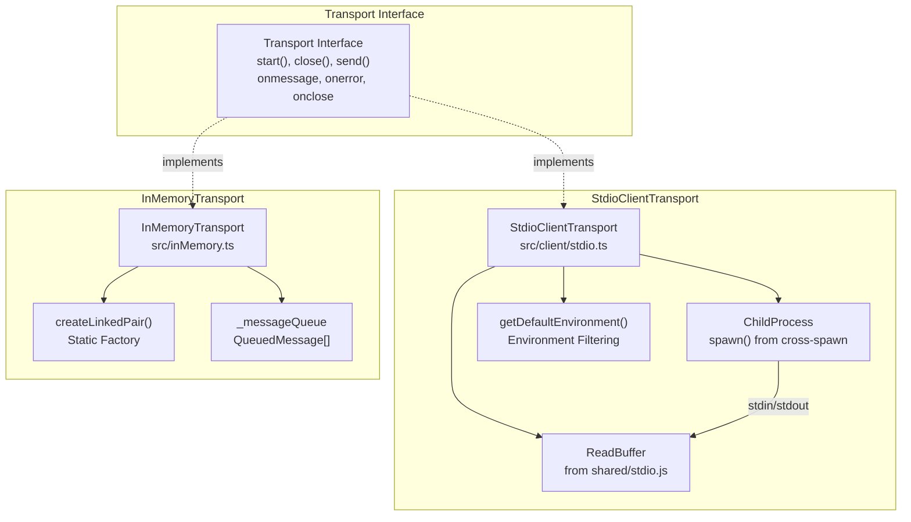
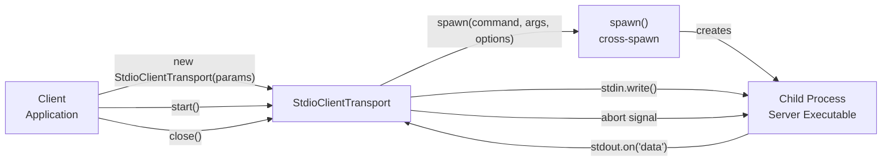
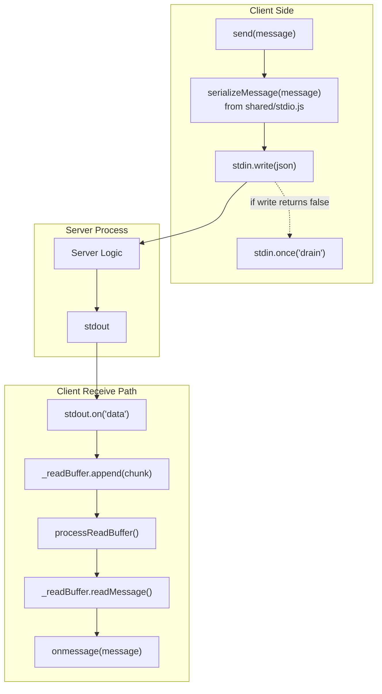
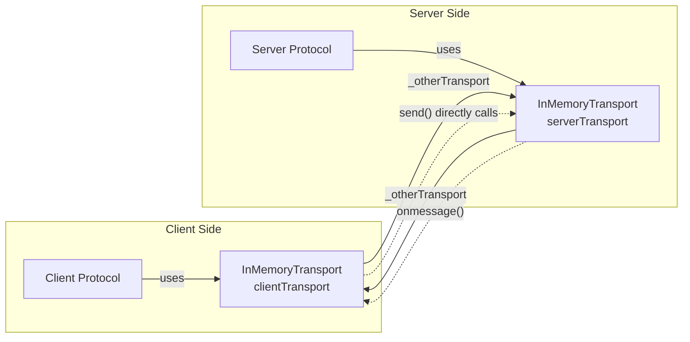

# Stdio and In-Memory Transports

<details>
<summary>Relevant source files</summary>

The following files were used as context for generating this wiki page:

- [.changeset/oauth-error-http200.md](.changeset/oauth-error-http200.md)
- [packages/client/src/client/auth.ts](packages/client/src/client/auth.ts)
- [packages/client/src/client/middleware.ts](packages/client/src/client/middleware.ts)
- [packages/client/src/client/sse.ts](packages/client/src/client/sse.ts)
- [packages/client/src/client/stdio.ts](packages/client/src/client/stdio.ts)
- [packages/client/src/client/streamableHttp.ts](packages/client/src/client/streamableHttp.ts)
- [packages/client/test/client/auth.test.ts](packages/client/test/client/auth.test.ts)
- [test/integration/test/client/client.test.ts](test/integration/test/client/client.test.ts)
- [test/integration/test/issues/test_1342OauthErrorHttp200.test.ts](test/integration/test/issues/test_1342OauthErrorHttp200.test.ts)
- [test/integration/test/server.test.ts](test/integration/test/server.test.ts)
- [test/integration/test/server/mcp.test.ts](test/integration/test/server/mcp.test.ts)
- [test/integration/test/taskLifecycle.test.ts](test/integration/test/taskLifecycle.test.ts)

</details>


## Purpose and Scope

This document covers two specialized transport implementations in the Model Context Protocol TypeScript SDK: `StdioClientTransport` for local process communication and `InMemoryTransport` for in-process messaging. These transports enable MCP clients to communicate with servers through non-network channels, supporting use cases from IDE integrations to unit testing.

For information about HTTP-based transports, see [Streamable HTTP Client Transport](#4.2) and [Streamable HTTP Server Transport](#3.5). For SSE-based communication, see [SSE Client Transport](#4.3). For the general transport abstraction, see [Transport Interface and Contract](#6.1).

## Transport Interface Implementation

Both `StdioClientTransport` and `InMemoryTransport` implement the standard `Transport` interface, providing the same lifecycle methods and callbacks used by all transport implementations in the SDK.



**Diagram: Transport Implementation Architecture**

Both transports provide the same interface to the `Client` and `Server` protocol classes, allowing applications to switch between local process communication and in-memory messaging without changing protocol-level code.

Sources: [src/client/stdio.ts:92-232](), [src/inMemory.ts:13-63](), [src/shared/transport.ts]()

## StdioClientTransport

The `StdioClientTransport` class enables MCP clients to communicate with servers running as local child processes. This transport spawns a server process and exchanges JSON-RPC messages over the process's stdin and stdout streams.

### Process Spawning and Lifecycle

The transport uses the `cross-spawn` library for cross-platform process spawning, with specific configurations for security and reliability.



**Diagram: Process Spawning Flow**

The `StdioServerParameters` interface [src/client/stdio.ts:9-40]() defines the configuration for spawning a server process:

| Parameter | Type | Description |
|-----------|------|-------------|
| `command` | `string` | The executable to run (required) |
| `args` | `string[]` | Command line arguments (optional) |
| `env` | `Record<string, string>` | Environment variables (optional, defaults to filtered set) |
| `stderr` | `IOType \| Stream \| number` | stderr handling (default: "inherit") |
| `cwd` | `string` | Working directory (optional, defaults to current) |

The `start()` method [src/client/stdio.ts:113-171]() spawns the process with these options:
- `shell: false` for security (prevents shell injection)
- `windowsHide: true` in Electron environments to prevent console windows
- `signal: this._abortController.signal` for clean shutdown via abort signal
- `stdio: ['pipe', 'pipe', stderr]` to control stdin/stdout/stderr

Sources: [src/client/stdio.ts:9-40](), [src/client/stdio.ts:113-171]()

### Environment Variable Filtering

The transport implements security-conscious environment variable filtering to prevent accidental leakage of sensitive credentials or shell functions to spawned processes.

The `DEFAULT_INHERITED_ENV_VARS` constant [src/client/stdio.ts:45-62]() defines platform-specific safe environment variables:

**Windows:**
- `APPDATA`, `HOMEDRIVE`, `HOMEPATH`, `LOCALAPPDATA`
- `PATH`, `PROCESSOR_ARCHITECTURE`
- `SYSTEMDRIVE`, `SYSTEMROOT`, `TEMP`
- `USERNAME`, `USERPROFILE`, `PROGRAMFILES`

**Unix/Linux/macOS:**
- `HOME`, `LOGNAME`, `PATH`, `SHELL`, `TERM`, `USER`

The `getDefaultEnvironment()` function [src/client/stdio.ts:67-85]() builds the default environment by:
1. Iterating through `DEFAULT_INHERITED_ENV_VARS`
2. Reading values from `process.env`
3. Skipping undefined values
4. **Security check**: Skipping values starting with `()` to prevent bash function injection [src/client/stdio.ts:76-79]()

The spawn call merges the default environment with user-provided environment variables [src/client/stdio.ts:123-126]():

```typescript
env: {
    ...getDefaultEnvironment(),
    ...this._serverParams.env
}
```

This ensures servers receive necessary system variables while preventing unintended credential leakage.

Sources: [src/client/stdio.ts:45-85](), [src/client/stdio.ts:123-126]()

### Message Communication Protocol

The transport implements bidirectional message passing through stdin/stdout with proper buffering and error handling.



**Diagram: Message Communication Flow**

**Sending Messages:**

The `send()` method [src/client/stdio.ts:218-231]() handles message transmission:
1. Serializes the message using `serializeMessage()` from [src/shared/stdio.js]()
2. Writes to `stdin` of the child process
3. If `write()` returns `false` (buffer full), waits for the `drain` event before resolving
4. Throws "Not connected" error if `stdin` is unavailable

**Receiving Messages:**

The receive path [src/client/stdio.ts:158-165](), [src/client/stdio.ts:197-210]() processes incoming data:
1. `stdout.on('data')` event appends chunks to `_readBuffer` (a `ReadBuffer` instance)
2. `processReadBuffer()` attempts to read complete JSON-RPC messages
3. `_readBuffer.readMessage()` parses newline-delimited JSON
4. Successfully parsed messages trigger `onmessage(message)` callback
5. Parse errors trigger `onerror(error)` callback

The `ReadBuffer` class handles partial messages across multiple data chunks, ensuring messages are only dispatched when complete.

Sources: [src/client/stdio.ts:158-165](), [src/client/stdio.ts:197-210](), [src/client/stdio.ts:218-231]()

### stderr Handling and Diagnostics

The transport provides flexible stderr handling through the `stderr` parameter in `StdioServerParameters`.

| stderr Value | Behavior |
|--------------|----------|
| `"inherit"` (default) | Server stderr printed to parent process stderr |
| `"ignore"` | Server stderr discarded |
| `"pipe"` or `"overlapped"` | Server stderr captured, accessible via `stderr` property |
| Stream object | Server stderr written to custom stream |
| File descriptor number | Server stderr written to file descriptor |

When stderr piping is requested, the transport creates a `PassThrough` stream immediately in the constructor [src/client/stdio.ts:105-107](), allowing callers to attach listeners before `start()` is called. This prevents loss of early error messages.

The `stderr` property [src/client/stdio.ts:180-186]() returns:
- The `PassThrough` stream if piping was requested
- The underlying `process.stderr` stream otherwise
- `null` if the process hasn't started or stderr is not piped

The `pid` property [src/client/stdio.ts:193-195]() exposes the child process ID for diagnostics and process management.

Sources: [src/client/stdio.ts:105-107](), [src/client/stdio.ts:180-195]()

### Error Handling and Cleanup

The transport handles various error scenarios and provides clean shutdown:

**Error Events:**
- `process.on('error')` [src/client/stdio.ts:134-143](): Handles spawn errors, filtering out expected `AbortError` from `close()` calls
- `stdin.on('error')` [src/client/stdio.ts:154-156](): Handles stdin write errors
- `stdout.on('error')` [src/client/stdio.ts:163-165](): Handles stdout read errors

**Clean Shutdown:**

The `close()` method [src/client/stdio.ts:212-216]() performs cleanup:
1. Aborts the spawn operation via `_abortController.abort()`
2. Clears the process reference
3. Clears the read buffer to prevent memory leaks

The abort signal causes the process to receive a termination signal, triggering the `close` event [src/client/stdio.ts:149-152]() which invokes the `onclose()` callback.

Sources: [src/client/stdio.ts:134-165](), [src/client/stdio.ts:212-216]()

## InMemoryTransport

The `InMemoryTransport` class enables MCP clients and servers to communicate within the same process without network or subprocess overhead. This is primarily used for testing and embedded scenarios where a server is embedded directly in the client application.

### Linked Pair Pattern

`InMemoryTransport` uses a linked pair pattern where two transport instances directly reference each other for bidirectional communication.



**Diagram: Linked Transport Architecture**

The `createLinkedPair()` static factory method [src/inMemory.ts:25-31]() creates and links two transport instances:

```typescript
static createLinkedPair(): [InMemoryTransport, InMemoryTransport] {
    const clientTransport = new InMemoryTransport();
    const serverTransport = new InMemoryTransport();
    clientTransport._otherTransport = serverTransport;
    serverTransport._otherTransport = clientTransport;
    return [clientTransport, serverTransport];
}
```

One transport should be passed to a `Client` and the other to a `Server` or `McpServer`.

Sources: [src/inMemory.ts:25-31]()

### Direct Message Passing

`InMemoryTransport` implements synchronous message delivery with optional queueing for messages sent before the transport is started.

The `send()` method [src/inMemory.ts:52-62]() implements direct message passing:

```typescript
async send(message: JSONRPCMessage, options?: { relatedRequestId?: RequestId; authInfo?: AuthInfo }): Promise<void> {
    if (!this._otherTransport) {
        throw new Error('Not connected');
    }

    if (this._otherTransport.onmessage) {
        this._otherTransport.onmessage(message, { authInfo: options?.authInfo });
    } else {
        this._otherTransport._messageQueue.push({ message, extra: { authInfo: options?.authInfo } });
    }
}
```

**Message Flow:**
1. If the receiving transport has an `onmessage` handler attached, the message is delivered immediately
2. If no handler is attached yet (before `start()` called), the message is queued in `_messageQueue`
3. When `start()` is called, queued messages are processed [src/inMemory.ts:33-39]()

This queueing mechanism ensures messages are never lost, even if sent before the receiving transport is fully initialized.

Sources: [src/inMemory.ts:33-39](), [src/inMemory.ts:52-62]()

### Authentication Information Support

Unlike other transports, `InMemoryTransport` supports passing authentication information directly with each message through the `MessageExtraInfo` structure.

The `send()` method accepts an optional `authInfo` parameter [src/inMemory.ts:52]():

```typescript
send(message: JSONRPCMessage, options?: { relatedRequestId?: RequestId; authInfo?: AuthInfo })
```

The `onmessage` callback receives auth info as the second parameter [src/inMemory.ts:19]():

```typescript
onmessage?: (message: JSONRPCMessage, extra?: { authInfo?: AuthInfo }) => void;
```

The `QueuedMessage` interface [src/inMemory.ts:5-8]() preserves auth info for queued messages:

```typescript
interface QueuedMessage {
    message: JSONRPCMessage;
    extra?: { authInfo?: AuthInfo };
}
```

This design enables testing of authentication scenarios without requiring actual OAuth flows, as demonstrated in the test suite [src/inMemory.test.ts:39-63]().

Sources: [src/inMemory.ts:5-8](), [src/inMemory.ts:19](), [src/inMemory.ts:52-62]()

### Lifecycle Management

`InMemoryTransport` implements a simple lifecycle with automatic cleanup of linked pairs.

**Start:**

The `start()` method [src/inMemory.ts:33-39]() processes any queued messages:

```typescript
async start(): Promise<void> {
    // Process any messages that were queued before start was called
    while (this._messageQueue.length > 0) {
        const queuedMessage = this._messageQueue.shift()!;
        this.onmessage?.(queuedMessage.message, queuedMessage.extra);
    }
}
```

**Close:**

The `close()` method [src/inMemory.ts:41-46]() implements cascading cleanup:

```typescript
async close(): Promise<void> {
    const other = this._otherTransport;
    this._otherTransport = undefined;
    await other?.close();
    this.onclose?.();
}
```

When one transport in a pair is closed:
1. It clears its reference to the other transport
2. It recursively calls `close()` on the other transport
3. Both transports invoke their `onclose()` callbacks

This ensures that closing either transport cleanly tears down the entire linked pair, preventing memory leaks or dangling references.

Sources: [src/inMemory.ts:33-46]()

## Transport Comparison

The following table compares the characteristics and use cases of stdio and in-memory transports:

| Aspect | StdioClientTransport | InMemoryTransport |
|--------|---------------------|-------------------|
| **Communication** | Child process stdin/stdout | Direct in-process function calls |
| **Latency** | Low (process IPC) | Minimal (in-memory) |
| **Isolation** | Full process isolation | No isolation |
| **Server Lifecycle** | Spawned and managed by transport | Must be created separately |
| **Platform** | Node.js only | All JavaScript environments |
| **Primary Use Case** | IDE integrations, CLI tools | Unit testing, embedded servers |
| **Auth Support** | Via HTTP transport (not stdio) | Direct auth info passing |
| **Environment Control** | Filtered environment variables | Shared process environment |
| **Error Handling** | Process crashes detectable | Shared error boundary |
| **Debugging** | Separate process (easier to debug) | Single process (simpler setup) |

### Usage Patterns

**StdioClientTransport Usage:**

```typescript
// Typical IDE integration pattern
const transport = new StdioClientTransport({
    command: '/path/to/mcp-server',
    args: ['--config', 'config.json'],
    stderr: 'pipe'  // Capture server logs
});

// Attach stderr listener for diagnostics
transport.stderr?.on('data', (chunk) => {
    console.error('Server:', chunk.toString());
});

const client = new Client({
    name: 'my-client',
    version: '1.0.0'
}, {
    capabilities: {}
});

await client.connect(transport);
```

**InMemoryTransport Usage:**

```typescript
// Testing pattern
const [clientTransport, serverTransport] = InMemoryTransport.createLinkedPair();

const server = new McpServer({
    name: 'test-server',
    version: '1.0.0'
}, {
    capabilities: {
        tools: {}
    }
});

const client = new Client({
    name: 'test-client',
    version: '1.0.0'
}, {
    capabilities: {}
});

await server.connect(serverTransport);
await client.connect(clientTransport);

// Now client and server communicate in-process
```

Sources: [src/client/stdio.ts:103-133](), [src/inMemory.ts:25-31](), [src/client/stdio.test.ts](), [src/inMemory.test.ts]()

## Security Considerations

### StdioClientTransport Security

1. **Shell Injection Prevention**: Spawn uses `shell: false` [src/client/stdio.ts:128]() to prevent shell command injection
2. **Environment Filtering**: `getDefaultEnvironment()` filters to safe variables and blocks bash functions [src/client/stdio.ts:67-85]()
3. **Process Isolation**: Server runs in separate process with no access to parent's memory
4. **Working Directory Control**: Optional `cwd` parameter restricts file system access [src/client/stdio.ts:131]()

### InMemoryTransport Security

1. **No Network Exposure**: All communication stays in-process
2. **Shared Security Context**: Server and client share the same security boundary
3. **Auth Info Testing**: Allows testing authentication logic without real OAuth [src/inMemory.ts:52]()
4. **Memory Isolation**: None - both sides can access shared objects

For production deployments requiring network separation or stronger isolation guarantees, use HTTP-based transports. See [Streamable HTTP Client Transport](#4.2) and [Transport Comparison and Selection](#6.2).

Sources: [src/client/stdio.ts:67-85](), [src/client/stdio.ts:128-131](), [src/inMemory.ts:52-62]()

---