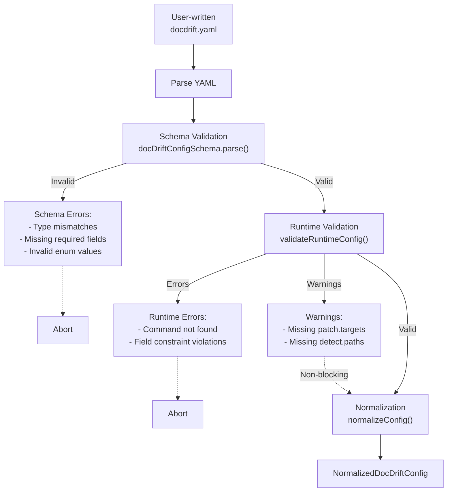
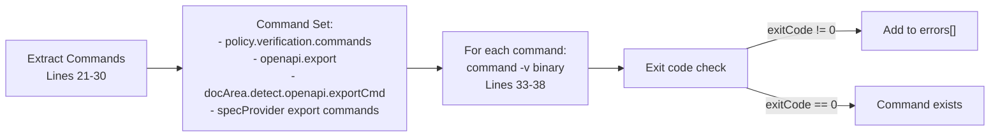
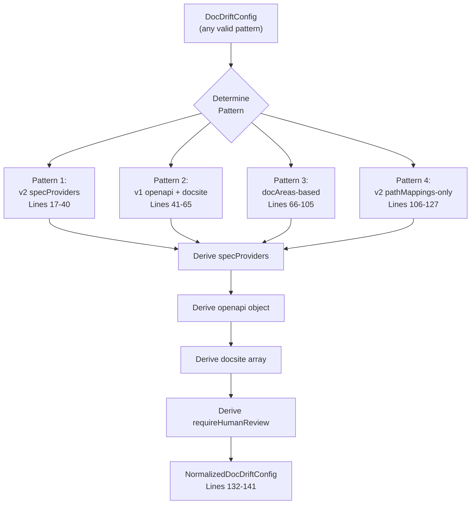
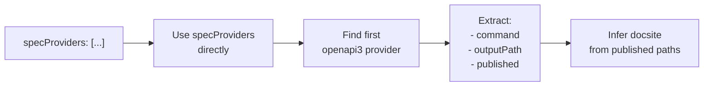
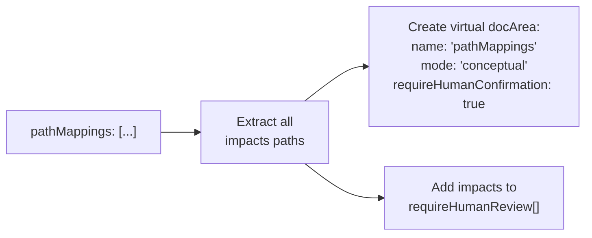
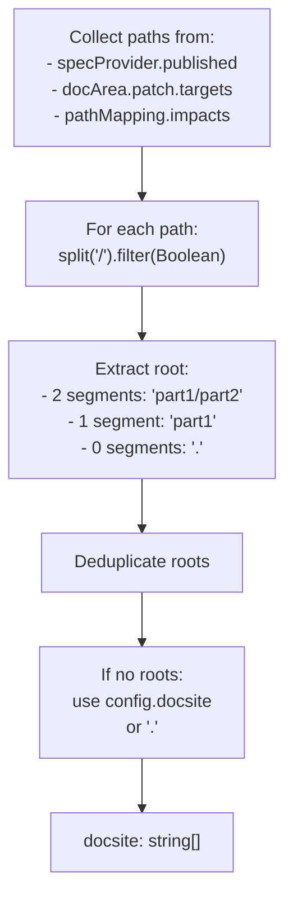
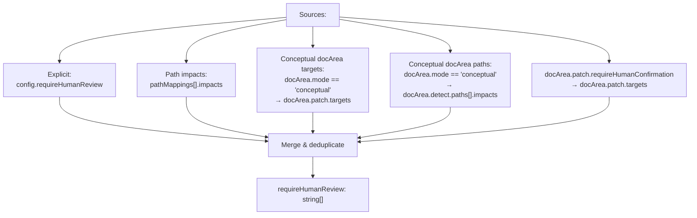

# Validation and Normalization

<details>
<summary>Relevant source files</summary>

The following files were used as context for generating this wiki page:

- [.github/workflows/devin-doc-drift.yml](.github/workflows/devin-doc-drift.yml)
- [docdrift.schema.json](docdrift.schema.json)
- [src/config/normalize.ts](src/config/normalize.ts)
- [src/config/schema.ts](src/config/schema.ts)
- [src/config/validate.ts](src/config/validate.ts)
- [src/detect/index.ts](src/detect/index.ts)
- [src/devin/prompts.ts](src/devin/prompts.ts)
- [src/github/client.ts](src/github/client.ts)
- [test/config.test.ts](test/config.test.ts)

</details>


This page explains how docdrift configurations are validated and normalized into a uniform runtime structure. The system supports four distinct configuration patterns, all of which are transformed into a single `NormalizedDocDriftConfig` type for consumption by detection, policy, and remediation subsystems.

For comprehensive field-level documentation, see [Configuration File Reference](#4.3). For spec provider configuration details, see [Spec Providers](#4.4).

## Purpose and Scope

The validation and normalization subsystem ensures configuration correctness through two stages:

1. **Schema Validation**: Structural validation using Zod schemas ([src/config/schema.ts:1-170]())
2. **Runtime Validation**: Executable constraint validation ([src/config/validate.ts:1-52]())

After validation, the `normalizeConfig` function ([src/config/normalize.ts:8-142]()) transforms any valid configuration pattern into a unified `NormalizedDocDriftConfig` structure. This insulates all runtime consumers from format variations.

## Validation Pipeline

The validation pipeline consists of two sequential stages executed before normalization.

### Validation Pipeline Flow



**Sources**: [src/config/schema.ts:145-154](), [src/config/validate.ts:13-51](), [src/cli.ts]()

### Schema Validation

Schema validation occurs via the Zod library using `docDriftConfigSchema` ([src/config/schema.ts:145-154]()). This schema enforces structural correctness and type safety.

| Validation Aspect | Schema Reference | Description |
|-------------------|------------------|-------------|
| Top-level structure | `docDriftConfigSchema` | Requires `version`, `devin`, `policy` |
| Detection method | `.refine()` at line 145 | Requires at least one of: `specProviders`, `(openapi + docsite)`, `docAreas`, or `(v2 + pathMappings)` |
| Spec providers | `specProviderConfigSchema:36-40` | Validates format, current source, published path |
| Doc areas | `docAreaSchema:61-74` | Requires `openapi` or `paths` in `detect` block |
| Policy fields | `policySchema:76-98` | Validates PR caps, confidence thresholds, allowlist |

The schema validation rejects configurations before any runtime operations occur, providing immediate feedback on structural errors.

**Sources**: [src/config/schema.ts:145-154](), [src/config/schema.ts:61-74](), [src/config/schema.ts:76-98]()

### Runtime Validation

Runtime validation occurs via `validateRuntimeConfig` ([src/config/validate.ts:13-51]()) after schema validation succeeds. It validates executable constraints that cannot be checked by static schema analysis.

#### Command Validation

The validator extracts all shell commands from the configuration and verifies their existence in the system PATH:



The `commandBinary` function ([src/config/validate.ts:9-11]()) extracts the binary name (first token) from the command string for validation.

**Sources**: [src/config/validate.ts:9-11](), [src/config/validate.ts:21-39]()

#### Field Constraint Validation

Additional runtime checks enforce field-level constraints:

| Constraint | Line | Error Condition |
|-----------|------|-----------------|
| `maxFilesTouched` | 17-19 | Must be >= 1 |
| `autogen` mode | 42-44 | Warning if no `patch.targets` specified |
| `conceptual` mode | 45-47 | Warning if no `detect.paths` rules |

**Sources**: [src/config/validate.ts:17-47]()

## Normalization Process

The `normalizeConfig` function ([src/config/normalize.ts:8-142]()) transforms any valid configuration into `NormalizedDocDriftConfig`. This process resolves four distinct configuration patterns into a single unified structure.

### Normalization Architecture



**Sources**: [src/config/normalize.ts:8-142]()

### Pattern Recognition and Normalization

The normalization function identifies configuration patterns via conditional checks and applies pattern-specific transformation logic.

#### Pattern 1: v2 specProviders

**Recognition**: `config.specProviders && config.specProviders.length >= 1` ([src/config/normalize.ts:17]())

This pattern directly uses v2-style spec providers. The normalizer:

1. Uses `specProviders` array directly ([src/config/normalize.ts:18]())
2. Derives `openapi` object from first OpenAPI3 provider ([src/config/normalize.ts:19-32]())
3. Infers `docsite` from published paths ([src/config/normalize.ts:33-40]())



**Sources**: [src/config/normalize.ts:17-40]()

#### Pattern 2: v1 Simple (openapi + docsite)

**Recognition**: `config.openapi && config.docsite` ([src/config/normalize.ts:41]())

This is the simplest configuration pattern. The normalizer:

1. Creates a single `SpecProviderConfig` from the `openapi` block ([src/config/normalize.ts:42-48]())
2. Uses `openapi` object directly ([src/config/normalize.ts:49]())
3. Converts `docsite` string to array ([src/config/normalize.ts:50]())
4. Synthesizes `docAreas` if `pathMappings` exist ([src/config/normalize.ts:51-65]())

**Synthesized docArea for pathMappings**:



**Sources**: [src/config/normalize.ts:41-65](), [test/config.test.ts:126-153]()

#### Pattern 3: docAreas-based

**Recognition**: `config.docAreas && config.docAreas.length > 0` ([src/config/normalize.ts:66]())

This legacy pattern derives everything from `docAreas`. The normalizer:

1. Finds first docArea with `detect.openapi` ([src/config/normalize.ts:67-69]())
2. Creates `SpecProviderConfig` from that docArea ([src/config/normalize.ts:72-77]())
3. Derives `openapi` object from same source ([src/config/normalize.ts:79-83]())
4. Infers `docsite` from all paths in all docAreas ([src/config/normalize.ts:85-96]())
5. Collects `requireHumanReview` from conceptual docAreas ([src/config/normalize.ts:98-105]())

**Sources**: [src/config/normalize.ts:66-105](), [test/config.test.ts:178-207]()

#### Pattern 4: v2 pathMappings-only

**Recognition**: `config.version === 2 && config.pathMappings?.length` ([src/config/normalize.ts:106]())

This pattern has no spec providers, only path mappings. The normalizer:

1. Sets empty `specProviders` array ([src/config/normalize.ts:107]())
2. Creates placeholder `openapi` object ([src/config/normalize.ts:108]())
3. Synthesizes a virtual docArea from `pathMappings` ([src/config/normalize.ts:112-120]())
4. Adds all impact paths to `requireHumanReview` ([src/config/normalize.ts:111]())
5. Infers `docsite` from impact paths ([src/config/normalize.ts:121-127]())

**Sources**: [src/config/normalize.ts:106-127]()

### Docsite Derivation Logic

All patterns use a common docsite derivation strategy: extract the first two path segments from relevant paths to determine documentation root directories.



**Sources**: [src/config/normalize.ts:33-40](), [src/config/normalize.ts:90-96](), [src/config/normalize.ts:121-127]()

## Normalized Config Structure

The output of normalization is `NormalizedDocDriftConfig` ([src/config/schema.ts:161-169]()), which guarantees the following fields are always populated:

### Type Definition

```typescript
interface NormalizedDocDriftConfig {
  // Required detection configuration
  specProviders: SpecProviderConfig[];
  openapi: { export: string; generated: string; published: string };
  docsite: string[];
  
  // Optional detection extensions
  exclude: string[];
  requireHumanReview: string[];
  pathMappings?: PathRule[];
  docAreas?: DocAreaConfig[];
  
  // Operating mode
  mode: "strict" | "auto";
  
  // Policy and Devin configuration (unchanged)
  policy: PolicyConfig;
  devin: DevinConfig;
}
```

**Sources**: [src/config/schema.ts:161-169]()

### Runtime Consumers

Multiple subsystems consume the normalized configuration with guaranteed field presence:

| Consumer | Location | Fields Used |
|----------|----------|-------------|
| `buildDriftReport` | [src/detect/index.ts:13-28]() | `specProviders`, `pathMappings`, `mode`, `docAreas` |
| `decidePolicy` | [src/policy/index.ts]() | `policy.prCaps`, `policy.confidence`, `policy.allowlist` |
| `buildWholeDocsitePrompt` | [src/devin/prompts.ts:76-194]() | `docsite`, `exclude`, `requireHumanReview`, `policy.allowNewFiles` |
| `devinCreateSession` | [src/devin/v1.ts]() | `devin.tags`, `devin.maxAcuLimit`, `devin.unlisted` |

**Sources**: [src/detect/index.ts:14-28](), [src/devin/prompts.ts:76-194]()

### requireHumanReview Synthesis

The `requireHumanReview` field is synthesized during normalization from multiple sources:



**Sources**: [src/config/normalize.ts:54](), [src/config/normalize.ts:98-105](), [src/config/normalize.ts:111]()

## Validation in CI/CD

The GitHub Actions workflow invokes validation before every run:

```yaml
- name: Validate config
  run: npx tsx src/cli.ts validate
```

**Sources**: [.github/workflows/devin-doc-drift.yml:52-53]()

The `validate` command ([src/cli.ts]()) executes both schema validation and runtime validation, exiting with non-zero code on errors. This ensures configuration correctness before drift detection begins.

## Configuration Testing

The test suite ([test/config.test.ts:1-209]()) validates all four configuration patterns through comprehensive test cases:

| Test Case | Lines | Pattern Tested |
|-----------|-------|----------------|
| Minimal config | 6-48 | docAreas-based |
| Missing detectors | 50-77 | Rejection case |
| Simple with pathMappings | 79-101 | v1 simple + pathMappings |
| Simple openapi + docsite | 103-124 | v1 simple |
| pathMappings synthesis | 126-153 | Virtual docArea creation |
| v2 specProviders | 155-176 | v2 specProviders |
| docAreas derivation | 178-207 | docAreas-based normalization |

**Sources**: [test/config.test.ts:1-209]()

---