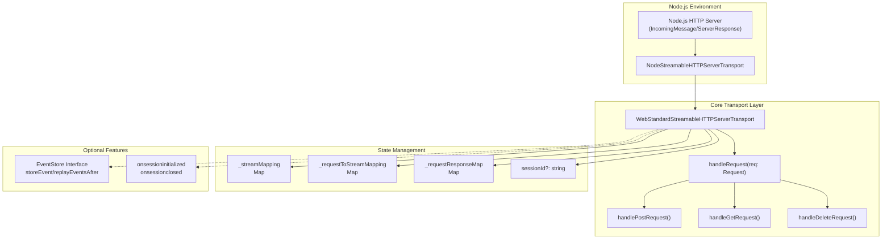
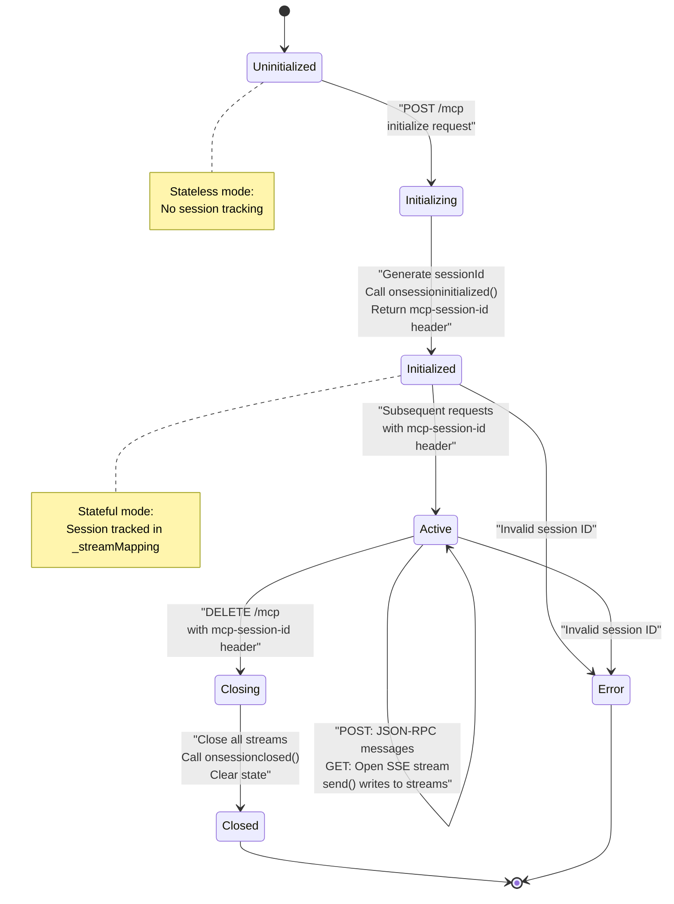
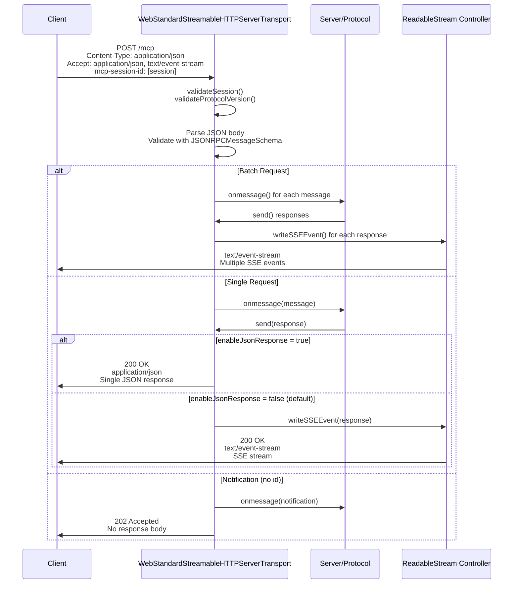
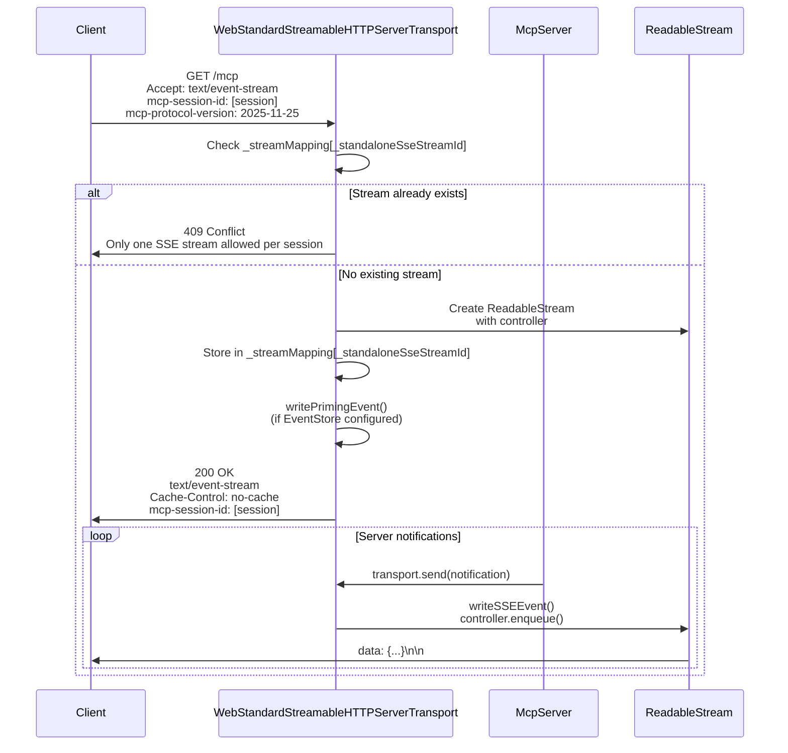
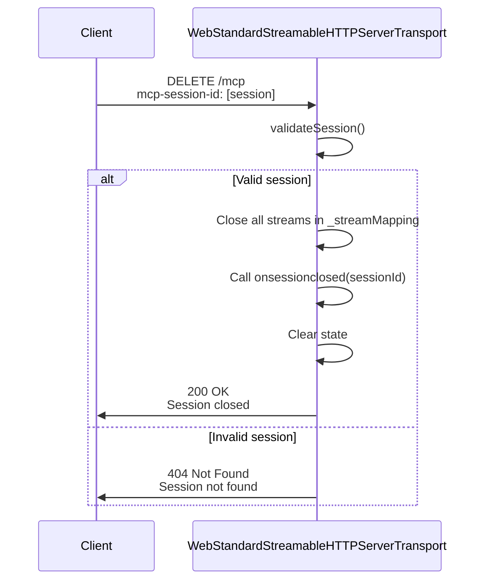
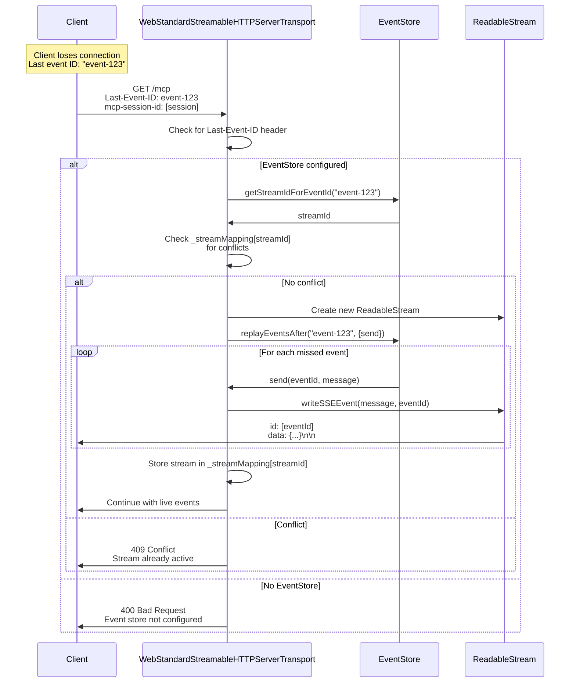

# Streamable HTTP Server Transport

<details>
<summary>Relevant source files</summary>

The following files were used as context for generating this wiki page:

- [.changeset/heavy-walls-swim.md](.changeset/heavy-walls-swim.md)
- [examples/server/src/customProtocolVersion.ts](examples/server/src/customProtocolVersion.ts)
- [examples/server/src/elicitationUrlExample.ts](examples/server/src/elicitationUrlExample.ts)
- [examples/server/src/jsonResponseStreamableHttp.ts](examples/server/src/jsonResponseStreamableHttp.ts)
- [examples/server/src/simpleStatelessStreamableHttp.ts](examples/server/src/simpleStatelessStreamableHttp.ts)
- [examples/server/src/simpleStreamableHttp.ts](examples/server/src/simpleStreamableHttp.ts)
- [packages/core/src/shared/transport.ts](packages/core/src/shared/transport.ts)
- [packages/middleware/node/test/streamableHttp.test.ts](packages/middleware/node/test/streamableHttp.test.ts)
- [packages/server/package.json](packages/server/package.json)
- [packages/server/src/experimental/tasks/mcpServer.ts](packages/server/src/experimental/tasks/mcpServer.ts)
- [packages/server/src/server/streamableHttp.ts](packages/server/src/server/streamableHttp.ts)
- [pnpm-lock.yaml](pnpm-lock.yaml)
- [pnpm-workspace.yaml](pnpm-workspace.yaml)

</details>


This page documents the Streamable HTTP Server Transport implementation, which enables MCP servers to communicate over HTTP using Server-Sent Events (SSE) for bidirectional message streaming. The transport supports both stateful and stateless modes, optional resumability, and multiple response formats.

For client-side HTTP transport, see [4.2](#4.2). For middleware integration (Express, Hono, Node.js), see [3.6](#3.6).

---

## Overview

The MCP SDK provides two HTTP server transport implementations:

- **`WebStandardStreamableHTTPServerTransport`**: Core implementation using Web Standard APIs (Request, Response, ReadableStream), compatible with any runtime supporting Web Standards (Node.js 18+, Cloudflare Workers, Deno, Bun)
- **`NodeStreamableHTTPServerTransport`**: Thin wrapper for Node.js HTTP that converts IncomingMessage/ServerResponse to Web Standard Request/Response objects

Both implementations follow the MCP Streamable HTTP transport specification, supporting POST requests for JSON-RPC messages and GET requests for establishing SSE streams.

**Sources:** [packages/server/src/server/streamableHttp.ts:1-216]()

---

## Transport Architecture



**Sources:** [packages/server/src/server/streamableHttp.ts:216-252](), [packages/middleware/node/src/streamableHttp.ts:1-50]()

---

## Operating Modes

The transport supports two fundamental operating modes determined by the `sessionIdGenerator` option:

| Mode | Configuration | Session ID Behavior | Use Case |
|------|--------------|---------------------|----------|
| **Stateful** | `sessionIdGenerator: () => string` | Server generates and returns session ID in response headers | Long-running connections with server-initiated messages, resumability support |
| **Stateless** | `sessionIdGenerator: undefined` | No session ID generated or validated | Simple request/response interactions, serverless environments |

**Sources:** [packages/server/src/server/streamableHttp.ts:73-155]()

---

## Session Lifecycle



**Sources:** [packages/server/src/server/streamableHttp.ts:338-359](), [packages/middleware/node/test/streamableHttp.test.ts:260-395]()

---

## Request Handling Flow

### POST Request Flow

POST requests carry JSON-RPC messages (requests, responses, or notifications) and can return either SSE streams or JSON responses depending on configuration.



**Sources:** [packages/server/src/server/streamableHttp.ts:603-771](), [packages/middleware/node/test/streamableHttp.test.ts:328-394]()

---

### GET Request Flow

GET requests establish standalone SSE streams for receiving server-initiated messages (notifications, progress updates, etc.).



**Sources:** [packages/server/src/server/streamableHttp.ts:395-468](), [packages/middleware/node/test/streamableHttp.test.ts:492-564]()

---

### DELETE Request Flow

DELETE requests terminate sessions and clean up resources.



**Sources:** [packages/server/src/server/streamableHttp.ts:773-813]()

---

## Configuration Options

### WebStandardStreamableHTTPServerTransportOptions

```typescript
interface WebStandardStreamableHTTPServerTransportOptions {
    sessionIdGenerator?: () => string;
    onsessioninitialized?: (sessionId: string) => void | Promise<void>;
    onsessionclosed?: (sessionId: string) => void | Promise<void>;
    enableJsonResponse?: boolean;
    eventStore?: EventStore;
    retryInterval?: number;
    supportedProtocolVersions?: string[];
    
    // Deprecated DNS rebinding protection (use external middleware)
    allowedHosts?: string[];
    allowedOrigins?: string[];
    enableDnsRebindingProtection?: boolean;
}
```

| Option | Type | Description |
|--------|------|-------------|
| `sessionIdGenerator` | `(() => string) \| undefined` | **Required for stateful mode.** Function that generates globally unique session IDs (e.g., `crypto.randomUUID()`). If `undefined`, transport operates in stateless mode. |
| `onsessioninitialized` | `(sessionId: string) => void \| Promise<void>` | Callback invoked when a new session is initialized. Useful for tracking multiple sessions. |
| `onsessionclosed` | `(sessionId: string) => void \| Promise<void>` | Callback invoked when a session is closed via DELETE request. Use for cleanup. |
| `enableJsonResponse` | `boolean` | If `true`, POST requests return single JSON responses instead of SSE streams. Default: `false` |
| `eventStore` | `EventStore` | Event store implementation for resumability support. If provided, enables event replay via `Last-Event-ID` header. |
| `retryInterval` | `number` | Retry interval in milliseconds to suggest to clients in SSE `retry` field. Controls client reconnection timing. |
| `supportedProtocolVersions` | `string[]` | List of protocol versions to accept in `mcp-protocol-version` header. Automatically set by `Server.connect()`. |

**Sources:** [packages/server/src/server/streamableHttp.ts:73-155]()

---

### HandleRequestOptions

Options passed to `handleRequest()` for pre-parsed bodies and authentication:

```typescript
interface HandleRequestOptions {
    parsedBody?: unknown;
    authInfo?: AuthInfo;
}
```

| Option | Type | Description |
|--------|------|-------------|
| `parsedBody` | `unknown` | Pre-parsed request body. Useful when body-parser middleware has already parsed the request. |
| `authInfo` | `AuthInfo` | Authentication info from middleware (e.g., OAuth bearer token). Passed to message handlers via `MessageExtraInfo`. |

**Sources:** [packages/server/src/server/streamableHttp.ts:158-171]()

---

## Resumability and EventStore

The transport supports resumability through the `EventStore` interface, allowing clients to reconnect and replay missed events.

### EventStore Interface

```typescript
interface EventStore {
    storeEvent(streamId: StreamId, message: JSONRPCMessage): Promise<EventId>;
    getStreamIdForEventId?(eventId: EventId): Promise<StreamId | undefined>;
    replayEventsAfter(
        lastEventId: EventId,
        { send }: { send: (eventId: EventId, message: JSONRPCMessage) => Promise<void> }
    ): Promise<StreamId>;
}
```

**Methods:**
- **`storeEvent()`**: Stores a message and returns an event ID. Called before sending each SSE event.
- **`getStreamIdForEventId()`**: Optional. Maps event ID to stream ID for conflict detection.
- **`replayEventsAfter()`**: Replays all events after the given event ID by calling `send()` for each.

**Sources:** [packages/server/src/server/streamableHttp.ts:24-54]()

---

### Resumability Flow



**Sources:** [packages/server/src/server/streamableHttp.ts:414-552](), [packages/middleware/node/test/streamableHttp.test.ts:749-853]()

---

## Priming Events and Retry Intervals

When `EventStore` is configured and the client's protocol version supports empty SSE data (>= 2025-11-25), the transport sends a **priming event** to establish resumption capability:

```
id: event-0
retry: 5000
data: 

```

The priming event:
- Has an empty data field (allowed in protocol version 2025-11-25+)
- Establishes the initial event ID for resumption
- Optionally includes a `retry` field (if `retryInterval` is configured) to control client reconnection timing

**Sources:** [packages/server/src/server/streamableHttp.ts:366-390]()

---

## Integration Patterns

### Stateful Server with Session Tracking

```typescript
import { randomUUID } from 'node:crypto';
import { NodeStreamableHTTPServerTransport } from '@modelcontextprotocol/node';
import { McpServer } from '@modelcontextprotocol/server';

const transports: Record<string, NodeStreamableHTTPServerTransport> = {};

const transport = new NodeStreamableHTTPServerTransport({
    sessionIdGenerator: () => randomUUID(),
    onsessioninitialized: (sessionId) => {
        console.log(`Session initialized: ${sessionId}`);
        transports[sessionId] = transport;
    },
    onsessionclosed: (sessionId) => {
        console.log(`Session closed: ${sessionId}`);
        delete transports[sessionId];
    }
});

const server = new McpServer({
    name: 'my-server',
    version: '1.0.0'
});

await server.connect(transport);
```

**Sources:** [examples/server/src/simpleStreamableHttp.ts:500-574]()

---

### Stateless Server (Request Per Connection)

```typescript
import { NodeStreamableHTTPServerTransport } from '@modelcontextprotocol/node';
import { McpServer } from '@modelcontextprotocol/server';

app.post('/mcp', async (req, res) => {
    const server = new McpServer({
        name: 'stateless-server',
        version: '1.0.0'
    });
    
    const transport = new NodeStreamableHTTPServerTransport({
        sessionIdGenerator: undefined  // Stateless mode
    });
    
    await server.connect(transport);
    await transport.handleRequest(req, res, req.body);
    
    res.on('close', () => {
        transport.close();
        server.close();
    });
});
```

**Sources:** [examples/server/src/simpleStatelessStreamableHttp.ts:99-125]()

---

### JSON Response Mode

```typescript
const transport = new NodeStreamableHTTPServerTransport({
    sessionIdGenerator: () => randomUUID(),
    enableJsonResponse: true  // Return JSON instead of SSE
});
```

In JSON response mode:
- POST requests return `application/json` responses
- Only a single JSON-RPC response is returned (batch responses not supported)
- Server-initiated messages cannot be sent (no SSE stream)
- GET requests should return 405 Method Not Allowed

**Sources:** [examples/server/src/jsonResponseStreamableHttp.ts:85-148]()

---

### Resumability with InMemoryEventStore

```typescript
import { InMemoryEventStore } from './inMemoryEventStore.js';

const eventStore = new InMemoryEventStore();

const transport = new NodeStreamableHTTPServerTransport({
    sessionIdGenerator: () => randomUUID(),
    eventStore,
    retryInterval: 5000  // Suggest 5s retry interval to clients
});
```

The `InMemoryEventStore` implementation:
- Stores events in memory with sequential IDs
- Maps event IDs to stream IDs
- Replays events after a given ID
- Suitable for development/testing (not production-ready)

**Sources:** [examples/server/src/simpleStreamableHttp.ts:29](), [packages/middleware/node/test/streamableHttp.test.ts:749-853]()

---

### Custom Protocol Versions

```typescript
const CUSTOM_VERSIONS = ['2026-01-01', ...SUPPORTED_PROTOCOL_VERSIONS];

const server = new McpServer(
    { name: 'custom-server', version: '1.0.0' },
    { supportedProtocolVersions: CUSTOM_VERSIONS }
);

const transport = new NodeStreamableHTTPServerTransport({
    sessionIdGenerator: () => randomUUID()
});

// Server automatically passes versions to transport during connect()
await server.connect(transport);
```

**Sources:** [examples/server/src/customProtocolVersion.ts:14-65]()

---

## Error Handling

The transport returns JSON-RPC error responses for various error conditions:

| HTTP Status | Error Code | Condition |
|-------------|-----------|-----------|
| 400 | -32600 | Invalid request (server already initialized, batch init, etc.) |
| 400 | -32700 | Parse error (invalid JSON) |
| 400 | -32000 | Bad request (missing session ID) |
| 403 | -32000 | DNS rebinding protection (invalid Host/Origin) |
| 404 | -32001 | Session not found |
| 405 | -32000 | Method not allowed |
| 406 | -32000 | Not acceptable (invalid Accept header) |
| 409 | -32000 | Conflict (duplicate SSE stream) |
| 415 | -32000 | Unsupported media type (invalid Content-Type) |

All error responses follow the JSON-RPC 2.0 error format:

```json
{
    "jsonrpc": "2.0",
    "error": {
        "code": -32000,
        "message": "Error message",
        "data": "Optional additional data"
    },
    "id": null
}
```

**Sources:** [packages/server/src/server/streamableHttp.ts:274-299](), [packages/middleware/node/test/streamableHttp.test.ts:471-746]()

---

## Internal State Management

The transport maintains several internal data structures:

| Property | Type | Purpose |
|----------|------|---------|
| `_streamMapping` | `Map<string, StreamMapping>` | Maps stream IDs to SSE stream controllers and cleanup functions |
| `_requestToStreamMapping` | `Map<RequestId, string>` | Maps JSON-RPC request IDs to stream IDs for routing responses |
| `_requestResponseMap` | `Map<RequestId, JSONRPCMessage>` | Temporarily stores responses in JSON response mode |
| `_initialized` | `boolean` | Tracks whether the initialize request has been processed |
| `sessionId` | `string \| undefined` | The generated session ID (undefined in stateless mode) |

**StreamMapping Interface:**

```typescript
interface StreamMapping {
    controller?: ReadableStreamDefaultController<Uint8Array>;
    encoder?: TextEncoder;
    resolveJson?: (response: Response) => void;
    cleanup: () => void;
}
```

**Sources:** [packages/server/src/server/streamableHttp.ts:58-68](), [packages/server/src/server/streamableHttp.ts:216-238]()

---

## Protocol Version Validation

The transport validates the `mcp-protocol-version` header on incoming requests:

1. During initialization, the client sends `mcp-protocol-version` header with its preferred version
2. The transport checks if the version is in `supportedProtocolVersions` (set by `Server.connect()`)
3. If supported, the transport proceeds; if not, it returns 400 Bad Request
4. After initialization, all subsequent requests must include the negotiated protocol version

**Sources:** [packages/server/src/server/streamableHttp.ts:815-860]()

---

## DNS Rebinding Protection (Deprecated)

The transport includes deprecated DNS rebinding protection features:

```typescript
{
    allowedHosts?: string[];
    allowedOrigins?: string[];
    enableDnsRebindingProtection?: boolean;
}
```

**⚠️ Deprecation Notice:** These options are deprecated. Use external middleware (e.g., Express middleware, Cloudflare Workers validation) for DNS rebinding protection instead.

**Sources:** [packages/server/src/server/streamableHttp.ts:117-136](), [packages/server/src/server/streamableHttp.ts:305-332]()

---

## Platform Compatibility

### WebStandardStreamableHTTPServerTransport

Works on any runtime with Web Standard APIs:
- ✅ Node.js 18+ (native Web Standard support)
- ✅ Cloudflare Workers
- ✅ Deno
- ✅ Bun
- ✅ Browser environments (for local testing)

Usage with Cloudflare Workers:

```typescript
export default {
    async fetch(request: Request): Promise<Response> {
        return transport.handleRequest(request);
    }
};
```

**Sources:** [packages/server/src/server/streamableHttp.ts:1-216]()

---

### NodeStreamableHTTPServerTransport

Node.js-specific wrapper that converts Node.js HTTP objects to Web Standard APIs:

- Converts `IncomingMessage` to `Request`
- Converts `ServerResponse` to `Response`
- Automatically handles request body parsing
- Writes response back to `ServerResponse`

**Sources:** [packages/middleware/node/src/streamableHttp.ts:1-94]()

---

## Testing Patterns

### Basic Request Testing

```typescript
const response = await fetch('http://localhost:3000/mcp', {
    method: 'POST',
    headers: {
        'Content-Type': 'application/json',
        'Accept': 'application/json, text/event-stream',
        'mcp-session-id': sessionId
    },
    body: JSON.stringify({
        jsonrpc: '2.0',
        method: 'tools/list',
        params: {},
        id: 'test-1'
    })
});
```

**Sources:** [packages/middleware/node/test/streamableHttp.test.ts:109-132]()

---

### SSE Stream Testing

```typescript
const response = await fetch('http://localhost:3000/mcp', {
    method: 'GET',
    headers: {
        'Accept': 'text/event-stream',
        'mcp-session-id': sessionId,
        'mcp-protocol-version': '2025-11-25'
    }
});

const reader = response.body?.getReader();
const { value } = await reader!.read();
const text = new TextDecoder().decode(value);

// Parse SSE format: "data: {...}\n\n"
const dataLine = text.split('\n').find(line => line.startsWith('data:'));
const eventData = JSON.parse(dataLine!.slice(5));
```

**Sources:** [packages/middleware/node/test/streamableHttp.test.ts:100-105](), [packages/middleware/node/test/streamableHttp.test.ts:492-532]()

---

## Summary

The Streamable HTTP Server Transport provides a flexible, standards-based transport implementation for MCP servers:

- **Dual operating modes**: Stateful (with session management) or stateless (simple request/response)
- **Multiple response formats**: SSE streams (default) or JSON responses
- **Optional resumability**: Event replay via `EventStore` interface
- **Platform agnostic**: Core implementation uses Web Standards, runs anywhere
- **Production ready**: Session callbacks, error handling, protocol validation
- **Extensible**: Middleware integration, custom protocol versions, event stores

**Key Classes:**
- `WebStandardStreamableHTTPServerTransport`: Core implementation
- `NodeStreamableHTTPServerTransport`: Node.js wrapper
- `EventStore`: Interface for resumability support

**Sources:** [packages/server/src/server/streamableHttp.ts:1-860](), [packages/middleware/node/src/streamableHttp.ts:1-94]()

---