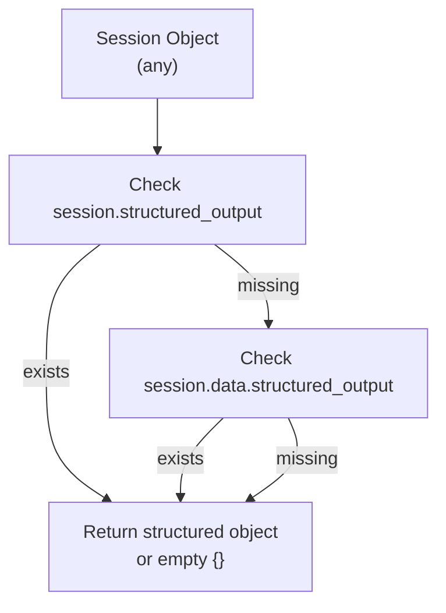
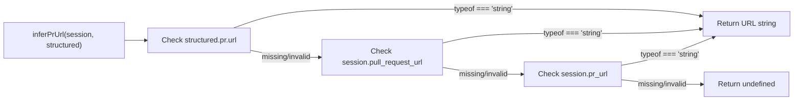
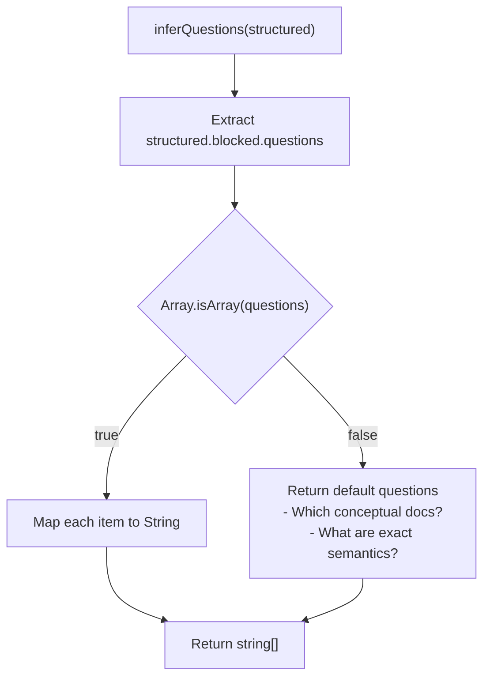
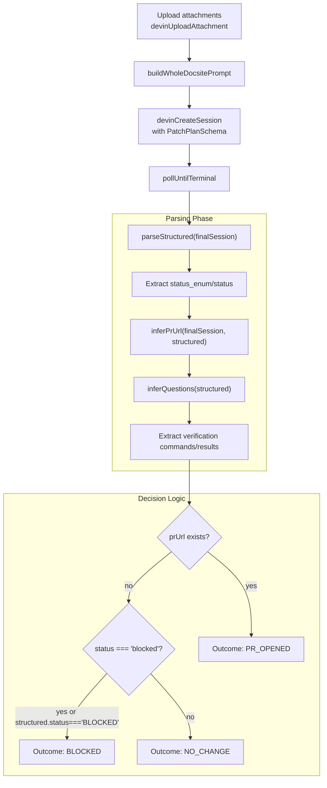
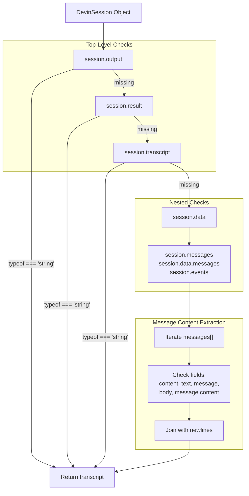
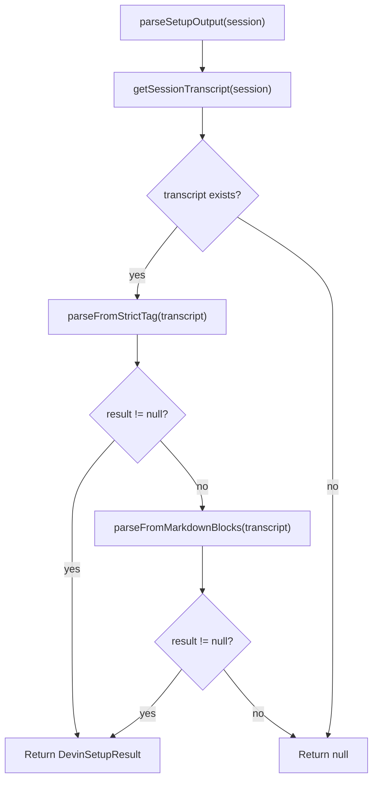
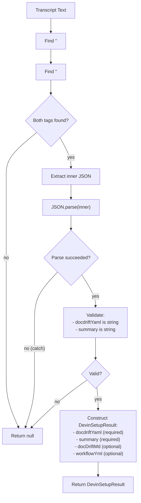
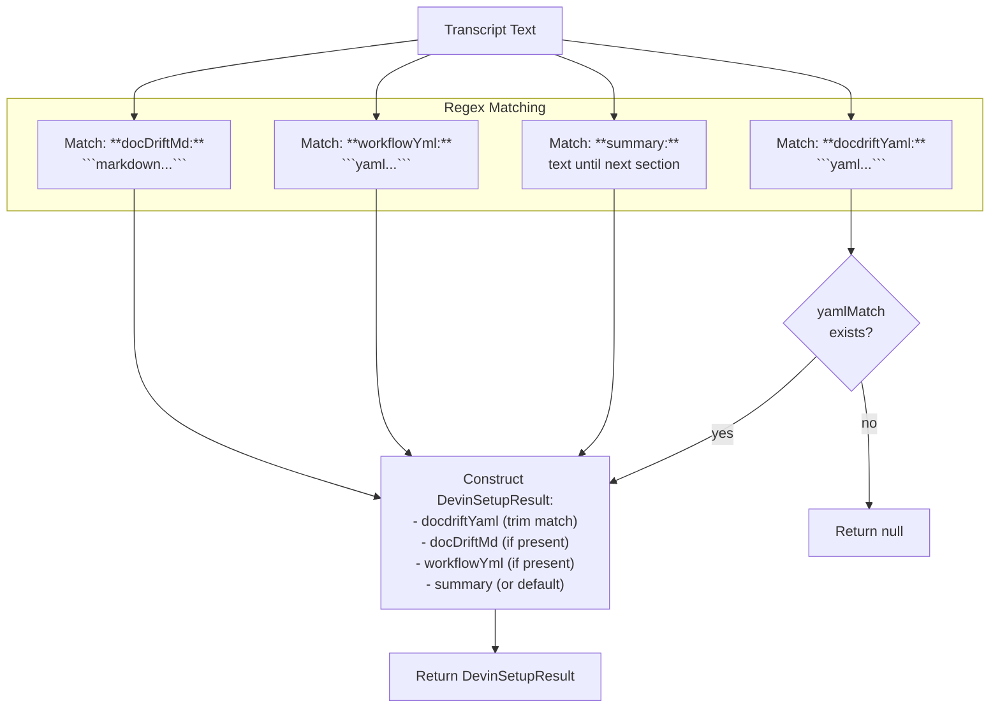
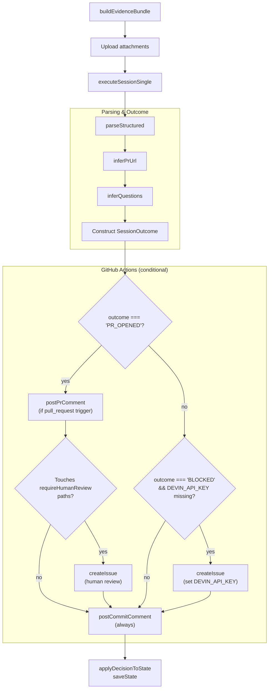
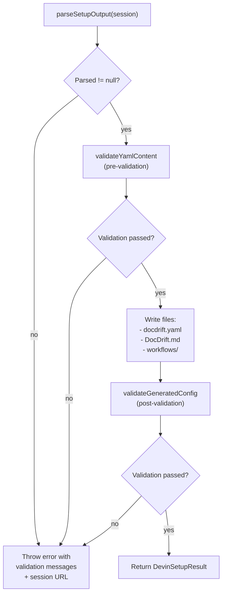

# Structured Output Parsing

<details>
<summary>Relevant source files</summary>

The following files were used as context for generating this wiki page:

- [docdrift-yml.md](docdrift-yml.md)
- [src/index.ts](src/index.ts)
- [src/setup/devin-setup.ts](src/setup/devin-setup.ts)
- [src/setup/index.ts](src/setup/index.ts)

</details>


## Purpose and Scope

This page documents the structured output parsing subsystem, which extracts actionable data from Devin AI session responses. The parsing logic handles both well-formed structured JSON output and fallback extraction from unstructured message transcripts. This system is critical for determining session outcomes (PR opened, blocked, no change) and driving downstream GitHub actions.

For information about creating and polling Devin sessions, see [Session Lifecycle](#8.3). For information about prompt generation that produces these outputs, see [Prompt Generation](#8.4).

---

## Parsing Contexts

The docdrift system performs structured output parsing in two distinct contexts:

| Context | Purpose | Key Functions | Output Type |
|---------|---------|---------------|-------------|
| **Runtime Remediation** | Parse session outcomes during `docdrift run` | `parseStructured`, `inferPrUrl`, `inferQuestions` | `SessionOutcome` |
| **Setup Configuration** | Extract generated YAML files during `docdrift setup` | `parseSetupOutput`, `getSessionTranscript`, `parseFromStrictTag` | `DevinSetupResult` |

Both contexts implement fallback mechanisms to handle cases where Devin returns unstructured output instead of JSON.

---

## Runtime Parsing: Session Outcomes

### SessionOutcome Type

The `SessionOutcome` interface represents the result of a drift remediation session:

```typescript
interface SessionOutcome {
  outcome: "PR_OPENED" | "ISSUE_OPENED" | "NO_CHANGE" | "BLOCKED";
  summary: string;
  sessionUrl?: string;
  prUrl?: string;
  issueUrl?: string;
  questions?: string[];
  verification: Array<{ command: string; result: string }>;
}
```

**Sources:** [src/index.ts:39-47]()

| Outcome | Meaning | Downstream Action |
|---------|---------|-------------------|
| `PR_OPENED` | Devin successfully created a PR | Post commit comment, optionally create review issue |
| `BLOCKED` | Devin hit a blocker and needs input | Log as blocked, no issue created (commit comment only) |
| `NO_CHANGE` | Session completed but no PR needed | Post commit comment |
| `ISSUE_OPENED` | (Unused in current implementation) | Reserved for future use |

---

### parseStructured Function

The `parseStructured` function extracts the structured JSON output from a Devin session response. Devin may return structured data at multiple levels of nesting depending on API version and response format.



**Implementation:**

The function checks two possible locations for structured output:
1. `session.structured_output` (top-level field)
2. `session.data.structured_output` (nested field)

If both are missing, it returns an empty object `{}`.

**Sources:** [src/index.ts:49-51]()

---

### inferPrUrl Function

The `inferPrUrl` function attempts to extract a PR URL from the session response. Devin may include the PR URL in multiple locations depending on how the session completed.



**Checked Locations (priority order):**

1. `structured.pr.url` - Expected location when structured output is present
2. `session.pull_request_url` - Alternative top-level field
3. `session.pr_url` - Abbreviated top-level field

All checks use strict type validation (`typeof === "string"`) to ensure the extracted value is usable.

**Sources:** [src/index.ts:53-64]()

---

### inferQuestions Function

The `inferQuestions` function extracts clarifying questions when Devin reports a blocked status. These questions indicate what additional information Devin needs to proceed.



**Default Questions:**

When Devin does not provide explicit questions, the system returns fallback questions that prompt human review:

1. "Which conceptual docs should be updated for this behavior change?"
2. "What are the exact user-visible semantics after this merge?"

**Sources:** [src/index.ts:66-75]()

---

### executeSessionSingle Integration

The `executeSessionSingle` function orchestrates the complete workflow: upload evidence, create session, poll to terminal state, parse output, and construct a `SessionOutcome`.



**Key Logic:**

1. **PR_OPENED**: If `prUrl` is extracted (any of the three locations), outcome is PR_OPENED regardless of status
2. **BLOCKED**: If no `prUrl` and (`status === "blocked"` OR `structured.status === "BLOCKED"`), outcome is BLOCKED
3. **NO_CHANGE**: If no `prUrl` and not blocked, outcome is NO_CHANGE

**Verification Data:**

The function extracts verification commands and results from `structured.verification` or falls back to the config's default verification commands:

```typescript
const verificationCommands = Array.isArray(structured?.verification?.commands)
  ? structured.verification.commands.map(String)
  : input.config.policy.verification.commands;
const verificationResults = Array.isArray(structured?.verification?.results)
  ? structured.verification.results.map(String)
  : verificationCommands.map(() => "not reported");
```

**Sources:** [src/index.ts:83-169]()

---

## Setup-Specific Parsing

### DevinSetupResult Type

When running `docdrift setup` with Devin, the system expects a `DevinSetupResult` containing generated configuration files:

```typescript
export interface DevinSetupResult {
  docdriftYaml: string;       // Required: YAML content
  docDriftMd?: string;        // Optional: Custom instructions markdown
  workflowYml?: string;       // Optional: GitHub Actions workflow
  summary: string;            // Required: Human-readable summary
  sessionUrl: string;         // Session URL for debugging
  prUrl?: string;             // PR URL when openPr=true
}
```

**Sources:** [src/setup/devin-setup.ts:28-36]()

---

### getSessionTranscript Function

The `getSessionTranscript` function extracts the full text transcript from a Devin session for fallback parsing. Devin may store transcript data in multiple locations depending on API version.



**Checked Fields (priority order):**

**Top-level fields:**
1. `session.output`
2. `session.result`
3. `session.transcript`

**Message arrays (if top-level fields missing):**
- `session.messages`
- `session.data.messages`
- `session.events`

**Per-message content fields (checked in order):**
1. `message.content`
2. `message.text`
3. `message.message`
4. `message.body`
5. `message.message.content` (nested)

The function concatenates all extracted text with newlines and returns the complete transcript.

**Sources:** [src/setup/devin-setup.ts:89-108]()

---

### parseSetupOutput Function

The `parseSetupOutput` function implements a two-tier fallback strategy for extracting setup results:



**Fallback Strategy:**

1. **First attempt**: Parse from strict XML tag (`<docdrift_setup_output>...</docdrift_setup_output>`)
2. **Second attempt**: Parse from markdown blocks (`**docdriftYaml:** ```yaml...````)
3. **Failure**: Return `null` if both methods fail

**Sources:** [src/setup/devin-setup.ts:154-163]()

---

### parseFromStrictTag Function

The `parseFromStrictTag` function extracts JSON from an XML-style tag in the transcript. This is the preferred structured output format for setup sessions.

**Expected Format:**

```
<docdrift_setup_output>
{
  "docdriftYaml": "version: 1\ndevin:...",
  "docDriftMd": "# Custom Instructions\n...",
  "workflowYml": "name: docdrift\n...",
  "summary": "Generated config from repo analysis"
}
</docdrift_setup_output>
```

**Parsing Logic:**



**Tag Constant:**

The tag name is defined as `DOCDRIFT_SETUP_OUTPUT_TAG = "docdrift_setup_output"` in the setup-prompt module.

**Sources:** [src/setup/devin-setup.ts:111-133](), [src/setup/setup-prompt.ts]() (for tag constant)

---

### parseFromMarkdownBlocks Function

The `parseFromMarkdownBlocks` function is a fallback that extracts setup data from markdown-formatted code blocks in the transcript.

**Expected Format:**

```markdown
**docdriftYaml:** ```yaml
version: 1
devin:
  apiVersion: v1
...
```

**docDriftMd:** ```markdown
# Custom Instructions
...
```

**workflowYml:** ```yaml
name: docdrift
...
```

**summary:** Config generated from repo fingerprint analysis
```

**Extraction Logic:**



**Regex Patterns:**

- **docdriftYaml**: `/\*\*docdriftYaml:\*\*[\s\S]*?```(?:yaml)?\s*([\s\S]*?)```/i`
- **docDriftMd**: `/\*\*docDriftMd:\*\*[\s\S]*?```(?:markdown)?\s*([\s\S]*?)```/i`
- **workflowYml**: `/\*\*workflowYml:\*\*[\s\S]*?```(?:yaml)?\s*([\s\S]*?)```/i`
- **summary**: `/\*\*summary:\*\*([\s\S]*?)(?=\n\n\*\*|$)/i`

**Default Summary:**

If no summary is found, defaults to `"Inferred from repo analysis"` (truncated to 500 characters).

**Sources:** [src/setup/devin-setup.ts:136-151]()

---

## Integration with runDocDrift

The parsing functions are integrated into the main `runDocDrift` workflow. After the session reaches a terminal state, parsing determines what GitHub actions to take.



**Key Decision Points:**

1. **PR_OPENED + pull_request trigger**: Post comment on source PR linking to doc-drift PR
2. **PR_OPENED + requireHumanReview paths**: Create issue for human review
3. **BLOCKED + missing DEVIN_API_KEY**: Create issue to add API key
4. **All outcomes**: Post commit comment with summary

**Sources:** [src/index.ts:336-496]()

---

## Error Handling and Validation

### Structured Output Validation

The system does not strictly validate the structure of `structured_output` beyond checking for expected fields. This design allows for graceful degradation when Devin returns partial or unexpected data.

**Validation Points:**

| Function | Validation | Fallback Behavior |
|----------|------------|-------------------|
| `parseStructured` | None (returns `{}` if missing) | All downstream code checks for field existence |
| `inferPrUrl` | Type check (`typeof === "string"`) | Returns `undefined` |
| `inferQuestions` | Array check (`Array.isArray`) | Returns default questions |
| `parseFromStrictTag` | JSON parse + field type checks | Returns `null` → fallback to markdown parsing |
| `parseFromMarkdownBlocks` | Regex match for YAML block | Returns `null` → error thrown |

### Setup Validation Flow

After parsing setup output, the system validates the generated YAML before writing files:



**Validation Functions:**

1. `validateYamlContent(yaml: string)` - Validates YAML string without writing to disk
2. `validateGeneratedConfig(path: string)` - Loads and validates the written config file

**Sources:** [src/setup/devin-setup.ts:240-249](), [src/setup/devin-setup.ts:283-286]()

---

## Summary Table: Parsing Functions

| Function | Input | Output | Purpose | Fallback |
|----------|-------|--------|---------|----------|
| `parseStructured` | `session: any` | `any` (object or `{}`) | Extract structured JSON from session | Returns `{}` |
| `inferPrUrl` | `session: any, structured: any` | `string \| undefined` | Find PR URL in session/structured output | Returns `undefined` |
| `inferQuestions` | `structured: any` | `string[]` | Extract blocked session questions | Returns default questions |
| `getSessionTranscript` | `session: DevinSession` | `string` | Extract full text transcript | Returns `""` |
| `parseFromStrictTag` | `text: string` | `DevinSetupResult \| null` | Parse JSON from XML tag | Returns `null` |
| `parseFromMarkdownBlocks` | `text: string` | `DevinSetupResult \| null` | Parse setup data from markdown | Returns `null` |
| `parseSetupOutput` | `session: DevinSession` | `DevinSetupResult \| null` | Orchestrate setup parsing with fallbacks | Returns `null` |

**Sources:** [src/index.ts:49-75](), [src/setup/devin-setup.ts:89-163]()

---