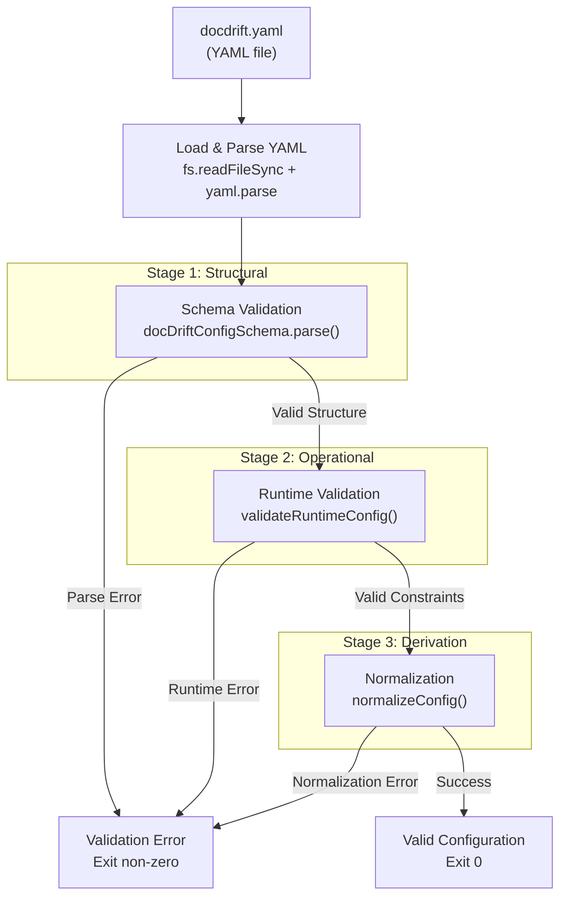
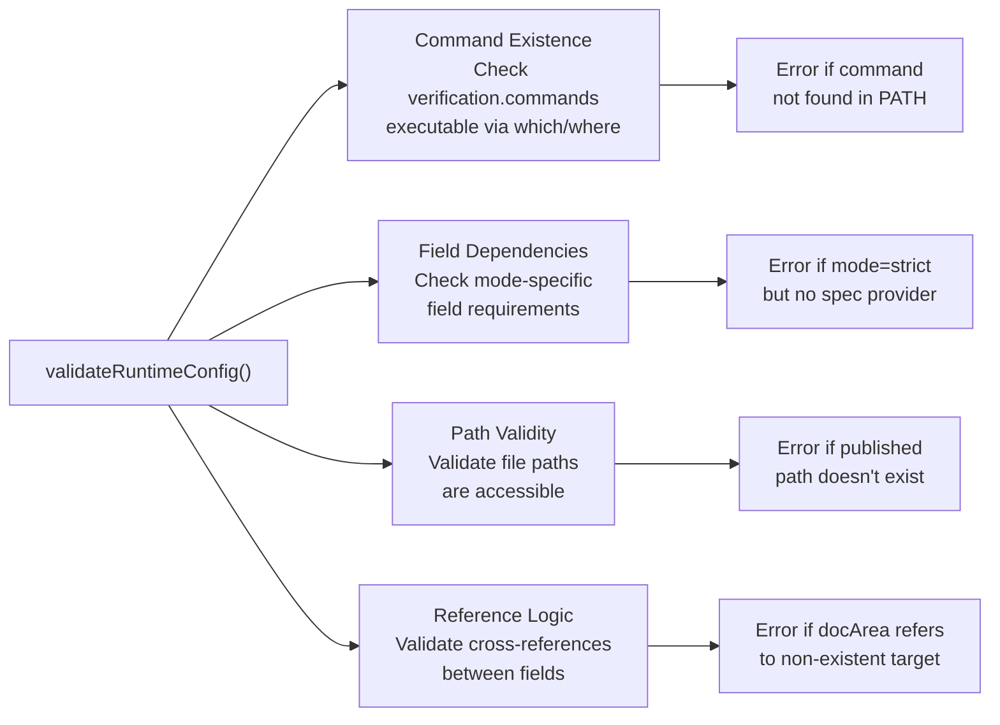
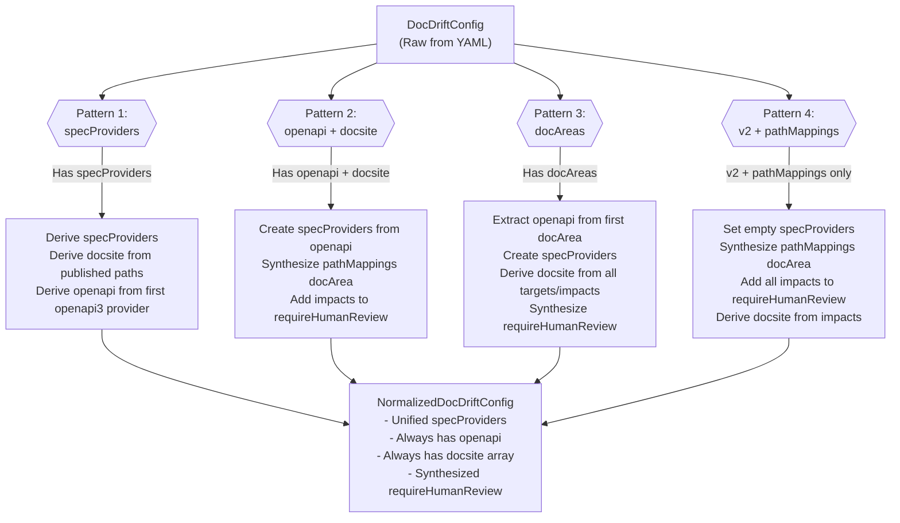
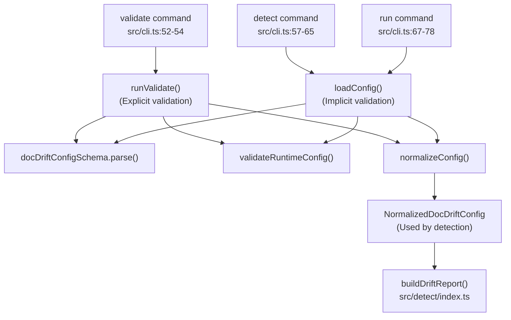

# validate

<details>
<summary>Relevant source files</summary>

The following files were used as context for generating this wiki page:

- [docdrift.schema.json](docdrift.schema.json)
- [src/cli.ts](src/cli.ts)
- [src/config/normalize.ts](src/config/normalize.ts)
- [src/config/schema.ts](src/config/schema.ts)
- [src/detect/index.ts](src/detect/index.ts)
- [src/devin/v1.ts](src/devin/v1.ts)
- [test/config.test.ts](test/config.test.ts)

</details>


This page documents the `validate` command, which checks the correctness of a `docdrift.yaml` configuration file. The validator performs schema validation, runtime constraint checks, and configuration normalization to ensure the configuration is both syntactically valid and operationally sound before detection or remediation runs.

For information about creating configuration files, see [Initial Setup](#2.2). For details on the configuration schema structure, see [Configuration Schema](#4.1). For information about the normalization process that runs after validation, see [Validation and Normalization](#4.2).

## Command Usage

The `validate` command is invoked without arguments and validates the configuration file at the current working directory:

```bash
npx @devinnn/docdrift validate
```

The command:
- Reads `docdrift.yaml` from the current directory
- Validates the configuration against the schema
- Checks runtime constraints (command existence, field dependencies)
- Normalizes the configuration to detect structural issues
- Exits with code 0 on success, non-zero on validation failure

Sources: [src/cli.ts:52-54]()

## Validation Architecture

The validation system implements a three-stage pipeline that progressively checks the configuration from structural correctness to operational readiness.



**Validation Pipeline Stages:**

| Stage | Component | Purpose | Failure Example |
|-------|-----------|---------|-----------------|
| 1. Structural | `docDriftConfigSchema` | Validates YAML structure matches Zod schema | Missing required field `policy.allowlist` |
| 2. Operational | `validateRuntimeConfig` | Checks executable commands, field dependencies | Verification command `npm run docs:check` not found |
| 3. Derivation | `normalizeConfig` | Derives fields and validates configuration patterns | Config has neither `specProviders` nor `openapi` block |

Sources: [src/cli.ts:52-54](), [src/config/schema.ts:145-154]()

## Schema Validation (Stage 1)

Schema validation uses Zod to enforce structural correctness. The `docDriftConfigSchema` is the top-level schema that validates the entire configuration object.

### Schema Definition Structure

```mermaid
graph TB
    docDriftConfigSchema["docDriftConfigSchema<br/>(Top-Level)"]
    
    version["version: 1 | 2"]
    devin["devin: Object<br/>API settings"]
    policy["policy: Object<br/>Operational rules"]
    
    specProviders["specProviders?: Array<br/>v2 spec detection"]
    openapi["openapi?: Object<br/>v1 simple config"]
    docsite["docsite?: string | string[]<br/>Doc directory paths"]
    docAreas["docAreas?: Array<br/>Granular areas"]
    pathMappings["pathMappings?: Array<br/>Path impact hints"]
    
    mode["mode: 'strict' | 'auto'<br/>Detection mode"]
    exclude["exclude?: string[]<br/>Ignore patterns"]
    requireHumanReview["requireHumanReview?: string[]<br/>Manual review paths"]
    
    refine["refine() constraint:<br/>Must have one of:<br/>- specProviders<br/>- openapi + docsite<br/>- docAreas<br/>- v2 + pathMappings"]
    
    docDriftConfigSchema --> version
    docDriftConfigSchema --> devin
    docDriftConfigSchema --> policy
    docDriftConfigSchema --> specProviders
    docDriftConfigSchema --> openapi
    docDriftConfigSchema --> docsite
    docDriftConfigSchema --> docAreas
    docDriftConfigSchema --> pathMappings
    docDriftConfigSchema --> mode
    docDriftConfigSchema --> exclude
    docDriftConfigSchema --> requireHumanReview
    docDriftConfigSchema --> refine
    
    specProviders --> specProviderConfigSchema["specProviderConfigSchema"]
    openapi --> openApiSimpleSchema["openApiSimpleSchema"]
    docAreas --> docAreaSchema["docAreaSchema"]
    pathMappings --> pathRuleSchema["pathRuleSchema"]
    policy --> policySchema["policySchema"]
```



Sources: [src/config/schema.ts:145-154](), [src/config/schema.ts:123-143]()

### Required Fields

The schema enforces these top-level required fields:

| Field | Type | Description |
|-------|------|-------------|
| `version` | `1 \| 2` | Configuration version number |
| `devin` | `object` | Devin API settings (see [8.1](#8.1)) |
| `policy` | `object` | Policy configuration (see [4.6](#4.6)) |

The configuration must also include at least one detection mechanism:
- `specProviders` (array, v2 format)
- `openapi` + `docsite` (v1 simple format)
- `docAreas` (array, granular format)
- `pathMappings` (array, v2 only, path-only detection)

Sources: [src/config/schema.ts:145-154]()

### Nested Schema Validation

The schema validates nested structures recursively:

**Policy Schema (`policySchema`):**
- `prCaps.maxPrsPerDay`: positive integer (default: 1)
- `prCaps.maxFilesTouched`: positive integer (default: 12)
- `confidence.autopatchThreshold`: number 0-1 (default: 0.8)
- `allowlist`: array of strings, minimum 1 item (required)
- `verification.commands`: array of strings, minimum 1 item (required)
- `slaDays`: non-negative integer (default: 7)
- `slaLabel`: string (default: "docdrift")
- `allowNewFiles`: boolean (default: false)

**Spec Provider Schema (`specProviderConfigSchema`):**
- `format`: enum of `"openapi3" | "swagger2" | "graphql" | "fern" | "postman"`
- `current`: discriminated union with `type` field:
  - `{type: "url", url: string}`
  - `{type: "local", path: string}`
  - `{type: "export", command: string, outputPath: string}`
- `published`: string (path to published spec in docs)

**DocArea Schema (`docAreaSchema`):**
- `name`: string
- `mode`: `"autogen" | "conceptual"`
- `owners.reviewers`: array of strings, minimum 1 item
- `detect`: must have `openapi` OR `paths` (enforced by refine)
- `patch.targets`: optional array of strings
- `patch.requireHumanConfirmation`: boolean (default: false)

Sources: [src/config/schema.ts:76-98](), [src/config/schema.ts:36-40](), [src/config/schema.ts:61-74](), [docdrift.schema.json:1-438]()

## Runtime Validation (Stage 2)

Runtime validation checks operational constraints that cannot be enforced by static schema validation. This stage is typically implemented in `validateRuntimeConfig` (referenced but not shown in provided files).

### Runtime Constraint Categories



**Validation Checks:**

| Check Type | Example Validation | Error Condition |
|------------|-------------------|-----------------|
| Command Existence | `policy.verification.commands[0]` exists in PATH | Command `npm run docs:check` not found |
| Mode Constraints | `mode: "strict"` requires spec provider | Config has `mode: "strict"` but no `specProviders` or `openapi` |
| File Paths | `openapi.published` file exists or parent dir exists | Published path parent directory does not exist |
| Field Dependencies | `docAreas[].detect` has `openapi` or `paths` | DocArea has empty `detect` block |

Sources: [src/cli.ts:52-54](), [test/config.test.ts:50-77]()

## Normalization Validation (Stage 3)

Normalization transforms the configuration into a canonical `NormalizedDocDriftConfig` structure. This stage validates that the configuration can be successfully normalized and detects structural inconsistencies.

### Normalization Process

The `normalizeConfig` function handles four distinct configuration patterns and derives missing fields:



Sources: [src/config/normalize.ts:8-142]()

### Normalization Pattern Details

**Pattern 1: V2 SpecProviders Configuration**

When `config.specProviders` exists and has at least one provider:
- Uses `specProviders` directly
- Derives `openapi` from first `openapi3` provider with `type: "export"`, or creates placeholder
- Derives `docsite` from published paths (extracts first two path segments as roots)

```typescript
// Example: specProviders pattern
{
  version: 2,
  specProviders: [
    {
      format: "openapi3",
      current: { type: "export", command: "npm run openapi:export", outputPath: "openapi/gen.json" },
      published: "apps/docs-site/openapi/api.json"
    }
  ],
  // ... other fields
}
```

Sources: [src/config/normalize.ts:17-40](), [test/config.test.ts:155-176]()

**Pattern 2: V1 Simple Configuration**

When `config.openapi` and `config.docsite` exist:
- Creates `specProviders` from `openapi` block
- Uses `docsite` directly (converts string to array if needed)
- If `pathMappings` exist, synthesizes a virtual `"pathMappings"` docArea in conceptual mode
- Adds all `pathMappings` impacts to `requireHumanReview`

Sources: [src/config/normalize.ts:41-65](), [test/config.test.ts:103-124](), [test/config.test.ts:126-153]()

**Pattern 3: DocAreas Configuration**

When `config.docAreas` exists and has at least one area:
- Finds first docArea with `detect.openapi` (required)
- Creates `specProviders` from that docArea's openapi config
- Derives `docsite` from all docArea targets and path impacts
- Synthesizes `requireHumanReview` from conceptual docAreas and areas with `requireHumanConfirmation`

Sources: [src/config/normalize.ts:66-105](), [test/config.test.ts:178-208]()

**Pattern 4: PathMappings-Only Configuration**

When `config.version === 2` and only `config.pathMappings` exists:
- Sets empty `specProviders` array
- Creates placeholder `openapi` with empty strings
- Synthesizes a `"pathMappings"` docArea in conceptual mode
- Adds all impacts to `requireHumanReview`
- Derives `docsite` from impact paths

Sources: [src/config/normalize.ts:106-130]()

### Normalization Error Conditions

The normalization process throws errors for invalid configuration patterns:

| Error | Condition | Message |
|-------|-----------|---------|
| No detection mechanism | Config lacks all four patterns | "Config must include specProviders, (openapi + docsite), or docAreas" |
| Missing openapi in docAreas | DocAreas pattern but no area has `detect.openapi` | "Legacy config requires at least one docArea with detect.openapi" |

Sources: [src/config/normalize.ts:129](), [src/config/normalize.ts:69]()

## Validation Error Reporting

When validation fails, the command outputs detailed error messages identifying the specific validation failure. Error messages include:

### Schema Validation Errors

Zod provides structured error messages with paths to the invalid field:

```
Error: Validation error at policy.allowlist: Required
Error: Validation error at docAreas[0].detect: docArea.detect must include openapi or paths
Error: Validation error at devin.apiVersion: Invalid literal value, expected "v1"
```

### Runtime Validation Errors

Runtime validation errors indicate operational issues:

```
Error: Verification command not found: npm run docs:check
Error: Published path parent directory does not exist: apps/docs-site/openapi/
Error: Config mode is 'strict' but no spec providers are configured
```

### Normalization Errors

Normalization errors indicate structural configuration problems:

```
Error: Config must include specProviders, (openapi + docsite), or docAreas
Error: Legacy config requires at least one docArea with detect.openapi
```

Sources: [src/cli.ts:110-113]()

## Integration with Other Commands

The validation logic is shared across multiple commands in the system:



**Command Integration:**

| Command | Validation Path | Purpose |
|---------|----------------|---------|
| `validate` | Explicit via `runValidate()` | Validate configuration only, exit with status |
| `detect` | Implicit via config loading | Validate before running drift detection |
| `run` | Implicit via config loading | Validate before running full remediation pipeline |
| `setup` | Validation of generated config | Ensure generated config is valid before writing |

Sources: [src/cli.ts:52-78](), [src/detect/index.ts:13-27]()

## Configuration File Location

The validation system expects `docdrift.yaml` to be in the current working directory. The file is loaded and parsed before validation:

```typescript
// Typical loading pattern
const configPath = path.resolve("docdrift.yaml");
const configYaml = fs.readFileSync(configPath, "utf-8");
const rawConfig = yaml.parse(configYaml);
const validConfig = docDriftConfigSchema.parse(rawConfig);
```

For CI environments, ensure the working directory is set to the repository root before invoking `validate`.

Sources: [src/cli.ts:52-54]()

## JSON Schema for IDE Support

The repository includes a generated JSON Schema at `docdrift.schema.json` that provides IDE autocomplete and inline validation for `docdrift.yaml` files. This schema is generated from the Zod schema definitions.

To enable IDE support, add this comment to the top of your `docdrift.yaml`:

```yaml
# yaml-language-server: $schema=https://raw.githubusercontent.com/cameronking4/docdrift/main/docdrift.schema.json
version: 2
# ... rest of config
```

The JSON Schema mirrors the Zod schema structure but uses JSON Schema Draft 7 format for compatibility with YAML language servers.

Sources: [docdrift.schema.json:1-8](), [src/config/schema.ts:100-121]()

---