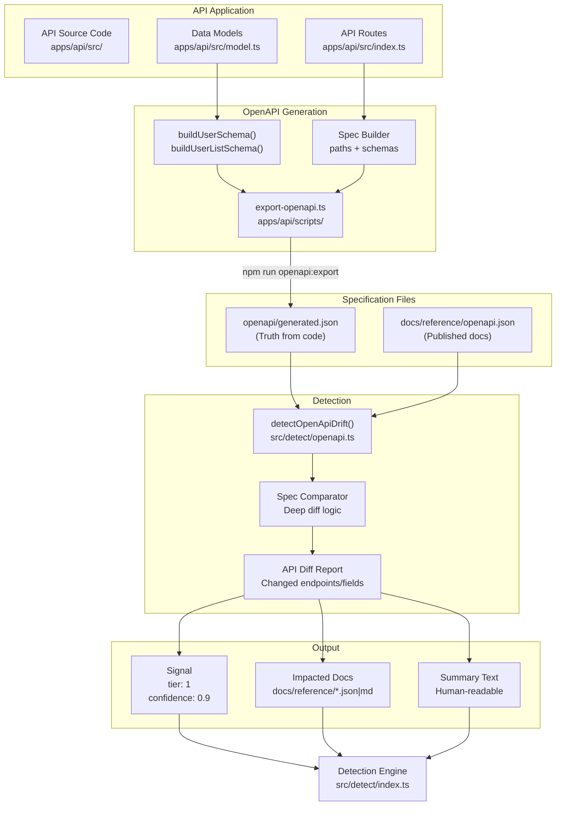
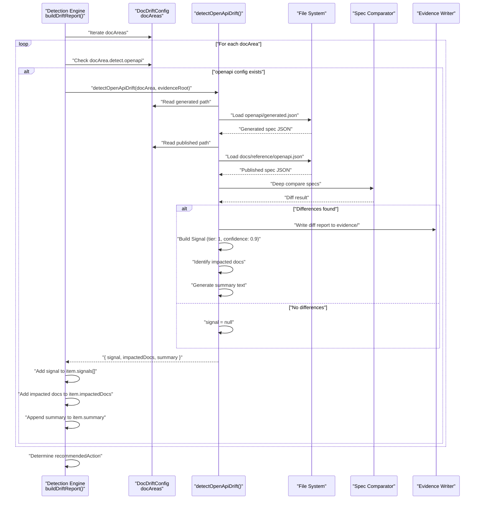
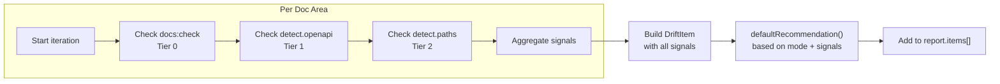

# Tier 1: OpenAPI Drift

<details>
<summary>Relevant source files</summary>

The following files were used as context for generating this wiki page:

- [.gitignore](.gitignore)
- [README.md](README.md)
- [docdrift.schema.json](docdrift.schema.json)
- [src/config/normalize.ts](src/config/normalize.ts)
- [src/config/schema.ts](src/config/schema.ts)
- [src/detect/index.ts](src/detect/index.ts)
- [test/config.test.ts](test/config.test.ts)

</details>


## Purpose and Scope

This document describes Tier 1 of the DocDrift detection system, which detects API documentation drift by comparing OpenAPI specifications. Tier 1 is specifically designed for autogen documentation drift where the source of truth is code and the documentation is structurally derived from API definitions.

For basic documentation validation checks, see [Tier 0: Basic Checks](#4.1). For heuristic-based conceptual drift detection, see [Tier 2: Heuristic Impacts](#4.3). For the overall detection system architecture, see [Detection System](#4).

**Sources**: README.md:25-26, README.md:48-52

---

## Detection Strategy

Tier 1 detection operates on a simple principle: **generated specification vs published specification comparison**. When API code changes, a fresh OpenAPI spec is generated from the codebase. This generated spec is then compared against the published spec that exists in the documentation. Any differences indicate that the documentation has drifted from the current API implementation.

This approach provides:
- **High confidence** signals (tier 1) because differences represent objective structural changes
- **Precise identification** of what changed (endpoints, fields, types, descriptions)
- **Automated remediation** potential since the fix is deterministic (update docs to match generated spec)

**Sources**: README.md:25-26, README.md:52

---

## System Architecture

The following diagram illustrates the components involved in Tier 1 detection:



**Sources**: apps/api/scripts/export-openapi.ts:1-52, src/detect/index.ts:64-71, README.md:48-52

---

## OpenAPI Spec Generation

### Export Script Implementation

The OpenAPI specification is generated by [apps/api/scripts/export-openapi.ts:1-52](). This script constructs an OpenAPI 3.1.0 specification by calling schema-building functions from the API's data models.

The generation process:
1. **Import model builders** from `apps/api/src/model.ts` (functions `buildUserSchema()` and `buildUserListSchema()`)
2. **Construct spec object** with `info`, `paths`, and endpoint definitions
3. **Write to file** at `openapi/generated.json`

**Key code constructs**:
- `buildUserSchema()`: Generates the JSON Schema for individual user objects
- `buildUserListSchema()`: Generates the JSON Schema for paginated user lists
- Spec structure: OpenAPI 3.1.0 with paths, parameters, and response schemas

**Sources**: apps/api/scripts/export-openapi.ts:1-52

---

### Generated Spec Structure

The generated specification at [openapi/generated.json:1-142]() follows this structure:

| Section | Description | Example |
|---------|-------------|---------|
| **openapi** | Version identifier | `"3.1.0"` |
| **info** | API metadata | `{ "title": "DataStack API", "version": "1.0.0" }` |
| **paths** | Endpoint definitions | `/v1/users/{id}`, `/v1/users` |
| **parameters** | Path/query parameters | `id` (path), `page`/`limit` (query) |
| **responses** | Response schemas | `200` with JSON schemas |
| **schema properties** | Field definitions | `id`, `fullName`, `email`, `avatarUrl`, `createdAt`, `role` |
| **required fields** | Mandatory properties | All fields marked required |

The current generated spec defines:
- **GET /v1/users/{id}**: Retrieve a single user by ID
- **GET /v1/users**: List users with pagination (`page`, `limit` parameters)

**Sources**: openapi/generated.json:1-142

---

## Detection Flow

The following sequence diagram illustrates how Tier 1 detection is invoked and executed:



**Sources**: src/detect/index.ts:64-71, README.md:48-52

---

## Detection Invocation

Within the main detection engine at [src/detect/index.ts:64-71](), Tier 1 detection is conditionally invoked based on configuration:

```typescript
if (docArea.detect.openapi) {
  const openapiResult = await detectOpenApiDrift(docArea, evidenceRoot);
  if (openapiResult.signal) {
    signals.push(openapiResult.signal);
  }
  openapiResult.impactedDocs.forEach((doc) => impactedDocs.add(doc));
  summaries.push(openapiResult.summary);
}
```

The detection runs if the doc area has an `openapi` detection configuration defined. The function `detectOpenApiDrift()` (implemented in `src/detect/openapi.ts`) performs the actual comparison and returns:

| Return Property | Type | Description |
|-----------------|------|-------------|
| **signal** | `Signal \| null` | If drift detected, a signal with `tier: 1`, `confidence: 0.9`, `type: "openapi-drift"` |
| **impactedDocs** | `string[]` | List of documentation files that need updates (typically `openapi.json` and derived docs) |
| **summary** | `string` | Human-readable description of detected drift |

**Sources**: src/detect/index.ts:64-71

---

## Signal Characteristics

Tier 1 OpenAPI drift signals have specific characteristics that influence policy decisions:

| Property | Value | Rationale |
|----------|-------|-----------|
| **tier** | `1` | High-priority detection tier |
| **confidence** | `0.9` | High confidence (objective structural comparison) |
| **type** | `"openapi-drift"` | Identifies detection mechanism |
| **evidence** | Diff file path | Points to detailed comparison in evidence bundle |

### Policy Implications

Due to high confidence and low tier, OpenAPI drift signals typically result in automated remediation:

1. **Autogen mode**: `recommendedAction = "OPEN_PR"` if `tier <= 1` ([src/detect/index.ts:15]())
2. **Confidence gating**: Passes `autopatchThreshold` checks (see [Policy Engine](#5))
3. **Devin routing**: High-confidence signals route to Devin for automated PR generation

**Sources**: src/detect/index.ts:10-18, README.md:16-21

---

## Configuration Schema

Tier 1 detection requires specific configuration in the doc area's `detect.openapi` section:

```yaml
docAreas:
  - name: api_reference
    mode: autogen
    detect:
      openapi:
        generated: "openapi/generated.json"
        published: "docs/reference/openapi.json"
        exportCommand: "npm run openapi:export"
```

| Field | Required | Description |
|-------|----------|-------------|
| **generated** | Yes | Path to generated spec (output of export command) |
| **published** | Yes | Path to published spec in documentation |
| **exportCommand** | Yes | Command to regenerate spec from code |

The export command is executed before comparison to ensure the generated spec reflects the current codebase state.

**Sources**: README.md:48-52, apps/api/scripts/export-openapi.ts:48-51

---

## Integration Points

### Integration with Detection Engine

The detection engine at [src/detect/index.ts:54-94]() orchestrates all three tiers:



For each configured doc area, Tier 1 runs after Tier 0 and before Tier 2, with all signals aggregated into a single `DriftItem` for that area.

**Sources**: src/detect/index.ts:54-94

---

### Integration with Evidence System

Tier 1 detection writes evidence to the evidence bundle:

**Evidence directory structure**:
```
.docdrift/evidence/{runId}/{docArea}/
  ├── openapi_diff.json       # Detailed field-by-field comparison
  ├── generated_spec.json     # Copy of generated spec
  ├── published_spec.json     # Copy of published spec
  └── manifest.json           # Evidence metadata
```

This evidence is later packaged into a tarball and uploaded to Devin sessions for PR generation. For more details, see [Evidence Bundles](#6.1).

**Sources**: src/detect/index.ts:42-43, README.md:38

---

## Recommended Action Determination

The `defaultRecommendation()` function at [src/detect/index.ts:10-18]() determines the initial recommended action based on mode and signal tiers:

**Logic**:
```
if no signals: NOOP
if mode == "autogen":
  if any signal has tier <= 1: OPEN_PR
  else: OPEN_ISSUE
if mode == "conceptual": OPEN_ISSUE
```

For Tier 1 OpenAPI drift:
- In **autogen mode**: `OPEN_PR` (high confidence, automated fix)
- In **conceptual mode**: `OPEN_ISSUE` (escalate to human)

The final action may be modified by the policy engine based on caps, existing PRs, and state (see [Policy Engine](#5)).

**Sources**: src/detect/index.ts:10-18

---

## Typical Drift Scenarios

### Scenario 1: Field Added to API

**Code change**: Add `avatarUrl` field to `User` model
**Generated spec**: Includes `avatarUrl` in schema with `type: "string"`
**Published spec**: Does not have `avatarUrl` field
**Detection**: Tier 1 identifies missing field in published docs
**Outcome**: High-confidence `OPEN_PR` recommendation

### Scenario 2: Endpoint Added

**Code change**: Implement `GET /v1/users` with pagination
**Generated spec**: New path with `page`/`limit` parameters
**Published spec**: Only has `GET /v1/users/{id}`
**Detection**: Tier 1 identifies missing endpoint
**Outcome**: High-confidence `OPEN_PR` recommendation

### Scenario 3: Field Renamed

**Code change**: Rename `name` → `fullName` in API response
**Generated spec**: Field called `fullName`
**Published spec**: Field called `name`
**Detection**: Tier 1 identifies removed field (`name`) and added field (`fullName`)
**Outcome**: High-confidence `OPEN_PR` recommendation

**Sources**: README.md:180-181, openapi/generated.json:32-34

---

## Relationship to Other Tiers

| Tier | Focus | Confidence | Typical Action |
|------|-------|------------|----------------|
| **Tier 0** | Build validation | High (1.0) | Blocks until fixed |
| **Tier 1** | Structural API drift | High (0.9) | Automated PR |
| **Tier 2** | Heuristic impacts | Medium (0.5-0.7) | Issue escalation |

Tier 1 sits between verification (Tier 0) and heuristics (Tier 2), providing high-confidence detection for structural API changes that can be automatically remediated.

**Sources**: README.md:23-26, src/detect/index.ts:10-18

---