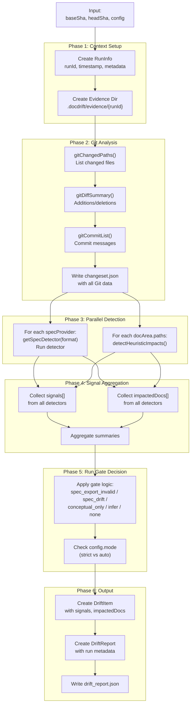
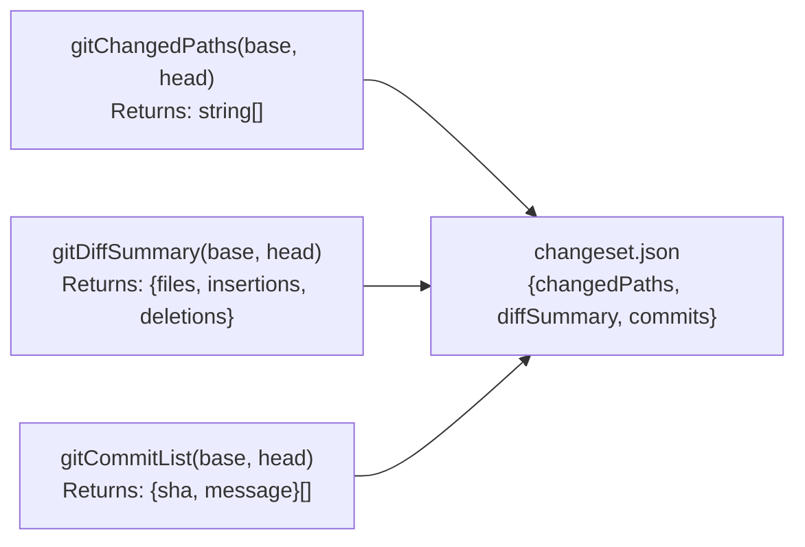
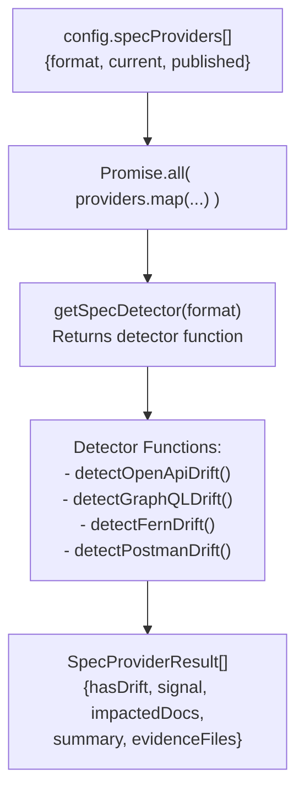
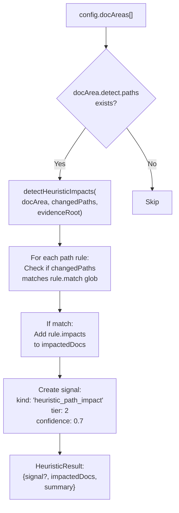
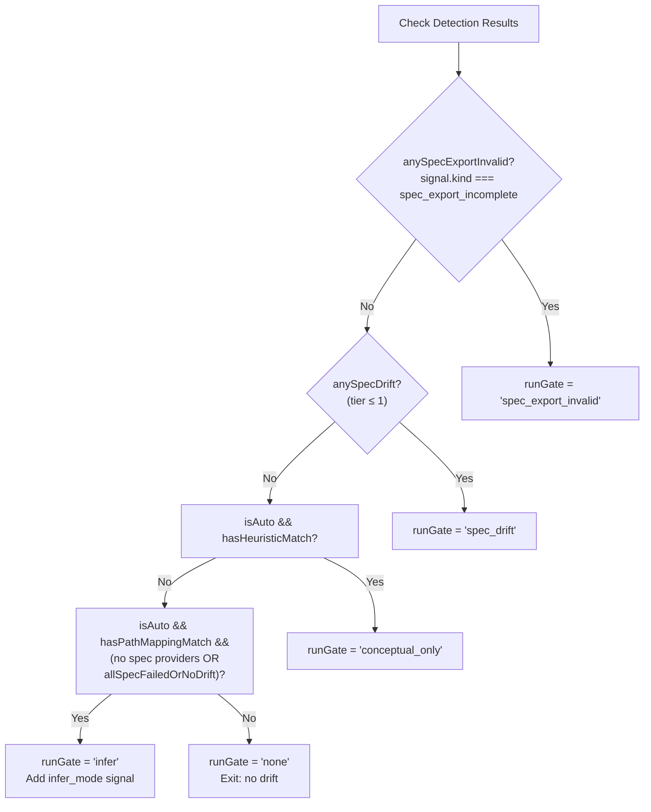
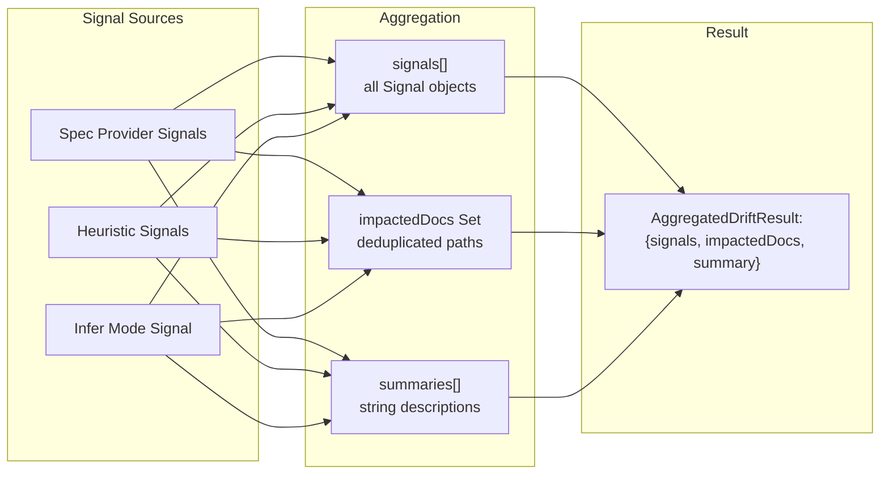
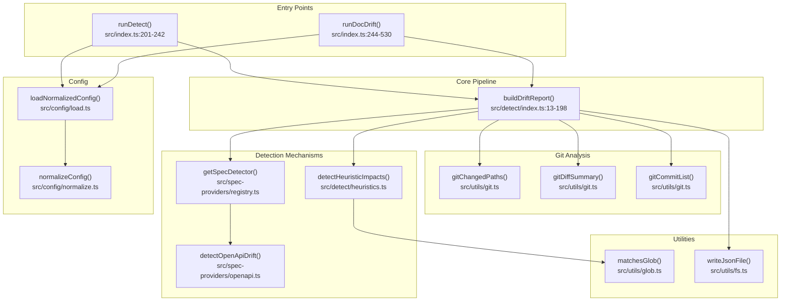

# Detection Pipeline

<details>
<summary>Relevant source files</summary>

The following files were used as context for generating this wiki page:

- [docdrift-yml.md](docdrift-yml.md)
- [docdrift.schema.json](docdrift.schema.json)
- [src/config/normalize.ts](src/config/normalize.ts)
- [src/config/schema.ts](src/config/schema.ts)
- [src/detect/index.ts](src/detect/index.ts)
- [src/index.ts](src/index.ts)
- [test/config.test.ts](test/config.test.ts)

</details>


The detection pipeline is the core orchestration layer that analyzes code changes, detects documentation drift, and determines whether remediation is warranted. It coordinates Git analysis, spec provider execution, path mapping heuristics, and applies run gate logic to produce a drift report with aggregated signals.

This page focuses on the `buildDriftReport` function and its orchestration of detection mechanisms. For details on individual detection mechanisms, see [Spec Provider Detection](#6.2) and [Path Mapping Heuristics](#6.3). For the decision logic that follows detection, see [Run Gate Logic](#6.4).

---

## Pipeline Overview

The detection pipeline is implemented in the `buildDriftReport` function, which accepts Git SHAs and configuration, then returns a comprehensive drift report.

**Pipeline Stages**



**Sources:** [src/detect/index.ts:13-198]()

---

## Function Signature and Return Type

The `buildDriftReport` function is the entry point for all drift detection operations.

```typescript
export async function buildDriftReport(input: {
  config: NormalizedDocDriftConfig;
  repo: string;
  baseSha: string;
  headSha: string;
  trigger: RunInfo["trigger"];
  prNumber?: number;
}): Promise<{
  report: DriftReport;
  aggregated: AggregatedDriftResult | null;
  changedPaths: string[];
  evidenceRoot: string;
  runInfo: RunInfo;
  hasOpenApiDrift: boolean;
  runGate: RunGate;
}>
```

**Input Parameters**

| Parameter | Type | Description |
|-----------|------|-------------|
| `config` | `NormalizedDocDriftConfig` | Normalized configuration with spec providers, docsite, policy |
| `repo` | `string` | Repository identifier (e.g., "owner/repo") |
| `baseSha` | `string` | Git commit SHA for the base state |
| `headSha` | `string` | Git commit SHA for the head state |
| `trigger` | `"push" \| "manual" \| "schedule" \| "pull_request"` | Event that triggered the run |
| `prNumber` | `number \| undefined` | Pull request number if trigger is "pull_request" |

**Return Values**

| Field | Type | Description |
|-------|------|-------------|
| `report` | `DriftReport` | Complete drift report with items array |
| `aggregated` | `AggregatedDriftResult \| null` | Aggregated signals and impacted docs (null if no drift) |
| `changedPaths` | `string[]` | List of files changed between base and head |
| `evidenceRoot` | `string` | Path to evidence directory for this run |
| `runInfo` | `RunInfo` | Metadata about the run (runId, timestamp, etc.) |
| `hasOpenApiDrift` | `boolean` | True if any spec provider detected drift |
| `runGate` | `RunGate` | Gate decision: "spec_export_invalid", "spec_drift", "conceptual_only", "infer", or "none" |

**Sources:** [src/detect/index.ts:13-28](), [src/model/types.ts]()

---

## Phase 1: Context Setup

The pipeline begins by creating run metadata and preparing the evidence directory.

### RunInfo Creation

`RunInfo` captures immutable metadata about the detection run:

```typescript
const runInfo: RunInfo = {
  runId: `${Date.now()}`,
  repo: input.repo,
  baseSha: input.baseSha,
  headSha: input.headSha,
  trigger: input.trigger,
  timestamp: new Date().toISOString(),
  prNumber: input.prNumber,
};
```

**Sources:** [src/detect/index.ts:29-37]()

### Evidence Directory

All detection artifacts are written to `.docdrift/evidence/{runId}/`:

```typescript
const evidenceRoot = path.resolve(".docdrift", "evidence", runInfo.runId);
ensureDir(evidenceRoot);
```

This directory contains:
- `changeset.json` - Git diff data
- Spec provider outputs (e.g., OpenAPI diffs)
- Path heuristic evidence files

**Sources:** [src/detect/index.ts:39-40]()

---

## Phase 2: Git Analysis

The pipeline queries Git for changes between `baseSha` and `headSha`.

### Git Utilities



### Changeset File

All Git analysis results are written to `changeset.json` for inclusion in evidence bundles:

```typescript
writeJsonFile(path.join(evidenceRoot, "changeset.json"), {
  changedPaths,
  diffSummary,
  commits,
});
```

This file is later uploaded to Devin as evidence and used by heuristic detection.

**Sources:** [src/detect/index.ts:42-50](), [src/utils/git.ts]()

---

## Phase 3: Spec Provider Execution

Spec providers run in parallel to detect API specification drift.

### Spec Provider Registry



### Parallel Execution

```typescript
const providerResults: SpecProviderResult[] = [];
if (config.specProviders.length > 0) {
  const results = await Promise.all(
    config.specProviders.map(async (provider) => {
      const detector = getSpecDetector(provider.format);
      return detector(provider, evidenceRoot);
    })
  );
  providerResults.push(...results);
}
```

Each detector returns:
- `hasDrift: boolean` - Whether drift was detected
- `signal: Signal` - Evidence with tier and confidence
- `impactedDocs: string[]` - Doc paths affected
- `summary: string` - Human-readable description
- `evidenceFiles: string[]` - Paths to evidence artifacts

**Sources:** [src/detect/index.ts:58-68](), [src/spec-providers/registry.ts]()

### Tier-1 Drift Detection

The pipeline distinguishes between high-confidence spec drift (tier ≤ 1) and lower-confidence signals:

```typescript
const anySpecDrift = providerResults.some((r) => r.hasDrift && r.signal && r.signal.tier <= 1);
```

**Sources:** [src/detect/index.ts:70-73]()

---

## Phase 4: Path Heuristic Detection

For each `docArea` with `detect.paths` rules, the pipeline runs heuristic detection.

### Heuristic Detection Flow



### Path Matching

```typescript
for (const docArea of config.docAreas) {
  if (docArea.detect.paths?.length) {
    const heuristicResult = detectHeuristicImpacts(docArea, changedPaths, evidenceRoot);
    if (heuristicResult.signal) {
      signals.push(heuristicResult.signal);
      heuristicResult.impactedDocs.forEach((d) => impactedDocs.add(d));
      summaries.push(heuristicResult.summary);
    }
  }
}
```

**Sources:** [src/detect/index.ts:87-96](), [src/detect/heuristics.ts]()

### Path Mappings Check

The pipeline also checks top-level `pathMappings` for conceptual drift:

```typescript
const pathMappings = config.pathMappings ?? [];
const hasPathMappingMatch =
  pathMappings.length > 0 &&
  changedPaths.some((p) => pathMappings.some((m) => matchesGlob(m.match, p)));
```

**Sources:** [src/detect/index.ts:99-102]()

---

## Phase 5: Run Gate Logic

The run gate determines whether to proceed with remediation and what mode to use.

### Gate Decision Tree



### Gate Implementation

```typescript
const isAuto = config.mode === "auto";
let runGate: RunGate = "none";

if (anySpecExportInvalid) {
  runGate = "spec_export_invalid";
} else if (anySpecDrift) {
  runGate = "spec_drift";
} else if (isAuto && hasHeuristicMatch) {
  runGate = "conceptual_only";
} else if (
  isAuto &&
  hasPathMappingMatch &&
  (config.specProviders.length === 0 || allSpecFailedOrNoDrift)
) {
  runGate = "infer";
  // Add infer_mode signal...
}
```

**RunGate Values**

| Gate | Meaning | Triggers When |
|------|---------|---------------|
| `spec_export_invalid` | Exported spec failed completeness validation | Any spec provider returns signal.kind === "spec_export_incomplete" |
| `spec_drift` | High-confidence API spec drift detected | Any spec provider reports tier ≤ 1 drift |
| `conceptual_only` | Path heuristics matched (no spec drift) | `mode: auto` and heuristic signals present |
| `infer` | Infer docs from file changes | `mode: auto`, pathMappings match, no spec providers or all failed |
| `none` | No drift detected | No signals or mode is `strict` |

**Sources:** [src/detect/index.ts:104-136]()

### Infer Mode Signal

When the gate is `infer`, a synthetic signal is created:

```typescript
if (signals.length === 0) {
  signals.push({
    kind: "infer_mode",
    tier: 2,
    confidence: 0.6,
    evidence: [path.join(evidenceRoot, "changeset.json")],
  });
  changedPaths.forEach((p) => impactedDocs.add(p));
  summaries.push("Infer mode: no spec drift; infer docs from file changes.");
}
```

**Sources:** [src/detect/index.ts:126-135]()

---

## Phase 6: Signal Aggregation

After all detection mechanisms run, signals and impacted docs are aggregated.

### Aggregation Structure



### Aggregated Result

```typescript
const aggregated: AggregatedDriftResult = {
  signals,
  impactedDocs: [...impactedDocs],
  summary: summaries.filter(Boolean).join(" | "),
};
```

**Signal Structure**

| Field | Type | Description |
|-------|------|-------------|
| `kind` | `string` | Signal type (e.g., "openapi_diff", "heuristic_path_impact") |
| `tier` | `number` | Confidence tier (1 = high, 2 = medium, 3 = low) |
| `confidence` | `number` | Confidence score 0-1 |
| `evidence` | `string[]` | Paths to evidence files |

**Sources:** [src/detect/index.ts:53-56](), [src/detect/index.ts:161-165](), [src/model/types.ts]()

---

## Phase 7: DriftItem and DriftReport Construction

The final output structures are built from aggregated data.

### DriftItem Creation

```typescript
const item: DriftItem = {
  docArea: "docsite",
  mode: runGate === "conceptual_only" ? "conceptual" : "autogen",
  signals: aggregated.signals,
  impactedDocs: aggregated.impactedDocs,
  recommendedAction: aggregated.signals.some((s) => s.tier <= 1) ? "OPEN_PR" : "OPEN_ISSUE",
  summary: aggregated.summary,
};
```

**Mode Assignment**

- `conceptual_only` gate → `mode: "conceptual"`
- All other gates → `mode: "autogen"`

**Recommended Action**

- Any tier-1 signal → `"OPEN_PR"`
- Otherwise → `"OPEN_ISSUE"`

**Sources:** [src/detect/index.ts:167-174]()

### DriftReport Structure

```typescript
const report: DriftReport = {
  run: {
    repo: input.repo,
    baseSha: input.baseSha,
    headSha: input.headSha,
    trigger: input.trigger,
    timestamp: runInfo.timestamp,
  },
  items: [item],
};
```

The report contains:
- `run` - Metadata about the detection run
- `items` - Array of `DriftItem` objects (typically 1 in simple config)

**Sources:** [src/detect/index.ts:176-185]()

### File Output

The report is written to `.docdrift/drift_report.json`:

```typescript
writeJsonFile(path.resolve(".docdrift", "drift_report.json"), report);
```

This file is consumed by:
- The policy engine ([see Policy Engine](#7))
- Evidence bundle builder ([see Evidence Bundles](#8.2))
- GitHub comment rendering ([see Issues and Notifications](#9.3))

**Sources:** [src/detect/index.ts:187]()

---

## Early Exit: No Drift Path

When `runGate === "none"`, the pipeline returns immediately without creating a drift item:

```typescript
if (runGate === "none") {
  const report: DriftReport = {
    run: {
      repo: input.repo,
      baseSha: input.baseSha,
      headSha: input.headSha,
      trigger: input.trigger,
      timestamp: runInfo.timestamp,
    },
    items: [],
  };
  writeJsonFile(path.resolve(".docdrift", "drift_report.json"), report);
  return {
    report,
    aggregated: null,
    changedPaths,
    evidenceRoot,
    runInfo,
    hasOpenApiDrift: false,
    runGate: "none",
  };
}
```

**Sources:** [src/detect/index.ts:138-159]()

---

## Integration Points

The detection pipeline is called from two main entry points:

### runDetect Command

The `detect` command runs the pipeline but does not trigger remediation:

```typescript
export async function runDetect(options: DetectOptions): Promise<{ hasDrift: boolean }> {
  const config = loadConfig();
  const runtimeValidation = await validateRuntimeConfig(config);
  // ... validation
  const normalized = loadNormalizedConfig();

  const { report, runGate } = await buildDriftReport({
    config: normalized,
    repo,
    baseSha: options.baseSha,
    headSha: options.headSha,
    trigger: options.trigger ?? "manual",
    prNumber: options.prNumber,
  });

  if (report.items.length === 0) {
    logInfo("No documentation drift detected.");
    return { hasDrift: false };
  }
  // ... display output
}
```

**Sources:** [src/index.ts:201-242]()

### runDocDrift Command

The `run` command executes the pipeline, then proceeds to policy evaluation and remediation:

```typescript
export async function runDocDrift(options: DetectOptions): Promise<RunResult[]> {
  // ... load config
  
  const { report, aggregated, runInfo, evidenceRoot, runGate } =
    await buildDriftReport({
      config: normalized,
      repo,
      baseSha: options.baseSha,
      headSha: options.headSha,
      trigger: options.trigger ?? "manual",
      prNumber: options.prNumber,
    });

  if (runGate === "none" || report.items.length === 0) {
    logInfo("No drift; skipping session");
    return [];
  }
  
  // ... proceed to policy engine and Devin session
}
```

**Sources:** [src/index.ts:244-530]()

---

## Configuration Impact on Detection

The detection pipeline behavior is controlled by several config fields:

### config.mode

| Mode | Behavior |
|------|----------|
| `strict` | Only runs on spec drift (ignores pathMappings unless spec drift present) |
| `auto` | Runs on spec drift OR pathMappings matches (enables infer mode) |

**Sources:** [src/detect/index.ts:105-116]()

### config.specProviders

Controls which spec detectors are invoked. Each provider runs in parallel:

```typescript
config.specProviders.map(async (provider) => {
  const detector = getSpecDetector(provider.format);
  return detector(provider, evidenceRoot);
})
```

Supported formats: `openapi3`, `swagger2`, `graphql`, `fern`, `postman`

**Sources:** [src/detect/index.ts:62-65](), [src/config/schema.ts:33]()

### config.docAreas[].detect.paths

Defines path mapping rules for heuristic detection. Each rule has:
- `match` - Glob pattern for code paths
- `impacts` - Doc paths affected when match changes

**Sources:** [src/detect/index.ts:87-96](), [src/config/schema.ts:4-7]()

### config.pathMappings

Top-level path mappings (simple config). Enables infer mode when no spec providers are configured or all fail:

```typescript
else if (
  isAuto &&
  hasPathMappingMatch &&
  (config.specProviders.length === 0 || allSpecFailedOrNoDrift)
)
```

**Sources:** [src/detect/index.ts:111-115]()

---

## Detection Pipeline Code Map

**Key Functions and Files**



**Sources:** [src/index.ts:201-530](), [src/detect/index.ts:1-199](), [src/utils/git.ts](), [src/spec-providers/registry.ts](), [src/detect/heuristics.ts]()

---

## Summary

The detection pipeline orchestrates drift detection through a six-phase process:

1. **Context Setup** - Create run metadata and evidence directory
2. **Git Analysis** - Query changed files, diff summary, and commits
3. **Parallel Detection** - Execute spec providers and path heuristics
4. **Signal Aggregation** - Collect and deduplicate all detection signals
5. **Run Gate Decision** - Determine if/how to proceed based on mode and signals
6. **Output Construction** - Build DriftItem, DriftReport, and write to disk

The pipeline's output (drift report, run gate, aggregated signals) drives all downstream operations: policy evaluation, evidence bundling, Devin session creation, and GitHub comment rendering.

**Sources:** [src/detect/index.ts:13-198](), [src/index.ts:201-530]()

---