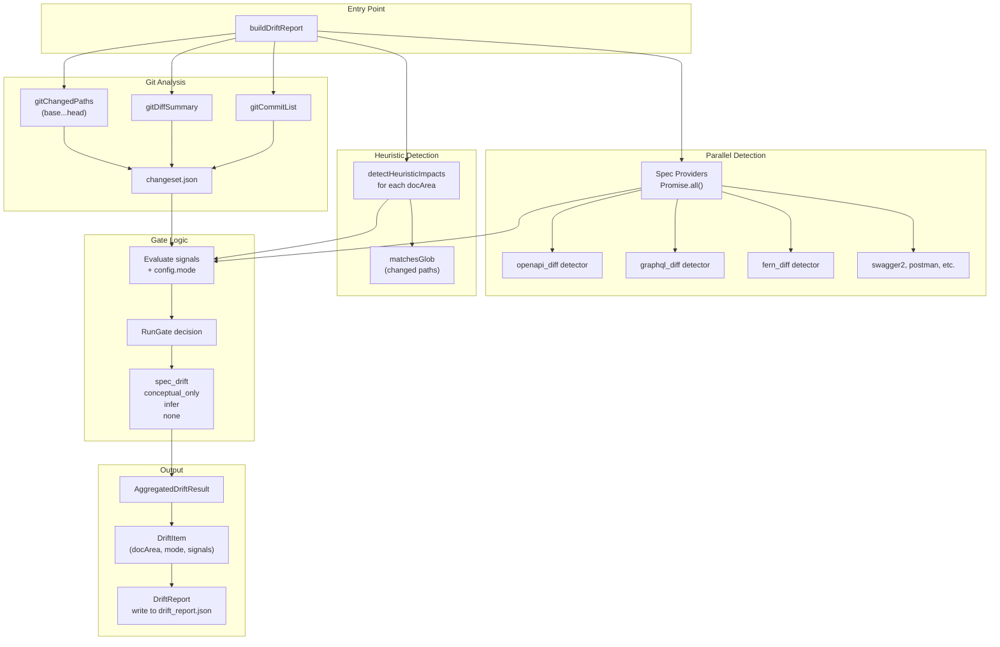
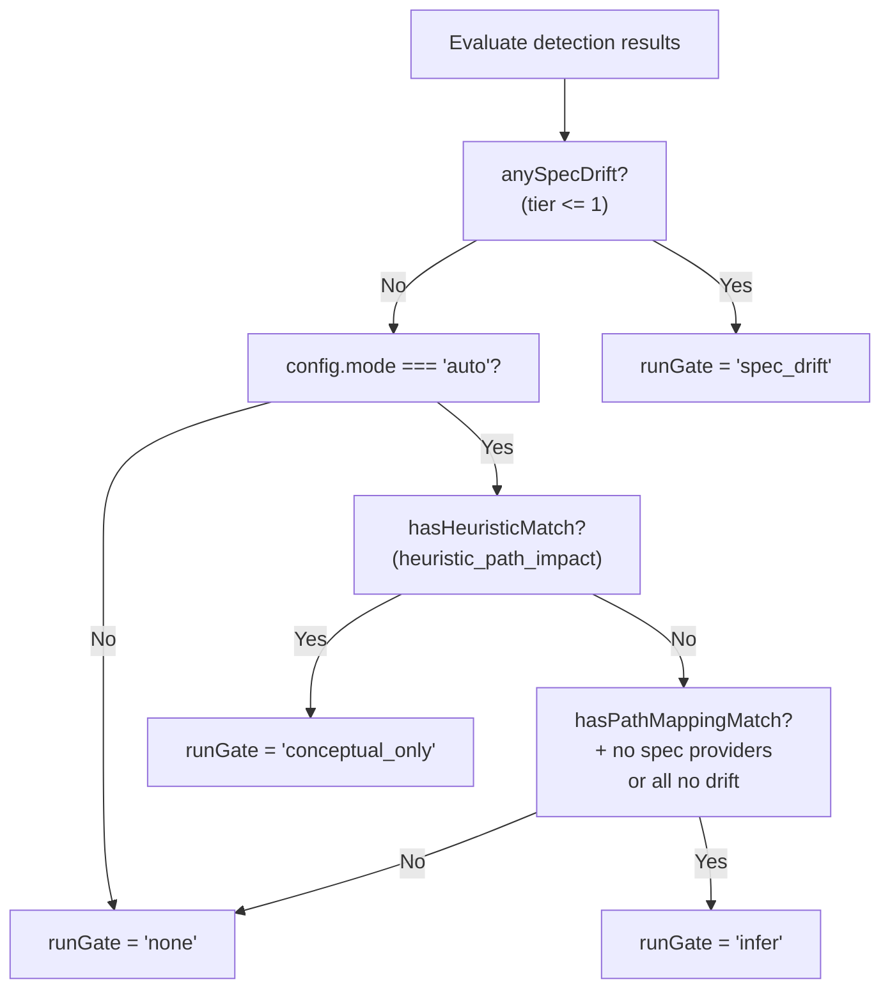
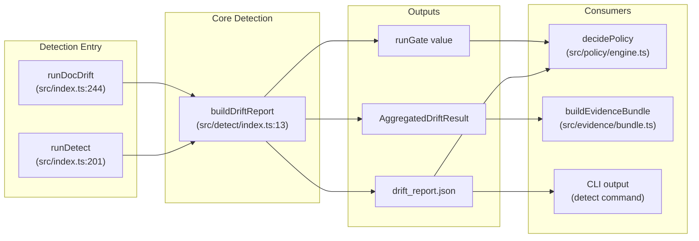

# Drift Detection System

<details>
<summary>Relevant source files</summary>

The following files were used as context for generating this wiki page:

- [.gitignore](.gitignore)
- [README.md](README.md)
- [docdrift-yml.md](docdrift-yml.md)
- [docdrift.schema.json](docdrift.schema.json)
- [src/config/normalize.ts](src/config/normalize.ts)
- [src/config/schema.ts](src/config/schema.ts)
- [src/detect/index.ts](src/detect/index.ts)
- [src/index.ts](src/index.ts)
- [test/config.test.ts](test/config.test.ts)

</details>


## Purpose and Scope

The drift detection system analyzes code changes between two Git commits to determine if documentation updates are required. It compares API specifications, evaluates path-based heuristics, and produces structured drift reports that feed into the policy engine and remediation pipeline.

This page covers the detection orchestration, mechanisms, and gate logic. For details on individual detection methods, see [Spec Provider Detection](#6.2) and [Path Mapping Heuristics](#6.3). For the decision-making that follows detection, see [Policy Engine](#7).

**Sources**: [src/detect/index.ts:1-199](), [README.md:46-57]()

---

## Core Responsibilities

The drift detection system performs five primary functions:

| Function | Implementation | Output |
|----------|---------------|--------|
| **Git analysis** | Extract changed paths, diff summary, commits between base and head SHAs | `changeset.json` in evidence directory |
| **Spec provider execution** | Run all configured spec providers (OpenAPI, GraphQL, etc.) in parallel | Per-provider drift signals and evidence files |
| **Path heuristics** | Match changed code paths against `pathMappings` rules | Heuristic signals identifying impacted docs |
| **Run gate decision** | Evaluate signals and mode to determine if remediation should proceed | `RunGate` enum: `spec_drift`, `conceptual_only`, `infer`, or `none` |
| **Report generation** | Aggregate signals, impacted docs, and summaries | `drift_report.json` at `.docdrift/drift_report.json` |

**Sources**: [src/detect/index.ts:13-198](), [src/index.ts:244-264]()

---

## Detection Architecture



**Diagram**: Detection pipeline from `buildDriftReport` entry point through all detection mechanisms to final report output.

**Sources**: [src/detect/index.ts:13-198](), [src/spec-providers/registry.ts](), [src/detect/heuristics.ts]()

---

## Detection Mechanisms

The system employs three detection mechanisms, executed in priority order:

### 1. Spec Provider Detection (Tier 1 - Highest Confidence)

Spec providers compare API specifications to detect structural changes. Each provider:
- Executes its detection logic (e.g., `detectOpenApiDrift` for OpenAPI)
- Returns a `SpecProviderResult` with `hasDrift`, `signal`, `impactedDocs`, and `evidenceFiles`
- Signals from spec providers have `tier <= 1`, indicating high confidence

**Supported formats**: `openapi3`, `swagger2`, `graphql`, `fern`, `postman`

**Configuration**: `config.specProviders` array, each with `format`, `current` (source), and `published` (path)

```typescript
// From src/detect/index.ts:58-84
const providerResults: SpecProviderResult[] = [];
if (config.specProviders.length > 0) {
  const results = await Promise.all(
    config.specProviders.map(async (provider) => {
      const detector = getSpecDetector(provider.format);
      return detector(provider, evidenceRoot);
    })
  );
  providerResults.push(...results);
}

const anySpecDrift = providerResults.some((r) => r.hasDrift && r.signal && r.signal.tier <= 1);
```

**Sources**: [src/detect/index.ts:58-84](), [src/spec-providers/registry.ts](), [src/config/schema.ts:33-40]()

### 2. Path Heuristics (Tier 2 - Medium Confidence)

Path-based detection matches changed code files against configured rules:

| Field | Purpose |
|-------|---------|
| `match` | Glob pattern for code paths (e.g., `"apps/api/src/auth/**"`) |
| `impacts` | Doc paths that may need updates when `match` changes |

**Signal generation**: When a changed file matches a `match` pattern, the system:
1. Creates a `heuristic_path_impact` signal with `tier: 2`
2. Adds all `impacts` to the `impactedDocs` set
3. Generates a summary like "Path heuristic: apps/api/src/auth/** → docs/guides/auth.md"

**Configuration**: `config.pathMappings` array or `docAreas[].detect.paths`

**Sources**: [src/detect/heuristics.ts](), [src/detect/index.ts:87-96](), [docdrift-yml.md:163-198]()

### 3. Inference Mode (Tier 2 - Fallback)

When `mode: auto` is set and no spec drift is detected, the system infers potential drift from file changes:

```typescript
// From src/detect/index.ts:111-136
else if (
  isAuto &&
  hasPathMappingMatch &&
  (config.specProviders.length === 0 || allSpecFailedOrNoDrift)
) {
  runGate = "infer";
  // ... collect signals from providers
  if (signals.length === 0) {
    signals.push({
      kind: "infer_mode",
      tier: 2,
      confidence: 0.6,
      evidence: [path.join(evidenceRoot, "changeset.json")],
    });
    changedPaths.forEach((p) => impactedDocs.add(p));
    summaries.push("Infer mode: no spec drift; infer docs from file changes.");
  }
}
```

**Activation**: Requires `mode: auto`, `pathMappings` matching changed files, and either no spec providers or all spec providers returning no drift.

**Sources**: [src/detect/index.ts:111-136](), [src/config/schema.ts:109-110]()

---

## Signal Structure and Evidence

All detection mechanisms produce `Signal` objects:

| Field | Type | Description |
|-------|------|-------------|
| `kind` | `string` | Signal type: `openapi_diff`, `graphql_diff`, `heuristic_path_impact`, `infer_mode`, etc. |
| `tier` | `number` | Confidence tier: 1 (highest), 2 (medium) |
| `confidence` | `number` | Confidence score 0-1 (used by policy engine) |
| `evidence` | `string[]` | Paths to evidence files in `.docdrift/evidence/<runId>/` |

**Signal aggregation**: All signals from all mechanisms are collected into a single `AggregatedDriftResult`:

```typescript
const aggregated: AggregatedDriftResult = {
  signals,
  impactedDocs: [...impactedDocs],
  summary: summaries.filter(Boolean).join(" | "),
};
```

**Sources**: [src/model/types.ts](), [src/detect/index.ts:161-165]()

---

## Run Gate Logic



**Diagram**: Run gate decision tree showing the four possible outcomes based on signals and configuration mode.

### Gate Outcomes

| Gate | Trigger Condition | Remediation Behavior | Typical Signals |
|------|------------------|---------------------|-----------------|
| `spec_drift` | Spec provider detected tier 1 drift | Always proceeds to policy evaluation | `openapi_diff`, `graphql_diff` |
| `conceptual_only` | `mode: auto` + heuristic match + no spec drift | Proceeds to policy (conceptual docs only) | `heuristic_path_impact` |
| `infer` | `mode: auto` + path mapping match + no spec drift | Proceeds to policy with low confidence | `infer_mode` |
| `none` | No drift detected or `mode: strict` without spec drift | Exits early, no session | None |

**Strict mode behavior**: Only `spec_drift` triggers remediation. Heuristics and inference are ignored.

**Auto mode behavior**: `spec_drift`, `conceptual_only`, and `infer` all trigger remediation (subject to policy).

**Sources**: [src/detect/index.ts:105-158](), [README.md:49-53](), [src/index.ts:266-270]()

---

## Drift Report Structure

The `buildDriftReport` function writes `drift_report.json` to `.docdrift/drift_report.json`:

```json
{
  "run": {
    "repo": "owner/name",
    "baseSha": "abc123...",
    "headSha": "def456...",
    "trigger": "push | pull_request | manual | schedule",
    "timestamp": "2024-01-15T10:30:00.000Z"
  },
  "items": [
    {
      "docArea": "docsite",
      "mode": "autogen | conceptual",
      "signals": [
        {
          "kind": "openapi_diff",
          "tier": 1,
          "confidence": 0.95,
          "evidence": [".docdrift/evidence/123456789/openapi_diff.json"]
        }
      ],
      "impactedDocs": ["apps/docs-site/openapi/openapi.json", "apps/docs-site/docs/api/users.mdx"],
      "recommendedAction": "OPEN_PR | OPEN_ISSUE",
      "summary": "OpenAPI spec changed: 3 endpoints added, 1 endpoint modified"
    }
  ]
}
```

**Report consumption**: The drift report is consumed by:
- Policy engine ([src/policy/engine.ts]()) to make PR/issue decisions
- Evidence bundle builder ([src/evidence/bundle.ts]()) for Devin session attachments
- Status/detect commands for user-facing output

**Sources**: [src/detect/index.ts:176-187](), [src/model/types.ts](), [src/index.ts:255-264]()

---

## Detection Pipeline Integration



**Diagram**: Detection system integration showing entry points (`runDetect`, `runDocDrift`) and consumers of detection output.

**CLI command mapping**:
- `docdrift detect` → `runDetect()` → early exit after report generation
- `docdrift run` → `runDocDrift()` → continues to policy and remediation

**Sources**: [src/index.ts:201-242](), [src/index.ts:244-530](), [src/cli.ts]()

---

## Evidence Directory Structure

Each detection run creates a timestamped evidence directory:

```
.docdrift/evidence/<runId>/
├── changeset.json           # Git diff, changed paths, commits
├── openapi_diff.json        # Spec diff (if OpenAPI provider ran)
├── graphql_diff.json        # GraphQL diff (if GraphQL provider ran)
└── attachments/             # Created by evidence bundle builder
    ├── openapi-generated.json
    └── openapi-published.json
```

**Run ID generation**: `runId = Date.now().toString()` (timestamp)

**Evidence root**: `path.resolve(".docdrift", "evidence", runInfo.runId)`

**Sources**: [src/detect/index.ts:29-50](), [src/evidence/bundle.ts]()

---

## Detection Modes: Strict vs Auto

| Mode | Behavior | Use Case |
|------|----------|----------|
| `strict` (default) | Only spec drift triggers remediation. Path heuristics and inference are ignored. | High-confidence automation. Only act when API specs definitively changed. |
| `auto` | Spec drift, path heuristics, and inference all trigger remediation (subject to policy). | Broader automation. Catch conceptual doc drift when code patterns change. |

**Mode configuration**: `mode: "strict" | "auto"` at config root level

**Mode evaluation in detection**:
```typescript
// From src/detect/index.ts:105-136
const isAuto = config.mode === "auto";
let runGate: RunGate = "none";
if (anySpecDrift) {
  runGate = "spec_drift";
} else if (isAuto && hasHeuristicMatch) {
  runGate = "conceptual_only";
} else if (isAuto && hasPathMappingMatch && ...) {
  runGate = "infer";
}
```

**Recommendation**: Start with `strict` mode. Add `pathMappings` and switch to `auto` once detection patterns are validated.

**Sources**: [src/detect/index.ts:105-136](), [src/config/schema.ts:109-110](), [README.md:49-53]()

---

## Detection Performance Characteristics

| Characteristic | Implementation | Impact |
|---------------|---------------|--------|
| **Parallelization** | Spec providers run via `Promise.all()` | Multiple spec formats detected simultaneously |
| **Caching** | Git operations are single-shot per run | No repeated Git commands for same base/head |
| **Evidence size** | Diff files, specs, and changesets stored to disk | `.docdrift/evidence/` grows over time (ignored in git) |
| **Failure isolation** | Spec providers return `hasDrift: false` on error | One provider failure doesn't block others |

**Evidence cleanup**: Evidence directories are gitignored but never auto-deleted. Manual cleanup: `rm -rf .docdrift/evidence/`.

**Sources**: [src/detect/index.ts:58-84](), [.gitignore:5-6]()

---