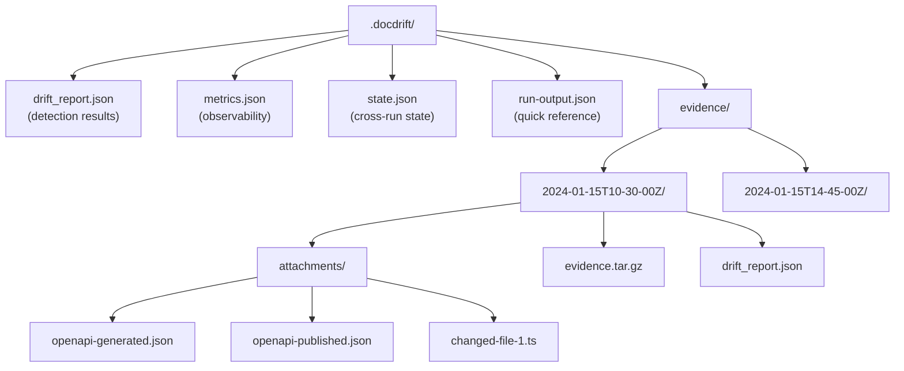
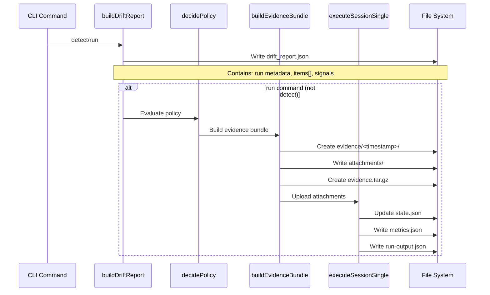
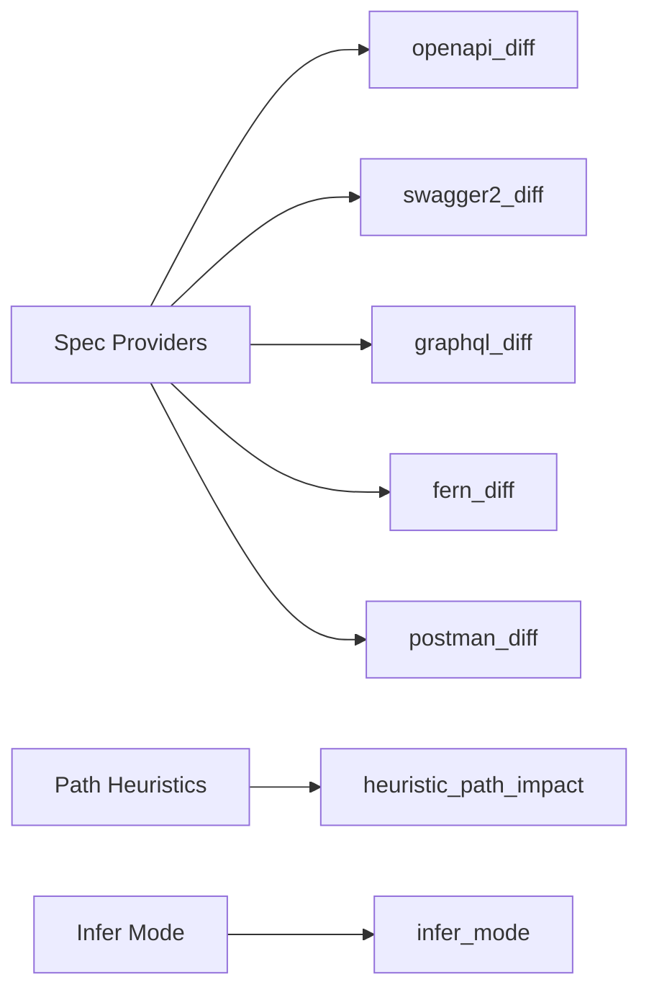
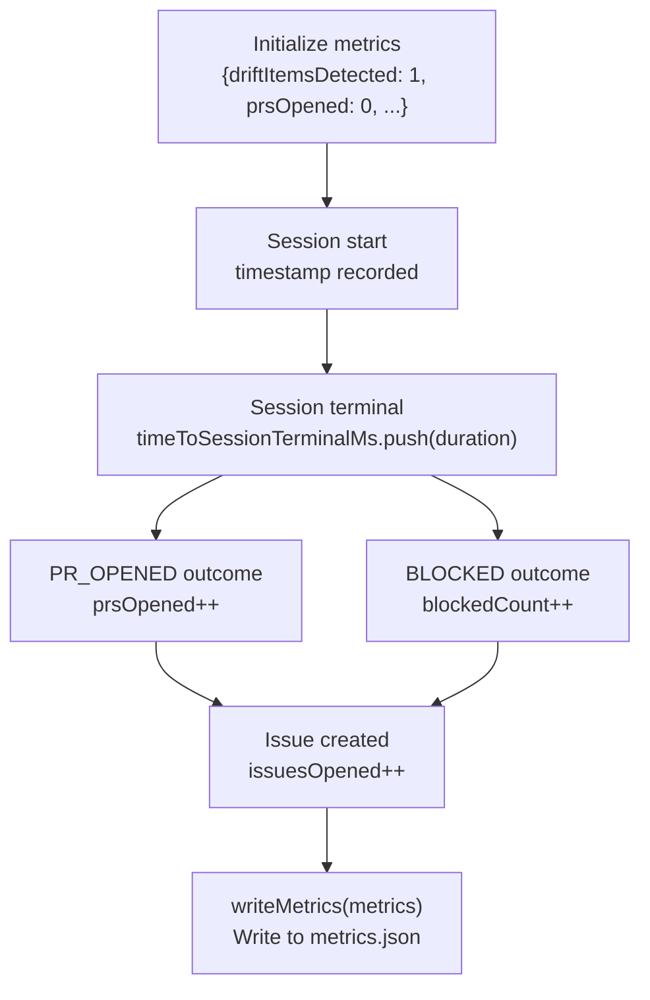
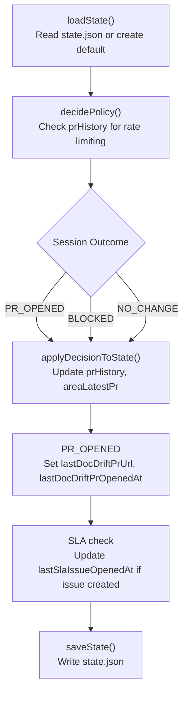
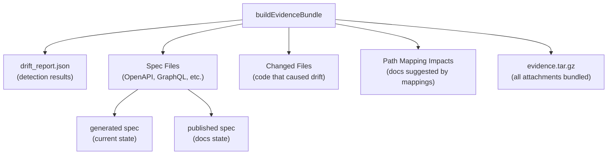
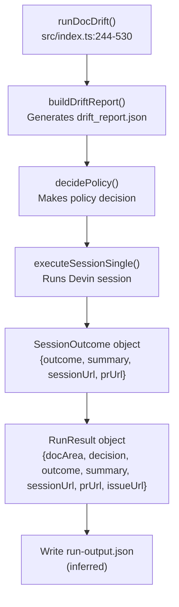
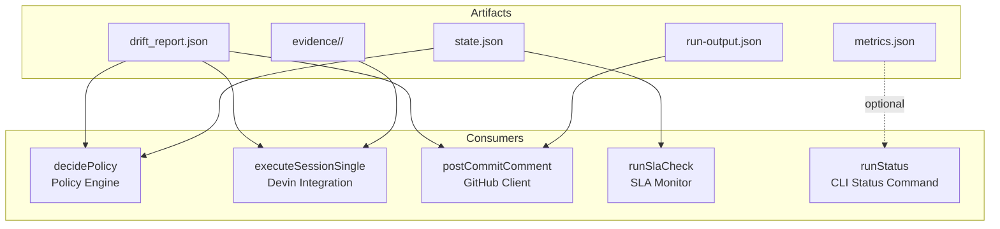

# Output and Artifacts

<details>
<summary>Relevant source files</summary>

The following files were used as context for generating this wiki page:

- [.docdrift/drift_report.json](.docdrift/drift_report.json)
- [docdrift-yml.md](docdrift-yml.md)
- [src/index.ts](src/index.ts)

</details>


This page documents all output files and artifacts produced by docdrift during detection and remediation runs. These artifacts serve multiple purposes: detection results for human review, evidence bundles for Devin AI sessions, metrics for observability, and state persistence for policy enforcement across runs.

Related pages: For the configuration that controls artifact generation, see [Configuration System](#4). For how artifacts are used in Devin sessions, see [Evidence Bundles](#8.2).

---

## Artifact Overview

All docdrift artifacts are written to the `.docdrift/` directory in the repository root. This directory structure persists across runs and is typically added to `.gitignore` to prevent committing ephemeral session data.

| Artifact | Path | Purpose | When Created | Persistence |
|----------|------|---------|--------------|-------------|
| **drift_report.json** | `.docdrift/drift_report.json` | Detection results with signals, impacted docs, and recommended actions | Every detect/run | Overwritten each run |
| **metrics.json** | `.docdrift/metrics.json` | Timing data, counts, policy decisions, observability metrics | Every run (not detect) | Overwritten each run |
| **state.json** | `.docdrift/state.json` | PR history, area tracking, SLA timestamps, rate limiting state | After run completion | Persistent, updated incrementally |
| **evidence/** | `.docdrift/evidence/<timestamp>/` | Timestamped snapshots: drift reports, attachments, changed files | Every run that invokes Devin | Accumulates; old directories remain |
| **run-output.json** | `.docdrift/run-output.json` | Per-area outcomes, session URLs, quick reference data | Every run | Overwritten each run |

---

## Directory Structure



**Sources:** [src/index.ts:1-664](), [src/evidence/bundle.ts]() (inferred from buildEvidenceBundle calls)

---

## Artifact Creation Lifecycle



**Sources:** [src/index.ts:201-242]() (runDetect), [src/index.ts:244-530]() (runDocDrift), [src/evidence/bundle.ts]() (inferred)

---

## drift_report.json

The drift report is the primary detection output, containing all signals, impacted documentation paths, and recommended actions. This file is created by `buildDriftReport` and consumed by policy decisions, evidence bundling, and Devin prompt generation.

### Structure

```json
{
  "run": {
    "repo": "owner/repository",
    "baseSha": "abc123...",
    "headSha": "def456...",
    "trigger": "push | pull_request | manual | schedule",
    "timestamp": "2024-01-15T10:30:00.000Z",
    "prNumber": 123
  },
  "items": [
    {
      "docArea": "docsite",
      "summary": "OpenAPI spec drift detected: 3 endpoints added, 2 modified",
      "confidence": 0.95,
      "signals": [
        {
          "kind": "openapi_diff",
          "confidence": 0.95,
          "description": "3 endpoints added in /api/users",
          "details": { "added": [...], "modified": [...] }
        },
        {
          "kind": "heuristic_path_impact",
          "confidence": 0.7,
          "description": "Changed files match pathMapping: src/auth/**",
          "details": { "matchedRule": {...}, "changedFiles": [...] }
        }
      ],
      "impactedDocs": [
        "apps/docs-site/docs/api/users.md",
        "apps/docs-site/docs/guides/authentication.mdx"
      ],
      "recommendedAction": "UPDATE_PR"
    }
  ]
}
```

### Key Fields

| Field Path | Type | Description |
|------------|------|-------------|
| `run.repo` | string | GitHub repository in `owner/name` format |
| `run.baseSha` | string | Base commit SHA for diff computation |
| `run.headSha` | string | Head commit SHA (current state) |
| `run.trigger` | enum | One of: `push`, `pull_request`, `manual`, `schedule` |
| `run.timestamp` | ISO 8601 | When detection ran |
| `run.prNumber` | number | Optional: source PR number if trigger is `pull_request` |
| `items[]` | array | Array of drift items (one per doc area) |
| `items[].docArea` | string | Doc area identifier (e.g., `"docsite"`, `"api_reference"`) |
| `items[].summary` | string | Human-readable summary of detected drift |
| `items[].confidence` | number | 0-1 confidence score (highest signal confidence) |
| `items[].signals[]` | array | Detection signals that triggered this item |
| `items[].signals[].kind` | enum | Signal type: `openapi_diff`, `graphql_diff`, `heuristic_path_impact`, `infer_mode` |
| `items[].signals[].confidence` | number | Signal-specific confidence (0-1) |
| `items[].signals[].details` | object | Signal-specific metadata (diffs, matched rules, etc.) |
| `items[].impactedDocs` | array | Doc file paths likely affected by this drift |
| `items[].recommendedAction` | enum | Policy suggestion: `UPDATE_PR`, `OPEN_ISSUE`, `NOOP` |

### Signal Kinds



**Sources:** [src/index.ts:187-199]() (signalKindLabel mapping), [src/detect/index.ts]() (buildDriftReport function), [.docdrift/drift_report.json:1-11]() (example structure)

---

## metrics.json

The metrics file captures timing data, counts, and policy decisions for observability. This file is written by `writeMetrics` after each run completes.

### Structure

```json
{
  "driftItemsDetected": 1,
  "prsOpened": 1,
  "issuesOpened": 0,
  "blockedCount": 0,
  "timeToSessionTerminalMs": [45230, 38190],
  "docAreaCounts": {
    "docsite": 1,
    "api_reference": 0
  },
  "noiseRateProxy": 1
}
```

### Key Fields

| Field | Type | Description |
|-------|------|-------------|
| `driftItemsDetected` | number | Total drift items found in this run |
| `prsOpened` | number | Number of PRs opened by Devin in this run |
| `issuesOpened` | number | Number of issues created (human review, SLA, blocked) |
| `blockedCount` | number | Number of sessions that ended with BLOCKED outcome |
| `timeToSessionTerminalMs` | array | Array of session durations in milliseconds |
| `docAreaCounts` | object | Count of items per doc area |
| `noiseRateProxy` | number | Heuristic: currently set to `prsOpened` count |

### Metrics Initialization and Updates

The metrics object is initialized at the start of `runDocDrift` and updated throughout execution:



**Sources:** [src/index.ts:284-292]() (metrics initialization), [src/index.ts:373]() (timing capture), [src/index.ts:390](), [src/index.ts:419](), [src/index.ts:442]() (counter increments), [src/index.ts:311](), [src/index.ts:332](), [src/index.ts:523]() (writeMetrics calls)

---

## state.json

The state file persists data across runs for rate limiting, SLA enforcement, and PR consolidation. This file is managed by `loadState` and `saveState` functions in the policy module.

### Structure

```json
{
  "prHistory": [
    {
      "timestamp": "2024-01-15T10:30:00.000Z",
      "docArea": "docsite",
      "prUrl": "https://github.com/owner/repo/pull/123"
    }
  ],
  "areaLatestPr": {
    "docsite": "https://github.com/owner/repo/pull/123",
    "api_reference": null
  },
  "lastDocDriftPrUrl": "https://github.com/owner/repo/pull/123",
  "lastDocDriftPrOpenedAt": "2024-01-15T10:30:00.000Z",
  "lastSlaIssueOpenedAt": "2024-01-22T14:00:00.000Z"
}
```

### Key Fields

| Field | Type | Description |
|-------|------|-------------|
| `prHistory` | array | Chronological list of all PRs opened by docdrift |
| `prHistory[].timestamp` | ISO 8601 | When the PR was opened |
| `prHistory[].docArea` | string | Doc area identifier |
| `prHistory[].prUrl` | string | GitHub PR URL |
| `areaLatestPr` | object | Map of doc area name to most recent PR URL (or null) |
| `lastDocDriftPrUrl` | string | Most recent PR URL across all areas |
| `lastDocDriftPrOpenedAt` | ISO 8601 | When the most recent PR was opened |
| `lastSlaIssueOpenedAt` | ISO 8601 | When the last SLA reminder issue was created |

### State Updates During Run



**Sources:** [src/index.ts:281]() (loadState), [src/index.ts:324-330](), [src/index.ts:464-476]() (applyDecisionToState calls), [src/index.ts:391-393](), [src/index.ts:472-475]() (lastDocDriftPr updates), [src/index.ts:517]() (lastSlaIssueOpenedAt update), [src/index.ts:477](), [src/index.ts:518]() (saveState calls), [src/policy/state.ts]() (inferred structure)

---

## Evidence Directory

The evidence directory contains timestamped snapshots of all data uploaded to Devin sessions. Each run creates a new subdirectory with ISO 8601 timestamp formatting.

### Directory Structure

```
.docdrift/evidence/
├── 2024-01-15T10-30-00-123Z/
│   ├── evidence.tar.gz          # Archive of all attachments
│   ├── drift_report.json        # Copy of detection results
│   └── attachments/
│       ├── openapi-generated.json
│       ├── openapi-published.json
│       ├── src-users-controller.ts
│       └── src-auth-middleware.ts
└── 2024-01-15T14-45-00-456Z/
    ├── evidence.tar.gz
    ├── drift_report.json
    └── attachments/
        └── ...
```

### Attachment Types



### Evidence Bundle Fields

The evidence bundle object returned by `buildEvidenceBundle` contains:

| Field | Type | Description |
|-------|------|-------------|
| `archivePath` | string | Path to `evidence.tar.gz` file |
| `attachmentPaths` | array | Array of individual attachment file paths |
| `driftReportPath` | string | Path to drift report JSON copy |

### Attachment Selection Logic

Attachments are selected based on drift signals and configuration:

1. **Spec files:** If spec drift detected, include both generated and published spec files
2. **Changed files:** Git diff between base and head SHA determines changed code files
3. **Path mapping impacts:** Files listed in `pathMappings[].impacts` that match changed code
4. **Size limits:** Files exceeding a threshold may be truncated or excluded
5. **Exclusions:** Files matching `exclude` globs are never included

**Sources:** [src/index.ts:336-337]() (buildEvidenceBundle call), [src/index.ts:95-99]() (attachment upload), [src/evidence/bundle.ts]() (inferred bundle structure)

---

## run-output.json

The run output file provides a quick reference summary of the run results, including per-area outcomes and session URLs. This file is useful for CI/CD reporting and debugging.

### Structure

```json
{
  "timestamp": "2024-01-15T10:30:00.000Z",
  "trigger": "pull_request",
  "prNumber": 123,
  "areas": [
    {
      "docArea": "docsite",
      "decision": "CREATE_PR",
      "outcome": "PR_OPENED",
      "summary": "Updated API reference and authentication guide",
      "sessionUrl": "https://app.devin.ai/sessions/sess_abc123",
      "prUrl": "https://github.com/owner/repo/pull/456",
      "issueUrl": "https://github.com/owner/repo/issues/789"
    }
  ]
}
```

### Key Fields

| Field | Type | Description |
|-------|------|-------------|
| `timestamp` | ISO 8601 | When the run completed |
| `trigger` | enum | One of: `push`, `pull_request`, `manual`, `schedule` |
| `prNumber` | number | Optional: source PR number if trigger is `pull_request` |
| `areas[]` | array | Per-area results |
| `areas[].docArea` | string | Doc area identifier |
| `areas[].decision` | enum | Policy decision: `CREATE_PR`, `UPDATE_EXISTING_PR`, `OPEN_ISSUE`, `NOOP` |
| `areas[].outcome` | enum | Session outcome: `PR_OPENED`, `BLOCKED`, `NO_CHANGE`, `ISSUE_OPENED` |
| `areas[].summary` | string | Human-readable summary |
| `areas[].sessionUrl` | string | Devin session URL |
| `areas[].prUrl` | string | GitHub PR URL if opened |
| `areas[].issueUrl` | string | GitHub issue URL if created |

### Mapping Code Functions to Output



**Sources:** [src/index.ts:452-462]() (RunResult construction), [src/model/types.ts]() (inferred RunResult type)

---

## Artifact Consumption

This diagram shows which system components consume which artifacts:



**Sources:** [src/index.ts:294-302]() (policy consumption), [src/index.ts:336-372]() (Devin consumption), [src/index.ts:479-496]() (GitHub comment consumption), [src/index.ts:542-595]() (SLA check consumption)

---

## File Paths and Constants

Key constants and file path definitions in the codebase:

| Constant | Value | Defined In |
|----------|-------|------------|
| `STATE_PATH` | `.docdrift/state.json` | [src/index.ts:662]() |
| Evidence root | `.docdrift/evidence/` | Inferred from buildEvidenceBundle |
| Drift report | `.docdrift/drift_report.json` | Inferred from buildDriftReport |
| Metrics | `.docdrift/metrics.json` | Inferred from writeMetrics |
| Run output | `.docdrift/run-output.json` | Inferred from usage |

**Sources:** [src/index.ts:662]() (STATE_PATH constant), [src/evidence/bundle.ts]() (inferred paths)

---