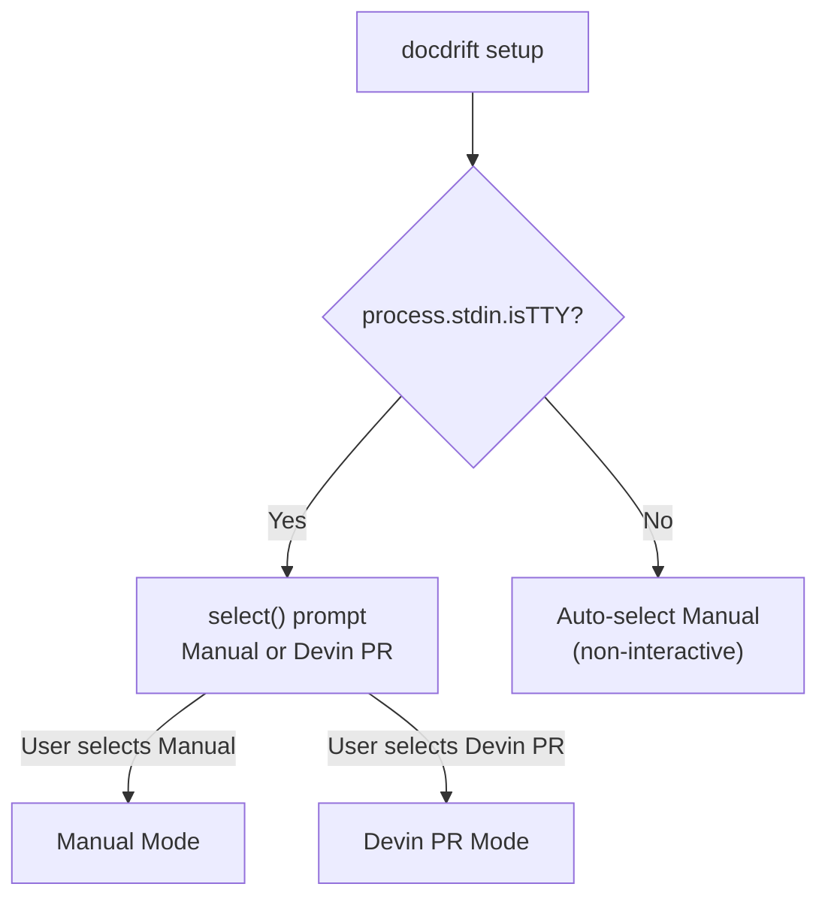
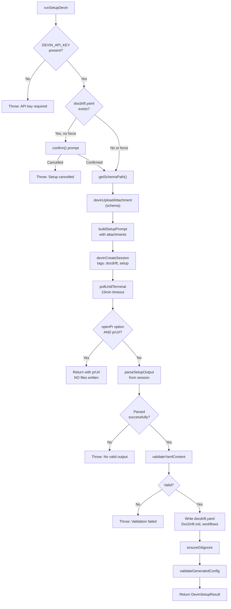
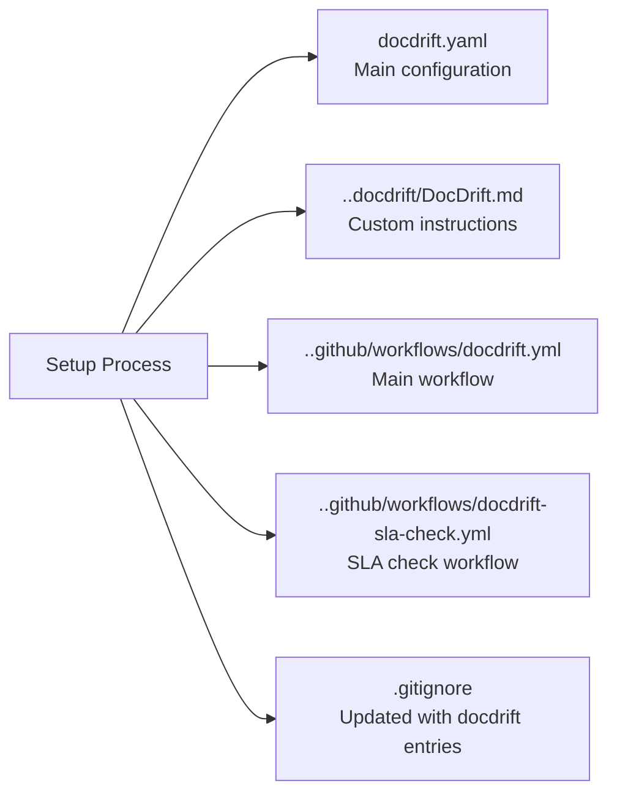
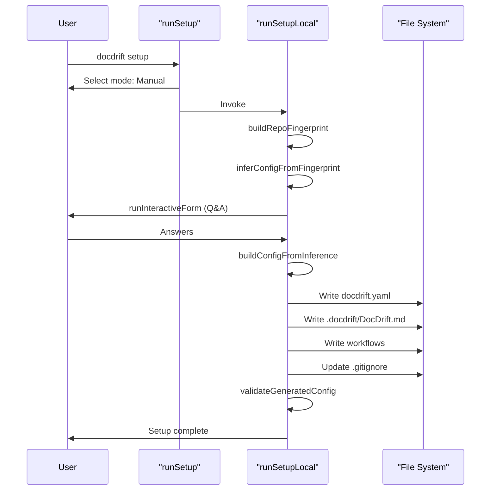
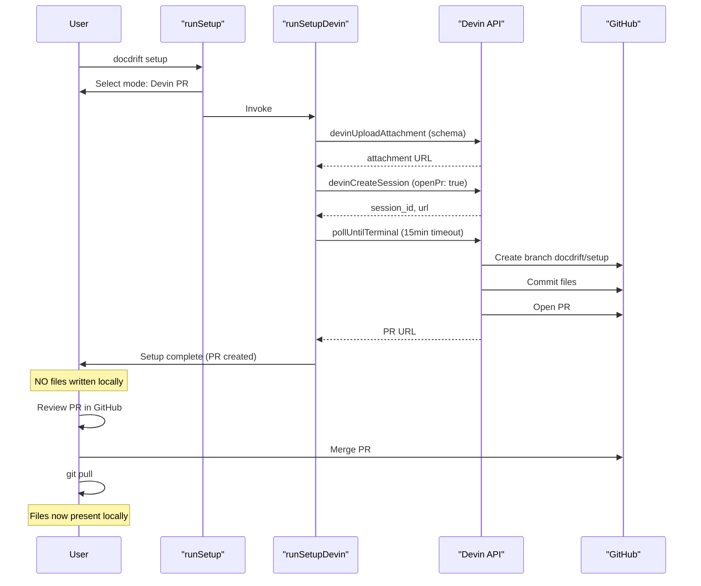
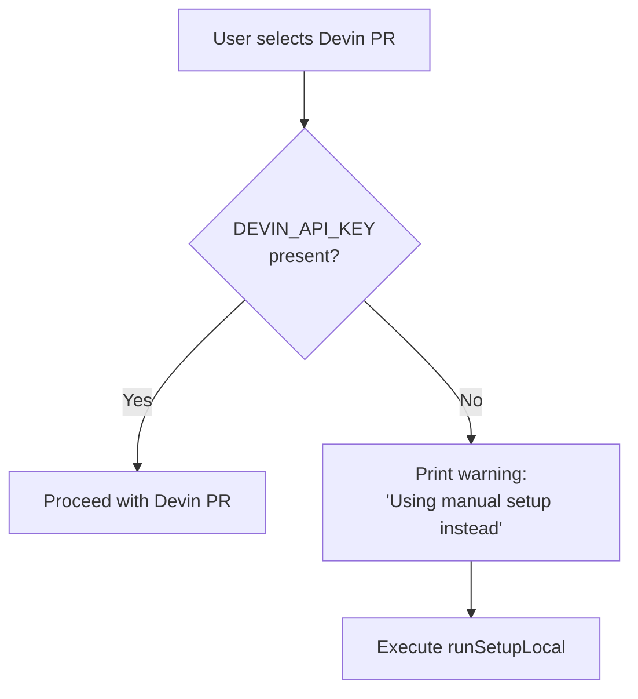

# Initial Setup

<details>
<summary>Relevant source files</summary>

The following files were used as context for generating this wiki page:

- [.gitignore](.gitignore)
- [README.md](README.md)
- [docs/guides/setup.md](docs/guides/setup.md)
- [src/setup/devin-setup.ts](src/setup/devin-setup.ts)
- [src/setup/index.ts](src/setup/index.ts)
- [src/setup/setup-prompt.ts](src/setup/setup-prompt.ts)
- [test/setup-devin-pr.test.ts](test/setup-devin-pr.test.ts)

</details>


This document explains how to configure docdrift for your repository using the `docdrift setup` or `docdrift generate-yaml` commands. It covers the two setup modes (Manual and Devin PR), their prerequisites, workflows, and generated artifacts.

For details on the configuration schema itself, see [Configuration Schema](#4.1). For information on repository fingerprinting and AI inference used during setup, see [Repository Fingerprinting](#5.4) and [AI Inference and Heuristics](#5.5).

## Setup Commands

docdrift provides two commands for initial configuration:

| Command | Purpose | Interactive |
|---------|---------|-------------|
| `docdrift setup` | Full interactive setup with mode selection and validation | Yes (if TTY) |
| `docdrift generate-yaml` | Scriptable configuration generation for CI/automation | No (defaults to Manual in non-TTY) |

Both commands support the same setup modes but differ in their intended usage context.

**Sources:** [src/setup/index.ts:1-140](), [README.md:23-41]()

## Setup Mode Selection

When running `docdrift setup` in an interactive terminal, the system prompts for mode selection via the `chooseSetupMode` function:



The mode determines whether configuration is generated locally or via a Devin AI session that opens a pull request.

**Sources:** [src/setup/index.ts:14-32]()

## Manual Setup Mode

Manual mode generates configuration locally using repository scanning, optional AI inference, and an interactive form. It does not require `DEVIN_API_KEY`.

### Manual Setup Flow

```mermaid
graph LR
    Start["`runSetupLocal`"]
    CheckExists{"`docdrift.yaml
    exists?`"}
    ConfirmOverwrite["`confirm()
    prompt`"]
    Scan["`buildRepoFingerprint`"]
    Infer["`inferConfigFromFingerprint`"]
    Form["`runInteractiveForm`"]
    BuildConfig["`buildConfigFromInference`"]
    WriteConfig["`writeConfig`"]
    Onboard["`runOnboarding`"]
    Validate["`validateGeneratedConfig`"]
    Done["`Return DevinSetupResult`"]
    
    Start --> CheckExists
    CheckExists -->|Yes, no force| ConfirmOverwrite
    CheckExists -->|No or force| Scan
    ConfirmOverwrite -->|Confirmed| Scan
    ConfirmOverwrite -->|Cancelled| Error["`Throw Error`"]
    Scan --> Infer
    Infer --> Form
    Form --> BuildConfig
    BuildConfig --> WriteConfig
    WriteConfig --> Onboard
    Onboard --> Validate
    Validate --> Done
```



### Key Functions and Responsibilities

| Function | File | Responsibility |
|----------|------|----------------|
| `runSetupLocal` | [src/setup/devin-setup.ts:39-86]() | Orchestrates manual setup flow |
| `buildRepoFingerprint` | Referenced in [src/setup/devin-setup.ts:60]() | Scans repository structure, detects frameworks, finds API specs |
| `inferConfigFromFingerprint` | Referenced in [src/setup/devin-setup.ts:61]() | Uses AI or heuristics to generate configuration suggestions |
| `runInteractiveForm` | Referenced in [src/setup/devin-setup.ts:64]() | Presents Q&A for low-confidence fields |
| `buildConfigFromInference` | Referenced in [src/setup/devin-setup.ts:66]() | Constructs configuration object from inference + form answers |
| `writeConfig` | Referenced in [src/setup/devin-setup.ts:68]() | Serializes configuration to YAML and writes to disk |
| `runOnboarding` | Referenced in [src/setup/devin-setup.ts:72]() | Creates `.docdrift/DocDrift.md`, workflows, updates `.gitignore` |

The manual mode writes files directly to the local filesystem before returning.

**Sources:** [src/setup/devin-setup.ts:39-86](), [docs/guides/setup.md:1-46]()

## Devin PR Setup Mode

Devin PR mode delegates configuration generation to a Devin AI session. The session analyzes the repository and opens a pull request with the generated files. This mode requires `DEVIN_API_KEY` and the repository must be added in Devin's Machine.

### Devin PR Setup Flow



### Devin Session Configuration

When creating a Devin session for setup, the following parameters are used:

| Parameter | Value | Purpose |
|-----------|-------|---------|
| `prompt` | From `buildSetupPrompt()` | Instructions for analyzing repo and generating config |
| `unlisted` | `true` | Session not visible in public listings |
| `max_acu_limit` | `2` | Resource limit for setup task |
| `tags` | `["docdrift", "setup"]` | Categorization for session filtering |
| `attachments` | Schema attachment URL | Provides JSON Schema for validation |
| `metadata.purpose` | `"docdrift-setup"` | Additional context |

**Sources:** [src/setup/devin-setup.ts:165-289](), [src/setup/devin-setup.ts:198-205]()

### Structured Output Parsing

The Devin session returns configuration via one of two formats:

#### Primary Format: Strict XML Tag

The session transcript is expected to contain a block delimited by `<docdrift_setup_output>` tags:

```
<docdrift_setup_output>
{"docdriftYaml":"# yaml...","docDriftMd":"# DocDrift...","workflowYml":"name: docdrift...","summary":"OpenAPI at..."}
</docdrift_setup_output>
```

The `parseFromStrictTag` function extracts and parses this JSON block.

#### Fallback Format: Markdown Blocks

If the strict tag is not found, `parseFromMarkdownBlocks` attempts to extract configuration from markdown code fences:

```markdown
**docdriftYaml:**
```yaml
# yaml content
```

**docDriftMd:**
```markdown
# markdown content
```
```

This fallback ensures robustness when Devin's output format varies.

**Sources:** [src/setup/devin-setup.ts:88-163](), [src/setup/setup-prompt.ts:7-31]()

## Setup Prompt Structure

The `buildSetupPrompt` function generates instructions for the Devin session. Key sections include:

| Section | Content |
|---------|---------|
| Repository Context | Repo already loaded; analyze structure |
| Attachments | Schema JSON file URLs |
| Requirements | `docdrift.yaml` (v2), `.docdrift/DocDrift.md`, `.github/workflows/docdrift.yml` |
| Spec Provider Detection | Find OpenAPI/Swagger/GraphQL specs and export scripts |
| Output Format | Strict XML tag format for reliable parsing |
| PR Creation | Optional: create branch `docdrift/setup`, commit, push, open PR |

When `openPr: true`, the prompt instructs Devin to:
1. Create branch `docdrift/setup` from `main`
2. Create files (`docdrift.yaml`, `.docdrift/DocDrift.md`, `.github/workflows/docdrift.yml`)
3. Commit with message `[docdrift] Add docdrift configuration`
4. Push and open PR to `main`
5. Still emit the strict output block for validation

**Sources:** [src/setup/setup-prompt.ts:34-98](), [src/setup/setup-prompt.ts:39-50]()

## Prerequisites

### Manual Mode

| Requirement | Reason |
|-------------|--------|
| Node.js 18+ | Runtime for CLI execution |
| npm or npx | Package execution |
| Write permissions | Creates files in repository |

No external API keys or services required.

### Devin PR Mode

| Requirement | Reason |
|-------------|--------|
| All Manual Mode requirements | Fallback capability |
| `DEVIN_API_KEY` environment variable | Authentication for Devin API |
| Repository added in Devin's Machine | Devin needs repository access |
| Git remote configured | For PR creation |
| GitHub authentication | Devin creates PR on behalf of user |

If `DEVIN_API_KEY` is missing, setup automatically falls back to Manual mode:

```
DEVIN_API_KEY is not set. Using manual setup instead.
```

**Sources:** [src/setup/index.ts:39-52](), [docs/guides/setup.md:14]()

## Generated Artifacts

Both setup modes generate the same set of files, but through different mechanisms:



### File Descriptions

| File | Purpose | Optional |
|------|---------|----------|
| `docdrift.yaml` | Main configuration file with spec providers, path mappings, policy settings | No |
| `.docdrift/DocDrift.md` | Custom instructions for Devin sessions (PR title prefix, tone, project-specific guidance) | Yes |
| `.github/workflows/docdrift.yml` | GitHub Actions workflow for automated drift detection on push/PR | Yes |
| `.github/workflows/docdrift-sla-check.yml` | Daily cron job to check for stale documentation PRs (7+ days) | Yes (auto-added with main workflow) |
| `.gitignore` | Updated with docdrift-specific ignore patterns | No (modified if exists, created if not) |

### `.gitignore` Entries

The setup process ensures these entries are present:

```
.docdrift/evidence
.docdrift/*.log
.docdrift/state.json
.docdrift/run-output.json
```

These patterns exclude runtime artifacts from version control while preserving configuration files.

**Sources:** [.gitignore:1-14](), [src/setup/devin-setup.ts:79-83](), [src/setup/devin-setup.ts:268-282]()

## Setup Flow Comparison

### Manual Mode: Immediate Local Files



**When setup completes:** All files are present locally. You can immediately run `docdrift validate` and `docdrift detect`.

### Devin PR Mode: PR-Based Workflow



**When setup completes:** PR exists, but NO files are written locally. You must merge the PR and run `git pull` to obtain the configuration files.

**Sources:** [src/setup/index.ts:34-139](), [src/setup/devin-setup.ts:165-289]()

## Fallback Behavior

The setup system includes multiple fallback mechanisms to ensure robustness:

### API Key Fallback



### Devin Session Failure Fallback

If Devin PR mode is selected but the session fails (network error, timeout, parsing failure):

```
Devin setup failed: <error message>

Falling back to local detection (repo fingerprint + heuristic)…
```

The system automatically retries using Manual mode, ensuring setup always succeeds.

**Sources:** [src/setup/index.ts:44-71]()

## Command Options

### Common Options

| Option | Description | Default |
|--------|-------------|---------|
| `--output <path>` | Path to write `docdrift.yaml` | `docdrift.yaml` |
| `--force` | Overwrite existing file without prompting | `false` |
| `--cwd <path>` | Working directory (for programmatic use) | `process.cwd()` |

### Devin-Specific Options

| Option | Description | Default |
|--------|-------------|---------|
| `--open-pr` | Devin creates branch, commits, and opens PR | `false` for `generate-yaml`, `true` for `setup` when Devin PR selected |

### Usage Examples

```bash
# Interactive setup with mode selection
npx @devinnn/docdrift setup

# Scriptable manual setup, overwrite existing
npx @devinnn/docdrift generate-yaml --output docdrift.yaml --force

# Scriptable Devin PR setup (requires DEVIN_API_KEY)
npx @devinnn/docdrift generate-yaml --open-pr

# Custom output location
npx @devinnn/docdrift setup --output config/docdrift.yaml
```

**Sources:** [src/setup/index.ts:5-11](), [README.md:36-41](), [docs/guides/setup.md:20-38]()

## Post-Setup Workflow

### After Manual Setup

1. Verify configuration: `npx @devinnn/docdrift validate`
2. Check for drift: `npx @devinnn/docdrift detect`
3. (Optional) Add `DEVIN_API_KEY` to repository secrets for CI
4. Commit and push generated files

### After Devin PR Setup

1. Review PR in GitHub: Check generated configuration, custom instructions, workflow
2. (Optional) Checkout branch `docdrift/setup` to edit before merging:
   ```bash
   git fetch origin docdrift/setup
   git checkout docdrift/setup
   # Edit files as needed
   git push
   ```
3. Merge PR in GitHub
4. Pull changes: `git pull`
5. Verify configuration: `npx @devinnn/docdrift validate`
6. Add `DEVIN_API_KEY` to repository secrets (Settings → Secrets → Actions)
7. Test detection: `npx @devinnn/docdrift detect`

The CLI provides an optional prompt after Devin PR setup:

```
Checkout branch to review/edit before merging? (y/N)
```

If confirmed, it automatically checks out `docdrift/setup` for local editing.

**Sources:** [src/setup/index.ts:73-138](), [docs/guides/setup.md:42-46]()

## Validation

Both setup modes perform validation before completion:

| Stage | Function | Purpose |
|-------|----------|---------|
| Pre-write | `validateYamlContent` | Validate YAML structure and schema compliance |
| Post-write | `validateGeneratedConfig` | Validate file existence and command executability |
| Final | `runValidate` | Full validation including runtime constraints |

If validation fails, setup throws an error with detailed messages:

```
Generated config failed validation:
  - specProviders[0].current.command: Command not found: npm run openapi:export
  - docsite: Path does not exist: docs
```

**Sources:** [src/setup/devin-setup.ts:74-77](), [src/setup/devin-setup.ts:240-249](), [src/setup/devin-setup.ts:283-286]()

## Setup Result Structure

Both `runSetupLocal` and `runSetupDevin` return a `DevinSetupResult` object:

```typescript
interface DevinSetupResult {
  docdriftYaml: string;        // Generated YAML content
  docDriftMd?: string;         // Custom instructions content (or undefined)
  workflowYml?: string;        // Workflow content (or undefined)
  summary: string;             // What was inferred/configured
  sessionUrl: string;          // Devin session URL (empty for manual)
  prUrl?: string;              // GitHub PR URL (only when openPr && PR created)
}
```

The presence of `prUrl` determines whether files were written locally (no `prUrl`) or via PR (has `prUrl`).

**Sources:** [src/setup/devin-setup.ts:28-36](), [src/setup/index.ts:73-104]()

---