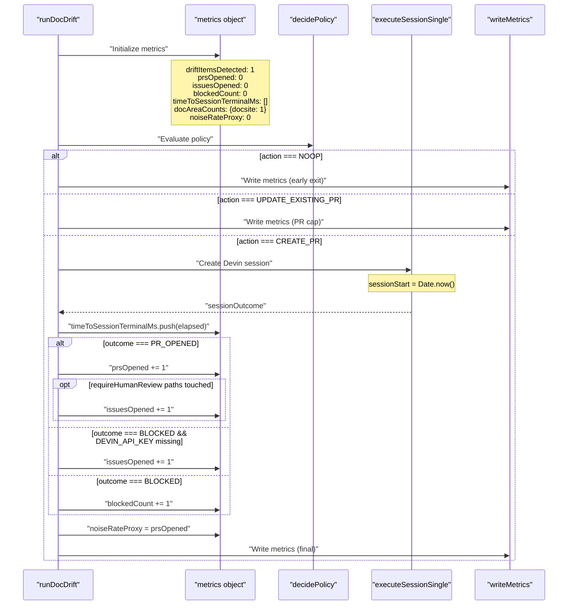
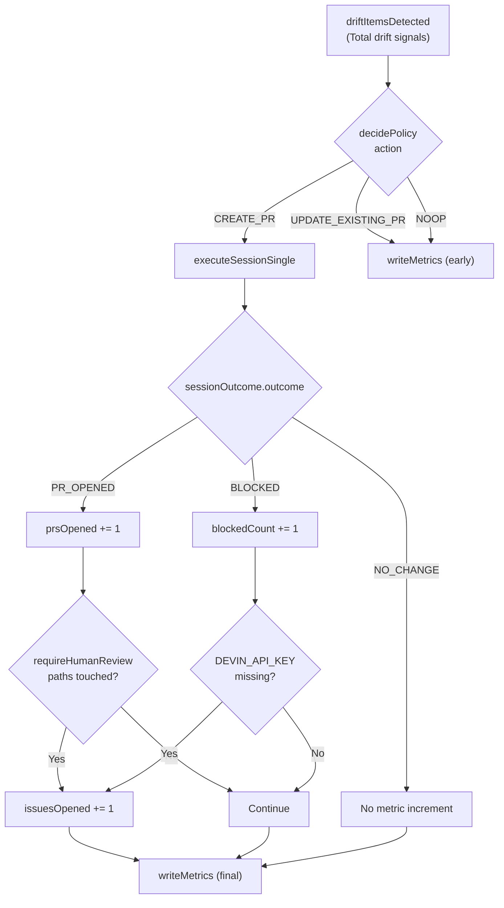
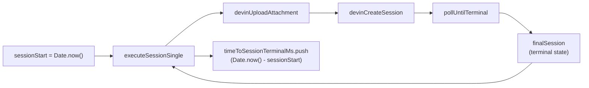
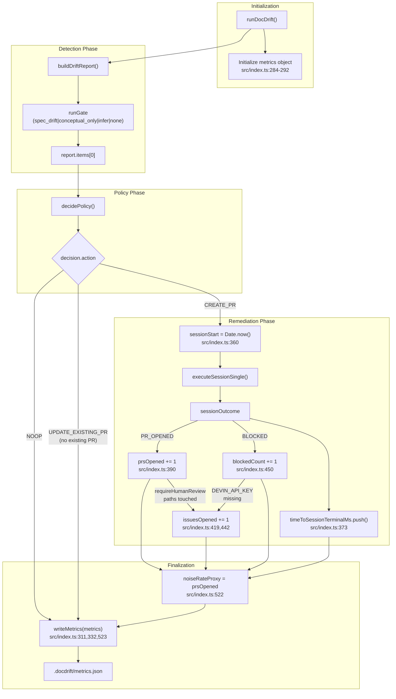

# metrics.json

<details>
<summary>Relevant source files</summary>

The following files were used as context for generating this wiki page:

- [.github/workflows/devin-doc-drift.yml](.github/workflows/devin-doc-drift.yml)
- [docdrift-yml.md](docdrift-yml.md)
- [src/config/validate.ts](src/config/validate.ts)
- [src/devin/prompts.ts](src/devin/prompts.ts)
- [src/github/client.ts](src/github/client.ts)
- [src/index.ts](src/index.ts)

</details>


## Purpose

The `metrics.json` file captures performance and operational metrics from DocDrift runs. It provides quantitative data for monitoring system behavior, measuring noise rates, and tracking remediation outcomes. This file is generated after the `run` command completes and contains aggregated statistics about drift detection and remediation actions.

For information about the drift detection results themselves, see [drift_report.json](#8.1). For evidence bundle structure, see [Evidence Directory Structure](#8.3).

## File Location and Generation Timing

The metrics file is written to `.docdrift/metrics.json` in the consuming repository's root directory (not inside the DocDrift package). It is generated only by the `run` command, not by `detect` or `validate`.

The metrics object is initialized at the start of `runDocDrift`, updated throughout execution as outcomes occur, and written to disk at three key points: when policy returns `NOOP` (no action needed), when policy returns `UPDATE_EXISTING_PR` (PR cap reached), and at the end of a successful run. This ensures metrics are persisted even when runs exit early due to policy decisions.

**Sources:** [src/index.ts:284-292](), [src/index.ts:311](), [src/index.ts:332](), [src/index.ts:523]()

### Generation Workflow



**Sources:** [src/index.ts:244-530](), [src/index.ts:284-292](), [src/index.ts:311](), [src/index.ts:332](), [src/index.ts:373](), [src/index.ts:390](), [src/index.ts:419](), [src/index.ts:442](), [src/index.ts:450](), [src/index.ts:522-523]()

## Metrics Structure

The metrics file contains JSON with the following top-level fields:

| Field | Type | Description |
|-------|------|-------------|
| `driftItemsDetected` | `number` | Total drift items found in the drift report (currently hardcoded to 1 in single-session mode) |
| `prsOpened` | `number` | Count of PRs created via Devin sessions (incremented when `sessionOutcome.outcome === "PR_OPENED"`) |
| `issuesOpened` | `number` | Count of GitHub issues created: human review issues when `requireHumanReview` paths are touched, or configuration issues when `DEVIN_API_KEY` is missing |
| `blockedCount` | `number` | Count of sessions that ended in blocked state (incremented when `sessionOutcome.outcome === "BLOCKED"`) |
| `timeToSessionTerminalMs` | `number[]` | Array of millisecond durations for each Devin session from creation to terminal state, measured from `sessionStart = Date.now()` to session completion |
| `docAreaCounts` | `Record<string, number>` | Per-doc-area breakdown of drift items detected (currently `{docsite: 1}` in single-session mode) |
| `noiseRateProxy` | `number` | Calculated as `metrics.prsOpened` - represents the number of automated remediation actions taken |

**Sources:** [src/index.ts:284-292](), [src/index.ts:373](), [src/index.ts:390](), [src/index.ts:419](), [src/index.ts:442](), [src/index.ts:450](), [src/index.ts:522]()

### Example Metrics File

```json
{
  "driftItemsDetected": 1,
  "prsOpened": 0,
  "issuesOpened": 0,
  "blockedCount": 1,
  "timeToSessionTerminalMs": [
    163827
  ],
  "docAreaCounts": {
    "docsite": 1
  },
  "noiseRateProxy": 0
}
```

In this example, one drift item was detected, no PRs were opened, no issues were created, one session was blocked, and the session took approximately 164 seconds (2.7 minutes) to reach a terminal state.

**Sources:** [src/index.ts:284-292]()

## Metrics Categories

### Outcome Metrics

These metrics track the remediation actions taken during the run:



- **`prsOpened`**: Incremented when `sessionOutcome.outcome === "PR_OPENED"` at [src/index.ts:390](). Represents successful automated remediation.
- **`issuesOpened`**: Incremented when a PR touches `requireHumanReview` paths ([src/index.ts:419]()) or when `DEVIN_API_KEY` is missing ([src/index.ts:442]()). Represents human escalation points.
- **`blockedCount`**: Incremented when `sessionOutcome.outcome === "BLOCKED"` at [src/index.ts:450](). Represents sessions that could not complete successfully.

**Sources:** [src/index.ts:294-302](), [src/index.ts:304-334](), [src/index.ts:389-421](), [src/index.ts:449-451]()

### Performance Metrics

The `timeToSessionTerminalMs` array captures the wall-clock time for each Devin session from creation to reaching a terminal state. The timing measurement is implemented at [src/index.ts:360-373]():

```typescript
const sessionStart = Date.now();
sessionOutcome = await executeSessionSingle({...});
metrics.timeToSessionTerminalMs.push(Date.now() - sessionStart);
```

This enables:
- Monitoring Devin API latency and total session duration
- Identifying slow sessions that may indicate complex documentation updates
- Calculating average/median session duration across runs



**Sources:** [src/index.ts:360-373](), [src/index.ts:94-169]()

### Doc Area Distribution

The `docAreaCounts` object provides a breakdown of drift items by doc area name. In the current single-session implementation, this is initialized as:

```typescript
docAreaCounts: { docsite: 1 }
```

This field is reserved for future use when multiple doc areas may be processed in a single run. Currently, the system operates in single-session mode where only one doc area (`docsite`) is processed per run, as defined in the `docAreaConfig` at [src/index.ts:273-279]().

In multi-session scenarios, this would help identify which documentation areas drift most frequently:

```json
{
  "docAreaCounts": {
    "api_reference": 3,
    "auth_guide": 1,
    "getting_started": 0
  }
}
```

**Sources:** [src/index.ts:290](), [src/index.ts:273-279]()

## Noise Rate Proxy

The `noiseRateProxy` metric is calculated as:

```typescript
metrics.noiseRateProxy = metrics.prsOpened;
```

This simple calculation at [src/index.ts:522]() equates noise rate proxy directly with the number of PRs opened. The metric represents the number of automated remediation actions taken by the system.

A noise rate proxy of:
- **0** indicates no automated PRs were opened (session was blocked, policy prevented action, or no drift detected)
- **1** indicates one PR was opened (typical for successful remediation in single-session mode)
- **Higher values** would occur in multi-session scenarios where multiple doc areas are remediated

The calculation is performed just before writing final metrics at [src/index.ts:523](). This metric can be tracked over time to monitor the system's remediation activity levels.

**Sources:** [src/index.ts:522-523]()

## Code Implementation

The metrics object is initialized at the start of `runDocDrift`:

[src/index.ts:284-292]()

```typescript
const metrics = {
  driftItemsDetected: 1,
  prsOpened: 0,
  issuesOpened: 0,
  blockedCount: 0,
  timeToSessionTerminalMs: [] as number[],
  docAreaCounts: { docsite: 1 },
  noiseRateProxy: 0,
};
```

The metrics are updated at various points throughout execution:

| Line | Update | Trigger |
|------|--------|---------|
| [src/index.ts:373]() | `timeToSessionTerminalMs.push(elapsed)` | After Devin session completes |
| [src/index.ts:390]() | `prsOpened += 1` | When `sessionOutcome.outcome === "PR_OPENED"` |
| [src/index.ts:419]() | `issuesOpened += 1` | When PR touches `requireHumanReview` paths |
| [src/index.ts:442]() | `issuesOpened += 1` | When `DEVIN_API_KEY` is missing |
| [src/index.ts:450]() | `blockedCount += 1` | When `sessionOutcome.outcome === "BLOCKED"` |
| [src/index.ts:522]() | `noiseRateProxy = prsOpened` | Before final write |

The metrics are written to disk using the `writeMetrics` function imported from `src/evidence/bundle`:

[src/index.ts:6]()

```typescript
import { buildEvidenceBundle, writeMetrics } from "./evidence/bundle";
```

This function is called at three points:

1. **Early exit (NOOP)**: [src/index.ts:311]() - When policy decides no action is needed
2. **PR cap reached**: [src/index.ts:332]() - When policy returns `UPDATE_EXISTING_PR` but no existing PR found
3. **Run completion**: [src/index.ts:523]() - After all processing completes

The `writeMetrics` function resolves the path to `.docdrift/metrics.json` and serializes the metrics object as formatted JSON.

**Sources:** [src/index.ts:6](), [src/index.ts:284-292](), [src/index.ts:311](), [src/index.ts:332](), [src/index.ts:373](), [src/index.ts:390](), [src/index.ts:419](), [src/index.ts:442](), [src/index.ts:450](), [src/index.ts:522-523]()

## Metrics Data Flow



**Sources:** [src/index.ts:244-530](), [src/index.ts:284-292](), [src/index.ts:360-373](), [src/index.ts:389-451](), [src/index.ts:522-523]()

## Usage in CI/CD

In GitHub Actions workflows, the metrics file is uploaded as an artifact for later analysis:

```yaml
- name: Upload artifacts
  uses: actions/upload-artifact@v3
  with:
    name: docdrift-artifacts
    path: |
      .docdrift/drift_report.json
      .docdrift/evidence/**
      .docdrift/metrics.json
```

This enables:
- Historical tracking of drift patterns across commits
- Performance monitoring of Devin session durations
- Analysis of noise rates over time to tune detection thresholds

**Sources:** [README.md:106-109]()

---