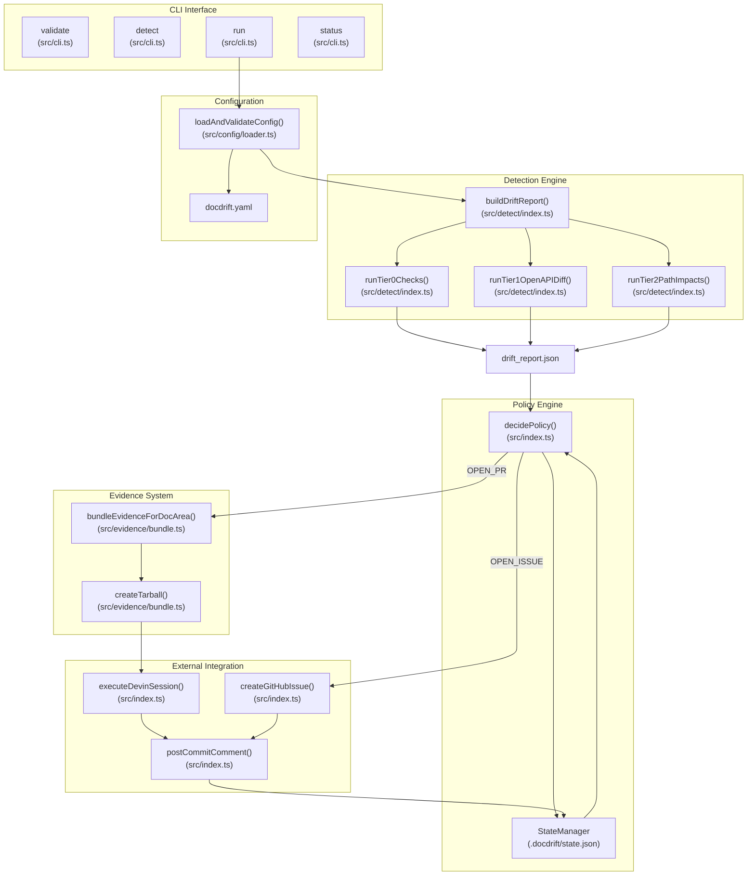
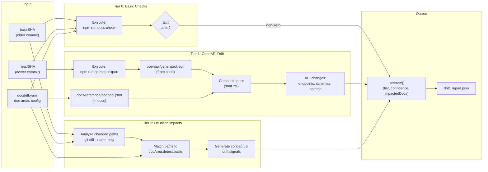
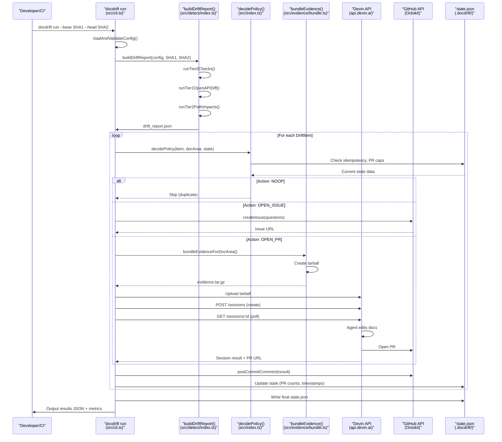
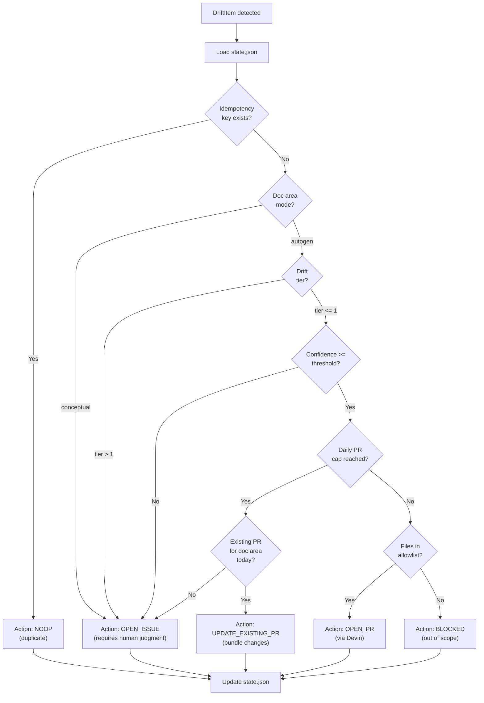
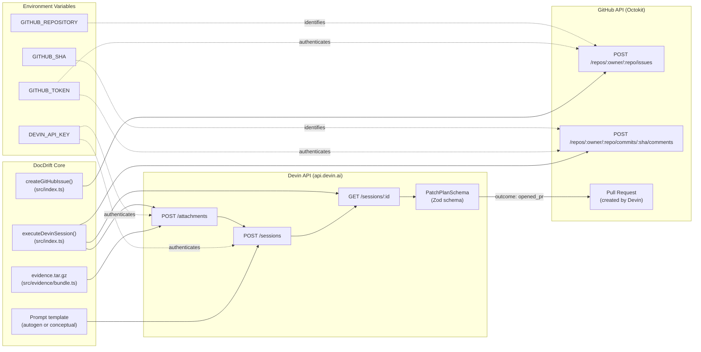
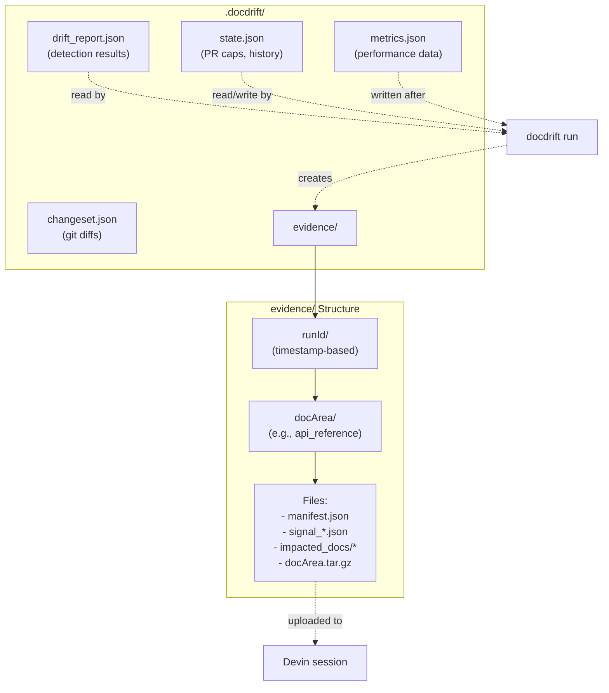
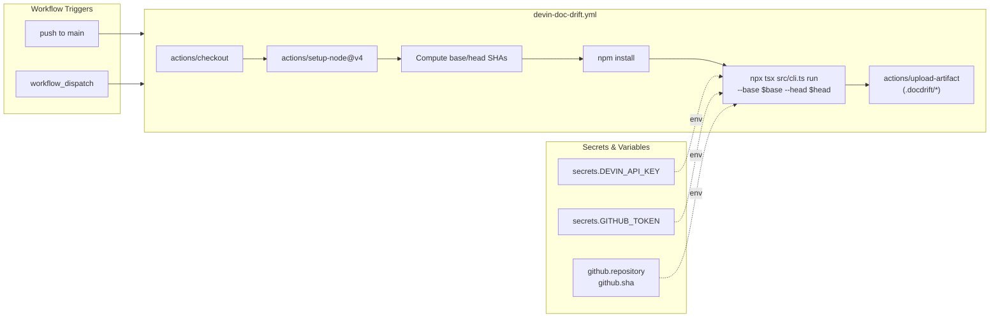

<details>
<summary>Relevant source files</summary>

The following files were used as context for generating this wiki page:

- [README.md](README.md)
- [loom.md](loom.md)
- [package.json](package.json)

</details>


DocDrift is an opinionated policy engine for documentation drift: it detects when code and docs have diverged, decides when to fix vs escalate, and controls Devin so you get one session and one PR—not a flood of doc updates. You run it via CLI or GitHub Actions. No generic “detect drift” pipeline; we gate on real signal, bundle evidence, and keep noise low by design.

## The problem: Client E (DataStack)

**Client E (DataStack):** *"We can't keep our internal docs or API references up to date. Our API docs are six months out of date. Engineers change endpoints and never update the docs. New hires and partner teams constantly ping us asking how things work because the docs are wrong. We know it's a problem but writing docs is the first thing that gets cut from any sprint."*

That’s the reality for many teams: docs slip, support load goes up, and onboarding slows down. The fix isn’t “write more docs”—it’s **detect drift from real code, then remediate in one place** so you save time (fewer “how does this work?” pings, less manual catch-up) and money (faster onboarding, fewer mistakes from stale docs).

## How DocDrift solves it

We **detect** by comparing generated API spec (from code) to what’s published in docs, plus optional path-based heuristics. Runs trigger on merge (GitHub Actions) or on demand (CLI). **We only run when there’s real drift:** in STRICT mode we gate on spec diff—no spec change means no Devin session, so you’re not flooded with runs.

The **policy engine** then **decides**: open a Devin session for a PR, open an issue for human judgment, or no-op. We enforce **idempotency** (same run doesn’t create duplicate work), **confidence gating**, and a **daily PR cap** so you never get buried in doc PRs.

**Remediation** is Devin with an **evidence bundle**—actual code, diffs, and impacted docs—updating only allowlisted paths. **One session, one PR** for the whole docsite. No doc-PR spam; **allowlist/exclude** so Devin only touches what you approve.

**API refs vs conceptual docs:** For API-first teams (“our API docs are six months out of date”), **STRICT mode** gates on spec diff only: no spec drift → no session. We only act when the spec actually changed. For conceptual guides, **AUTO mode** plus **path mappings** (e.g. `apps/api/src/auth/**` → guides) signals when code might have outrun the prose; we **escalate to an issue** or **requireHumanReview** so a human decides—no silent rewrites of guides. **7-day SLA:** stale doc-drift PRs get a reminder via `sla-check`. One **lightweight YAML** (`docdrift.yaml`) keeps adoption simple. (Surfacing: single session/PR, cap, requireHumanReview, confidence, allowlist, idempotency—all built in.)

## How you run it

**Quick Start** — Run in under 2 minutes with the npm package (no clone required):

```bash
npx @devinnn/docdrift setup          # or generate-yaml for scriptable config
npx @devinnn/docdrift validate       # verify config and commands
npx @devinnn/docdrift detect         # detection only (optional: --base / --head)
npx @devinnn/docdrift run            # full run (set DEVIN_API_KEY, GITHUB_* for CI)
```

Add repo secret `DEVIN_API_KEY` for GitHub Actions. **CLI** for local and scripted use: `validate`, `detect`, `run`, `setup`, `generate-yaml`, `export`, `sla-check`, `status`. **GitHub Actions** for drift on push and optional export/SLA workflows. See **[Getting Started](/getting-started)** and **[GitHub Actions](/github-actions)**.

**More:** [Setup](/guides/setup), [Configuration](/guides/configuration), [Real World Scenarios](/real-world-scenarios); [Architecture](/deepwiki/pages/architecture), [Key Concepts](/deepwiki/pages/monorepo-structure-and-packages), [Detection Rules](/deepwiki/pages/detection-rules).

## What else is in the box

Evidence bundle (drift report + diffs + impacted docs) so Devin fixes from real code; verification commands; DeepWiki export to static MDX; `setup` / `generate-yaml` for bootstrap; `status` and `sla-check` for visibility. All of it fits the same policy: detect once, decide clearly, remediate with low noise.

## System Components

The system consists of five major subsystems that work together to detect and remediate documentation drift:



**Key Code Entities:**

| Component | Primary File | Core Functions |
|-----------|-------------|----------------|
| CLI Interface | [src/cli.ts]() | Command handlers for `validate`, `detect`, `run`, `status` |
| Detection Engine | [src/detect/index.ts:21-114]() | `buildDriftReport()`, tier-specific detection functions |
| Policy Engine | [src/index.ts:170-177]() | `decidePolicy()` decision logic |
| Evidence System | [src/evidence/bundle.ts:30-97]() | `bundleEvidenceForDocArea()`, tarball creation |
| Devin Integration | [src/index.ts:50-128]() | `executeDevinSession()`, session polling |
| State Management | [.docdrift/state.json]() | Persistent state for idempotency and caps |

**Sources:** [README.md:6-14](), [package.json:7-9](), [src/cli.ts](), [src/index.ts:144-290](), [src/detect/index.ts:21-114]()

## Three-Tier Detection System

DocDrift employs a three-tier detection mechanism that progressively analyzes code changes for documentation impacts:

| Tier | Name | Mechanism | Confidence | Use Case |
|------|------|-----------|------------|----------|
| 0 | Basic Checks | Runs `npm run docs:check` command | High | Documentation build validation |
| 1 | OpenAPI Drift | Compares generated vs published OpenAPI specs | High | API reference drift detection |
| 2 | Heuristic Impacts | Path-based mapping of code → docs | Lower | Conceptual documentation impacts |



**Detection Implementation:**
- **Tier 0:** Executes shell command from `docArea.detect.docsCheck` field in configuration [README.md:24]()
- **Tier 1:** Compares `docArea.detect.openapi.generatedPath` with `docArea.detect.openapi.publishedPath` [README.md:25]()
- **Tier 2:** Matches changed file paths against `docArea.detect.paths[].pattern` globs [README.md:26]()

Each tier produces `DriftItem` objects with fields:
- `tier`: numeric identifier (0, 1, or 2)
- `confidence`: score indicating fix automation suitability
- `impactedDocs`: array of documentation files affected
- `summary`: human-readable description
- `evidence`: supporting data (diffs, errors, matched paths)

**Sources:** [README.md:23-26](), [src/detect/index.ts:48-83](), [.docdrift/drift_report.json:1-30]()

## Core Workflow

The primary workflow executes when `docdrift run` is invoked, either locally or in CI:



**Key Steps:**

1. **Validation** [src/cli.ts](): Checks configuration syntax and command availability
2. **Detection** [src/detect/index.ts:21-114](): Runs three-tier analysis, produces `drift_report.json`
3. **Policy Decision** [src/index.ts:170-177](): Routes each drift item to action: `OPEN_PR`, `OPEN_ISSUE`, `UPDATE_EXISTING_PR`, or `NOOP`
4. **Evidence Bundling** [src/evidence/bundle.ts:30-97](): Creates tarball with drift report, diffs, and impacted docs
5. **Session Execution** [src/index.ts:50-128](): Uploads evidence to Devin, creates session with prompt, polls until terminal
6. **GitHub Integration** [src/index.ts](): Posts commit comments and creates issues
7. **State Persistence** [.docdrift/state.json](): Updates tracking data for caps and idempotency

**Sources:** [README.md:34-42](), [src/index.ts:144-290](), [src/cli.ts]()

## Policy Engine and Low-Noise Guarantees

The mechanisms below (idempotency, caps, confidence gating, mode routing, allowlist) are how we deliver the behavior described above—one PR, no duplicate work, human review where it matters. Reference:



**Policy Mechanisms:**

| Mechanism | Implementation | Purpose |
|-----------|----------------|---------|
| **Idempotency** | Hash of `repo + baseSHA + headSHA + action` stored in `state.json` | Prevent duplicate actions on re-runs |
| **PR Caps** | `policy.maxPRsPerDay` in configuration | Global daily limit on PR creation |
| **Bundling** | One PR per doc area per day | Group multiple changes into single PR |
| **Confidence Gating** | `docArea.patch.autopatchThreshold` | Only automate high-confidence fixes |
| **Mode Routing** | `docArea.mode: autogen \| conceptual` | Conceptual drift always escalates to issues |
| **Allowlist** | `docArea.patch.allowedPaths` | Restrict Devin edits to approved files |

**Sources:** [README.md:16-21](), [src/index.ts:170-177](), [README.md:14-18]()

## External Service Integration

DocDrift integrates with two external platforms to orchestrate remediation:



**Integration Points:**

1. **Devin API** [src/index.ts:50-128]():
   - `POST /attachments`: Upload evidence tarball
   - `POST /sessions`: Create session with prompt and attached evidence
   - `GET /sessions/:id`: Poll until status is `completed`, `blocked`, or `failed`
   - Structured output: Zod schema `PatchPlanSchema` validates response

2. **GitHub API** [src/index.ts]():
   - Issues API: Create issues for low-confidence or conceptual drift
   - Commit comments: Post results summary on head commit
   - Pull Requests: Created by Devin agent, not directly by DocDrift

**Authentication:**
- `DEVIN_API_KEY`: Required for Devin API calls [README.md:68]()
- `GITHUB_TOKEN`: Required for GitHub API calls, auto-provided in Actions [README.md:124]()
- `GITHUB_REPOSITORY`: Format `owner/repo`, identifies target repository
- `GITHUB_SHA`: Commit SHA for posting comments

**Sources:** [src/index.ts:50-128](), [.github/workflows/devin-doc-drift.yml:38-47](), [README.md:64-68]()

## Output Artifacts

All DocDrift outputs are written to `.docdrift/` directory in the consuming repository:



**Artifact Descriptions:**

| File | Purpose | Structure |
|------|---------|-----------|
| `drift_report.json` | Detection results | `{ runId, baseSHA, headSHA, items: DriftItem[] }` |
| `state.json` | Persistent tracking | `{ prCounts: { date: count }, history: { idempotencyKey: action } }` |
| `metrics.json` | Performance data | `{ detectionTimeMs, sessionTimeMs, totalDriftItems }` |
| `changeset.json` | Git diff data | `{ files: [{ path, additions, deletions, patch }] }` |
| `evidence/{runId}/{docArea}/` | Evidence bundles | Tarball with manifest and supporting files |

**Evidence Bundle Contents:**
- `manifest.json`: Metadata about bundled evidence
- `signal_*.json`: Individual drift signal details
- `impacted_docs/`: Copies of affected documentation files
- `{docArea}.tar.gz`: Compressed archive uploaded to Devin

**Git Ignore:**
Add `.docdrift/` to `.gitignore` to avoid committing run artifacts [README.md:32]()

**Sources:** [README.md:28-32](), [.docdrift/drift_report.json:1-30](), [src/evidence/bundle.ts:30-97]()

## GitHub Actions Integration

DocDrift provides a GitHub Actions workflow for continuous integration:



**Workflow Configuration:** [.github/workflows/devin-doc-drift.yml:1-65]()

**Key Steps:**
1. Checkout repository with full history (`fetch-depth: 0`)
2. Setup Node.js 20.x
3. Compute base SHA (previous commit) and head SHA (current commit)
4. Install dependencies with `npm install`
5. Run `docdrift run` with computed SHAs
6. Upload `.docdrift/` directory as artifacts

**Required Secrets:**
- `DEVIN_API_KEY`: Add in repository settings → Secrets → Actions

**Provided Automatically:**
- `GITHUB_TOKEN`: Auto-generated token with repository access
- `github.repository`: Repository identifier (`owner/repo`)
- `github.sha`: Current commit SHA

**Sources:** [.github/workflows/devin-doc-drift.yml:1-65](), [README.md:102-110](), [README.md:119-128]()

## NPM Package Distribution

DocDrift is published as `@devinnn/docdrift` on npm, enabling usage in any repository:

**Package Metadata:** [package.json:1-42]()
- **Binary:** `docdrift` CLI command [package.json:7-9]()
- **Entry Point:** `dist/src/index.js` [package.json:6]()
- **Files Included:** `dist/src/` only [package.json:14]()
- **Node Requirement:** `>= 20` [package.json:11-13]()

**Usage in External Repositories:**

```bash
# Install globally or use npx
npx @devinnn/docdrift validate
npx @devinnn/docdrift detect --base SHA1 --head SHA2

# With environment for full run
DEVIN_API_KEY=... GITHUB_TOKEN=... GITHUB_REPOSITORY=owner/repo \
  npx @devinnn/docdrift run --base SHA1 --head SHA2
```

**Repository Requirements:**
1. Create `docdrift.yaml` at repository root
2. Configure detection commands and doc areas
3. Set `DEVIN_API_KEY` secret in CI
4. Optional: Add `.docdrift/` to `.gitignore`

For a step-by-step npx flow, see [Getting Started](/getting-started). For commands, ecosystems, and end-to-end flows, see [Real World Scenarios](/real-world-scenarios).

**Sources:** [package.json:1-42](), [README.md:149-178]()

---